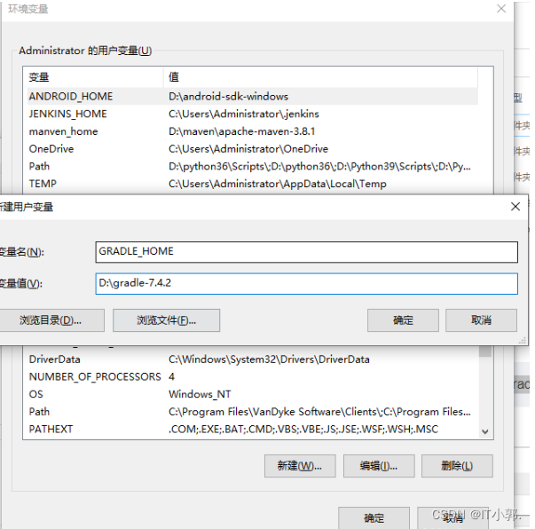
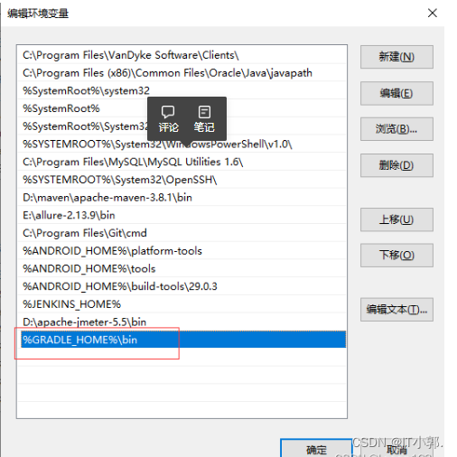
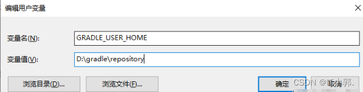

# 配置Android开发环境

## 下载gradle

> 官网下载链接：https://gradle.org/releases/

* ### 添加环境变量

  #### 新建： `GRADLE_HOME `环境变量指向你的 `Gradle `解压路径（ `这里看大家安装的路径，不一定一样 `）



#### 将 `%GRADLE_HOME%\bin `添加到 `Path `环境变量中，然后点击确定




* ### 配置镜像仓库：

### 打开 `\gradle-7.4.2\init.d\` 下的 `init.gradle`(没有就新建一个文件)

**添加如下配置( `这里我们使用【 `阿里云镜像 `】建议配置,下载速度比较快 `)**

```json
allprojects {
    repositories {
 
        mavenLocal()
 
        maven { url 'https://maven.aliyun.com/repository/public/' }
        maven { url 'https://maven.aliyun.com/repository/spring/'}
    	maven { url 'https://maven.aliyun.com/repository/google/'}
    	maven { url 'https://maven.aliyun.com/repository/gradle-plugin/'}
    	maven { url 'https://maven.aliyun.com/repository/spring-plugin/'}
    	maven { url 'https://maven.aliyun.com/repository/grails-core/'}
	    maven { url 'https://maven.aliyun.com/repository/apache-snapshots/'}
        
        mavenCentral()
    }
}
```

* ### 配置本地仓库:


变量名：`GRADLE_USER_HOME`
变量值：自定义 `Gradle` 仓库目录



* ### IDEA配置

  