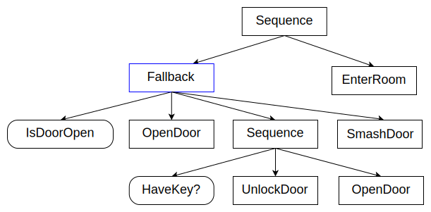
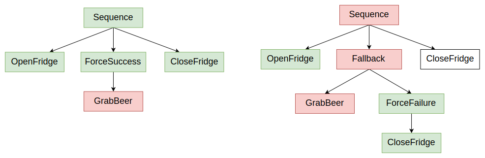

# Introduction to behavior trees

Abstraction in programming has **evolved** our use of computers from basic arithmetic operations to representing complex real-world phenomena using models.

Most of the time, you will find the abstractions that includes:

* **[teleo-reactive programs](https://teleoreactiveprograms.net/introduction/)**
* **[Petri nets](https://ieeexplore.ieee.org/abstract/document/725407)**
* **[finite-state machines (FSMs)](https://en.wikipedia.org/wiki/Finite-state_machine)**
* **[behavior trees (BTs)](https://arxiv.org/abs/1709.00084)**

Behavior trees actually began in the videogame industry to define behaviors for non-player characters (NPCs): Both [Unreal Engine](https://docs.unrealengine.com/en-US/InteractiveExperiences/ArtificialIntelligence/BehaviorTrees/BehaviorTreesOverview/index.html) and [Unity](https://opsive.com/support/documentation/behavior-designer/overview/).   It is **easy** to compose or modify, but **sacrifices** the ease of designing reactivce behaviors.

**BTs** can be defined by the following characteristics:

* **Behavior trees are trees (duh)**. They start at a root node and are designed to be traversed in a specific order until a terminal state is reached (success or failure).
* **Leaf nodes are executable behaviors:** Each leaf will do something, whether it’s a simple check or a complex action, and will output a status (success, failure, or running). In other words, leaf nodes are where you connect a BT to the lower-level code for your specific application.
* **Internal nodes control tree traversal:** The internal (non-leaf) nodes of the tree will accept the resulting status of their children and apply their own rules to dictate which node should be expanded next.

A behavior Tree is a tree of hierarchical nodes that controls the flow of execution of "task".

## Behavior tree terminology

### Concept Explanation:

#### 1. TIcks :  

​	 Discrete update steps which ehavior trees execute in.  After a node ticks, it returns a **status** to its parent, which can be ***Success***, ***Failure***, or ***Running***.

> ## How Tick works:
>
> 
>
> A **Sequence** is the simplest **ControlNode**: it executes its children one after the other and, if they all Succeed, it returns SUCCESS too.
>
> 1. The first tick sets the Sequence node to RUNNING (orange).
> 2. Sequence ticks the first child, "OpenDoor", that eventually returns SUCCESS.
> 3. As a result, the second child "Walk" and later "CloseDoor" are ticked.
> 4. Once the last child is completed, the entire Sequence switches from RUNNING to SUCCESS.

### Types of nodes

![UML hierarchy](data:image/png;base64,iVBORw0KGgoAAAANSUhEUgAAAXsAAAEdCAIAAABi8VAbAAAABGdBTUEAALGPC/xhBQAAACBjSFJNAAB6JgAAgIQAAPoAAACA6AAAdTAAAOpgAAA6mAAAF3CculE8AAAABmJLR0QA/wD/AP+gvaeTAAAh5ElEQVR42u3dfVAbZ54n8EYtIRTGeFqWPWasKHrLns3EWMJWYiMvQbeEOGwyfsm8GINZE3w3mdncxrnzzDgZz6wDRcq1lSWFqVqpKMyyVXEykxgEGBNlIkVKRYTaIgXjP1yplGrjeLBhebFkIzDGkvzcH7rp65XUjTCI1++3+g+p+3l+/ahNf6zulloUQRAEWaxQ2AQIgkAcBEEgDoIgCMRBEATiIAiCQBwEQSAOgiAQJ8WrR5KLWq3GHysCceYb7EjJ5Nq1a9hQCMSBOBAHQSAOxEEQiANxIA6CQByIgyAQB4E4CMSBOHPYstSCbVuIg0CcJRBH4OMqC8iEyWSKRCLztwPiIMjqeY+zgPtzTNmysjKbzQZxEATiCO3PFEXV1dUplcq0tLTonI6ODoPBIJVKtVptTU1NKBRiG/MtoihqeHhYo9GMjY0lXJfNZtPpdBKJRKfTNTY2cgfQ3Nys1WolEoler7fZbGwvgWFAHATirGBxLBbL9evXo0+9Xm9ubq7X652amvL5fMXFxbW1tbMuipatr6+vqqqKX1dbW5tSqXS5XBMTEy6XS6lUdnZ2Rhc5HA61Wu3xeILBoNvtVqlU0V4C64I4CMRZ2eJcuXKFfVpUVNTX18c+HRwc1Ov1sy6Klg2Hw0ajsbe3N2Zd+fn5drud7djW1mY2m6OPCwoKWH0IIXa7PdpLYF0QB4E4K1ucmZkZ9qlCoaBpmqZpkUiUlpZGUZRIJJp1EVu2p6cnLy8vHA5zZzIM4/f72VX4/X6GYaKP5XJ5IBDgLor2ElgXxEEgzsoWh/s0IyNjaGgoYV+BRdwilZWVDQ0NSYrDMExCcQTWBXEQiLN6xDGbzVarNWFfgUXcIqOjoxqNZmRkhHtU1d7ezj10mvWoSmBdEAeBOKtHHKfTKZfLW1paxsfHJycnnU5nSUnJrItiilit1oqKCu6ZY5VK5Xa72dPDrDLd3d0JzxwLrAviIBBn9YhDCPF4PBaLJTMzUyaTWSwWp9M566KYIpFIxGQycWdarVadTicWi+Ovjjc1NanV6vir4wLDgDgIxFkZ4qypQBwE4kAciIMgEAfiIAjEgTgQB0EgDsRBEIiDQBwE4kAciIMgEAfiIAjEgTgQB0EgDsRBEIiDQBwE4izC6pHkAnEQiLOU8fl8NE1z70a8lisjCMRJbcrLy7Ozs48dO4bKCAJxUpuBgYHNmzcPDw+r1eqHuPnDKquMIBAntSksLIz+pFRXV5darZ6enl7LlREE4qQwDodDr9ezv/p0+PDhkydPrtnKCAJxUphQKGQwGLg3Gx4bG1MoFAMDA2uwMoJAnNSmpaVl79698TN37dr1EL91udIrIwjESWGmp6eVSuXnn38ev6iwsPDtt99eU5URBOKkNmfPnj1w4EDCRT6fT6FQXLt2be1URhCIk8IEAgGFQuHz+QT27X379q2RyggCcVKbEydOvPzyywINoido33333bVQGUEgTgozNjaW5PePFArFnL5GsBIrIwjEWQx0YodOUWu2MoJAnEUfesr23pVYGUEgDsSBOAgCcSAOgkAciIMgEAfiQBwEgTgQB0EgDsSBOAgCcSAOgkAciIMgEAfiQBwEgTgQB0EgDsSBOAgCcSAOgkAciANxEIgDcSAOgkAciIMgEAfiQBwEgTirvTKFpD5qtRooQByIQwgh2BlSnWvXrmEjQxyIA3EgDsSBOBAH4iAQB+IgEAfiQByIA3EQiANxEIgDcSAOxFmSrQ1xIA7EmUUc9oMkMpnsscce279///vvv//gwYOV+09DUZTJZIpEIvMvCHEgDsRZeHGiD2ZmZv785z9/8MEHu3fvfvbZZ+/du7dyxSkrK7PZbBAH4kCcBag8nyQz1FAo9Mwzz7z11lvsnI6ODoPBIJVKtVptTU1NKBRi5+/cuVMqlapUqqamJra9zWbT6XQSiUSn0zU2NnLXVVdXp1Qq09LSCCFff/31iy++KJfLs7KyDh48yP7IesIxJ1kzOmd4eFij0XB/tZ37MvlKEUKam5u1Wq1EItHr9TabjduLbyNAHIizmsWZT4Tf43DzxRdfbN++PfrY6/Xm5uZ6vd6pqSmfz1dcXFxbW0sI6erqys7OvnTpUjAY9Pl8R48ejbZva2tTKpUul2tiYsLlcimVys7OTnZdFovl+vXr0ae5ubmffvrp3bt3b9++/corrxw/fpxvVMnXZPvW19dXVVXFFxQo5XA41Gq1x+MJBoNut1ulUrG9+DYCxIE4EGcBxJmampLJZNHHRUVFfX197KLBwUG9Xk8I2bNnz4cffhjfNz8/3263c7Ewm83suq5cuZJwbHfu3FEqlXyjmlPNaN9wOGw0Gnt7e2MKCpQqKChg9SGE2O12thffRoA4EAfiLIw4jzzySPSxQqGgaZqmaZFIlJaWRlGUSCQihMhkslu3bsX3ZRjG7/ezT/1+P8Mw7LpmZmbYRd9+++2hQ4c2btwYPXqiaZpvVMnX5Pbt6enJy8sLh8PcmQKl5HJ5IBDgLmJ78W0EiANxIM4CiNPT07Njx47o44yMjKGhofg2crn8IcThtiwsLDx16tSNGzdCodD09DR36ZzEEXhFlZWVDQ0NSYrDMAyfOHwbAeJAHIgzX3HC4fCzzz579uzZ6FOz2Wy1WuM7FhYWXrx4MeFRVXt7O/fYhHsExG2ZmZkZDAajjz/77DPuUrFYHH1vMteaMXNGR0c1Gs3IyAj3qIqvlMBRFd9GgDgQB+I8pDj379+/cePGxYsXzWYz9+q40+mUy+UtLS3j4+OTk5NOp7OkpIQQ4na7t2zZcvny5fgzxyqVyu12s+dfuWd5uas2Go11dXVTU1Nffvnltm3buEu1Wq3D4WA/U5N8zfg5Vqu1oqKCe+aYr1R3dzffmWO+jQBxIA7EmbM40WRkZKhUqh/+8IfvvfdezCcAPR6PxWLJzMyUyWQWi8XpdEbnt7a2GgyG9PR0tVp9/vx57k6u0+nEYnH8lWxu2f7+/ry8vPT0dJVKde7cOe7S1tZWjUZD0zQ7M8ma8XMikYjJZOLO5CtFCGlqalKr1QmvjvNtBIgDcSDOHMRBFjAQB+JAHIgDcSAOxIE4EAeBOBAHgTgQB+JAHIiDQByIg0AciANxIA7EgTgQB+JAHATiQBwE4kAciANxIA4CcSAOAnEgDsRJelRIqgNxIA7EQRCIA3EQBIE4EAdBIA7EQRAE4kAcBIE4EAdBIA7EQRAE4kAcBIE4EAdBEIgDcRAE4kCc5EaF4JsKEAfiLFKwIyUTfBsT4kAciANxEIgDcSAOAnEgDsSBOBAH4kAciINAHIiDQByIA3HWpjgp2m5zKgtxIA7ESa0409PT1dXVOTk5Uqk0KyurqKjo0qVLS/LauX0pijKZTJFIZP7FIQ7EgTjLRZx79+7l5+dXVlZevXp1ZmYmEAh0d3c/99xzy0GcsrIym80GcRCIM3vl5Zn4ob711lsHDhwQeC02m02n00kkEp1O19jYyL7ACxcuGI1GqVS6adOm8vLy8fHx+BfONq6rq1MqlWlpaQI148UZHh7WaDRjY2MJG/AVIYQ0NzdrtVqJRKLX6202G7dXR0eHwWCQSqVarbampiYUCkEciLPixVmeSbgjbd++/YsvvuDr0tbWplQqXS7XxMSEy+VSKpWdnZ3RTZeTk+NyuYLB4M2bN48cOVJaWsq3VSmKslgs169fF64ZLw4hpL6+vqqqKv6fTKCIw+FQq9UejycYDLrdbpVKxfbyer25ubler3dqasrn8xUXF9fW1kIciANxFk+cjIwMv9/P1yU/P99ut3MBMpvN0U3X39/Pzh8ZGdmwYYOAOFeuXJm1ZkJxwuGw0Wjs7e2NaSBQpKCggNWHEGK329leRUVFfX197KLBwUG9Xg9xIA7EWS7iMAzDXer3+xmGiW46vnO6CcWZmZmZtWZCcQghPT09eXl54XCYO1OgiFwuDwQC3EVsL4VCQdM0TdMikSgtLY2iKJFIBHEgDsRZLkdVAuLwbUyBRQ8nDiGksrKyoaEhSXEYhuETJyMjY2hoSHgrQRyIA3FSKE5tba3AmeP8/Pz29nbuEQp7VMW3McVicfT9CN925qspIM7o6KhGoxkZGeEeVfEVETiqMpvNVqsV4kAciLNk4kxPTz/11FNVVVVXr169f/9+IBD46KOP2KvjbW1tKpXK7XazZ2HZM8d8G1Or1TocDu4xV0xjvpoC4hBCrFZrRUUF98wxX5Hu7m6+M8dOp1Mul7e0tIyPj09OTjqdzpKSEogDcSDO4olDCLl79+6ZM2e2bt2anp6+bt26Z555pquri7ur63Q6sVgcc3Wcb2O2trZqNBqapgWOsxLWFBYnEomYTCbuTL4ihJCmpia1Wp3w6rjH47FYLJmZmTKZzGKxOJ1OiANxIM6iioNAHIgDcSAOxEEgDsSBOAjEgTgQB+JAHIgDcSAOAnEgDgJxIA7EgTgQB4E4EAfiIBAH4kAciANxIA7EgTgIxIE4EAfiQByIs+ivF0kmEAfiQBwEQSAOgiAQB+IgCMSBOAiCQBwEQSAOxEEQBOIgCAJxIA6CQByIgyAIxIE4CAJxIE7qXy+CbzlAHIizSMGOlEzwTU6IA3EgDsRBIA7EgTgIxIE4EAfiQByIA3EgDgJxIA4CcSAOxFl94tjtdqVSmYptvrA1IQ7EgThLJs4CbiKtVtvT08OtbDKZIpHI/FcHcSAOxIE4sRGJRA8ePOBWLisrs9lsEAeBOBBn9k3U0dFhMBikUqlWq62pqQmFQoSQr7/++sUXX5TL5VlZWQcPHhwbG2PrsGHnDA8PazQatk3M6mw2m06nk0gkOp2usbGRu+rm5matViuRSPR6vc1m4/ZKOCqIA3EgzsoWx+v15ubmer3eqakpn89XXFxcW1tLCMnNzf3000/v3r17+/btV1555fjx43ylok/r6+urqqri27S1tSmVSpfLNTEx4XK5lEplZ2dndJHD4VCr1R6PJxgMut1ulUrF9uIbFcSBOBBnZYtTVFTU19fHPh0cHNTr9TFt7ty5o1QqhcUJh8NGo7G3tzemTX5+vt1uZxu3tbWZzebo44KCAlYfQojdbmd7JTMqiANxIM7KE0ehUNA0TdO0SCRKS0ujKEokEhFCvv3220OHDm3cuDF6AEXTtLA4hJCenp68vLxwOMydyTCM3+9nG/v9foZhoo/lcnkgEOAuYnvxjQriQByIs7LFycjIGBoaip9fWFh46tSpGzduhEKh6elpbnc+cQghlZWVDQ0NSYrDMAyfOHyjgjgQB+KsbHHMZrPVao2fn5mZGQwGo48/++yzJMUZHR3VaDQjIyPco6r29nbuoVMyR1V8o4I4EAfirGxxnE6nXC5vaWkZHx+fnJx0Op0lJSWEEKPRWFdXNzU19eWXX27bti1JcQghVqu1oqKCe+ZYpVK53W729DCrTHd3N9+ZY75RQRyIA3FWjDgxYRd5PB6LxZKZmSmTySwWi9PpJIT09/fn5eWlp6erVKpz584lL04kEjGZTNyZVqtVp9OJxeL4q+NNTU1qtTrh1fGEo4I4EAfirAxx1mAgDsSBOBAH4iCrQpy1Fvy9QhyIg+A9DsRBIA7EgTgIxEEgDsSBOAjEgTgIxEEgDsSBOAjEgTgIxIE4CMSBOAjEgTgIxFl5/1RIcoE4EAdZqfH5fDRNc29mvDh9EYiDrMWUl5dnZ2cfO3ZskfsiEAdZcxkYGNi8efPw8LBarZ7rjSPm0xeBOMhaTGFhYfQXqbq6utRq9fT09OL0RSAOsubicDj0ej37i1GHDx8+efLkIvRFIA6y5hIKhQwGA/dexWNjYwqFYmBgIKV9EYiDrMW0tLTs3bs3fuauXbtm/Z3M+fRFIA6y5jI9Pa1UKj///PP4RYWFhW+//XaK+iIQB1mLOXv27IEDBxIu8vl8CoXi2rVrqeiLQBxkzSUQCCgUCp/PJ2DKvn37FrwvAnE4jZClzldffbU4fxAnTpx4+eWXBRpETwy/++67C9sXgTj/RZxqQjAt1URRlFKtHh4eTvVfw9jYWJICKhSKmK8vzKcvAnEgzvIS52/fflu/dSv3F7tTh078v/4i9EUgDsRZRuJUE1Jw4sSevXvZ3wVfvD+ReagBcRCIs1LFqSbkyfLykuefX+RPtUAcBOKsUXHOhEI7Dxz46eHDEAeBOJhSLk41IaeDwW179544cQLiIBAHU8rFiaKj2rr17NmzEAdZK+JQFLXFZHozEhHYMZLZeTA9hDjVhPxqePhRvb6pqQniIGtFnNyyshdsNoizJOJUE/LqV19tViovXrwIcZA1Ic6vhocZjebU2FjCHeMFm02u09ESiVyn29/YyDbghm18pKNjs8EglkoZrfZvamrOhEJQJhmm/2FgQK5QJPzaJMRBVps41YSU1NfnVVXF7xilbW1ZSuUxl+s3ExPHXK4spbKss5Nv5znu9X4vN/e41/vbqakTPp++uLiothbKJPnG8H99/vmGFN96BuIgy0WcM+FwttH4P3p7Y3YMVX5+qd3ONi5ta1OZzXw7j66o6Gd9fezTk4ODcr0eysRs7VkDcZDVL041Icd7erLz8s6Ew9yZMoZ53e9nG7/u98sYhk+cRxQKEU2LaDpNJEpLS6MoKk0kgjJzJQniIGtCnGpCjJWVf9vQ8NDiiDMyfjk0BDUgDgJxkhLn16OjjEbz65ER7lHVkfb2/39UZbezR1UisTj6hoidVGbzC1Yr1IA4CMRJSpxqQl6wWg0VFdwzx+tVqkq3+3QwWOl2r1ep2DPHjFZb4XBwP8hzzOmUyeWHWlpOjY+fnpw85nT+VUlJwrXgyjrEQSAOqSbkzUhki8n0X66OW61ynU4kFnOvjlcTcri1ldFoRDTNbfySx6OxWNIzMyUymcZiOeZ0QhyIg0AcTBAH4iAQB+JAHATiYII4y1Mc3DZ7EaJWqyEOxIE4hBDCtzMgC5Vr165BHIgDcSAOxMEEcSAOxIE4EAfiIBAHE8SBOBAHE8SBOAjEgTgQZxmKw24TgY2zrLbbQwwG4kAciJOsONPT09XV1Tk5OVKpNCsrq6io6NKlS6kWJ2ZDzX+7URRlMpkikcj8y0IcTBAnVeLcu3cvPz+/srLy6tWrMzMzgUCgu7v7ueeeS/X2XPANRVFUWVmZzWaDOJjWljjLM3wDfuuttw4cOCDwimw2m06nk0gkOp2usbGRfZkXLlwwGo1SqXTTpk3l5eXj4+Nsl+bmZq1WK5FI9Hq9zWaLf48TP7aYESZcqfB6KYoaHh7WaDTcH4PnluWrKTBgQkhHR4fBYJBKpVqttqamhu/nYSEOxCGr7H1Kit7jbN++/YsvvuBb2tbWplQqXS7XxMSEy+VSKpWdnZ3RTZSTk+NyuYLB4M2bN48cOVJaWhrt4nA41Gq1x+MJBoNut1ulUs31qIpvpcLrjVaor6+vqqqKLytQU2DAXq83NzfX6/VOTU35fL7i4uLa2lqIA3EgzsOLk5GR4ff7+Zbm5+fb7XauBWazObqJ+vv72fkjIyMbNmyIPi4oKGB3ZkKI3W6fqzh8KxVeb7RCOBw2Go29vb0xZQVqCgy4qKior6+PXTQ4OKjX6yEOxIE4qRKHYRjuUr/fzzBMdBPxnaOVy+WBQIDbZa7i8K1UeL3sg56enry8vHA4zJ0pUFNgwAqFgqZpmqZFf7kluUgkgjgQB+Kk6qhKQBy+jcYwTErFSeZCWGVlZUNDQ5LiCAw4IyNjaGgIZ44xQZwFE6e2tlbgzHF+fn57ezv3iIM9quLbaEkeVYnF4ujbkIRHVQlXmrw4o6OjGo1mZGSEe1TFV1NgwGaz2Wq1QhxMEGfBxJmenn7qqaeqqqquXr16//79QCDw0UcfsVfH29raVCqV2+1mz6qyZ475Nlp3d3cyZ461Wq3D4WAPkWLOHCdcafLiEEKsVmtFRQX3zDFfTYEBO51OuVze0tIyPj4+OTnpdDpLSkogDsSBOA8vDiHk7t27Z86c2bp1a3p6+rp165555pmuri7urqvT6cRicczVcYGN1tTUpFarBa6OE0JaW1s1Gg1N0wmvjidc6ZzEiUQiJpOJO5OvpsCACSEej8disWRmZspkMovF4nQ6IQ7EgTjzEgeZfxZVHL7Gc2VrnsytKSUhDsRZzeIIfJRzCcVZ8J+aWUFmQRyIs1be48z6U1aLuddBHIgDcdaiOD+6cCHbaBRLpZmbNu0oLz81Ph7T8oTPt+3AgcyNG+n09Oy8vJ/8/vfClWdtn/CtVsJhRKcjHR2bDQaxVMpotX9TU3MmFBIu+A9ffbXu+9//3b17bIPTwWDmxo2v37oVbfyCzSbX62mJhNFqD/7rv3JLzbouiANxIM68xNmYk3PM5TodDP7y5s3cI0e2l5bGtMzOy9v3z//8ut//jzMz//Pf/z3n0CHhynNtLzCMakKOe73fy8097vX+dmrqhM+nLy4uqq2dteB/e/75A01N7NODzc15VVVsy+8+9thLHg/7q8cVH388p3VBHIgDcR5enJ/397NPfz0y8siGDTEtpevWnRwcTP6gZq7tBYZRTYiuqOhnfX3sopODg3K9ftaCL3k8iq1b33zwIPpU/fTTv/jTn9iW7A+rVxNSarern356TuuCOBAH4jy8OG9GIvFtuC3/+tSpRxQK089+dujf/u2XQ0OzVp5re4FhVBPyiEIhomkRTaf95eshaSJRMi/t+zt3HunoqCbktf/4D3VBAbflG4EA+/R1v18ml89pXRAH4kCcBTtznPAa1t9fuVL8T//0gx/9SMYw++rqZq081/YCAxNnZPCxJVzhx++//9jevdWEFP7udz/5wx+SESfJdUEciANxUisOO732zTcZ69cnf6mIr71ILD4TDiczMJXZ/ILVOutuHFOwmpAzodB3H3vseE+PymzmngBOcFT1l3dASa4L4kAciJNCcR7ft+/v/vjH05OTp4PB5//lX7bs2iVcOZn2jFZb4XCwR1ICAzvmdMrk8kMtLafGx09PTh5zOv+qpGTWgtFpX12dXKf779XVMZVjzhwf/eijOa0L4kAciJNCccovX1Y//bQ4I+MRhSLn0KHXvvlGuHIy7Q+3tjIajYim+d5Scee85PFoLJb0zEyJTKaxWI45nbMWjE6/mZhI/853fvWf/xlT+QWrVa7TicRiRqM5cP58zCnnWdcFcRYzFJL64HtVCzOVXbq04+jR5fZZQYiDrBjuIU7y0y9v3tz0xBPx1+khDoJAnIXfq9MzM8u7upbh9yEgDgJxMEEcBIE4EAfiICtOnDldvVqS746vqVvqQBwE4qwJcRJ2YWdSFPXo7t3xDR7dvZvbBuIgEOfhxVnC/+eXyUq5mii2bn3J4+EurXS7N27bBnEQiDM3cfjuPhPTOOHdYSiK2ldXl6VUpqWlRZu9+vXXOS++KJPLpVlZ2w4ePDU2xl1XTOMjHR3f37lTLJWuV6nYO0gkHJLwfW0E+BC+vU7y4vz4vfcef+457tLH9+378fvvQxwE4sxNHL67z3Ab890dhqIojcXyf65fZ1t+Lze38tNPf3v37hu3bz/1yis7jx/nrovbuLyra112dtmlS6eDwRM+H/t5PL4hCdzXRlgcvhc4J3HejEQ25uT8/ZUr0Tm/+NOfNv3gB29GIhAHgThzE4fv7jPcxnx3h6Eoit0J46ff3LmTpVRy18Vt/OiePT/98MOEe13CIQnc10ZYHL4XOCdxqgn5ye9/z2q1/fDh6JfOIc5S/tEj8/umwtKIw3f3GW5jvrvDUBT1jzMz3O7/+9tvcw4dyty4MfpSRTTNrcxtLJHJ+I6J+IbEd18bYXH4qs1VnDcjkc07drz2zTevffPN5h07ovZBnCUMvsmZTAS+jbkszhwn3IX47g4T311TWPjXp06dvHHjTCj0u+npmJ2f21Iml896FiZmDt99bYTFSQaX9O98543bt7lz3ggE6PT0mC4//eCDJ3/xiyd//nP23RnEgTgQZ+HF4bs7THz39MzM08Hg//uy9WefCez8msLCwxcvzkkcvvvazF+cLbt2/d0f/8idU+FwfG/79pgubz54oHzySeWTT7IHdxAH4kCchReH7+4w8d2zjcZ9dXW/nZp6+csvuReP4xtXut1ZW7aUX74cf+ZYYJAJ72szf3F+8oc/bHj88YqPP34jEHgjEKj4+GO5Tsf+lkMyn1qCOBAH4iyYOHx3h4nv/vP+/uy8PDo9fb1KVXLunPDOf7i1dbPBQKenf1etZm9GIzzIhPe1mb840cE8unu3jGFkDPPonj2ldvucPieZ8FcGIQ7EgTir8L42+F4VxEEgzuLd1wbiQJxVv9EeeiQQZ+HvawNxIA5f3nnnHalU+s477zzcJprnRqMoymQyRSKR+deEOJggzgoQx2AwnD9/fseOHUuyiSiKKisrs9lsEAcTxFn94gwMDJjNZkJIbm7uwMBAzNKOjo6dO3dKpVKVStXU1BRz4j/hRrPZbDqdTiKR6HS6xsZGts2FCxeMRqNUKt20aVN5efn4+Di7aHh4WKPRjI2N8f1DJKxJCGlubtZqtRKJRK/X22w2bq+Ojg6DwSCVSrVabU1NTSgUgjiYIM7Si/Pqq6++9957hJBz5869+uqr3EVdXV3Z2dmXLl0KBoM+n+/o0aOzHlW1tbUplUqXyzUxMeFyuZRKZWdnZ7RNTk6Oy+UKBoM3b948cuRIaWkpt3t9fX1VVdWcajocDrVa7fF4gsGg2+1WqVRsL6/Xm5ub6/V6p6amfD5fcXFxbW0txMEEcZZYnPv37z/xxBMzMzOEkFu3bj366KP3799nl+7Zs+fDDz+c03mc/Px8u93OxSL6BoqiqP7+fnb+yMjIhg0buN3D4bDRaOzt7U2+ZkFBQZSeaOx2O9urqKior6+PXTQ4OKjX6yEOJoizxOLY7fY33niDfVpaWsrdt2Uy2a1bt+YkDsMwfr+ffer3+xmGibbhOzfMPujp6cnLywuHw0nWlMvlgUCAO5/tpVAoaJqmaVr0ly85ikQiiIMJ4iyxOPv37485NbN//352qVwuX0Bx+HpxF1VWVjY0NCRZk2EYPnEyMjKGhoZw5hgTxFlG4oyOjq5fv/7OnTvsnDt37qxfv350dDT6tLCw8OLFizG9xGJx9G0I31FVe3s79z0Ue1SVjDijo6MajWZkZCSZmgJHVWaz2Wq1QhxMEGcZifPOO++UlZXFzCwrK2M/mON2u7ds2XL58mXumWOtVutwOLiHSDFneVUqldvtZs/msmeOkxGHEGK1WisqKpKp2d3dzXfm2Ol0yuXylpaW8fHxyclJp9NZUlICcTBBnKUUZ8eOHZ988knMzE8++YT7wZzW1laDwZCenq5Wq8+fPx+do9FoaJoWIEOn04nF4pir40mKE4lETCZTMjUJIU1NTWq1OuHVcY/HY7FYMjMzZTKZxWJxOp0QBxPEWfqr4wjEwQRxIA7EwbQ2xFl9ASgQB9MyFWf1Be9xIA4miANxIA7EgTgQB+JAHEwQB+JAHEwQB+JAHIgDcRCIA3EwQRyIA3EgDsSBOMgyEAfBR9pWTfDXkmSWTBwEQRCIgyAIxEEQBIE4CIJAHARBIA6CIAjEQRBkRef/AlbdMqZ33gSwAAAAJXRFWHRkYXRlOmNyZWF0ZQAyMDE5LTAyLTI3VDExOjQ2OjU5KzAwOjAwqUUDzQAAACV0RVh0ZGF0ZTptb2RpZnkAMjAxOS0wMi0yN1QxMTo0Njo1OSswMDowMNgYu3EAAAAQdEVYdFNvZnR3YXJlAFNodXR0ZXJjgtAJAAAAAElFTkSuQmCC)

#### 1. LeafNode nodes

​	They are leaves of the BT, can either be **Action** or **Condition** nodes.  ***condition nodes represent simple checks (e.g., “is the gripper open?”) while action nodes represent complex actions (e.g., “open the door”).***

#### 2. Control Node

**Control nodes** are internal nodes and define how to traverse the BT given the status of their children.   **Decorator** nodes only have one child node, while other type of nodes can have any number of children.

> Check out the images below to see how the different control nodes work.
>
> 
>
> Sequence nodes execute children in order until **one child returns Failure** or **all children returns Success**.
>
> 
>
> Fallback nodes execute children in order until **one of them returns Success** or **all children return Failure**. These nodes are key in designing recovery behaviors for your autonomous agents.
>
> **FallbackNode**, can express **fallback strategies** :
>
> - If a child returns **FAILURE**, tick the next one.
> - If a child returns **SUCCESS**, then no more children are ticked and the Fallback returns **SUCCESS**.
> - If all the children return **FAILURE**, then the Fallback returns **FAILURE** too.
>
> Example:
>
> 
>
>  
>
> 
>
> 
>
> Is the door open?
>
> If not, try to open the door.
>
> Otherwise, if you have a key, unlock and open the door.
>
> Otherwise, smash the door.
>
> If **any** of these actions succeeded, then enter the room.
>
> ---------------------------------------------------------------------------------------------------------------------------------------------------
>
> 
>
> it ticks the children in order and:
>
> 
>
> 
>
> Parallel nodes will execute all their children in “parallel”. This is in quotes because it’s not true parallelism; at each tick, each child node will individually tick in order. Parallel nodes return Success when at least M child nodes (between 1 and N) have succeeded, and Failure when all child nodes have failed.
>
> 
>
> Decorator nodes modify a single child node with a custom policy. A decorator has its own set of rules for changing the status of the “decorated node”. For example, an “Invert” decorator will change Success to Failure, and vice-versa. While decorators can add flexibility to your behavior tree arsenal, you should stick to standard control nodes and common decorators as much as possible so others can easily understand your design.
>
> Depending on the type of [DecoratorNode](https://www.behaviortree.dev/docs/nodes-library/DecoratorNode), the goal of this node could be either:
>
> - to transform the result it received from the child.                                转换状态 
> - to halt the execution of the child.                                                        暂停执行
> - to repeat ticking the child, depending on the type of Decorator.         重复tick
>
> 

#### 3.   Action Node

### How to choose between  FSM  and   BTs ?

- In theory, it is possible to express anything as a BT.  FSM, one of the other abstractions, or as plain code. However, each model has its own advantages and disadvantages in their intent to aid design at larger scale.
- Specific to BTs vs. FSMs, there is a tradeoff between **modularity** and **reactivity**. Generally, BTs are easier to compose and modify while FSMs have their strength in designing reactive behaviors.

