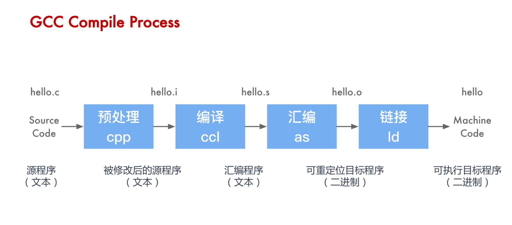
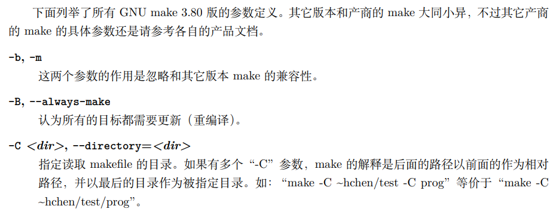
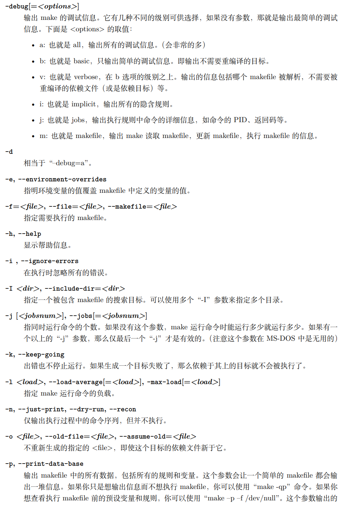
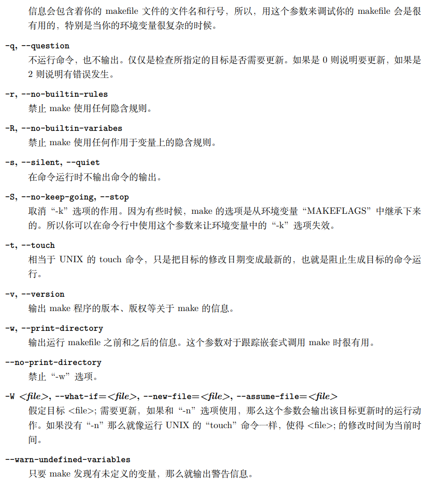
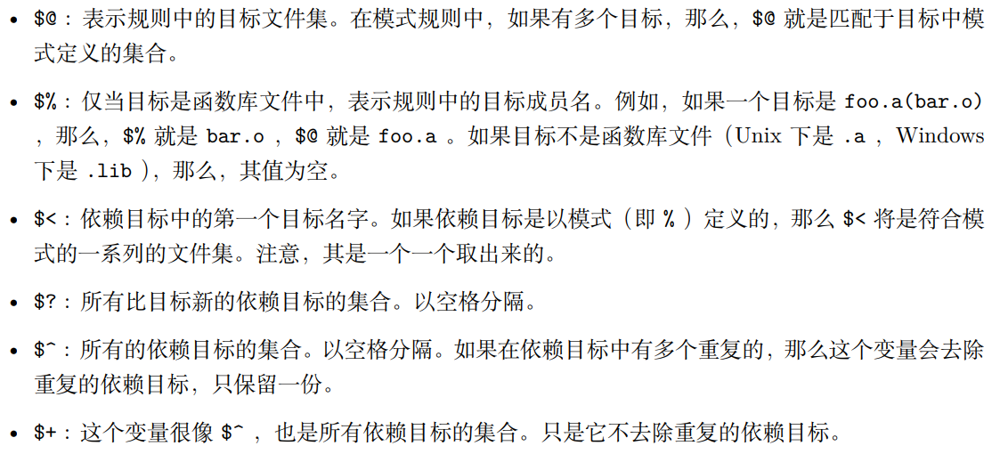
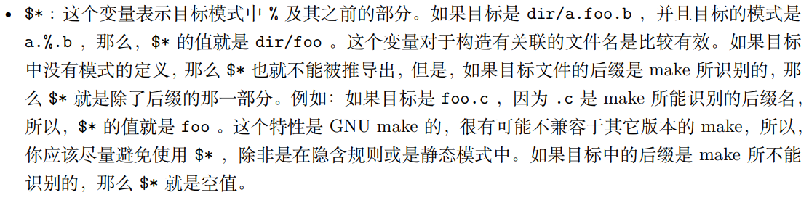
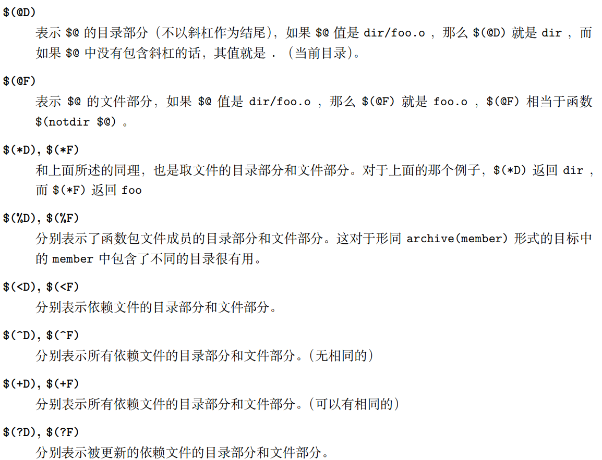

 

# Makefile


学习自书[《跟着我学makefile》](https://github.com/seisman/how-to-write-makefile)

参考：

https://github.com/loverszhaokai/GNUMakeManual_CN/blob/master/GNU_Make_Manual_CN.pdf

[Makefile模板](https://github.com/TheNetAdmin/Makefile-Templates/blob/master/Readme-cn.md)

## Chapter One

## 前置知识：

#  

## Chapter Two

`make` 命令执行的时候，需要一个`makefile`文件去告诉 make 怎么去编译和链接程序。

### 2.1    `makefile`规则

```makefile
target ...   : prerequsities ...
	recipe
	...
```

> **`target`**:
>
> ​	目标文件 or 可执行文件 or label
>
> **`prerequisities`**：
>
> ​	生成 `target`  所需要的依赖文件
>
> **` recipe` **：
>
> ​	该 ` target` 要执行的命令

### 2.2    ` make`   逻辑

1. make 会在当前目录下找名字叫“Makefile”或“makefile”的文件。 
2.  如果找到，它会找文件中的第一个目标文件（target），在上面的例子中，他会找到“edit”这个文 件，并把这个文件作为最终的目标文件。 
3.  如果 edit 文件不存在，或是 edit 所依赖的后面的 .o 文件的文件修改时间要比 edit 这个文件新， 那么，他就会执行后面所定义的命令来生成 edit 这个文件。 
4.  如果 edit 所依赖的 .o 文件也不存在，那么 make 会在当前文件中找目标为 .o 文件的依赖性，如 果找到则再根据那一个规则生成 .o 文件。（这有点像一个堆栈的过程） 
5.  当然，你的 C 文件和头文件是存在的啦，于是 make 会生成 .o 文件，然后再用 .o 文件生成 make 的终极任务，也就是可执行文件 edit 了。


### 2.3     `makefile` 中使用变量

``` makefile
#定义变量
OBJ = main.o cmd.o \
	insert.o
	
#使用变量
edit:$(OBJ)
	cc -o edit $(OBJ)
```


### 2.4     让 `make`自动推导

`make` 可以自动推导文件和文件依赖关系后面的命令。 解释：`  make` 会找寻与生成目标（.o） 文件名相同的` .c`文件。

故：

之前的版本：

``` makefile
objects = main.o kbd.o command.o display.o \
	insert.o search.o files.o utils.o

edit : $(objects)
	cc -o edit $(objects)
main.o : main.c defs.h
	cc -c main.c
kbd.o : kbd.c defs.h command.h
	cc -c kbd.c
command.o : command.c defs.h command.h
	cc -c command.c
display.o : display.c defs.h buffer.h
	cc -c display.c
insert.o : insert.c defs.h buffer.h
	cc -c insert.c
search.o : search.c defs.h buffer.h
	cc -c search.c
files.o : files.c defs.h buffer.h command.h
	cc -c files.c
utils.o : utils.c defs.h
	cc -c utils.c
clean :
	rm edit $(objects)

```


``` makefile
objects = main.o kbd.o command.o display.o \
	insert.o search.o files.o utils.o

edit : $(objects)
	cc -o edit $(objects)

main.o : defs.h
kbd.o : defs.h command.h
command.o : defs.h command.h
display.o : defs.h buffer.h
insert.o : defs.h buffer.h
search.o : defs.h buffer.h
files.o : defs.h buffer.h command.h
utils.o : defs.h

.PHONY : clean
clean :
	rm edit $(objects)
```

（最后三行 表示clean是一个 ***伪目标***）

### 2.5    `makefile` 另一种风格

``` makefile
objects = main.o kbd.o command.o display.o \
	insert.o search.o files.o utils.o

edit : $(objects)
	cc -o edit $(objects)

$(objects) : defs.h
kbd.o command.o files.o : command.h
display.o insert.o search.o files.o : buffer.h

.PHONY : clean
clean :
	rm edit $(objects)

```


### 2.6        清空目录规则

``` makefile
.PHONY : clean
clean :
	-rm edit $(objects)
```

在 rm 前面的 减号 意思是 ***如果某些文件出现问题，但不要管，继续做后面的事情***


### 2.7        Makefile 里有什么

`Makefile` 里主要包含了五个东西：显式规则、隐式规则、变量定义、指令和注释。


### 2.8       Makefile文件名

文件名 最好为  `Makefile`


### 2.10         包含其他`Makefile`  

```makefile
include <filename>
```

include ... 可以是当前操作系统 Shell 的文件模式（可以包含路径和通配符）。

```makefile
include foo.make *.mk $(bar)
#等价于
include foo.make a.mk b.mk c.mk bish bash
```

 make寻找  文件 的顺序：

1. 当前目录下
2. `-I  or  --include-dir`  参数指定的目录
3. `<prefix>/include    /usr/gnu/inlcude    /usr/local/include    /usr/include` 

环境变量 .INCLUDE_DIRS 包含当前 make 会寻找的目录列表。

***你应当避免使用命令行参数 -I 来寻 找以上这些默认目录，否则会使得 make “忘掉”所有已经设定的包含目录，包括默认目录。*** 

​	如果有文件没有找到的话，make 会生成一条警告信息，但不会马上出现致命错误。它会继续载入其 它的文件，一旦完成 makefile 的读取，make 会再重试这些没有找到，或是不能读取的文件，如果还是不 行，make 才会出现一条致命信息。

​	如果你想让 make 不理那些无法读取的文件，而继续执行，你可以在 include 前加一个减号“-”。如： 

```makefile
-include <filename>
```

 其表示，无论 include 过程中出现什么错误，都不要报错继续执行。如果要和其它版本 make 兼容， 可以使用 `sinclude` 代替 `-include` 。


### 2.11       环境变量  `MAKEFILES` 

***不建议使用这个环境变量***

这个环境变量中引入的Makefile目标不会起作用。


### 2.12       `make`  的工作方式

GNU 的 make 工作时的执行步骤如下：（想来其它的 make 也是类似） 


----------------------------------

1. 读入所有的 Makefile。 
2.  读入被 include 的其它 Makefile。 
3.  初始化文件中的变量。 
4.  推导隐式规则，并分析所有规则。 
5.  为所有的目标文件创建依赖关系链。 

--------------------

6. 根据依赖关系，决定哪些目标要重新生成。  
7. 执行生成命令。

第一阶段（1-5），如果定义的变量被使用了，但是 make  不会马上展开


## Chapter Three

### 书写规则

规则包含两个部分，一个是**依赖关系**，一个是**生成目标的方法**。

### 3.1     规则举例

```makefile
foo.o: foo.c def.h
	cc -c -g foo.c
```

### 3.2      规则的语法

```makefile
targets: prerequisities
	command
	...
	
# or
targets: prerequisities : command
	command
	...
```

* targets   可以是多个文件，或通配符。
* command 是命令行，如果其不与“target:prerequisites”在一行，那么，**必须以 Tab 键开头**，如果 和 prerequisites 在一行，那么可以用分号做为分隔。（见上）
* 反斜杠可以换行。


### 3.3    在规则中使用通配符

三个通配符：  *  ？ ~

举例：

在变量中的通配符

```makefile
obj = *.o
obj := $(wildcard *.c)                        #列出一确定文件夹中所有的.c文件
$(patsubst %.c,%.o,$(wildcard *.c))			  #列出上面命令中所有对应的.o文件
```

```makefile
objects := $(patsubst %.c,%.o,$(wildcard *.c))
foo : $(objects)
	cc -o foo $(objects)
```


### 3.4     文件搜寻

指定目录搜索，当`make`在当前目录下面找不到，则会去指定目录找，**`VPATH`** 为完成此功能的变量.

```makefile
VPATH = src:../headers
```


**`vapth`** 变量更加灵活：

```makefile
vpath <pattern> <directories>         #为符合模式 <pattern> 的文件指定搜索目录 <directories>

vpath <pattern>                       #清除符合模式 <pattern> 的文件的搜索目录。

vpath                                 #清除所有已被设置好了的文件搜索目录。

#<pattern> 中需要包含 % 字符，% 意思是匹配零或若干字符
```

举例：

```makefile
vpath %.h ../headers
```


### 3.5     伪目标

使用  `.PHONY`   来显式指明该目标为伪目标，这样就可以防止与文件名重名带来的不良后果。

```makefile
.PHONY : clean
clean :
	rm *.o temp
```


情况（有依赖的伪目标，并作为默认目标）:

```makefile
all : prog1 prog2 prog3
.PHONY : all

prog1 : prog1.o utils.o
	cc -o prog1 prog1.o utils.o
prog2 : prog2.o
	cc -o prog2 prog2.o
prog3 : prog3.o sort.o utils.o
	cc -o prog3 prog3.o sort.o utils.o
```

这样就可以 一口气生成若干个可执行文件。

> 原理：
>
> 我们知道，Makefile 中的第一个目标会被作为其默认目标。我们声明了一个“all”的伪目标，其依赖 于其它三个目标。
>
> 由于默认目标的特性是，总是被执行的，但由于“all”又是一个伪目标，伪目标只是一 个标签不会生成文件，所以不会有“all”文件产生。于是，其它三个目标的规则总是会被决议。也就达到 了我们一口气生成多个目标的目的。
>
> `.PHONY : all `声明了“all”这个目标为“伪目标”。（注：这里的显 式“`.PHONY : all`”不写的话一般情况也可以正确的执行，这样 make 可通过隐式规则推导出，“all”是 一个伪目标，执行 make 不会生成“all”文件，而执行后面的多个目标。建议：显式写出是一个好习惯。


情况（作为依赖的伪目标）：

```makefile
.PHONY : cleanall cleanobj cleandiff
cleanall : cleanobj cleandiff
	rm program
cleanobj :
	rm *.o
cleandiff :
	rm *.diff
```


### 3.6     多目标

目标可以不止一个。(自动化变量  $@ ,后文会学 )

```makefile
bigoutput littleoutput : text.g
	generate text.g -$(subst output,,$@) > $@
```

等价：

```makefile
bigout : text.g
	generate text.g -big > bigoutput
littleoutput : text.g
	generate text.g -little > littleoutput
```


### 3.7       静态模式

静态模式可以更加容易地定义多目标规则。

```makefile
<targets ...> : <target-pattern> : <prereq-patterns ...>
	<commands>
	...
```

**`<target-pattern>` ** 表示从  **`<targets ...>`**   中选出具有这样的 pattern 的组成一个集合。

直接看例子：

```makefile
objects:foo.c bar.o

all: $(objects)

$(objects): %.o: %.c
	$(CC) -c $(CFLAGS) $< -o $@
```

**`%.o `**   表示     **`$(objects)`**   要所有以 .o 结尾的目标

**`%.c`**   表示      依赖模式 **`%.c`** 则取模式 **`%.o`** 的  **`%.`** ，也就是 foo bar ，并为其加下 .c 的后缀，于是，我们的依赖目标就是 foo.c bar.c

等价于

```makefile
oo.o : foo.c
$(CC) -c $(CFLAGS) foo.c -o foo.o
bar.o : bar.c
$(CC) -c $(CFLAGS) bar.c -o bar.o
```


```makefile
files = foo.elc bar.o lose.o
$(filter %.o,$(files)): %.o: %.c
	$(CC) -c $(CFLAGS) $< -o $@
$(filter %.elc,$(files)): %.elc: %.el
	emacs -f batch-byte-compile $<
```

**$(filter %.o,$(files)) **表示调用 `Makefile` 的 filter 函数，过滤“$files”集，只要其中模式为“%.o”的 内容。


### 3.8        自动生成依赖

使用 `-M`  指令自动生成依赖关系；使用 `-MM`  指令自动生成依赖并防止将一些标准库文件也包含进来。

GNU组织建议议把编译器为每一个源文件的自动生成的依赖关系放到一个 文件中，为每一个 name.c 的文件都生成一个 name.d 的 Makefile 文件，.d 文件中就存放对应 .c 文件 的依赖关系。

举例：

```makefile
%.d: %.c
	@set -e; rm -f $@; \
	$(CC) -M $(CPPFLAGS) $< > $@.$$$$; \
	sed 's,\($*\)\.o[ :]*,\1.o $@ : ,g' < $@.$$$$ > $@; \
	rm -f $@.$$$$
```

这句命令可以 将 变量 source中的字符串 **.c** 都替换成 **.d**

```makefile
include $(sources:.c=.d)
```


## Chapter Four

### 书写命令

每个命令的开头都必须以  Tab  键开头，除非命令紧跟在规则后面的分号后的。

### 4.1      显示命令

```makefile
@echo   xxxxx
```

输出：

```makefile
xxx
```

如果没加 @  那么，make将会输出命令那一串字符：

```makefile
echo xxx
xxx
```


```makefile
make -n 
# or
make --just-print

#上面的命令只会显示命令，而不会执行命令。

make -s 
#  or
make --silent 
#  or
make --quiet

#上面的命令全面禁止命令显示
```


### 4.2      命令执行

make   会一条一条执行后面的命令，而如果你想要将结果应用于下一条命令，应该用分号：

```makefile
exec:
	cd /home/lyn; pwd
```


### 4.3      命令出错

为了忽略命令报错，可以在命令行之间 Tab之后加上 ` - `

```makefile
clean:
	-rm -f *.o
```


### 4.4       嵌套执行`make`

在每个子目录都写一个 `Makefile` 的好处在于使得 本身的 Makefile 更加简洁清晰易懂。

```makefile
subsystem:
	cd subdir && subdir
```

传递变量到下一级  `Makefile`:

```makefile
export <variable>

unexport <variable>

#传递所有变量
export
```


### 4.5     定义命令包

```makefile
define run
yacc $(firstword $^)
mv y.tab.c $@
endif
```


## Chapter Five

### 5.1     变量的基础

使用变量：

```makefile
obj = program.o
program : ${obj}
	cc -o program $(objects)
	
$(objects) : defs.h
```


### 5.2   变量中的变量

变量可以嵌套使用：

```makefile
foo = $(bar)
bar = $($(id))
id =ii.o
```

操作符的使用：

> **`:= `**     防止前面的变量使用后面的变量
>
> **`=`**       变量的定义可以不在使用变量前
>
> **`?=`**     条件判断操作符（ifndef endif）

技巧定义一个空字符：

```makefile
nullstring = 
space = $(nullstring) #辅助注释
#or
space = $(nullstring) $(nullstring)
```


### 5.3   变量高级用法

1. 替换共有部分

```makefile
$(var:.o=.c)
#将字符串var的后缀 .o 替换为 .c
```

2. 静态模式

```makefile
bar:= $(foo:%.o=%.c)
```


### 5.4     追加变量值

**`+=`**    : 如果这个变量之前没有定义，则   `+=`   变为 `=`  ,如果定义了，就会继承前次操作的赋值符。

```makefile
variable := value
variable += more

# 等价于

variable := value
variable := $(variable) more
```


### 5.5       override   指令

添加这个关键词后，这个变量将会接收来自make命令行的参数设置。

```makefile
override <variable>; =<vable>;
```


### 5.6   多行变量

使用 define  来设置变量可以换行

```makefile
define two-lines
echo fooo
echo $(bar)
endef
```


### 5.7      环境变量

### 5.8      目标变量

设置局部变量：
```makefile
<target ...> : <variable-assignment>
<target ...> : override <variable-assignment>
```

接下来的例子中，prog 中含有局部变量 `$(CFLAGS)`

```makefile
prog : prog.o foo.o bar.o
	$(CC) $(CFLAGS) prog.o foo.o bar.o
```


### 5.9       模式变量

可以给目标变量定义变量：

```makefile
%.o : CFLAGS = -o
```

语法：

```makefile
<pattern ...> : <variable-assignment>
<pattern ...> : override <variable-assignment>
```


## Chapter Six

条件变量：

```makefile
ifeq ($(strp $(foo)),)
<text-if-empty>
endif

ifdef <variable-name>
else
endif

ifndef <variable-name>
```


## Chapter Seven

### 7.1      函数调用语法

```makefile
$(<function> <arguments>)
```


### 7.2  字符串处理函数

```makefile
$(subst <from>,<to>,<text>)

$(patsubst <pattern>,<replacement>,<text>)

$(filter <pattern...>,<text>)
```

filter 函数

```makefile
sources := foo.c bar.c baz.s ugh.h
foo: $(sources)
	cc $(filter %.c %.s,$(sources)) -o foo
```

sort     排序函数

```makefile
$(sort <list>)
```


### 7.3       文件名操作函数

#### 取目录函数——dir。

```makefile
$(dir <names...>)
```

#### 名称：取文件函数——notdir。

```makefile
$(notdir <names...>)
```

从文件名序列  中取出各个文件名的后缀。

```makefile
$(suffix <names...>)
```

把前缀/后缀  加到  中的每个单词前面/后面

```makefile
$(addprefix <prefix>,<names...>)

$(addsuffix <suffix>,<names...>)
```

#### shell 函数

```makefile
contents := $(shell cat foo)
files := $(shell echo *.c)
```


## Chapter  Eight

### 8.1 make 的退出码

 make 命令执行后有三个退出码： 

* 0 表示成功执行。 
* 1 如果 make 运行时出现任何错误，其返回 1。 
* 2 如果你使用了 make 的“-q”选项，并且 make 使得一些目标不需要更新，那么返回 2。


### 8.2    指定Makefile

```makefile
make -f hchen.mk
```


### 8.3       指定目标

```makefile
.PHONY: all
all: prog1 prog2 prog3 prog4
```

* all: 这个伪目标是所有目标的目标，其功能一般是编译所有的目标。 
* clean: 这个伪目标功能是删除所有被 make 创建的文件。 
* install: 这个伪目标功能是安装已编译好的程序，其实就是把目标执行文件拷贝到指定的目标中去。 
* print: 这个伪目标的功能是例出改变过的源文件。 • tar: 这个伪目标功能是把源程序打包备份。也就是一个 tar 文件。 
* dist: 这个伪目标功能是创建一个压缩文件，一般是把 tar 文件压成 Z 文件。或是 gz 文件。 
* TAGS: 这个伪目标功能是更新所有的目标，以备完整地重编译使用。 
* check 和 test: 这两个伪目标一般用来测试 makefile 的流程。


### 8.4      make  参数








## Chapter Nine

### 9.1      使用隐含规则

我们也可以使用 make 的参数 -r 或 --no-builtin-rules 选项来取消所有的预设置的隐含规则。当然，即使是我们指定了 -r 参数，某些隐含规则还是会生效，因为有许多的隐含规则都是使用了 “后缀规则”来定义的，所以，只要隐含规则中有“后缀列表”（也就一系统定义在目标 .SUFFIXES 的依 赖目标），那么隐含规则就会生效。


1. 编译 C 程序的隐含规则。 `.o` 的目标的依赖目标会自动推导为 `.c` ，并且其生成命令是 `$(CC) –c $(CPPFLAGS) $(CFLAGS) `
2.  编译 C++ 程序的隐含规则。` .o `的目标的依赖目标会自动推导为 .cc 或是 .C ，并且其生成命令是 `$(CXX) –c $(CPPFLAGS) $(CXXFLAGS) `。（建议使用 .cc 作为 C++ 源文件的后缀，而不是 .C ）
3. 汇编和汇编预处理的隐含规则。 .o 的目标的依赖目标会自动推导为 .s ，默认使用编译器 as ，并且其生成命令是：$ (AS) $(ASFLAGS) 。.s 的目标的依赖目标会自动推导为 .S ，默认使用 C 预编译器 cpp ，并且 其生成命令是：$(AS) $(ASFLAGS) 。 
4. 链接 Object 文件的隐含规则。 目标依赖于 `.o `，通过运行 C 的编译器来运行链接程序生成（一般是 ld ），其生成命令 是：`$(CC) $(LDFLAGS) .o $(LOADLIBES) $(LDLIBS) `。这个规则对于只有一个源文件的工程 有效，同时也对多个 Object 文件（由不同的源文件生成）的也有效。例如如下规则:

```makefile
 x : y.o z.o 
```

并且 x.c 、y.c 和 z.c 都存在时，隐含规则将执行如下命令: 

```makefile
cc -c x.c -o x.o 
cc -c y.c -o y.o 
cc -c z.c -o z.o 
cc x.o y.o z.o -o x 
rm -f x.o 
rm -f y.o 
rm -f z.o 
```

如果没有一个源文件（如上例中的 x.c）和你的目标名字（如上例中的 x）相关联，那么，你最好写 出自己的生成规则，不然，隐含规则会报错的。


### 9.3 隐含规则使用的变量

#### 9.3.1 关于命令的变量。 

* AR : 函数库打包程序。默认命令是 ar 
* AS : 汇编语言编译程序。默认命令是 as 
* CC : C 语言编译程序。默认命令是 cc 
* CXX : C++ 语言编译程序。默认命令是 g++
* CPP : C 程序的预处理器（输出是标准输出设备）。默认命令是 $(CC) –E
* RM : 删除文件命令。默认命令是 rm –f

#### 9.3.2 关于命令参数的变量 

下面的这些变量都是相关上面的命令的参数。如果没有指明其默认值，那么其默认值都是空。 

* ARFLAGS : 函数库打包程序 AR 命令的参数。默认值是 rv
* ASFLAGS : 汇编语言编译器参数。（当明显地调用 .s 或 .S 文件时） 
* CFLAGS : C 语言编译器参数。 
* CXXFLAGS : C++ 语言编译器参数。
* CPPFLAGS : C 预处理器参数。（C 和 Fortran 编译器也会用到）。 
* LDFLAGS : 链接器参数。（如：ld ）


### 9.4       定义模式规则

模式规则中，至少在规则的目标定义中要包含 % ，否则，就是一般的规则。目标中的 % 定义表示对 文件名的匹配，% 表示长度任意的非空字符串。例如：%.c 表示以 .c 结尾的文件名（文件名的长度至少 为 3），而 s.%.c 则表示以 s. 开头，.c 结尾的文件名（文件名的长度至少为 5）。

```makefile
%.o : %.c ; <command ......>;
```

```makefile
%.o : %.c
	$(CC) -c $(CFLAGS) $(CPPFLAGS) $< -o $
```

#### 9.4.1 自动化变量







详解：

> * **`$@`**  ：目标文件。在模式规则中，代表复合模式的目标文件集合中的一个目标文件。
> * **`$<`**  ：第一个依赖文件。在模式规则中，代表符合模式的依赖文件集合中的最后一个依赖文件。
> * **`$>`**  ：最后一个依赖文件。在模式规则中，代表复合模式的依赖文件集合中的最后一个依赖文件。
> * **`$:`**  ：在模式规则中， 代表复合模式的依赖文件集合中的所有依赖文件列表。
> * **`$?`**  ：所有依赖文件中最近的一个文件。代表新的一组依赖文件中的第一个文件。
> * **`$~`**  ：所有依赖文件中最早的一个。也就是新的一组依赖文件中的最后一个文件。
> * **`$^`**  ：代表目前目标文件所依赖的所有文件。

举例：

```makefile
test: test1 test2 test3
	$(CC) -o $@ $^
	
test: test.c
	$(CC) -o $@ $<
	
test: test1.c
	$(CC) -o $@ $^ $?
```

