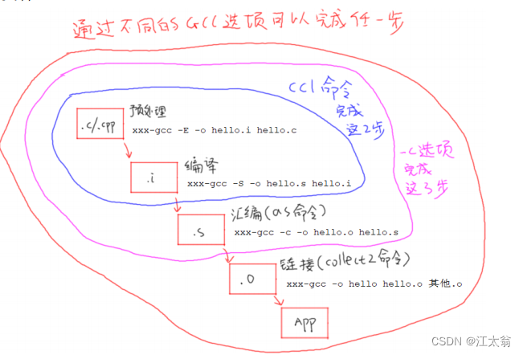

# GCC 常用命令

## Useful Options：

* `-x language`

  * specify the language for the  following input files

  

### Control the stags of compilation

* `-c`
  * Compile or assemble the source files but **do not link**
* `-S`
  * Stop after the stage of compilation proper; **do not assemble**
* `-E`
  * Stop after the **preprocessing stage**; **do not run the compiler proper**
* `-o file`
  * 

  

