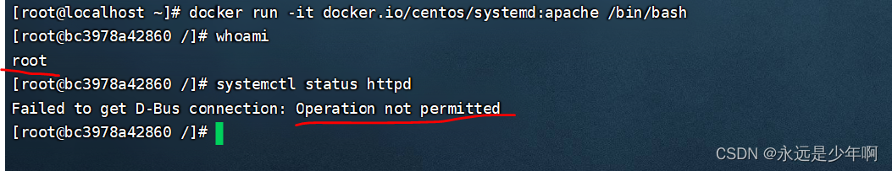

# Docker容器权限问题

## 一、Docker容器权限问题概述

我们在Docker的使用过程中，常常面临一种困扰，即进入Docker容器后，很多命令都没有权限执行，如下所示：



从上图中可以看出，尽管我们的Docker容器显示自己的身份是root，但是依旧有很多命令我们无法执行。

二、Docker容器权限问题解决
（一）Docker权限参数

我们在Docker启动时，可以使用–privileged=true和-u参数来给Docker容器授权，例如：


```shell
docker run -it --privileged=true -u=root docker.io/centos /bin/bash
```

这样，我们可以以ROOT的权限进入Docker并进行控制。可以解决诸如mount等指令无法执行的问题。

### 二）systemctl命令无权执行解决

但是，在某些Docker镜像中，我们加上这两个参数后仍然无法解决systemctl命令的执行权限问题。反而会报错：
 Failed to get D-Bus connection: Operation not permitted
 如下所示：

```bash
docker run -it --privileged=true -u root docker.io/centos/systemd:apache /usr/sbin/init
```