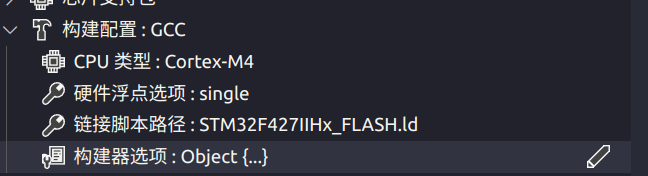

# EIDE 工作流

`CubeMX` - `VS Code` - `EIDE` 工作流 （Modified By Liam  2025-03-8）

## 前置环境准备：

* **软件环境:**
  - Windows 11/10   /   Ubuntu
  - STM32CubeMX
  - Vscode
  - OpenOCD
  - arm-none-eabi-gcc
* **硬件环境**：
  * STM32F427IIH6
  * STLink

### 工具安装：

* **OpenOCD**

  * OpenOCD是用于对STM32进行下载仿真的工具，是一个开源软件包，Windows版本下从[这里](https://gnutoolchains.com/arm-eabi/openocd/)下载。
  * Ubuntu直接  `sudo apt install openocd`  或者   自己去 google上下载

*  [Arm GNU Toolchain Downloads – Arm Developer](https://developer.arm.com/downloads/-/arm-gnu-toolchain-downloads)

  * 安装选择ZIP压缩包形式的如图：

  

  > 关于 **版本**？
  >
  > ​	理论上来说目前是下新的会更好，特别是你要使用 H7 等高性能mcu时，并且新版本GCC通常会会修复某些bug，引入对新C/C++标准的支持。
  >
  > ​	
  >
  > 
  >
  > ​	新版本可能会导致原有代码编译无法通过，原因为新引入的标准可能会禁止原有的不安全操作。
  >
  > ​	例如实践发现，使用 14.2.Rel1版本导致：
  >
  > ​	未引入标准库头文件而使用所含函数的行为   **将无法被编译**，但是在13.x中可以正常编译
  >
  > ​	`error: implicit declaration of function 'printf' [-Wimplicit-function-declaration]`    编译无法通过
  >
  > ​	
  >
  > AArch32 bare-metal target (arm-none-eabi) 为我们需要下载的交叉编译器
  >
  > mingw-w64-i686 : 32位
  >
  > mingw-w64-x86_64： 64位系统 （14.2版本中出现）
  
  
  
  把上面那俩的**环境变量**添加好。
  
  arm-gcc那个记得只添加  **/home/lyn/Environment/gcc-arm-none-eabi-10.3-2021.10/bin**  这个bin目录
  
  

## 构建工程步骤

### CubeMX 生成 Makefile 工程

> Makefile 是一种 linux 下的工程管理方法（Windows 下也能用），但我们生成 Makefile 只是为了方便获取要编译的源文件列表、包含路径、预处理定义等信息，并没有真正使用 Makefile。（感兴趣的同学可以自己百度了解）

生成工程文件的时候，选 ==Makefile==


注意请勾选：  ***Copy only the necessary library files***


生成之后，注意观察，`startup_stm23f427xx.s`  文件中需要有几百行代码。（有时候CubeMX抽风，会生成错的）


### 创建 EIDE 空项目

用 VS Code 打开刚才生成的工程目录

EIDE - 新建项目 - 空项目 - Cortex-M - 输入项目名称（需要和 CubeMX 生成的文件夹名称相同）

> 首次打开 EIDE 时会提示下载运行库之类的东西，点确定让它自己下载就好

弹出文件夹选择窗口，选择工程目录的上一级文件夹


出现如下警告时，点 yes，并在之后的弹窗中选择切换到工作区


之后在 VS Code 中的资源管理器应该可以看到这些文件（夹）


> （如果看不到 `Core`, `Drivers` 等文件夹，***很可能是项目名称不一致或没有选择上一级文件夹***，导致 EIDE 工程创建到了别的地方，建议 remake）

### 配置 EIDE 工程

打开 EIDE 插件栏（如下图）


#### 添加 .s 文件

> 之所以先添加 .s 文件，是为了防止遗忘

项目资源 - 右键 - 添加文件

这里选 asm 或 any


然后选择名称类似 `startup_stm32xxxxx.s` 的 `.s` 文件（不同芯片文件不同）

#### 添加 .c 文件夹

项目资源 - 右键 - 添加源文件夹，选择普通文件夹


添加 `Core`, `Drivers` 等所有包含 .c 文件的文件夹


添加完成后：


#### 配置 GCC 

配置以下部分：

- CPU 类型：可以在 `CubeMX`、`百度` 或者生成的 `Makefile` 里查到
- 链接脚本路径：填写工程目录下 `STM32xxxx_FLASH.ld` 文件的相对路径（不同芯片文件不同）
- 对于有 FPU 的 CPU：
  - 在硬件浮点选项中选 `single` （对于 Cortex-M4）
  - 在构建器选项 - 全局选项 - 硬件浮点 ABI 选 hard（记得保存）

> 在 Makefile 里可以找到这些：
>
> ```makefile
> # cpu
> CPU = -mcpu=cortex-m4
> 
> # fpu
> FPU = -mfpu=fpv4-sp-d16
> 
> # float-abi
> FLOAT-ABI = -mfloat-abi=hard
> ```

配置完成后：



#### 烧录器配置

根据自己使用的烧录器和芯片配置即可

例如：


==or==


#### 项目属性

##### 包含目录

> ## （==强烈建议==）如果设置中勾选了 `EIDE.Source Tree: Auto Search Include Path`（如下图），那么 EIDE 会自动搜索项目资源中添加的文件夹，这里就不用手动填入了


> ## 如果不进行上面的步骤，否则参考 Makefile 填入  这里：


点击项目属性右边的按钮：


将Makefile中的头文件引用部分，添加进入这个文件 的 IncludeFolders 

> Makefile 相关部分长这样，注意要去掉每行开头的 `-I` 和最后的 `\`
```
# C includes
C_INCLUDES =  \
-ICore/Inc \
-IDrivers/STM32F4xx_HAL_Driver/Inc \
-IDrivers/STM32F4xx_HAL_Driver/Inc/Legacy \
-IDrivers/CMSIS/Device/ST/STM32F4xx/Include \
-IDrivers/CMSIS/Include
```

添加完成长这样：


##### 预处理器宏定义

在Makefile 中找到这样的代码：

```
# C defines
C_DEFS =  \
-DUSE_HAL_DRIVER \
-DSTM32F407xx
```

然后：

在预处理器定义栏点击 `+` 出现这个：


将刚刚找到的 C_DEFS = 后面的复制过来  ，注意去掉 `-D` 和 `\`

可以用 `;` 分隔每个定义，例如 `USE_HAL_DRIVER;STM32F407xx`（不同芯片不一样）


#### 更改 "EIDE.ARM.GCC.InstallDirectory"


填入你**安装的gcc目录**（最新的gcc在前步骤中已经安装了），例如"F:\\Environment\\arm-gnu-toolchain-13.2.Rel1-mingw-w64-i686-arm-none-eabi"


**至此，配置完成！`F7` 编译一下试试？**


## 一些技巧

### 一键编译烧录
在 EIDE 工程打开时，按 `ctrl`+`shift`+`p`，输入 `eide` 可以找到许多相关命令


可以给 eide: 构建、烧录分配快捷键，实现一键编译烧录（当然你每次在这里点也可以）

## EIDE其实可以配合KEIL进行使用

只需要在EIDE界面选择： “导入”， 并选择 MDK


这样就可以在EIDE中进行编辑，在keil中进行调试

## 调试配置生成


## 问题： 在链接环节，LD文件报错，显示找不到某些符号

解决方法：

1. 打开插件设置


2. 更改 "EIDE.ARM.GCC.InstallDirectory": 为你**安装的gcc目录**（最新的gcc在前步骤中已经安装了），例如"F:\\Environment\\arm-gnu-toolchain-13.2.Rel1-mingw-w64-i686-arm-none-eabi"


