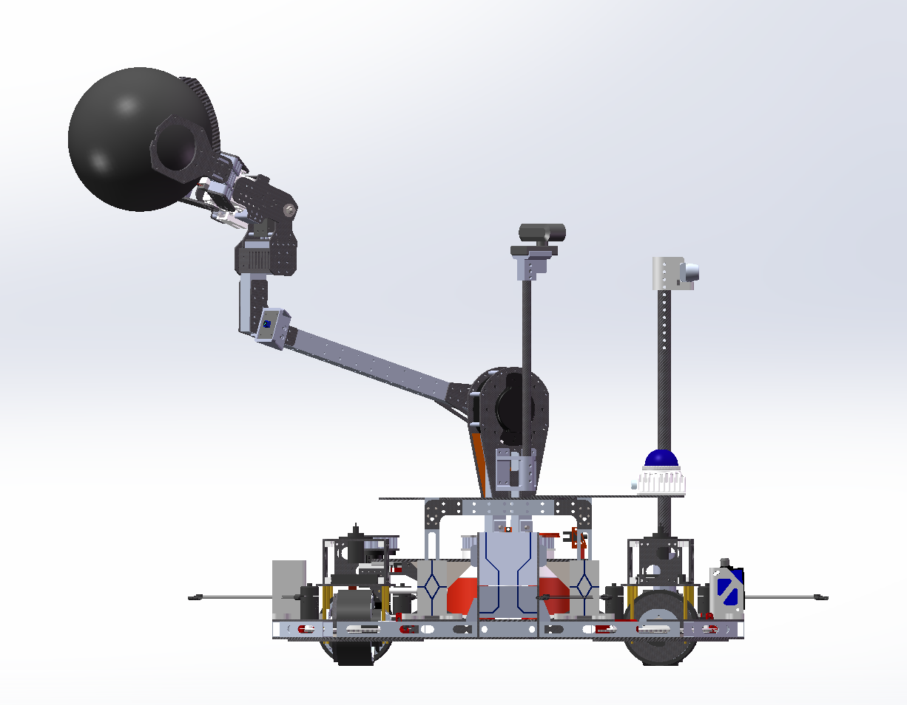
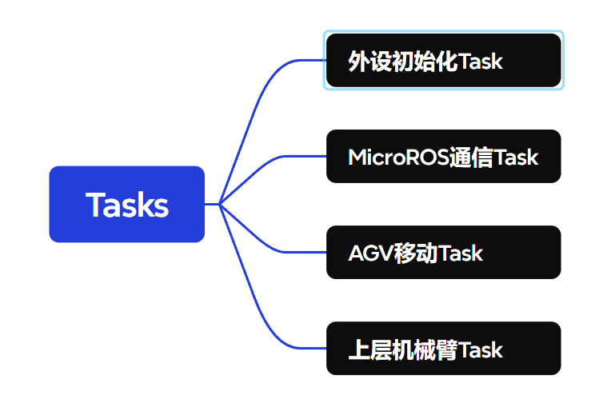
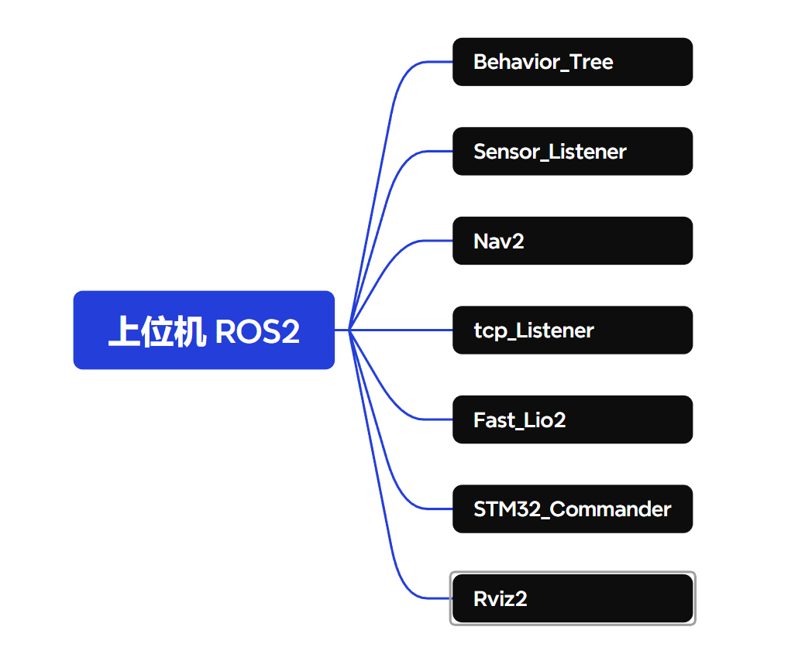
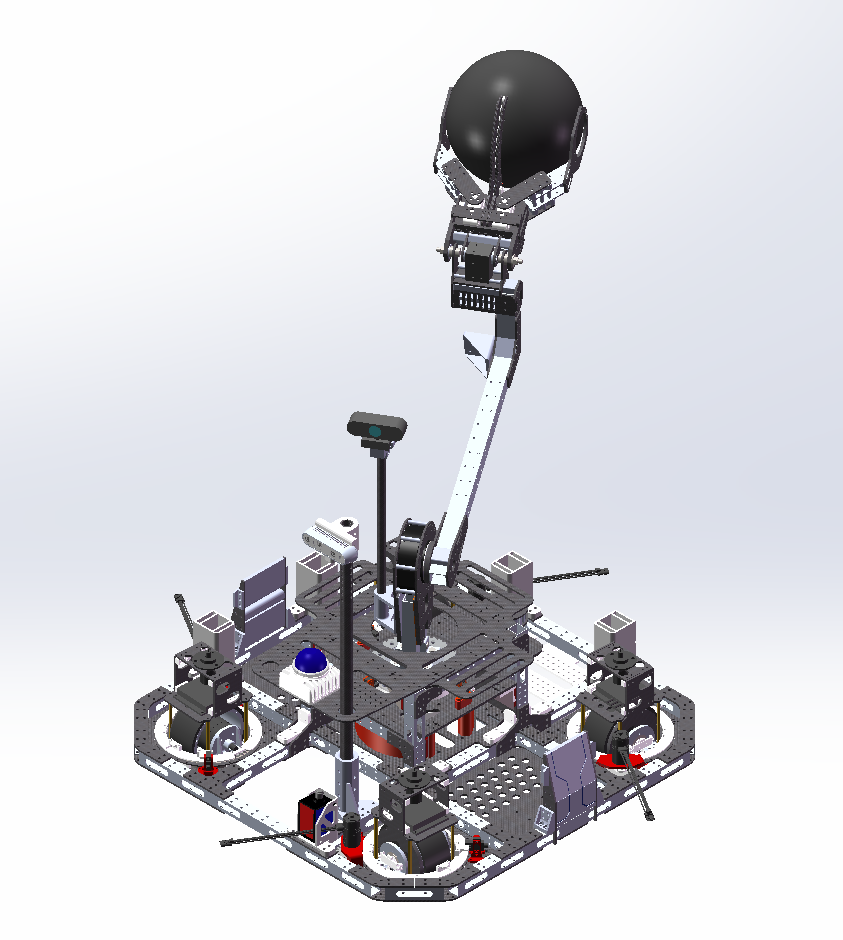

# RC24-AGV-Robot

> 2024赛季‘颗粒归仓’ WTR2024 R2-Robot 车车，主要任务：将目标物体——不同颜色的球夹取放到目标位置，难点：地形复杂，具有坡
>
> 时间轴：2023-11 ~ 2024-7



## 机械组成：

R2底盘由**四个**全向舵轮组成全向移动底盘，上层由一个4自由度机械臂夹爪组成，夹爪底部固定于可以旋转 420 度云台之上，以便实现机身超过240度的夹取范围。视觉方面，使用一前一后两个摄像头分别对目标物体和放置位置的识别，一个摄像头固定在与机械臂连接的云台之上；另一摄像头固定于底盘末端。其余传感器如：Mid360激光雷达固定于后端；底盘四周配备2个高精度单点激光测距。

### 主要部件型号：

- 电机型号：
  - 5065-400KV外转子滑板电机*4
  - 大疆2006无刷电机*4
  - 大疆3508无刷电机*4
  - 宇树GO-M8010-6关节电机*1
  - 飞特舵机*3
- 相机型号：
  - Intel RealSense D435i
- 激光雷达：
  - Mid360
- 主控：
  - STM32F429IGT6
  - Intel NUC 10
  - Nvidia Orin NX

- 双网口交换机*1

## 软件部分：

> ### 技术栈：
>
> - 硬件：
>   1. STM32主控PCB绘制
>   2. ADC采样模块
> - 软件：
>   1. STM32 开发 **裸机** && **FreeRTOS**
>   2. ROS——Navigation2
>   3. Behavior Tree
>   4. Yolo
>   5. OpenCV

控制部分，我们使用了STM32F4系列作为电机和各种传感器的驱动主控，使用一台x86_64平台的intel NUC作为上位机实现最终的控制，视觉处理部分则交给NVidia NX（NX搭载 32 个 Tensor Core 的 1024 核 NVIDIA Ampere 架构 GPU，158TOPs AI算力）去解决。之所以使用x86平台是因为，相比于Arm平台，软件兼容性好太多，减少不必要的因为要手动编译源码解决冲突所需的调整过程。

### 下位机：

下位机使用主控STM32F429IGT6（大疆系列A板），使用FreeRTOS进行任务调度。

总架构：



#### MicroROS

由于我们的上位机使用ROS2节点作为控制网络对各个设备进行控制，因此我们直接采用了ROS2的一个项目[micro-ROS](https://github.com/micro-ROS)，移植部署在STM32，该项目的核心功能为创建发布者和接收者，和ROS2功能相似，自带校验通信协议，免去了我们自行编写通信协议以及调试串口的时间。

> 为了方便随时编译，我专门写了一个Makefile，在脱离IDE的情况下也能进行编译和烧录：[lynliam/MicroRos](https://github.com/lynliam/MicroRos)

创建完毕后只需要在ROS2本体中启动`micro_ros_agent`即可，详细查看：[lynliam/WTR_micro_ros_stm32cubemx_utils: A set of utilities for integrating micro-ROS in a STM32CubeMX project](https://github.com/lynliam/WTR_micro_ros_stm32cubemx_utils)

#### 舵轮移动：

底盘移动部分的控制代码，主体部分使用事件驱动型的层次式状态机（HSM）对底盘运行状态进行维护，并具有紧急事件处理能力。

##### HSM

层次式状态机的核心思想为引入 **状态嵌套** 理念，并允许一个子状态从它的祖先（超状态）继承行为，有效简化控制流程并提高代码复用能力和追踪能力。状态的每一次更改，我们只需要给每个状态注册相应的函数（函数指针），便可执行对应动作，十分便于后期代码维护。

**核心结构体**：

```c
typedef struct HSM_STATE_T
{
    struct HSM_START_T *parent;          // parent state
    HSM_FN handler;             // associated event handler for state
    const char *name;           // name of state
    uint8_t level;              // depth level of the state
};
struct HSM_T
{
    HSM_STATE *curState;        // Current HSM State
};
```

事件创建：

```c
HSM_STATE CHASSIS_ON;
HSM_STATE CHASSIS_OFF;
HSM_STATE CHASSIS_ONReady;
HSM_STATE CHASSIS_ONError;
HSM_STATE CHASSIS_ONCorrecting;
HSM_STATE CHASSIS_ONReadyRunning;
HSM_STATE CHASSIS_ONReadySTOP;
```

状态处理函数：

```c
HSM_EVENT CHASSIS_ON_Handler(HSM *This, HSM_EVENT event, void *param)
{
    if(event == HSM_ENTRY)
    {
        HAL_GPIO_WritePin(GPIOG, GPIO_PIN_1, GPIO_PIN_RESET);
    }
    else if(event == HSM_EXIT)
    {
        HAL_GPIO_WritePin(GPIOG, GPIO_PIN_1, GPIO_PIN_SET);
    }
    else if(event == HSM_CHASSIS_INIT)
    {
        HSM_Tran(This, &CHASSIS_ONCorrecting, 0, NULL); 
        return 0;
    }
    else if(event == HSM_CHASSIS_ERROR)
    {
        HSM_Tran(This, &CHASSIS_ONError, 0, NULL); 
        return 0;
    }
    else if(event == HSM_CHASSIS_POWEROFF)
    {
        HSM_Tran(This, &CHASSIS_OFF, 0, NULL);
        return 0;
    }
    return event;
}
```

之后的控制只需要提供相应的事件，状态机将会自动进行处理。

下面为采用了状态机后的底盘Task，十分简洁：

```c
void StartChassisTask(void *argument)
{
    HSM_CHASSIS_Init(&mychassis, "chassis");
    HSM_CHASSIS_Run(&mychassis, HSM_CHASSIS_START, NULL);    
    for (;;) {
        // swChassis_set_targetVelocity(&mychassis, 0.2, 0.0,0.0);
        HSM_CHASSIS_Run(&mychassis, Next_Event, NULL);

        vTaskDelay(5 / portTICK_RATE_MS);
    }
}
```


##### 底盘驱动

底盘驱动采用回调函数或函数指针实现模块解耦，例如：

```c
void vesc_2006_swheel_init(Swheel_t *this, uint8_t id, GPIO_TypeDef *GPIOx, uint16_t GPIO_Pin)
{
        Swheel_init(
        this,
        id,
        GPIOx,
        GPIO_Pin,
        CHASSIS_WHEEL_REDUCTION,
        20*powf(-1,id),
        mDJI_RgetSpeed,
        mDJI_RgetPos,
        mDJI_RspeedServo,
        mDJI_RposServo,
        mDJI_Rreset,
        NULL,
        vesc_MspeedServo,
        vesc_Mstop
        );
}
```

我们只需维护指针表便可以实现对应动作的更改。

其余关于底盘全向舵轮数学结算问题，网上有一大把教程，在此不再陈述。注意点：

1. 数学解算正确性
2. 舵向电机寻找最短圆弧进行旋转
3. CAN网检测函数，防止电机失控


#### 机械臂：

机械臂部分，我们分别将每个活动关节的电机的控制接口均采用 ROS发布 和 接收 方式，通过在ROS2 gazebo中导入关节模型，设定正确的坐标映射变换，就可以实现上位机分别控制每个关节的效果。

 

注：在编写驱动时，可以采用：

```c
UnitreeMotor * Unitree_Create_Motor()
{
#ifdef USE_FREERTOS
    UnitreeMotor * instance = (UnitreeMotor *)pvPortMalloc(sizeof(UnitreeMotor));
#else
    UnitreeMotor * instance = (UnitreeMotor *)malloc(sizeof(UnitreeMotor));
#endif
    return instance;
}
```

类似C++对象的思想，将电机初始化为实例对象，便于对多个电机进行控制。

> 时延问题：使用高速回调定时器，发送命令值。


### 上位机：

总架构：



我们使用了 Ros2 Navigation2 作为上位机控制主框架、行为树作为程序运行逻辑控制来构建整个运行平台。


#### 组件：Action_Findball

- spin_to_func  ： 底盘旋转程序

- pid_controller ： PID组件

- approaching_ball ： 接近球 Action 服务器

  

该组件主要功能为 获取摄像头数据，运行opencv寻找目标球坐标，执行底盘控制程序接近目标，最后运行夹取球程序。

- approaching_ball ： 接近球 Action 服务器，使用**kalman 滤波器**对球的位置进行进一步处理，防止底盘在快速运动中对球的跟踪丢失
- 包含生命周期管理功能
- 使用多线程，启动多个节点，节点间使用互斥锁来进行数据共享（接受回调接受的数据写入和执行节点的数据读入）
- 状态机采用 进、出、主程序的执行方式
- 电子围栏，监控底盘是否越界or撞墙


##### 组件： Detect

- `camera_distribute` : 多个摄像头处理组件
- `Find_ball `： Opencv主程序，识别多个椭圆球
- `PTZ_angle` ： 对现实角度和相机像素进行标定

###### `camera_distribute` 

本次项目使用了两个摄像头，一个装在云台上负责远距离定位，一个装在机械臂末端负责近距离识别。该 `camera_distribute` 负责获取摄像头唯一设备ID，并分配内部序号，最后写入xml文件，保证每个摄像头运行的程序对应。


###### `Find_ball.cpp ` 

- 负责运行识别主程序，正确辨识多个复杂的不同颜色球。（800*600）

* 色彩空间转换 BGR --->  HSV 色相 饱和度 亮度 （考虑光照）
* 高斯模糊，消除噪点
* 创建色彩遮罩
* 灰度处理
* 形态学闭运算  腐蚀膨胀
* 考虑反光影响，将该区域直接填充
* 椭圆检测
* 对大小进行排序
* 目标球决策： 当目标球消失（超过3s）：修正kalman滤波器，更换目标； 当寻找的目标球被遮挡，优先寻找没有被遮挡的球


- 对两种颜色（紫色和红色）直径30cm的球进行识别，并考虑各种 **遮挡** 和 **丢失** 情况
- 使用kalman 进行位置估计，并在球从摄像头画面中消失时 准确预估其位置，并重新跟踪
- 使用 OpenCV库中 椭圆检测算法，该算法使用三角形原理来检测圆弧，能准确提取遮挡边沿信息
- 使用c++ 多态


###### `publisher_findball.cpp`

- 创建一个摄像头画面实时回传网页，监测识别结果（curl库）
- 线程通信、互斥锁
- 生命周期管理


#### 组件：`tcp_listener`

负责和 nvidia orin nx 进行通信， 然后进行决策

> 选择tcp通信原因，tcp为可靠通信，方案选择最初是为了使用wifi局域网，减少走线，最后为了减少赛场信号干扰，使用了交换机。。。


#### 组件： `sensor_listener`

负责回传和监测传感器发送数据，例如激光串口、mid360数据、底盘速度向量


#### 组件： BehaviorTree.CPP

全图运动进行流程控制


## 赛后复盘：

### 问题一：自控理论缺失

整个系统设计初期，没有对控制器带宽、整个系统时延、单片机性能预估、控制器选择上进行严谨考虑。例如上下位机通信时延没有控制、机械臂效果偏差。

### 问题二：底盘PMSM驱动没有接外置编码器，跑无感算法性能差。


### 问题三： 没有对 摄像头进行标定

对摄像头只进行了正畸标定，没有对现实距离进行标定，导致并不能获取当前目标球在地图中的坐标，进而无法使用路径规划器组件，纯粹依靠

### 问题四： 底盘旋转性能差

换成：基于加速度限制的 bang-bang 控制规划算法，性能好了一点


#### 优点一： 使用xml作为信息交互文件

### 优点二： 使用HSM 层次状态机


### 贡献：定位**[opencv_contrib](https://github.com/opencv/opencv_contrib)** 椭圆识别库中数组越界的bug  编号#3704  ， 给OpenCV 库 提出issue ， 并成功被修复


## 附录图片：

