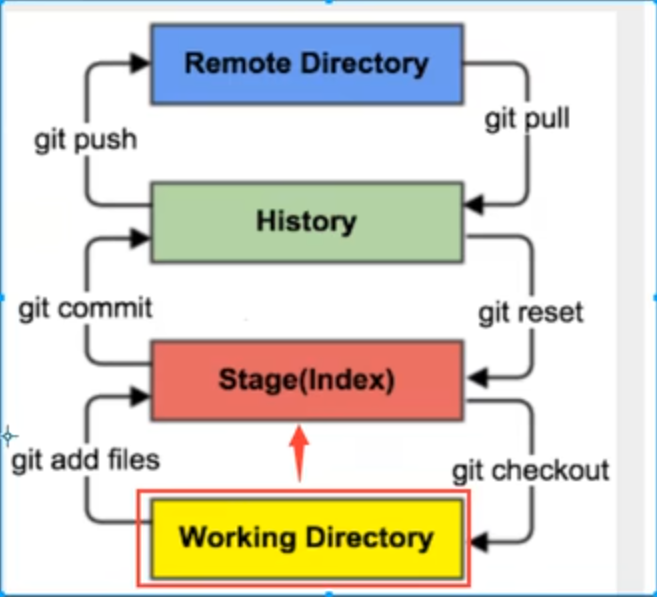
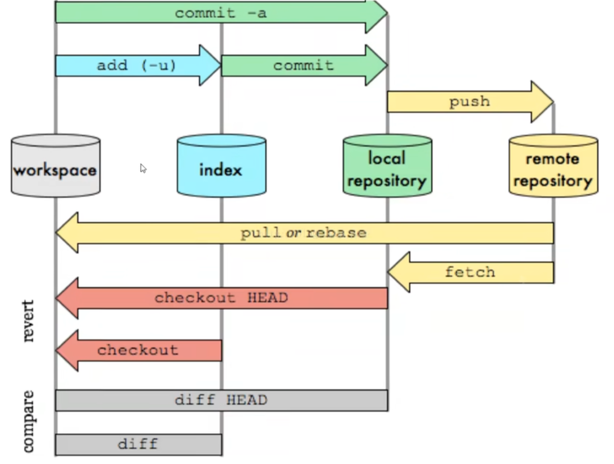
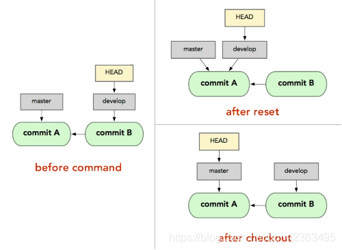
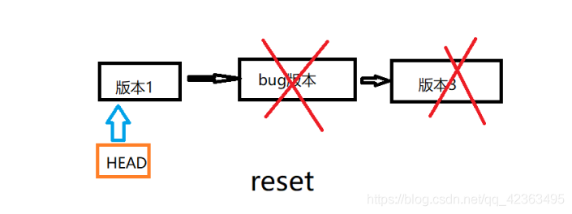
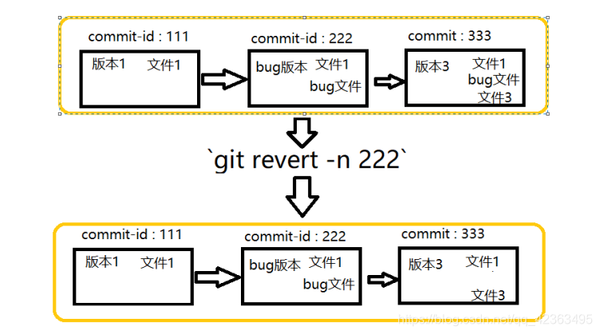
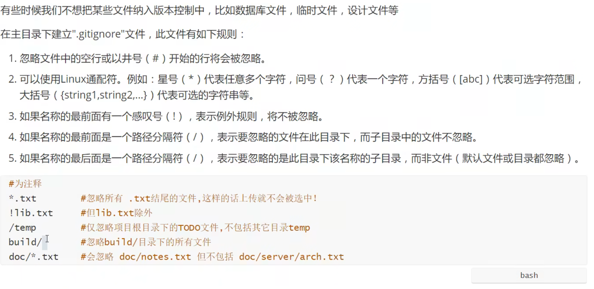

# Git

## 一、git配置

```shell
git config -l
#查看当前git环境配置
```

### 系统config：

```shell
git config --system --list
```

配置文件在`git安装目录/etc/gitconfig`

### 用户配置：

```shell
git config --global --list
```

配置文件在`~/.gitconfig`

### 查看当前仓库配置信息:

```shell
git config --local --list
```

配置文件在`当前项目的/.git/config`

### 修改git配置:

```git config [--local][--global][--system] section.key value```

```git config --local user.name huhuhu``` 设置当前项目的用户名

```git config --global core.quotepath false``` 配置当前用户的编码项，可以解决中文编码问题

```git config --local core.ignorecase false``` 配置当前项目不忽略文件大小写，git默认忽略文件名的大小写，这点值得注意

## 二、基本理论



* Working Directory: 项目代码区
* Stage：暂存区，临时存放改动
* Resposiry：仓库区 ，这里有提交的所有版本信息，```HEAD```指向最新放入仓库的版本
* Remote：远程仓库




### 4.1、init && clone

`git init` 在当前目录新建一个仓库

`git init [project-name]` 在一个目录下新建本地仓库

`git clone [url]` 克隆一个远程仓库

#### 4.2、diff

```git diff HEAD -- ```. 查看最新本地版本库和工作区所有文件的区别

```git diff HEAD -- [file-name]``` 查看最新本地版本库和工作区文件的却别

```git diff HEAD^ -- [file-name]``` 查看本地上一个版本和工作区文件的却别

```git diff [local branch] origin/[remote branch]``` 比较本地分支和远程分支的区别

### 4.3、status

------

`git status [file-name]` 查看指定文件状态

`git status` 查看所有文件状态

#### 4.4、add

```git add [file-name1] [file-name2] ... ```从工作区添加指定文件到暂存区

```git add ```. 将工作区的被修改的文件和新增的文件提交到暂存区，不包括被删除的文件

```git add -u . u指update```，将工作区的被修改的文件和被删除的文件提交到暂存区，不包括新增的文件

```git add -A``` . A指all，将工作区被修改、被删除、新增的文件都提交到暂存区

#### 4.5、commit

```git commit -m [massage]``` 将暂存区所有文件添加到本地仓库

```git commit [file-name-1] [file-name-2] -m [massage]``` 将暂存区指定文件添加到本地仓库

```git commit -am [massage] ```将工作区的内容直接加入本地仓库
```git commit --amend``` 快速将当前文件修改合并到最新的commit，不会产生新的commit。在提交commit后发现还有部分文件修改忘记提交了可以是用该命令

加-m是指直接在后面写上版本的注释，不加-m的话会用一个vim打开文件让你写入massage，有未追踪的文件将会失败，需要add加入暂存区。

### 4.6、clean

`git clean -df` 加`-d`是指包含目录，加`-f`是指强制，删除所有未跟踪的文件

#### 4.7、log

```git log``` 显示所有commit日志

```git log --pretty=oneline``` 将日志缩写为单行显示

```git log --graph --pretty=oneline --abbrev-commit ```查看分支合并情况

```git log --oneline --decorate --graph --all``` 查看分叉历史，包括：提交历史、各个分支的指向以及项目的分支分叉情况。

```git log -3 ```查看最新3条commit日志数据

### 4.8、reflog

`git reflog` 显示操作本地版本库的命令，包括commit和reset等，在回退版本以后又后悔找不到commit id了可以使用此命令查看历史

#### 4.9、push

`git push` 将文件添加到远程仓库

`git push -f` 强制提交，当我们本地reset到旧的版本时，然后普通push会被拦截，因为此是本地HEAD指向比远程库还要旧

`git push origin [branch-name]` 推送当前本地分支到指定远程分支

### 4.10、rm

`git rm --cached [file-name]` 删除暂存区的文件

`git rm -rf .` 不但删除所有暂存区的文件，还删除所有工作区的物理文件

### 4.11、checkout

```
git checkout -- [file-name]
```

- 最好加`--`，没有的话就把它当作切换分支看待，切换到另一个分支了，如果没有这个分支也会把它当作文件执行。

- 用暂存区的文件覆盖掉工作区的文件

  如果暂存区没有可更新的就会用commit的文件更新工作区的文件

  `git checkout [branch]` 切换分支

  `git checkout -b [new-branch-name]` 创建并切换分支

### 4.12、reset

**当对整个版本进行操作**

```
git reset --{soft|(mixed)|hard} HEAD
```

- `--soft` 其中可选参数soft表示单纯的切换HEAD指向的commit-id
- `--mixed` 默认值mixed参数表示先执行上面一步，然后再将commit-id里面的内容更新到暂存区
- `--hard` hard表示先执行上面两步，然后再将暂存区内容同步到工作区

`git reset --hard HEAD^^` 用上两个版本里的所有文件撤回到暂工作区

`git reset --hard [commit id]` 用指定版本的所有文件撤回到工作区

**当对当个文件进行操作**

```
git reset HEAD [file-name]
```

- 对单个文件操作时候只能用mixed参数，而且还是可省略

- 对单个文件操作时候HEAD指向不会变

- 将commit中指定的文件同步到暂存区中

- `git reset [commit-id] [file-name]` 将指定commit-id中的文件替换掉暂存区的文件

  **切换分支的比较**

  `git reset [branch]` 切换分支，但这里的切换分支和上面的`git checkout [branch]`切换分支不同，下图说明：

  

  ### Revert

  ```shell
  git revert -n [commit-id]
  git revert -n HEAD^^
  ```

  #### 撤回版本比较

  - reset 切换版本是会删除丢弃最新的版本的，HEAD会直接跳到指定版本，但是还是可以通过reflog找回。

  

  - revert 会将指定的bug版本视为bug版，会将当前版本中的bug版的代码删除，生成新的commit覆盖掉当前commit，但是commit-id是不会变的。




### branch

```git branch [branch-name]``` 创建分支

```git branch``` 查看当前分支

```git branch -a ```查看本地和远程的所有分支

```git branch -r``` 查看远程所有分支

```git branch -d [branch-name]``` 删除一个分支

```git branch -D [branch-name]``` 强制删除一个没有合并的分支

```git branch --set-upstream-to=origin/[branch-name] [branch-name]``` 把本地分支和远程分支进行连接

### merge

```git merge``` 合并本地```origin/[branch-name]```和```HEAD->[branch-name]```的代码，并同步到工作空间

```git merge [branch-name]``` 用于合并指定分支到当前分支

```git merge --quit``` 退出当前分支合并，当合并后冲突很多，要撤回合并分支就可以用这个命令

```git merge --no-ff -m [massage] [branch-name] ```不使用Fast forward合并分支，这样会创建新的commit，所以需要massage。这样被合并的分支HEAD指向是会变的。

如果使用了Fast forward方式合并分支，那么删除次要分支的时候历史分支记录也会被删除，这样就无法追寻分支合拼信息了。

### switch

```git switch -c [branch-name] ```创建新分支并切换到该分支

```git switch [branch-name]``` 切换到已有分支

### stash

```git stash``` 隐藏当前工作的修改

如果不隐藏自己修改的半成品代码，就会发生切换到别的分支后，将然后自己的半成品代码带入其他分支，这样就发生很多不必要的麻烦。
git stash save message 执行存储时，添加备注，方便查找，只有git stash 也要可以的，但查找时不方便识别。

```git stash list ```查看隐藏的工作信息列表

```git stash drop``` 删除隐藏的工作信息

```git stash pop``` 恢复隐藏的工作信息，同时删除隐藏的工作信息

```git stash apply [stash@{0}] ```恢复指定的隐藏工作信息，但是不会删除隐藏的工作信息

### cherry-pick

```git cherry-pick [commit-id]``` 这个是复制一次commit提交，然后在当前分支上重新提交一遍；也就是将指定commit的合并到当前分支；

这种适用于在其他分支上修复了bug，但是这个bug在当前分支上依然存在，所以可以复制这个commit的过程，不必重写代码。

### remote

```git remote add origin``` 远程地址 关联远程仓库

```git remote``` 查看本地添加了哪些远程分支地址

```git remote -v ```查看本地添加了哪些远程分支地址更详细信息

```git remote remove origin ```删除本地指定的远程地址

### fetch

```git fetch``` 拉取远程分支最新的```commit```到本地仓库的```origin/[branch-name]```

### pull

``git pull`` 从远程仓库拉取代码到工作空间

```pull ``和`` fetch``的关系

```git pull == git fetch + git merge```

### tag

```git tag``` 查看所有标签

```git tag [version]``` 给当前最新的```commit```打上标签

```git tag [version] [commit-id]``` 给指定的```commit-id```打上标签

```git tag -a [version] -m [massage] [commit-id]``` 给指定的```commit-id```打上标签并附上说明文字

```git tag -d [version]``` 删除标签

### show

```git show [tag-name]``` 查看标签的详细信息

### rebase

```git rebase -i HEAD~2``` 合并前两个历史提交，会弹出vim修改信息，修改第二行的pick为s，或者为squash，squash为合并的意识，然后保存退出编辑，会打开第二个vim编辑，合并并修改commit内容，保存退出会产生一个新的commit id，这样就合并了两个commit.


## 文件状态


* Untracked: 未跟踪, 此文件在文件夹中, 但并没有加入到git库, 不参与版本控制. 通过git add 状态变为Staged.
* Unmodify: 文件已经入库, 未修改, 即版本库中的文件快照内容与文件夹中完全一致. 这种类型的文件有两种去处, 如果它被修改, 而变为Modified. 如果使用git rm移出版本库, 则成为Untracked文件
* Modified: 文件已修改, 仅仅是修改, 并没有进行其他的操作. 这个文件也有两个去处, 通过git add可进入暂存staged状态, 使用git checkout 则丢弃修改过, 返回到unmodify状态, 这个git checkout即从库中取出文件, 覆盖当前修改
* Staged: 暂存状态. 执行git commit则将修改同步到库中, 这时库中的文件和本地文件又变为一致, 文件为Unmodify状态. 执行git reset HEAD filename取消暂存, 文件状态为Modified
  

## 忽略

