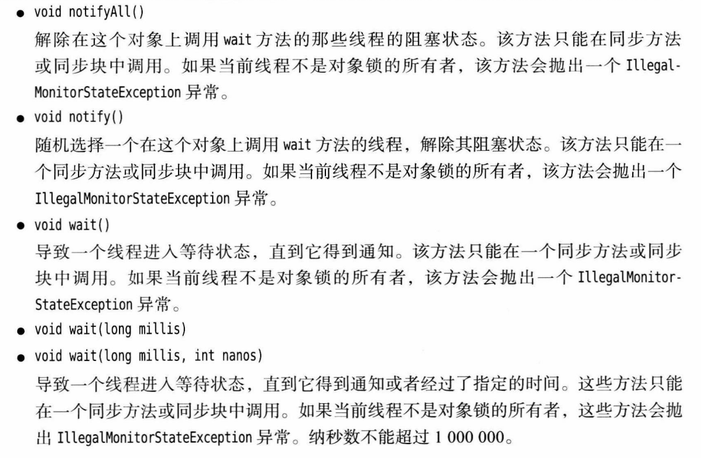

# 并发

每个进程之间按都有自己的一整套变量，而线程之间则共享数据。

### 线程：

> 实现多线程方法：
>
> * 构造Runnable接口的类实例
> * 继承Thread类（不推荐，应当将并行运行任务和运行机制解耦）
> * 构造线程池

```java
//Runnable接口：
public interface Runnable
{
    void run();
}
```

```java
//例子：
public class demo1 implements Runnable{   //创建接口类实例
    @Override                             //覆写方法
    public void run() {
        for (int i = 0; i < 100; i++) {
            System.out.println("being print number:"+i);
        }
    }

    public static void main(String[] args) {
        demo1 a_demo1=new demo1();          //新建类实例对象
        new Thread(a_demo1).start();        //利用线程类开启
        for (int i = 0; i < 1000; i++) {
            System.out.println("main");
        }
    }
}
```


#### 线程状态：

|          状态           |                                            |
| :---------------------: | ------------------------------------------ |
|           New           | 此时程序还有一些基础工作来运行线程代码     |
|        Runnable         | 可运行，不一定运行or始终运行，依赖系统调度 |
|         Blocked         | 暂时不活动，不运行代码                     |
|         Waiting         | 暂时不活动，不运行代码                     |
| TImed waiting(计时等待) | 暂时不活动，不运行代码                     |
|       Terminated        | 终止后无法从断点开始                       |

> 抢占式调度：会给每一个线程分配时间片执行任务，时间用完后，操作系统选择下一线程

阻塞和等待条件：

* 但一个线程试图获取内部对象锁但不成功。
* 线程等待两一个线程通知条件。
* 超时参数让线程进入计时等待状态。


终止条件：

* 自然退出
* 因为没有捕获的异常而退出

```java
static void yield();
void join();
void ioin(long millis);
Thread.State getState();
```


### 线程属性：

#### 中断线程：

线程终止：执行完最后一条语句or因为没有捕获的异常而退出。没有任何方法可以强制中断线程。

interrupt方法：（线程应该时不时检查这个标志）可以设置线程中断状态：

```java
//如果线程被阻塞，则无法检测中断，则要引入InterruptedException异常。
//被中断的线程可以决定如何响应中断。
while(!Thread.currentThread().isInterrupted()&&more work to do)
{
    do some thing;
}
```

> 如果循环中调用了```sleep```则不要检测中断状态，应捕获```InterruptedException```.
>
> 调用interrupted会清除线程中断状态，检查线程是否中断。


#### 守护线程：

Java中有两类线程：

* User Thread
* Daemon Thread

所谓的守护线程，指的是程序运行时在后台提供的一种通用服务的线程。比如垃圾回收线程就是一个很称职的守护者，并且这种线程并不属于程序中不可或缺的部分。因此，当所有的非守护线程结束时，程序也就终止了，同时会杀死进程中的所有守护线程。反过来说，只要任何非守护线程还在运行，程序就不会终止。

```java
//调用setDaemon将其转换为守护进程
t.setDaemon(true);
```

* 不能将正在运行的常规线程设置成守护线程。
* Daemon线程中产生的新线程也是Daemon


#### 线程名：

```java
var t=new Thread(runnable);
t.setName("Web crawler");
```


#### 未捕获异常：(???)

run方法不能抛出检查型错误，但异常会使线程死亡。


#### 线程优先级：

> 现在不要使用线程优先级了


### 同步：

竟态条件：多个线程同时修改同一个数据。


所以我们应该确保线程失去控制之前，方法应该**已经运行完成**。


#### 锁对象：

重入锁：```ReentrantLock```,构造一个重入锁来保护临界区。

```Reentrantlock```保护代码块结构：

```java
mylock.lock();    //a ReentrantLock object
try
{
    critical section
}
finally
{
    myLock.unlock();    //必须有这一句在Finnally里面，锁必须释放
}
```

重入锁：线程可以反复获得已经拥有的锁，锁有一个**持有计数**来跟踪对lock方法的嵌套调用。被一个锁保护的代码可以调用另一个使用相同锁的方法。


#### 条件对象（conditional variable）又叫条件变量：

管理那些已经获得一个锁，却不能做有用工作的线程。一个锁变量可以有一个或多个相关联的条件对象。你可以用```newCondition```方法获得一个条件对象。

```java
class Bank
{
    private Condition sufficientFunds;
    public Bank()
    {
        sufficientFunds = bankLock.newCondition();
    }
}
```

调用```sufficientFunds.await();```可以使当前线程暂停，并放弃锁，进入条件的***等待集***。直到另一线程在同一条件上调用```signalALL```方法。

当另一线程完成转账后，应该调用：```sufficientFunds.signalALL()```，来重新激活等待这个条件的所有线程。线程将从之前暂停的地方继续执行。否则将会产生**死锁**现象。

> await调用应该放在如下形式的循环当中
>
> ```
> while( !(OK to proceed) )
> 	condition.await();
> ```

```signalALL```调用会随机选择一个等待集中的一个线程，并解除当前线程的阻塞状态。

> 只有拥有一个条件的锁时，才能调用。

总结：

* 一次只能有一个线程执行被保护的代码
* 锁可以管理试图进入被保护代码段的线程or进入代码段但不能运行的线程
* 锁可以有多个相关联的条件变量对象


#### synchronized关键词：

   synchronized是一种同步器，用来解决线程并发安全问题，采取的方案是**序列化访问临界资源**，也就是**同步互斥访问**。其本质就是加锁。表示此时只有一个线程进入同步方法。

原理：

 1. synchronized是一种对象锁(锁的是对象而非引用)，是可重入的。其加锁的方式有三种：

          1）同步实例方法，锁是当前实例对象。

          2）同步类方法，锁是当前类对象。

          3）同步代码块，锁是括号里面的对象。

 2. 

  2. synchronized底层原理

                synchronized是基于JVM内置锁实现，通过内部对象Monitor(监视器锁)实现，基于进入与退出Monitor对象实现方法与代码块同步，监视器锁的实现依赖底层操作系统的Mutex lock（互斥锁）实现，它是一个重量级锁性能较低。JVM内置锁在1.5之后版本做了重大的优化，如锁粗化（Lock Coarsening）、锁消除（Lock Elimination）、轻量级锁（Lightweight Locking）、偏向锁（Biased Locking）、适应性自旋（Adaptive Spinning）等技术来减少锁操作的开销，，内置锁的并发性能已经基本与Lock持平。 

        synchronized关键字被编译成字节码后会被翻译成monitorenter 和 monitorexit 两条指令分别在同步块逻辑代码的起始位置与结束位置。    

Java的每一个**对象**都有一个内部锁如果一个方法声明时有```synchronized```关键词，那么对象的锁将会保护整个方法。

```java
public synchronized void method()
{
    method body;
}
//等价于下面
public void method()
{
    this.intrinsicLock.lock();
    try
    {
        method body;
	}
    finally
    {
        this.intrinsicLock.unlock();
    }
}
```

```java
//调用
//wait(),notifyALL()
//等价于
//intrisicCondition.await()
//instrisicCondition.signalALL()
```

> 如果静态方法被声明为同步，则会获得相关类对象的内部锁，没有其他线程可以调用这个类的该方法或者任何其他同步静态方法





#### 同步块：

同步代码块指同一时刻只有一个线程进入同步代码块，但是多个线程可以进入方法。

```java
//这段代码将会获得obj的锁。
synchronized(obj)
{
    critical section;
}
```

==总结：synchronized(this)以及普通synchronized方法，只能防止多个线程同时执行同一对象的同步端，synchronized锁的括号中的对象而非代码。==


**全局锁：**

全局锁，锁住的类对象，并不是类实例化出的对象。

```java
class A
{
    synchronized static  public void print()
    //定义为静态方法，也就是将A这个类锁住，那么同一时刻，只能有一个类对象进入代码块
    {
        System.out.println(Thread.currentThread().getName()+":进入print方法");
        try {
            Thread.sleep(100);
        } catch (InterruptedException e) {
            e.printStackTrace();
        }
        System.out.println(Thread.currentThread().getName()+":离开print方法");
    }

}
class MythreadB implements  Runnable
{

    public void run()
    {
       A.print();
    }
}
public class Synch
{
    public static void main(String[] args) {
        MythreadB thread=new MythreadB();
        new Thread(thread,"线程1").start();
        new Thread(thread,"线程2").start();
        new Thread(thread,"线程3").start();
    }
}
//**********************************************************************************************
  同步代码块 ：synchronized(类名称.class)
class A
{
      public void print()
      {
          synchronized (A.class)
          {
              System.out.println(Thread.currentThread().getName() + ":进入print方法");
              try {
                  Thread.sleep(100);
              } catch (InterruptedException e) {
                  e.printStackTrace();
              }
              System.out.println(Thread.currentThread().getName() + ":离开print方法");
          }
      }
}
class MythreadB implements  Runnable
{
    public void run()
    {
      new A().print();
    }
}

```


### 监视器（Monitor）：

监视器是一个用来保证多个线程安全访问共享数据的机制。

与锁的区别：

严格地讲，“监视器”和“锁”这两个术语表达的含义是不一样的，但实际上很多时候两个术语是可以互换的。

* 锁：是一个具有获取和释放语句以维持特定属性的东西，比如：互斥锁，读写锁
* 监视器：是一个机制，或者说是一个概念，用来保证在任何时候只有一个线程能够执行给定区块的代码。“监视器”可以通过“锁”来实现，但“监视器”的含义大于“锁”的含义。

原理：


特性：

* 监视器是只包含私有字段的类
* 监视器类的每一个对象都有一个关联的锁
* 所有方法都有这个锁锁定
* 锁可以有任意多个相关联的条件

过程：

1. 当有多个线程同时想获取某个对象锁时，首先会进入EntryList队列
2. 当某个线程获取到对象锁时，线程成为对象锁的拥有者，准备开始运行加锁代码块时，执行字节码指令monitorenter，此时count ++;
3. 当对象锁的拥有者线程再次获取锁时，由于synchronized锁是可重入的，此时进行count ++，而不是在EntryList队列中阻塞等待锁；
4. 每个加锁代码块运行完成或因发生异常退出时，会执行monitorexit字节码指令，此时count --;，当count变为0是，对象锁的拥有者线程释放锁。
5. 拥有锁的线程在运行过程中调用了wait()方法，那么线程会进入到WaitSet对象，等待被notify()或等待的时间已到，才有可能再次成为对象锁的拥有者。

Java中的监视器支持两种线程同步方式：互斥和协作：

- 互斥：在Java虚拟机中，线程互斥是通过对象锁完成的。互斥可以使线程独立使用共享的数据，而不其它线程干扰。
- 协作：在Java虚拟机中，线程协作是通过Object类中的wait和notify方法完成的。协作可以使多个线程为了同一个目标一起工作。


### volatile字段：

volatile关键词为实例字段的同步访问提供了一种免锁机制，声明该字段可能被另一个线程并发更新。

>  **所谓可见性，是指当一个线程修改了某一个共享变量的值，其他线程是否能够立即知道该变更，JMM规定了所有的变量都存储在主内存中**。很显然，上述的例子中是没有办法做到内存可见性的。

内存语义：

- 当**写**一个volatile变量时，JMM会把该线程对应的本地内存中的共享变量值立即刷新回主内存中。
- 当**读**一个volatile变量时，JMM会把该线程对应的本地内存设置为无效，重新回到主内存中读取最新共享变量。

volatile变量有2大特点，分别是：

* 可见性

* 有序性：禁重排！

  重排序是指编译器和处理器为了优化程序性能面对指令序列进行重新排序的一种手段，有时候会改变程序予以的先后顺序。

  * 不存在数据以来关系，可以重排序；

  * 存在数据依赖关系，禁止重排序。

    但重排后的指令绝对不能改变原有串行语义！

那么volatile凭什么可以保证可见性和有序性呢？？

[内存屏障Memory Barrier](https://blog.csdn.net/m0_49183244/article/details/125493673)～


### 原子性：


#### 死锁：

就是线程之间相互等待阻塞。
