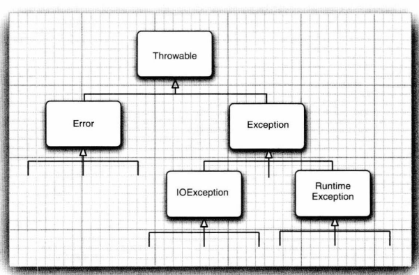

# 异常

分类：


派生于```RuntimeException```的异常：

* 错误强制类型转换
* 数组访问越界
* 访问null指针

只要是```RuntimeException```异常就是自己的错误。

**非检查型错误**：

* Error
* ```RuntimeException```


### 声明检查型异常

```java
//该声明将会告知编译器，此方法可能抛出一个异常
public FileInput(String name) throws FileNotFoundException
```

需抛出异常条件：

* 调用一个排除检查型异常的方法
* 检查到一个错误，并利用throw语句抛出一个检查型错误
* 程序出错
* 系统错误

> 注意：1. 类方法抛出的异常可能属于其子类。
>
>              2. 子类方法中声明的检查型异常不能比超类方法中声明的异常更通用
>              3. 超累为抛出异常则子类也不能。

### 抛出异常：

```java
String readData(Scanner in) throws EOFException,FileNotFoundException
{
    ...
    throw new EOFEception(String text);
    ...
}
```

### 创建异常类：

### 捕获异常：

要捕获那些你知道如何处理的异常，传播那些不知道怎么处理的异常。

```java
try
{
    code;
}
catch(ExceptionType e)
{
    handler for this type;
}
finally
{
}
```

