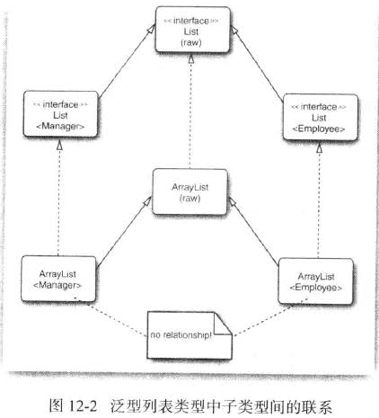

# 泛型程序设计

泛型允许设计者详细地描述变量和方法的类型如何变化，意味着编写的代码可以对多种不同类型的**对象重用**。

* 泛型类

类型变量使用大写形式，且比较短，这是很常见的。在java库中，使用变量E表示集合的元素类型，K和V分别表示表的关键字和值的类型。T（需要时还可以用临近的字母U和S）表示类型。

```java
class Array <T>
{
    private T first;
    private T second;
    public Array(){first = null,:second = null;}
    public Array(T first, T second){this.first = first; this.second = second}
}
```


* 泛型方法

```java
class Array
{
    public static<T> T getMiddle()
    {
        return a;
    }
}
```

调用时，可以把具体 的类型：

```java
String middle = Array.<String>getMiddle("John","q");
```


### 类型变量的限定

有时需要对类型变量加以约束。　一个类型变量或通配符可以有多个限定，限定类型用“&” 分隔，而用逗号来分隔类型变量。在java继承中，可以根据需要拥有多个接口超类型，但限定中至多有一个类。如果用一个类作为限定，但必须是第一个。

```public static <T extends Comparable & Serializable> T min(T[] a)```

### 泛型代码和虚拟机

类型擦除：

>  无论何时定义一个泛型类型，都会自动提供一个相应的原始类型( raw type)。这个原始类型的名字就是去掉类型参数后的泛型类型名。类型变量会被擦除（ erased)，并替换为其限定类型(或者，对于无限定的变量则替换为0bject)。

jvm中没有泛型类型对象，只有普通的类和方法。所有的类型参数都用他们的限定类型替换(如果没有类型参数，则使用Object类型)，这个过程称为擦除(erased)，擦除类型变量，并替换为限定类型。

* 编写一个泛型方法调用时，如果擦出了返回类型，编译器就会插入强制类型转换，将被擦除为object的转换为Employee。
* 桥方法被合成来保持多态。

### 约束和局限：

使用Java泛型时需要考虑一些限制，这些限制大都是由类型擦除引起的。

1. 不能用基本类型实例化类型参数：

　　　不能用类型参数来代替基本类型。就是没有Pair<double>,只有Pair<Double>。当然主要是原因是类型擦除。擦除之后，Pair类含有Object类型的域，而Object不能存储double的值。

2. 运行时类型查询只适用于原始类型:

　　  虚拟机中的对象总有一个特定的非泛型类型。因此，所有类型查询只产生原始类型。

　　　 如:if(a instanceof Pari<String>)是错误的，因为只能查询原始类型，即Pari，if(a instanceof Pari<T>)是错误的

3. 不能创建参数化类型的数组：

　　   Couple<Employee>[] couple = new Couple<Employee>[5] ; 这种声明式不合法的。如果要存放参数化类型对象的集合，可以考虑使用ArrayList<Couple<Employee>>进行声明，而且Java中建议优先使用集合，这样既安全又有效。

4. Varargs警告：

　　　向参数个数可变的方法传递一个泛型类型的实例，为调用这个方法，虚拟机必须建立一个Pair<String>数组，这就违反了前面的规则，不过，对于这种情况有所放松，只会得到一个警告，而不是错误。

　　  可以使用注解@SuppressWarnings("unchecked")或@SafeVarargs抑制这个警告。

5. 不能实例化类型变量：

　　  不能使用像new<T>(...),new t[...]或T.class这样的表达式中的类型变量。

6. 泛型类的静态上下文中类型变量无效：

　　  不能在***静态域或方法***中引用类型变量。

7. 不能抛出或捕获泛型类的实例：　　  

　　  在Java中，

``` public class GenericException <T> extends Exception {...}```

 这种泛型类扩展子Throwable是不合法的，不能通过编译器。不能再catch子句中使用类型参数。 java 异常处理的一个基本原则是，必须为所有已检查异常提供一个处理器。不过可以利用泛型消除这个限制。

8. 注意擦除后的冲突。


### 泛型类型的继承规则

　　 在使用泛型时，需要了解一些有关继承和子类型的准则。

　　如：Manager是Employee的子类，那么Pair<Manager>是Pair<Employee>的一个子类吗？ 答案是：“不是”

　　规则：无论S与T有什么联系。通常，Pair<S>与Pair<T>没有什么联系。

　　永远可以将参数化类型转换为一个原始类型。




### 通配符：

在通配符类型中，允许类型参数发生变化。

```java
//表示任何泛型Pair类型，类型参数是Employee的子类
Pair<? extends Employee>
```

为什么要使用通配符而不是简单的泛型呢？通配符其实在声明局部变量时是没有什么意义的，但是当你为一个方法声明一个参数时，它是非常重要的。

所以，对于不确定或者不关心实际要操作的类型，可以使用无限制通配符（尖括号里一个问号，即），表示可以持有任何类型。像 countLegs 方法中，限定了上界，但是不关心具体类型是什么，所以对于传入的 Animal 的所有子类都可以支持，并且不会报错。

好处：

- 如果传入的类型不是 E 或者 E 的子类，编译不成功
- 泛型中可以使用 E 的方法，要不然还得强转成 E 才能使用

坏处：

* set类型的方法可能无法使用，只能使用返回值。

```java
static int countLegs (List<? extends Animal > animals ) {
    int retVal = 0;
    for ( Animal animal : animals )
    {
        retVal += animal.countLegs();
    }
    return retVal;
}

static int countLegs1 (List< Animal > animals ){
    int retVal = 0;
    for ( Animal animal : animals )
    {
        retVal += animal.countLegs();
    }
    return retVal;
}

public static void main(String[] args) {
    List<Dog> dogs = new ArrayList<>();
     // 不会报错
    countLegs( dogs );
    // 报错
    countLegs1(dogs);
}
```

#### 通配符的超类型限定：

下界: 用 super 进行声明，表示参数化的类型可能是所指定的类型，或者是此类型的父类型，直至 Object。在类型参数中使用 super 表示这个泛型中的参数必须是 E 或者 E 的父类。

* 刚好和extends相反，可以为方法提供参数，但是不可以使用返回值。


> 直观来说，带有超类型限定的通配符允许写入一个泛型对象，而子类型限定的通配符允许读取一个泛型对象。

## ？和 T 的区别：

？和 T 都表示不确定的类型，区别在于我们可以对 T 进行操作，但是对 ？不行，比如如下这种 ：

```java
// 可以
T t = operate();

// 不可以
？car = operate();
```

T 是一个 确定的 类型，通常用于泛型类和泛型方法的定义，？是一个 不确定 的类型，通常用于泛型方法的调用代码和形参，不能用于定义类和泛型方法。

区别1：通过 T 来 确保 泛型参数的一致性

```java
// 通过 T 来 确保 泛型参数的一致性
public <T extends Number> void
test(List<T> dest, List<T> src)

//通配符是 不确定的，所以这个方法不能保证两个 List 具有相同的元素类型
public void
test(List<? extends Number> dest, List<? extends Number> src)
```


区别2：类型参数可以多重限定而通配符不行

使用 & 符号设定多重边界（Multi Bounds)，指定泛型类型 T 必须是 MultiLimitInterfaceA 和 MultiLimitInterfaceB 的共有子类型，此时变量 t 就具有了所有限定的方法和属性。对于通配符来说，因为它不是一个确定的类型，所以不能进行多重限定。

区别3：通配符可以使用超类限定而类型参数不行

```java
T extends A
**********************************
? extends A
? super A
```

