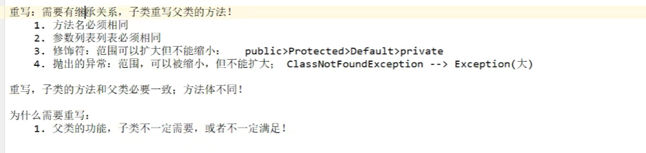
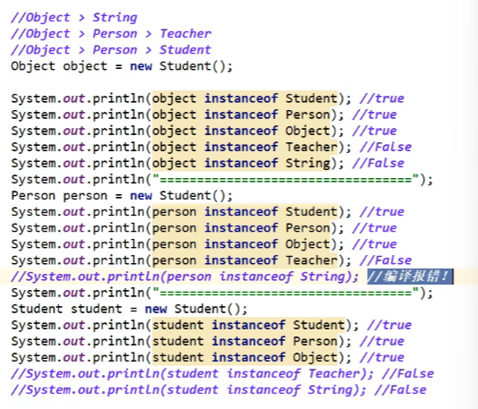

# 继承

### 超类&&子类

所有JAVA类均继承自Object类, 均使用动态绑定，具有多态能力。

### super：

```java
//super可以调用父类的静态实例字段。
super.name=ccc;
//使用super可以调用父类同名方法
super.salary();
//使用super(),调用父类构造器
super(ddd,ddd);
```

super注意点：

1. super调用父类构造方法，必须在构造方法第一个
2. 需出现在子类方法or构造方法
3. super与this不能同时调用构造


### 继承层次：

Java没有多重继承，从某个特定的类到其祖先的路径称为类的**继承链**。

final 声明可以阻止类继承。

### 方法覆盖：

* final字段不能覆盖
* static不能覆盖
* private方法



方法覆盖时，子类的方法不能低于超类方法的可见性

### 多态：

存在条件：

* 有继承关系
* 子类重写父类方法
* 父类引用子类对象

注意：

* 将子类引用赋给超类，这时不能够使用子类的特殊字段
* **不能**将超类引用赋给子类

### instanceof

判断是不是父子关系or相同关系




### 强制类型转换：

* 只能在继承层次内进行强制类型转换
* 在将超类转化为子类前使用**instanceof**检查

### 抽象类/函数（virtual，虚函数）：

**abstract**   关键词，希望子类对其进行覆盖

### 受保护的访问：

protected，则保护字段只能在同一个包中 的类访问。

### Object:

* equal方法

Object类中的equals 方法用于检测一个对象是否等于另外一个对象。实现方法：检测两个对象医用是否相等。

* tostring()方法：

发挥对象值的一个字符串。

```getClass().getName()```获取类名的字符串。

子类应该有自己的```tostring```方法，并加入类的字段

### 泛型数组列表

允许运行时确定数组的大小。

```java
//ArrayList
```

