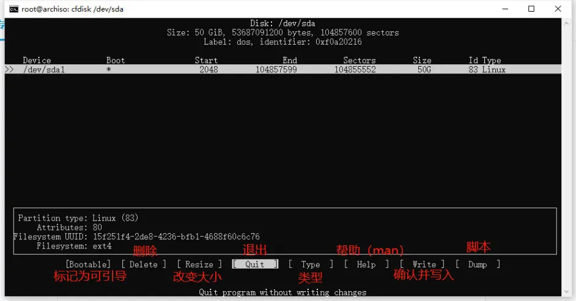
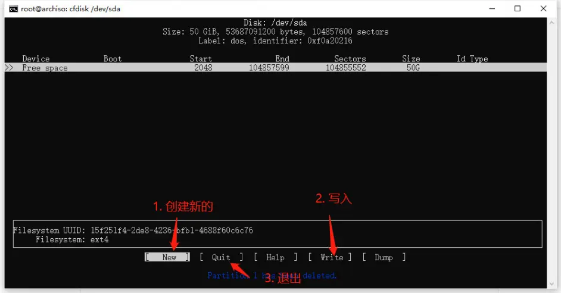

# Archlinx:

## 1.系统安装：[from Bilibili](https://www.bilibili.com/read/cv20753052?from=search&spm_id_from=333.337.0.0)

### 校对时间：

#### 使用 timedatectl 修改时区：

```shell
timedatectl set-timezone Asia/Shanghai
date 
```

与互联网同步日期时间

执行

```shell
timedatectl set-ntp true
timedatectl status
```

检查服务状态。

### 联网：

#### 1.有线网络

插上网线，等待片刻即可。

#### 2.无线网络

输入 iwctl 回车进入无线网络工具，依次执行如下命令。

```shell
device list #列出无线网卡（一般来说是wlan0）
station wlan0 scan #扫描无线网络
station wlan0 get-networks #列出所有可用的无线网络
station wlan0 connect SSID #SSID即为Wi-Fi名称，可输入一部分然后按Tab键补全
```

输入密码后回车，然后执行 exit。

注意：要连接名称里带空格的网络，连接时要用双引号将网络名称括起来。


### 分区：

```shell
#使用 fdisk 列出硬盘和分区情况：
fdisk -l
lsblk

cfdisk <硬盘编号>
```





在分区管理界面，可以使用上、下、左、右键移动位置。对于 Arch Linux，以下分区是必须要有的：

* 一个根分区（挂载在根目录）/；
* 要在 UEFI 模式中启动，还需要一个 EFI 系统分区。

> * 注意：EFI系统分区不能小于200MB，否则将无法安装引导。建议EFI系统分区设置为300MB。
>
> 如果硬盘上原来有操作系统，安装 Arch Linux 单系统需要先删除原来的分区。删除方法：先用上下键选中要删除的分区，然后用左右键选择 Delete，回车。
>
> 如果EFI分区大小不足，请先删除原来的EFI分区，再重新建立大小为300MB的EFI分区。


#### 1.创建根分区

先用上下键选中一块空闲空间（free space），然后用左右键选择New，回车。

First sector，保持默认即可，回车。

Size in sectors or {KMGTP}，输入根分区的大小（建议大于 64G），以数字+G（如80G）的形式输入，回车。

Hex code or GUID，默认8300是 Linux File System，保持默认即可，回车。

Enter new partition name，输入分区名，回车。

#### 2.创建交换分区

与创建根分区方法类似，在分区大小和 Hex code or GUID 上有所不同，Hex code or GUID 应为 8200。


### 分区格式化：

```shell
mkfs.fat -F 32 /dev/EFI分区设备名 #图中EFI分区设备名为nvme0n1p1，请根据自己lsblk的实际情况替换 作者：linux_kitten 
mkfs.btrfs -f /dev/根分区设备名 #图中根分区设备名为nvme0n1p2，请根据自己lsblk的实际情况替换 作者：linux_kitten 
mkswap /dev/交换分区设备名 #图中交换分区设备名为nvme0n1p4，请根据自己lsblk的实际情况替换 作者：linux_kitten 

```

### 挂载分区

```shell
5.挂载分区

#挂载分区的顺序不要颠倒，否则可能遇到安装完成后无法启动系统的问题。
#先执行下面命令挂载根分区：

mount /dev/根分区设备名 /mnt

#由于我们用的是 Btrfs 文件系统，所以接下来需要创建子卷。
#执行下面命令创建 / 目录子卷：

btrfs subvolume create /mnt/@

#如有需要，可执行下面命令创建 /home 子卷（可选）：
#（创建 /home 子卷后，根目录和用户的家目录将会分开放置）

btrfs subvolume create /mnt/@home
#创建完子卷后，执行下面命令卸载根分区：

umount /dev/根分区设备名
#然后挂载根分区的 / 目录子卷：

mount /dev/根分区设备名 /mnt -o subvol=@

#创建挂载点：

mkdir /mnt/boot

#执行下面命令挂载EFI分区：

mount /dev/EFI分区设备名 /mnt/boot

#执行下面命令挂载交换分区：

swapon /dev/交换分区设备名

#如果你创建了 @home 子卷，也把它挂载上：

mkdir /mnt/home
mount /dev/根分区设备名 /mnt/home -o subvol=@home

#挂载完成后，可使用lsblk命令查看挂载情况。 

#************************************************************一种
设置好分区后记住编号，再格式化：
系统分区：
# mkfs.ext4 <分区编号>
EFI 分区（如果有）：
# mkfs.fat -F 32 <分区编号>
交换分区（如果有）：
# mkswap <分区编号>
启动交换分区（如果有）：
# swapon <分区编号>
挂载即将安装系统的分区：
# mount <分区编号> /mnt 
```

```shell
#换源
nano /etc/pacman.d/mirrorlist 
Server = https://mirrors.tuna.tsinghua.edu.cn/archlinux/$repo/os/$arch

```

### 系统安装：

```shell
#Intel
pacstrap /mnt base base-devel linux linux-firmware linux-headers vim bash-completion btrfs-progs intel-ucode
#AMD
pacstrap /mnt base base-devel linux linux-firmware linux-headers vim bash-completion btrfs-progs amd-ucode 
```

> **备注：**
>
> base-devel：基础开发工具包（包括 gcc g++ make 等等）
>
> vim：常用的文本编辑器
>
> bash-completion：提供 bash 终端按 Tab 键即可自动补全命令的功能
>
> btrfs-progs：Btrfs文件系统管理工具
>
> amd-ucode/intel-ucode：CPU 微码
>
> 
>
> **关于内核的选择，Arch Linux提供了以下内核：**
>
> ```shell
> linux - 原版的 Linux 内核和模块，采用了一些补丁。
> 
> linux-hardened - 注重安全的 Linux 内核，采用一系列加固补丁以缓解内核和用户空间漏洞。和 linux包 相比，它启用了上游更多的内核加固功能。
> 
> linux-zen - 一些内核黑客合作的结果，提供了最适合日常使用的内核。可在 https://liquorix.net 上找到一些细节（他们为 Debian 提供基于 Zen 的内核二进制文件）。
> 
> linux-lts - 受长期支持（LTS）的 Linux 内核和模块。
> 
> linux-rt 和 linux-rt-lts - 由Ingo Molnar领导的一小群核心开发人员维护。这个补丁允许几乎所有的内核被抢占，除了少数非常小的代码区域（“原始自旋锁关键区域”）。这是通过将大多数内核自旋锁替换为支持优先级继承的互斥锁，以及将所有中断和软件中断移动到内核线程来实现的。 作者：kc0ver https://www.bilibili.com/read/cv20753052?from=search&spm_id_from=333.337.0.0 出处：bilibili
> ```
>
> ```shell
> 这样只是最基本的系统，还需要更多的软件来支持系统运行，以下是作者认为需要安装的：
> 
>     networkmanager - 连接互联网（不用 netctl）
> 
>     dhcpcd - 分配 ip 地址
> 
>     openssh - ssh服务
> 
>     cups - 打印机
> 
>     nano 或 micro - 都是好用的命令行文本编辑器，micro 的快捷键更接近 Windows 自带的记事本。
> 
>     git - 100%会用到的，现在不装以后也会被当作依赖安装
> 
>     grub - 必须安装，引导系统用
> 
>     os-prober - 双系统必须安装
> 
>      efibootmgr - UEFI 必须安装
> 
>     intel-ucode 或 amd-ucode - CPU 微码必须安装
> 
>     man-db 和 man-pages - 查看软件包的文档
> 
>     ntfs-3g - 只读挂载 ntfs 分区（访问 Windows 文件）双系统必须安装
> 
>     firefox  - 浏览器
> 
>     noto-fonts-cjk 和 noto-fonts-emoji - 谷歌设计的字体（包含中文和 emoji） 作者：kc0ver
> ```
>
> 


### 生成 fstab 文件

```shell
#用以下命令生成 fstab 文件：
genfstab -U /mnt >> /mnt/etc/fstab

#建议在执行完以上命令后，执行
cat /mnt/etc/fstab

#检查 fstab 文件是否正确。
Chroot 进入新系统

```

### 进入新系统：

```shell
#执行以下命令变更根目录，进入新系统：
arch-chroot /mnt
```

### 设置时区

```shell
#设置时区

#执行下面命令设置 Asia/Shanghai 时区：
ln -sf /usr/share/zoneinfo/Asia/Shanghai /etc/localtime

#如果需要设置其他时区：
ln -sf /usr/share/zoneinfo/Region（地区名）/City（城市名） /etc/localtime

#执行下面命令与硬件时间同步：
hwclock --systohc
```

### 本地化：

```shell

#*******************************本地化**********************
#执行下面命令打开 locale.gen 文件：
vim /etc/locale.gen

#按键盘上的 i 进入插入模式。
#往下翻找到 en_US.UTF-8 UTF-8，将前面的注释符（#）删去。
#然后按 Esc 键，输入 :wq，回车，保存退出。
#注意：在安装阶段不要设置中文 locale，可能导致 tty 乱码。
#然后执行
locale-gen

#生成 locale 信息。
#执行下面命令新建 locale.conf 文件：
vim /etc/locale.conf

#按键盘上的 i 进入插入模式，然后输入
LANG=en_US.UTF-8

#按 Esc 键，输入 :wq，回车，保存退出。

##***************************网络设置*************************#

#执行下面命令新建 hostname 文件：
vim /etc/hostname
#按键盘上的 i 进入插入模式，然后输入自己喜欢的主机名，输入完后按 Esc 键，输入 :wq，回车，保存退出。

#**************************Root 用户密码设置*****************#

#执行下面命令设置 Root 用户密码：
passwd

#**************************普通用户的创建与设置*****************#
#执行下面命令创建一个普通用户：
useradd -m -g users -G wheel,storage,power 用户名

#执行下面命令为这个用户设置密码：
passwd 用户名

#***************************编辑超级用户文件：*****************#
EDITOR=vim visudo

#按键盘上的 i 进入插入模式。
#往下翻找到 “Uncomment to allow members of group to execute any command”
#将下面一行 %wheel 前的注释符（#）删去。 
```

### 网络、蓝牙与声音

```shell
#执行下面命令安装网络相关工具：
pacman -S networkmanager dialog dhcpcd

#执行下面命令启用网络服务：
systemctl enable NetworkManager

#如果你用的是有线网络，执行下面命令启用 dhcpcd：
systemctl enable dhcpcd@eno2

#执行下面命令安装蓝牙、声卡驱动和其他个人认为不错的工具：
pacman -S bluez bluez-utils cups xdg-utils xdg-user-dirs alsa-utils pulseaudio pulseaudio-bluetooth openssh

#如果电脑有蓝牙功能，执行下面命令启用蓝牙：
systemctl enable bluetooth

#执行下面命令启用打印机服务：
systemctl enable cups

#如果需要做测试，可执行下面命令启用SSH服务：
systemctl enable ssh 


#作者：linux_kitten https://www.bilibili.com/read/cv16392057?from=search&spm_id_from=333.337.0.0 出处：bilibili
```

## 2. grub 安装：

```shell
sudo pacman -S grub

#进入文件后设置：
nano /etc/default/grub
GRUB_DISABLE_OS_PROBER=false

grub-install --target=x86_64-efi --efi-directory=/boot --bootloader-id=Arch
grub-mkconfig -o /boot/grub/grub.cfg
```


## 3. 重启：

```shell
exit
umount -a
reboot
```

## 4. 附加：安装基本 KDE Plasma 桌面环境 

使用以下命令安装 plasma 和 sddm：

$ sudo pacman -S plasma sddm

    plasma 包提供桌面环境，sddm 功能类似 gdm。

sddm 开机自启：

$ sudo systemctl enable sddm

    如果是从 gnome 切换到 kde plasma，你可能会卸载 gdm 转而使用 sddm，一定要在卸载之前先关闭 gdm 的开机自启，也就是：
    
    $ sudo systemctl disable gdm

kde 社区提供的应用程序：

```shell
$ sudo pacman -S kde-applications 
```

### 附加：更新系统（软件包）

Arch Linux 采取滚动式更新，这意味着它不会像 Windows 一样发布大版本，使用以下命令查找软件包更新：

$ sudo pacman -Syu

    前文提到 -Sy 为刷新软件源缓存，小写的 u 为更新系统，pacman 的参数区分大小写，例如 -r 和 -R 意味着不同的操作，更新完成后重启。
    
    滚动方式更新系统有一定风险，尤其是更新内核和更新大量软件包时，因此请勤于更新系统。更新前先看一看即将更新的包，做好心理准备，即使遇到故障也不要慌，仔细检查报错以及输出，上网查询相应解决方式，进入 Live 系统修复。

附加：微信

需要单独安装的依赖：

$ yay -S spark-dwine-helper-git

    直接安装会报错找不到 spark-dwine-helper 包作为依赖。

安装 spark 微信：

$ yay -S com.qq.weixin.spark 

Arch Linux 采取滚动式更新，这意味着它不会像 Windows 一样发布大版本，使用以下命令查找软件包更新：

$ sudo pacman -Syu

    前文提到 -Sy 为刷新软件源缓存，小写的 u 为更新系统，pacman 的参数区分大小写，例如 -r 和 -R 意味着不同的操作，更新完成后重启。
    
    滚动方式更新系统有一定风险，尤其是更新内核和更新大量软件包时，因此请勤于更新系统。更新前先看一看即将更新的包，做好心理准备，即使遇到故障也不要慌，仔细检查报错以及输出，上网查询相应解决方式，进入 Live 系统修复。

附加：微信

需要单独安装的依赖：

$ yay -S spark-dwine-helper-git

    直接安装会报错找不到 spark-dwine-helper 包作为依赖。

安装 spark 微信：

```shell
$ yay -S com.qq.weixin.spark
```


## 5. Nvidia驱动安装：

```shell
#安装intel核显驱动
sudo pacman -S xf86-video-intel

#编辑pacman.conf文件启用32位软件源
sudo vim /etc/pacman.conf

[multilib]
Include = /etc/pacman.d/mirrorlist

#同步软件包数据库
sudo pacman -Syy
sudo pacman -S nvidia nvidia-prime nvidia-settings nvidia-utils opencl-nvidia lib32-nvidia-utils lib32-opencl-nvidia

sudo pacman -S yay

#安装optimus-manager
yay -S optimus-manager

#安装图形化切换工具
yay -S optimus-manager-qt

#安装
sudo pacman -S xf86-video-nouveau
```

