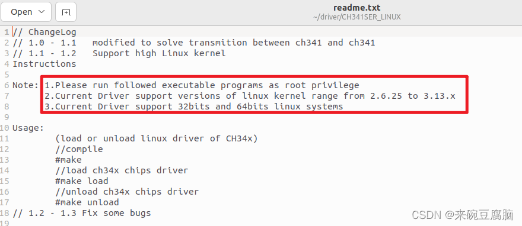
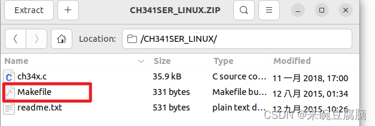

# ubuntu 22.04不识别ch340串口


这个真是挺无语的，发现国内厂商普遍对开源环境不感兴趣，ch340官方linux驱动好像被厂家忘了，现在放出来的驱动还是上古内核版本：

于是，驱动居然要用户自己编译安装。。还好网上有不少大神：链接，测试了下，可以使用，步骤也不算太麻烦，这个帖子是对原文方法的一点整理和补充，否则可能不能自动加载驱动。

### 下载官方linux驱动：[链接](https://www.wch.cn/downloads/CH341SER_LINUX_ZIP.html)，解压后里面有三个文件，其实就只用里面的makefile文件:



可以用一些命令查看下当前状态

```shell
# 查看内核版本

uname -r

# 查看系统自带驱动

ls /lib/modules/$(uname -r)/kernel/drivers/usb/serial

# 查看串口设备信息

sudo dmesg | grep tty

# 如果brltty占用了串口就把他卸载掉，不会影响使用

sudo apt remove brltty
```

### 删除旧版本ch340驱动，但需要记住原模块名叫什么，一会儿编译后放过来还需要命名一致，否则驱动不会自动加载

```shell
#进入串口驱动目录，用管理员权限删除ch34开头那个驱动文件
cd /lib/modules/$(uname -r)/kernel/drivers/usb/serial
sudo rm ch341.ko
```

### 到这个网站[链接](https://elixir.bootlin.com/linux/v5.19/source/drivers/usb/serial/ch341.c)选择匹配的内核版本，然后把右边的代码全部拷贝出来替换掉第一步解压出来的ch34x.c，删除新建一个同名c文件也可以。然后编译，期间可能提示编译器不匹配，不影响使用

```shell
#编译
make
#加载，但这样下次重启驱动后需要重新加载
make load
#或者这样加载，也是重启后失效
sudo insmod ch34x.ko
```

### 用管理员权限把编译出来的ch34x.ko文件拷贝回原驱动目录，然后修改模块名到之前的旧驱动名称，我这里是ch341.ko。

```shell
#驱动文件拷贝回驱动目录
sudo cp ch34x.ko /lib/modules/$(uname -r)/kernel/drivers/usb/serial
cd /lib/modules/$(uname -r)/kernel/drivers/usb/serial
sudo mv ch34x.ko ch341.ko
```

### 重启，ch340也可以自动加载了。