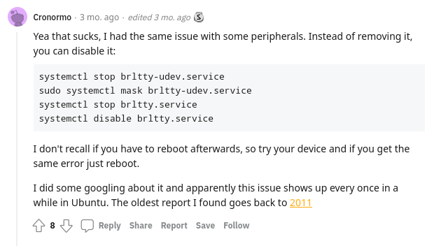

# ubuntu22.04的 brltty 导致 USB 转串口连接失败

Ubuntu 22.04 LTS，今天发现连接带有 USB-UART 的数据链不识别，具体的现象就是 /dev 目录下没有出现 ttyUSB* 设备名称。

```shell
ls /dev/ttyUSB*
```

通过 sudo dmesg | grep tty 最终看到了原因。



```shell
[    0.425064] printk: console [tty0] enabled
[    1.288554] 00:05: ttyS0 at I/O 0x3f8 (irq = 4, base_baud = 115200) is a 16550A
[  980.188047] usb 2-2.1: FTDI USB Serial Device converter now attached to ttyUSB0
[  980.872665] usb 2-2.1: usbfs: interface 0 claimed by ftdi_sio while 'brltty' sets config #1
[  980.876265] ftdi_sio ttyUSB0: FTDI USB Serial Device converter now disconnected from ttyUSB0xxxxxxxxxx 123[    0.425064] printk: console [tty0] enabled[    1.288554] 00:05: ttyS0 at I/O 0x3f8 (irq = 4, base_baud = 115200) is a 16550A[  980.188047] usb 2-2.1: FTDI USB Serial Device converter now attached to ttyUSB0[  980.872665] usb 2-2.1: usbfs: interface 0 claimed by ftdi_sio while 'brltty' sets config #1[  980.876265] ftdi_sio ttyUSB0: FTDI USB Serial Device converter now disconnected from ttyUSB045
```

可以解释为：原本该设备连接到了 ttyUSB0 端口，突然被一个叫 brltty 的进程一脚踹掉了。。。

目测有很多人被坑，尤其是升 Ubuntu 到 22.04 并且还在学习 arduino 的。

可以先不管 brltty 是什么进程，有人给出的方案就是卸掉，如 brltty package disconnecting ttyUSB0 used for Arduino。更温和的处理方法就是禁用掉该服务。如 reddit 中这么做，因为直接卸掉会将某些依赖卸载掉：
在这里插入图片描述
执行如下命令：

```shell
root@one-vmwarevirtualplatform:/home/one/桌面# systemctl stop brltty-udev.service
root@one-vmwarevirtualplatform:/home/one/桌面# systemctl mask brltty-udev.service
Created symlink /etc/systemd/system/brltty-udev.service → /dev/null.
root@one-vmwarevirtualplatform:/home/one/桌面# systemctl stop brltty.service
root@one-vmwarevirtualplatform:/home/one/桌面# systemctl disable brltty.service
```

> Brltty
>
> Introduction
> BRLTTY is a background process (daemon) which provides access to the Linux/Unix console (when in text mode) for a blind person using a refreshable braille display. It drives the braille display, and provides complete screen review functionality. Some speech capability has also been incorporated.

转自 brltty.app