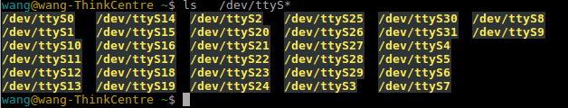

## 永久打开串口权限

首先查看用户组

```cobol
 ls -l /dev/ttyUSB0
```

终端输出：

```cobol
crw-rw-rw- 1 root dialout 188, 0 12月 19 14:47 /dev/ttyUSB0
```

可以看到用户 root ，所属用户组为 dialout, 因此一种方法是把我们的当前用户名 加入到这个用户组。

```crystal
$ whoami
lynliam
sudo usermod -aG dialout lynliam
```

最后，logout 再登入系统，登陆名wang就可以使用该串口了 。

## 232 串口权限

## 1.查看 232 串口信息：

```cobol
ls -l /dev/ttyS*
```

终端效果：


## 2.临时打开串口权限

```cobol
sudo chmod 666 /dev/ttyS0
```

该方法只能临时添加访问权限，一次性的，下次拔插串口线或者开关机还需要再次赋予串口权限