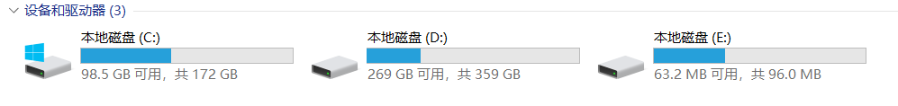

# Linux折腾史

### 安装

1. 关闭security boot
2. 调整usb启动顺序
3. windows11下按着shift+重启键可以进疑难解答—＞uefi管理（进BIOS）
4. 重启进安装界面
5. 选Ubuntu
6. 过程点（something else）


***
### 分区

1. /efi   双硬盘请放于硬盘（创建efi分区512Mb）
2. swap  交换分区，和运行内存相关， 如果你想实现笔记本盒盖休眠，请将此分区扩大到**大于**与本机运行内存大小
3. 选择Filesystem  **btrfs** ；  选择挂载点（mount point） /根目录  
4. 记得选择引导分区 即分区界面下面的bootloader point  选择你新分出来的EFI的磁盘号  例如：nvme0n1p6 （***注意不要错选了Windows 的EFI分区！！！！是你在步骤1分出来的EFI***）

> 下面的分区不需要在分类
>
> 1. /var  系统运行时要改变的数据
> 2. /home  用户目录文件
> 3. /usr  软件存在处
> 4. /opt
> 5. /scr

***

### 换源

可以使用  **小鱼一键换源** 。

```bash
wget http://fishros.com/install -O fishros && . fishros
```


更换源
1. 备份原来的源
    ```sudo cp -v /etc/apt/sources.list /etc/apt/sources.list.backup```
2. 终端执行chmod命令更改文件权限使软件源文件可编辑：
    ```sudo chmod 777 /etc/apt/sources.list```
3. 编辑     ```sudo gedit /etc/apt/sources.list```

如果你已添加 PPA 仓库，请查看 `/etc/apt/sources.list.d/` 目录并删除相应的条目

https://mirrors.cernet.edu.cn/site/TUNA


> ## 以下源 均为 AMD64  即 x86架构

#### 阿里源

```shell
deb https://mirrors.aliyun.com/ubuntu/ jammy main restricted universe multiverse
deb-src https://mirrors.aliyun.com/ubuntu/ jammy main restricted universe multiverse

deb https://mirrors.aliyun.com/ubuntu/ jammy-security main restricted universe multiverse
deb-src https://mirrors.aliyun.com/ubuntu/ jammy-security main restricted universe multiverse

deb https://mirrors.aliyun.com/ubuntu/ jammy-updates main restricted universe multiverse
deb-src https://mirrors.aliyun.com/ubuntu/ jammy-updates main restricted universe multiverse

# deb https://mirrors.aliyun.com/ubuntu/ jammy-proposed main restricted universe multiverse
# deb-src https://mirrors.aliyun.com/ubuntu/ jammy-proposed main restricted universe multiverse

deb https://mirrors.aliyun.com/ubuntu/ jammy-backports main restricted universe multiverse
deb-src https://mirrors.aliyun.com/ubuntu/ jammy-backports main restricted universe multiverse

```


#### 清华源
```shell
# 默认使用了源码镜像降低了 apt update 速度，如有需要可自行取消注释
deb https://mirrors.tuna.tsinghua.edu.cn/ubuntu/ jammy main restricted universe multiverse
deb-src https://mirrors.tuna.tsinghua.edu.cn/ubuntu/ jammy main restricted universe multiverse
deb https://mirrors.tuna.tsinghua.edu.cn/ubuntu/ jammy-updates main restricted universe multiverse
deb-src https://mirrors.tuna.tsinghua.edu.cn/ubuntu/ jammy-updates main restricted universe multiverse
deb https://mirrors.tuna.tsinghua.edu.cn/ubuntu/ jammy-backports main restricted universe multiverse
deb-src https://mirrors.tuna.tsinghua.edu.cn/ubuntu/ jammy-backports main restricted universe multiverse

deb https://mirrors.tuna.tsinghua.edu.cn/ubuntu/ jammy-security main restricted universe multiverse
deb-src https://mirrors.tuna.tsinghua.edu.cn/ubuntu/ jammy-security main restricted universe multiverse

# 预发布软件源，不建议启用
# deb https://mirrors.tuna.tsinghua.edu.cn/ubuntu/ jammy-proposed main restricted universe multiverse
# deb-src https://mirrors.tuna.tsinghua.edu.cn/ubuntu/ jammy-proposed main restricted universe multiverse
```
#### 中科大源

```shell
deb https://mirrors.ustc.edu.cn/ubuntu/ bionic main restricted universe multiverse
deb-src https://mirrors.ustc.edu.cn/ubuntu/ bionic main restricted universe multiverse
deb https://mirrors.ustc.edu.cn/ubuntu/ bionic-updates main restricted universe multiverse
deb-src https://mirrors.ustc.edu.cn/ubuntu/ bionic-updates main restricted universe multiverse
deb https://mirrors.ustc.edu.cn/ubuntu/ bionic-backports main restricted universe multiverse
deb-src https://mirrors.ustc.edu.cn/ubuntu/ bionic-backports main restricted universe multiverse
deb https://mirrors.ustc.edu.cn/ubuntu/ bionic-security main restricted universe multiverse
deb-src https://mirrors.ustc.edu.cn/ubuntu/ bionic-security main restricted universe multiverse
deb https://mirrors.ustc.edu.cn/ubuntu/ bionic-proposed main restricted universe multiverse
deb-src https://mirrors.ustc.edu.cn/ubuntu/ bionic-proposed main restricted universe multiverse
```


#### 哈工深源（校内源，很快但是依赖校园网）

```shell
# 默认使用了源码镜像降低了 apt update 速度，如有需要可自行取消注释
deb https://mirrors.osa.moe/ubuntu/ jammy main restricted universe multiverse
deb-src https://mirrors.osa.moe/ubuntu/ jammy main restricted universe multiverse
deb https://mirrors.osa.moe/ubuntu/ jammy-updates main restricted universe multiverse
deb-src https://mirrors.osa.moe/ubuntu/ jammy-updates main restricted universe multiverse
deb https://mirrors.osa.moe/ubuntu/ jammy-backports main restricted universe multiverse
deb-src https://mirrors.osa.moe/ubuntu/ jammy-backports main restricted universe multiverse

deb https://mirrors.osa.moe/ubuntu/ jammy-security main restricted universe multiverse
deb-src https://mirrors.osa.moe/ubuntu/ jammy-security main restricted universe multiverse

# deb http://security.ubuntu.com/ubuntu/ jammy-security main restricted universe multiverse
# deb-src http://security.ubuntu.com/ubuntu/ jammy-security main restricted universe multiverse

# 预发布软件源，不建议启用
# deb https://mirrors.osa.moe/ubuntu/ jammy-proposed main restricted universe multiverse
# deb-src https://mirrors.osa.moe/ubuntu/ jammy-proposed main restricted universe multiverse
```


4. 更新源sudo apt-get update
> ## Arm架构：
>
> ### 阿里云
>
> ```shell
> deb https://mirrors.aliyun.com/ubuntu-ports/ jammy main restricted universe multiverse
> deb-src https://mirrors.aliyun.com/ubuntu-ports/ jammy main restricted universe multiverse
> 
> deb https://mirrors.aliyun.com/ubuntu-ports/ jammy-security main restricted universe multiverse
> deb-src https://mirrors.aliyun.com/ubuntu-ports/ jammy-security main restricted universe multiverse
> 
> deb https://mirrors.aliyun.com/ubuntu-ports/ jammy-updates main restricted universe multiverse
> deb-src https://mirrors.aliyun.com/ubuntu-ports/ jammy-updates main restricted universe multiverse
> 
> # deb https://mirrors.aliyun.com/ubuntu-ports/ jammy-proposed main restricted universe multiverse
> # deb-src https://mirrors.aliyun.com/ubuntu-ports/ jammy-proposed main restricted universe multiverse
> 
> deb https://mirrors.aliyun.com/ubuntu-ports/ jammy-backports main restricted universe multiverse
> deb-src https://mirrors.aliyun.com/ubuntu-ports/ jammy-backports main restricted universe multiverse
> ```
>
> ### 清华
>
> ```shell
> # 默认注释了源码镜像以提高 apt update 速度，如有需要可自行取消注释
> deb https://mirrors.tuna.tsinghua.edu.cn/ubuntu-ports/ jammy main restricted universe multiverse
> deb-src https://mirrors.tuna.tsinghua.edu.cn/ubuntu-ports/ jammy main restricted universe multiverse
> deb https://mirrors.tuna.tsinghua.edu.cn/ubuntu-ports/ jammy-updates main restricted universe multiverse
> deb-src https://mirrors.tuna.tsinghua.edu.cn/ubuntu-ports/ jammy-updates main restricted universe multiverse
> deb https://mirrors.tuna.tsinghua.edu.cn/ubuntu-ports/ jammy-backports main restricted universe multiverse
> deb-src https://mirrors.tuna.tsinghua.edu.cn/ubuntu-ports/ jammy-backports main restricted universe multiverse
> 
> deb https://mirrors.tuna.tsinghua.edu.cn/ubuntu-ports/ jammy-security main restricted universe multiverse
> deb-src https://mirrors.tuna.tsinghua.edu.cn/ubuntu-ports/ jammy-security main restricted universe multiverse
> 
> # 预发布软件源，不建议启用
> # deb https://mirrors.tuna.tsinghua.edu.cn/ubuntu-ports/ jammy-proposed main restricted universe multiverse
> # deb-src https://mirrors.tuna.tsinghua.edu.cn/ubuntu-ports/ jammy-proposed main restricted universe multiverse
> ```

***

### 时间问题：

Windows 与 Linux 缺省看待系统硬件时间的方式是不一样的：

Linux 时钟分为系统时钟(System Clock)和硬件(RTC)时钟。Linux把硬件时间当作 UTC,系统时间是UTC时间经过换算得来的。比如说北京时间是GMT+8,则系统中显示时间是硬件时间+8。
Windows把系统硬件(RTC)时间当作本地时间(local time)，即系统时间跟BIOS中显示的时间(RTC)是一样的。

    sudo apt-get install ntpdate					//在Ubuntu下更新本地时间
    sudo ntpdate time.windows.com
    sudo hwclock --localtime --systohc			//将本地时间更新到硬件上
***
> # 如果你的电脑有NVIDIA独显，如RTX4060之类

### 禁用nouveau驱动

* 创建配置文件：
```sudo gedit /etc/modprobe.d/blacklist_nouveau.conf```

* 文件中添加：
    ```blacklist nouveau```
  ```  options nouveau modeset=0```

* 重启，然后输入以下命令验证是否生效：
    ```lsmod | grep nouveau```

* 可能出现的问题：提示无法保存创建的blacklist_nouveau.conf文件
方法：提升用户权限，执行：
```cd /etc/modprobe.d/```
```sudo chmod 777```

* 不要遗漏sudo chmod 777 . 后面的“.”，表示当前路径，然后就可以保存创建的blacklist_nouveau.conf文件了。


### 安装驱动：

在Ubuntu中找到  **附加驱动**  or  Additional xx   

点开下载


***
### 卸载Ubuntu  

1. 把开机启动项设为默认Windows启动

2. 删除Ubuntu系统分区

3. 进入windows系统，win+R--输入Diskpart  也可以直接使用**磁盘管理器**，则忽略一下命令。直接跳到步骤4

* ```list disk```

* ```select disk 0```

* ``list partition``

* ``select partition 6``（先删除Ubuntu启动项EFI所在分区）

* ``delete partition override``

同样的方法，删掉/ /swap /home分区等。

#### 4. 用EasyUEFI----管理EFI启动项---删除ubuntu启动项

#### 4. 或者用记事本删除，

为 win10 的 EFI 系统分区 分配盘符

1. `win + r` 打开运行，输入 `diskpart`


2. 输入 `list disk` 因为我的 win10 EFI 系统分区在 磁盘1 中，所以接着输入 `select disk 1` 进入


3. 接着输入 `list partition` 查看具体分区列表，根据容量找到 win10 EFI 系统分区，这里是分区 1，输入 `select partition 1` 进入


5. 为 win10 的 EFI 系统分区分配盘符【assign letter = e】这里e为盘符(不区分大小写)，**不要和已有的盘符重复**，分配完成后不要关闭此窗口，进入资源管理器可看到 E 盘




## 进入 EFI 分区，找到 EFI 文件夹，删除其中的 ubuntu 文件夹

1. 直接打开我们会发现权限不够，打不开。
   这里我们要运用一个小技巧，先用管理员权限打开记事本，然后通过记事本菜单栏里的【打开】来访问，可以看到 EFI 文件夹，进入**找到 ubuntu 文件夹，删除即可**


## 删除为 win10 的 EFI 系统分区 分配的盘符

1. 在刚才的 cmd 窗口输入 `remove letter=e`，关闭窗口退出，至此完成


***

### 装好NVIDIA显卡驱动后，切换核显

```shell
#切换intel
sudo prime-select intel
#切换nvidia
sudo prime-select nvidia
#显示当前显卡
prime-select query
```

------

### 安装cpufrequtils

```shell
sudo apt-get install cpufrequtils 
cpufreq-set -g powersave
cpufreq-set -g performance
cpufreq-info
```


