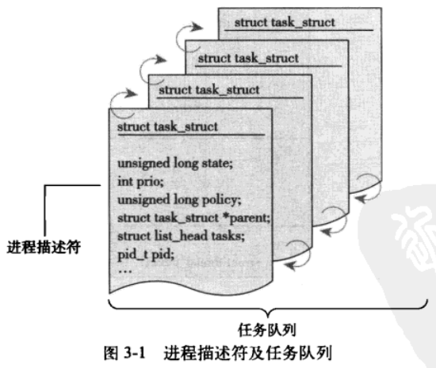

# 进程管理

## 进程

进程就是处于执行期的程序，还包含其他调用的资源；线程是进程中活动的对象，每个线程都有一个独立的程序计数器、进程栈和进程寄存器。

两种虚拟机制：

- 虚拟处理器
- 虚拟内存

`fork()`

`exec()`

`exit()`

`wait4()`

## 进程描述符/任务结构

内核将进程列表存放在 任务队列 的双向循环列表中，列表每一项为（`task_struct`）进程描述符──包含内核管理一个进程的所有信息




早期的 Linux 内核版本中（比如 2.6 ~ 4.x）：

针对x86系统架构，没有专门的寄存器存放指向 `task_struct` 的指针

使用slab分配 `task_struct` 结构，每个 `thread_info()` 结构中都包含了指向 `task_struct` 的指针


但在5.x 和 6.x 删除了  `task_struct` 的指针，转而使用current 宏定义来访问

```c
static __always_inline struct task_struct *get_current(void)
{
	if (IS_ENABLED(CONFIG_USE_X86_SEG_SUPPORT))                //判断段寄存器是否启用，启用的话可以直接从段寄存器中获取 task_struct 
		return this_cpu_read_const(const_current_task);

	return this_cpu_read_stable(current_task);
}

#define current get_current()
#define current_thread_info() ((struct thread_info *)current)
```


内核通过 PID 来标识每个进程，默认最大值为32768，但是可以扩展。

### 进程状态：

- 运行
- 睡眠（阻塞）（可中断）：正在等待事件完成
- 不可中断睡眠：接收到信号也不会被唤醒
- 被其他进程跟踪：被其他进程跟踪的进程
- 停止：进程停止


设置当前进程：

```c
set_task_state(task, state);
```

### 进程上下文

进程上下文就是 进程执行过程中，cpu的寄存器值、进程状态和堆栈信息。进程切换时，我们需要保存当前进程所有状态。

用户态内陷内核态三种方式：

- 系统调用
- 异常
- 中断

cpu内核三种状态：

- 内核态，运行于进程上下文，内核代表进程运行于内核空间
- 内核态，运行于中断上下文，内核代表硬件运行于内核空间
- 用户态

#### 中断上下文

硬件通过触发信号，导致内核调用中断处理程序，进入内核空间。**进程上下文的代码不可阻塞**。

### 进程家族树

Unix所有进程都是 PID 为 1 的init 进程后代，系统每个进程必有一个父进程。

### 进程创建

Unix 进程创建时，使用了`fork()` 和 `exec()`， 首先通过 fork 拷贝当前进程创建子进程，然后 exec 函数负责读取可执行文件并将其载入地址空间开始运行。

#### 写时拷贝

写时拷贝是一种可以推迟甚至免除拷贝数据的技术，内核让子进程和父进程共享同一个拷贝，只有在需要写入时，数据才会复制，只读时共享。


#### fork()

linux通过clone 实现 fork，然后由`clone()`调用`copy_process()` 函数，


#### `vfork()`

不拷贝父进程的页表项，子进程和父进程共享整个地址空间，父进程被阻塞，直到子进程退出和 `exec()`（必须正确调用，否则父进程将不会继续执行），保证了自程序先执行。

### 线程在linux中的实现

在linux内核中，线程仅仅被视为一个和其他进程共享某些资源的进程；而在其他系统中一般提供了专门支持线程的机制

```c
clone(CLONE_VM | CLONE_FS | CLONE_FILES |　CLONE_SIGHAND, 0);
```

共享地址空间、文件系统资源、文件描述符和信号处理程序

#### 内核线程

独立运行在内核空间的标准进程

### 进程终结

- 主动终止：调用`exit()`
- 被动终止：当遇到无法解决的信号或异常时

进程终止任务大部分靠 `do_exit()`函数来完成，最后时刻，`do_exit()`调用`schedule()` 切换到新的进程，并将当前进程标记为 EXIT_ZOMBIE 状态。此时这个进程存在的唯一目的是向父进程提供信息，提供完毕，剩余进程资源释放。

#### 删除进程描述符

进程终止工作 和 进程描述符的删除工作是分开的。

#### 孤儿进程

孤儿进程：父进程在子进程之前退出，必须有一个机制保证子进程找到一个新的进程，否则成为孤儿进程在退出时永远处于僵死状态。`do_exit()`最终会执行寻找父亲的过程，找不到，则让 init 作为父进程。


