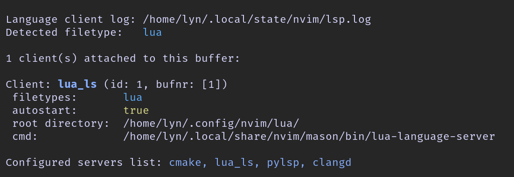
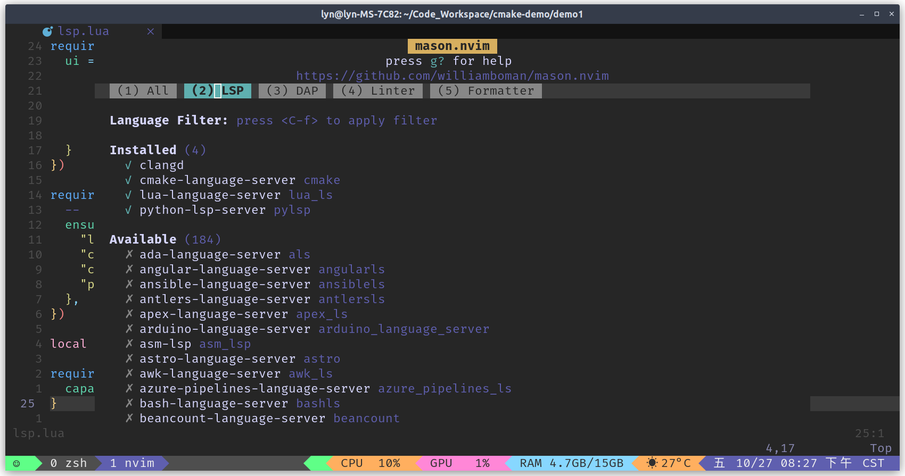

# Neovim 配置

本项目 clone 自 https://github.com/eggtoopain/Neovim-Configuration-Tutorial/tree/lazy

配置 使用 Lasy Nvim 重写，只需要将 美化下面 nvim 的压缩包解压到 **自己Nvim的路径**，例如： `~/.config/nvim` 如果没有该文件夹，直接将解压后的Nvim整个文件夹复制到 `.config/`目录下即可。

`init.lua`

```lua
require("plugins.plugins-setup")

require("core.options")
require("core.keymaps")

-- 插件
require("plugins.lualine")
require("plugins/nvim-tree")
require("plugins/treesitter")
require("plugins/lsp")
require("plugins/cmp")
require("plugins/comment")
require("plugins/autopairs")
require("plugins/bufferline")
require("plugins/gitsigns")
require("plugins/telescope")
```

已知配置的东西有：

* 主题
* 状态栏
* lsp代码补全
* 括号匹配
* git显示
* bufferline
* 文件目录显示


## LSP代码补全记录：

### 1.   使用 `:LspInfo`  可以查看当前启用的 lsp-language-server 



### 2.  借助 Mason 插件实现 Lsp管理

输入命令：   `:Mason`   进入Mason插件管理界面

在 `LSP` 一栏中下载自己需要的 Lsp-language-server 



然后 配置 :  `plugins/lsp.lua`

```lua
require("mason").setup({
  ui = {
      icons = {
          package_installed = "✓",
          package_pending = "➜",
          package_uninstalled = "✗"
      }
  }
})

require("mason-lspconfig").setup({
  -- 确保安装，根据需要填写
  ensure_installed = {
    "lua_ls",
    "cmake",
    "clangd",
    "pylsp",
  },
})

local capabilities = require('cmp_nvim_lsp').default_capabilities()

require("lspconfig").lua_ls.setup {
  capabilities = capabilities,
}

require("lspconfig").cmake.setup{}
require("lspconfig").clangd.setup{
  cmd = {
    "clangd",
    "--header-insertion=never",
    "--query-driver=/opt/homebrew/opt/llvm/bin/clang",
    "--all-scopes-completion",
    "--completion-style=detailed",
  }
}
require("lspconfig").pylsp.setup{}

```

参考官方说明：

[mason-lspconfig.nvim](https://github.com/williamboman/mason-lspconfig.nvim#default-configuration)

[Nvim-lspconfig](https://github.com/neovim/nvim-lspconfig)

lsp.lua  编写官方配置教程：

[server_configurations](https://github.com/neovim/nvim-lspconfig/blob/master/doc/server_configurations.md#clangd)

[neovim Mason配置LSP相关](https://zhuanlan.zhihu.com/p/614518048)

[Clangd配置 Wiki](https://github.com/autozimu/LanguageClient-neovim/wiki/Clangd)

https://github.com/williamboman/nvim-lsp-installer

https://github.com/neovim/nvim-lspconfig/blob/master/lua/lspconfig/server_configurations/clangd.lua