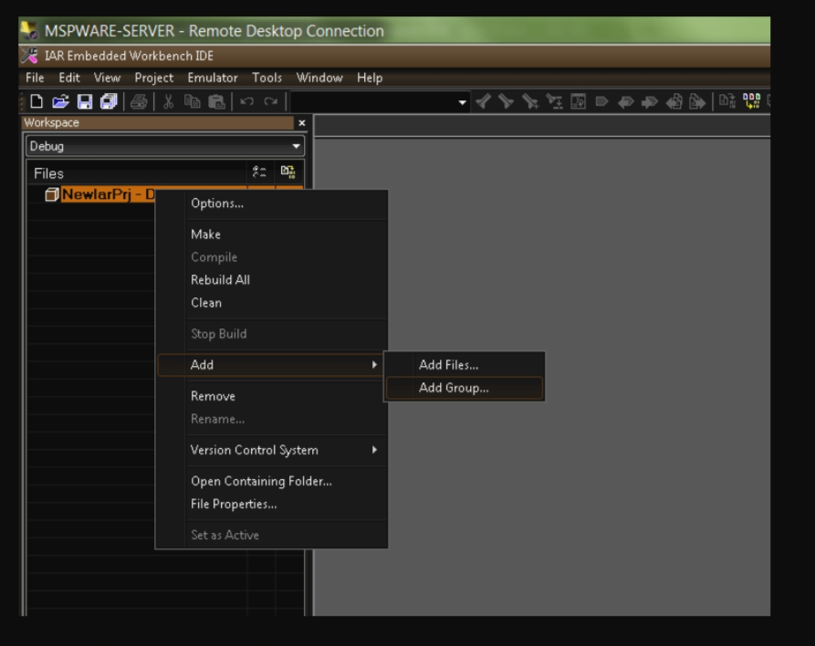
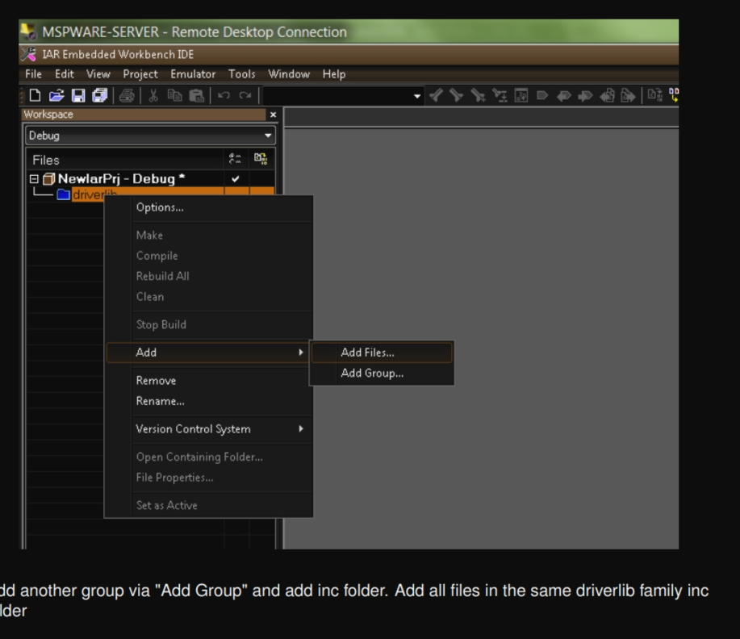
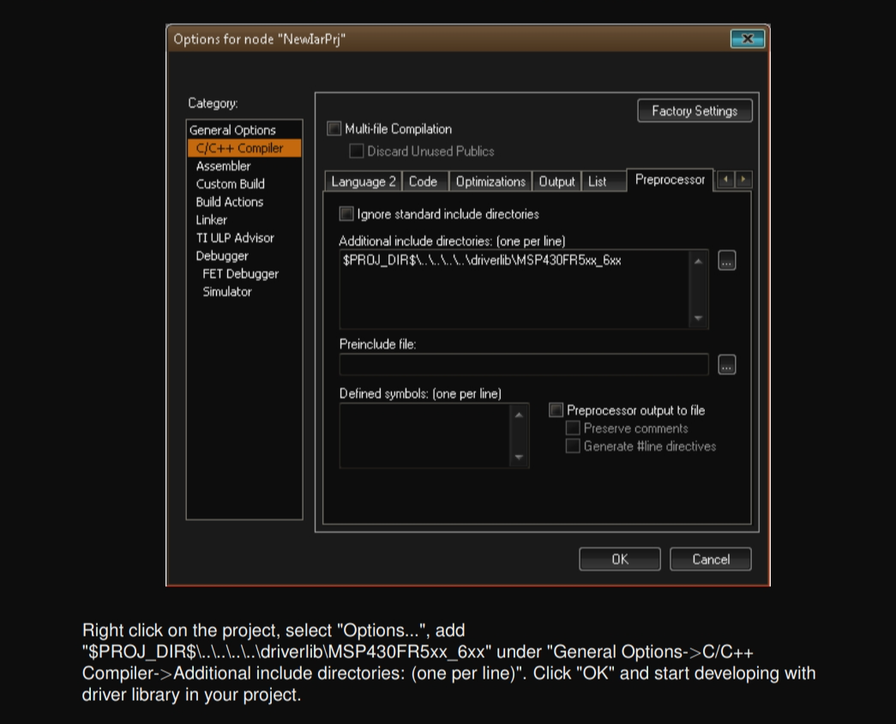
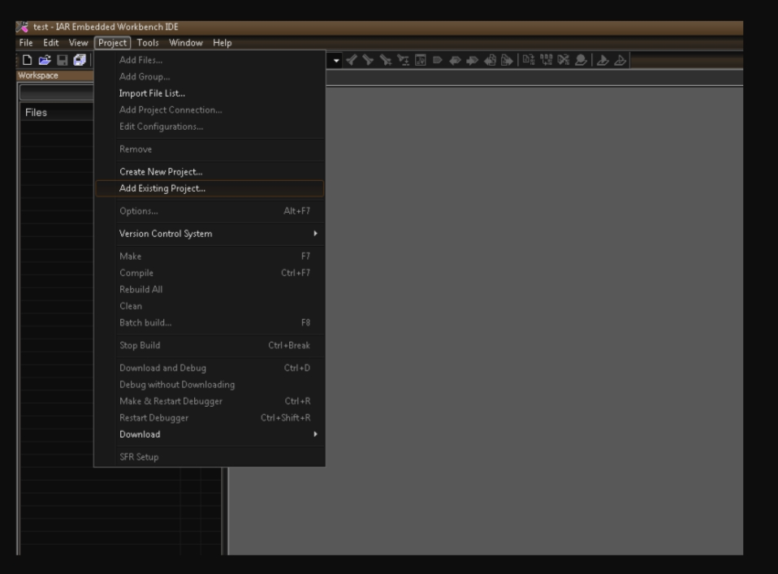
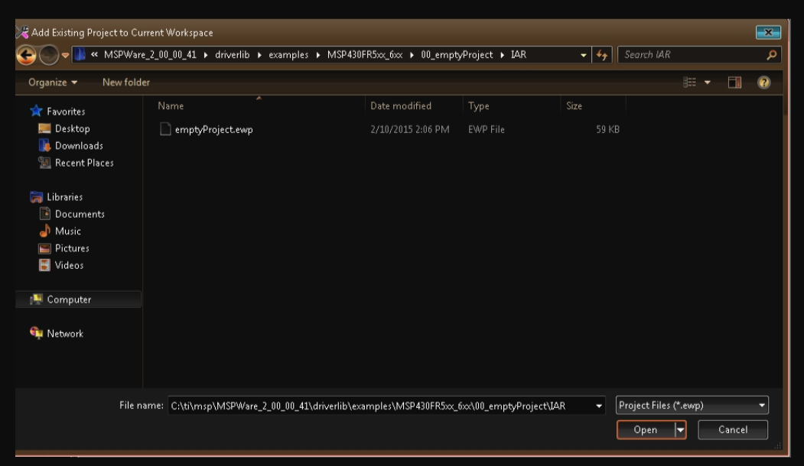
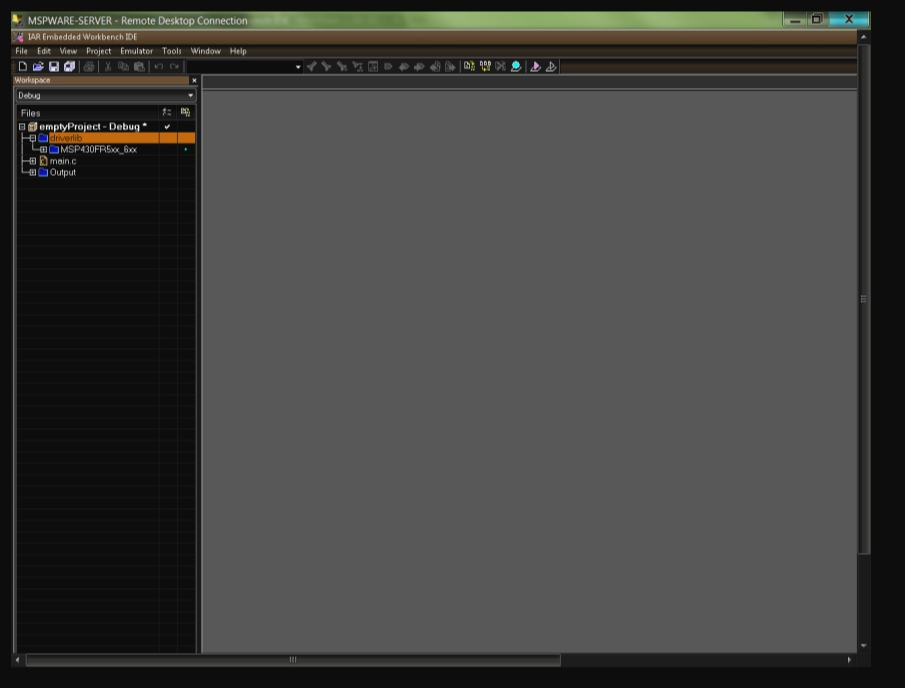

# 如何用IAR for msp430烧写代码到msp430F5529

新建工作区：


新建工程，点击Projec菜单下的Create New Project，


在弹出的对话框中Tool chain选择msp430（一般为默认），选择C文件夹的main，点击ok。


### ==保存工作区，File->Save Project,==  不保存无法烧录，烧录时候找不到.eww格式文件！！！！！


导入库函数版emptyproject 文件：

文件在同目录下面的

```shell
00_emptyProject.eww
```

> # How to include driverlib into your existing IAR project
>
> To add driver library to an existing project, right click project click on Add Group - "**driverlib**"
>
> 文件在同目录下的zip文件
>
> Now click Add files and browse through driverlib folder and add all source files of the family the device belongs to.
>
> 
>
> 
>
> 
>
> 
>
> # How to create a new IAR project that uses Driverlib
>
> 
>
> 
>
> 


options配置
3.1鼠标右键点击新建project，点击Options


选择General Options中的Target的Device，选择对应芯片型号


3.3在Debugger的Setup的Driver选择FET Debugger。


FET Debugger的Setup的Connection选择Texas Instrument USB-IF，点OK。


点击右上角的Make编辑，没有错误和警告。


用USB连接电脑和板子，点击右上角的绿色按钮Download and Debug。


仿真界面如图，点击右上角的Go，程序就能运行了。

