# 安装

##  一、Windows版本安装--VScode & Mingw64 & MSYS2

## 下载安装MSYS2

> [MSYS2](https://www.msys2.org/)

### 安装完成后：

```shell
pacman -Syu
pacman -S --needed mingw-w64-x86_64-gcc mingw-w64-x86_64-gdb mingw-w64-x86_64-make mingw-w64-x86_64-pkgconf base base-devel msys2-w32api-runtime

pacman -Syuu
pacman -S mingw-w64-x86_64-gcc
pacman -S mingw-w64-x86_64-pkg-config
pacman -S mingw-w64-x86_64-zlib
```

### 添加环境变量：

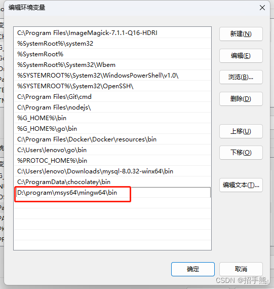

### 添加系统变量`PKG_CONFIG_PATH`

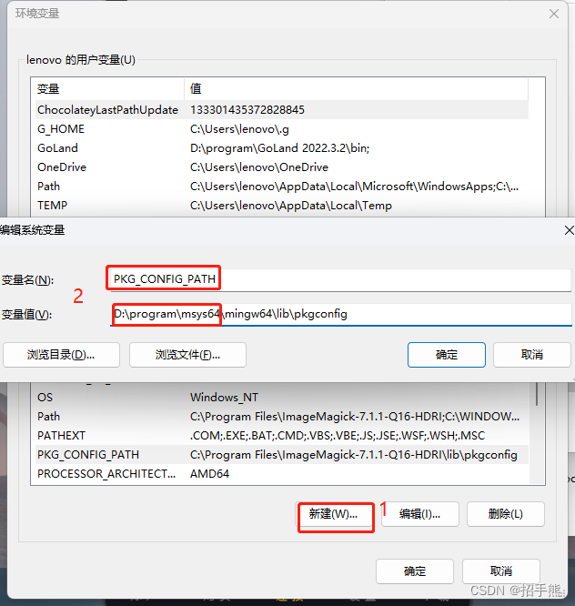

### 安装opencv_mingw64

> [Package: mingw-w64-x86_64-opencv - MSYS2 Packages](https://packages.msys2.org/package/mingw-w64-x86_64-opencv)

```shell
pacman -Syuu
pacman -S mingw-w64-x86_64-opencv
pacman -S mingw-w64-x86_64-qt6-5c ompat
pacman -S mingw-w64-x86_64-vtk
```

至此安装过程结束，所有的dll 文件应该已经都安装好了。

添加环境变量

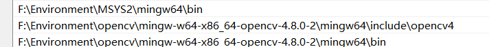


### vscode配置

```json
//c_cpp_properties.json
{
    "configurations": [
        {
            "name": "Win32",
            "includePath": [
                "${workspaceFolder}/**",
                "F:\\Environment\\MinGW\\mingw64\\include",
                "F:\\Environment\\MinGW\\mingw64\\x86_64-w64-mingw32\\include",
                "F:\\Environment\\opencv\\mingw-w64-x86_64-opencv-4.8.0-2\\mingw64\\include\\opencv4"               
            ],
            "defines": [
                "_DEBUG",
                "UNICODE",
                "_UNICODE"
            ],
            "compilerPath": "F:\\Environment\\MinGW\\mingw64\\bin\\g++.exe",                   //这里也要改
            "cStandard": "c11",
            "cppStandard": "c++17",
            "intelliSenseMode": "gcc-x64",
            "configurationProvider": "ms-vscode.cmake-tools"
        }
    ],
    "version": 4
}
```

```json
//launch.json
{
    // 使用 IntelliSense 了解相关属性。 
    // 悬停以查看现有属性的描述。
    // 欲了解更多信息，请访问: https://go.microsoft.com/fwlink/?linkid=830387
    "version": "0.2.0",
    "configurations": [
        {
            "name": "g++.exe - 生成和调试活动文件",
            "type": "cppdbg",
            "request": "launch",
            "program": "${fileDirname}\\${fileBasenameNoExtension}.exe",
            "args": [],
            "stopAtEntry": false,
            "cwd": "${fileDirname}",
            "environment": [],
            "externalConsole": true,//由false改为true后可显示运行框
            "MIMode": "gdb",
            "miDebuggerPath": "F:\\Environment\\MinGW\\mingw64\\bin\\gdb.exe",                      //这里也要改
            "setupCommands": [
                {
                    "description": "为 gdb 启用整齐打印",
                    "text": "-enable-pretty-printing",
                    "ignoreFailures": true
                }
            ],
            "preLaunchTask": "C/C++: g++.exe 生成活动文件"
        }
    ]
}

```

```json
//tasks.json
{
    "tasks": [
        {
            "type": "cppbuild",
            "label": "C/C++: g++.exe 生成活动文件",
            "command": "F:\\Environment\\MSYS2\\mingw64\\bin\\g++.exe",
            "args": [
                "-fdiagnostics-color=always",
                "-std=c++11",
                "-g",
                "${file}",
                "-o",
                "${fileDirname}\\${fileBasenameNoExtension}.exe",
                "-IF:/Environment/opencv/mingw-w64-x86_64-opencv-4.8.0-2/mingw64/include/opencv4",    //这里也要改
"-LF:/Environment/opencv/mingw-w64-x86_64-opencv-4.8.0-2/mingw64/lib",                                //这里也要改
"-lopencv_gapi",
"-lopencv_stitching",
"-lopencv_alphamat",
"-lopencv_aruco",
"-lopencv_bgsegm",
"-lopencv_ccalib",
"-lopencv_cvv",
"-lopencv_dnn_objdetect",
"-lopencv_dnn_superres",
"-lopencv_dpm",
"-lopencv_face",
"-lopencv_freetype",
"-lopencv_fuzzy",
"-lopencv_hdf",
"-lopencv_hfs",
"-lopencv_img_hash",
"-lopencv_intensity_transform",
"-lopencv_line_descriptor",
"-lopencv_mcc",
"-lopencv_ovis",
"-lopencv_quality",
"-lopencv_rapid",
"-lopencv_reg",
"-lopencv_rgbd",
"-lopencv_saliency",
"-lopencv_sfm",
"-lopencv_stereo",
"-lopencv_structured_light",
"-lopencv_phase_unwrapping",
"-lopencv_superres",
"-lopencv_optflow",
"-lopencv_surface_matching",
"-lopencv_tracking",
"-lopencv_highgui",
"-lopencv_datasets",
"-lopencv_text",
"-lopencv_plot",
"-lopencv_videostab",
"-lopencv_videoio",
"-lopencv_viz",
"-lopencv_wechat_qrcode",
"-lopencv_xfeatures2d",
"-lopencv_shape",
"-lopencv_ml",
"-lopencv_ximgproc",
"-lopencv_video",
"-lopencv_xobjdetect",
"-lopencv_objdetect",
"-lopencv_calib3d",
"-lopencv_imgcodecs",
"-lopencv_features2d",
"-lopencv_dnn",
"-lopencv_flann",
"-lopencv_xphoto",
"-lopencv_photo",
"-lopencv_imgproc",
"-lopencv_core"
            ],
            "options": {
                "cwd": "${fileDirname}"
            },
            "problemMatcher": [
                "$gcc"
            ],
            "group": {
                "kind": "build",
                "isDefault": true
            },
            "detail": "调试器生成的任务。"
        }
    ],
    "version": "2.0.0"
}
```

下面这个文件应该没什么用

```json
//settings.json
{
    "C_Cpp.errorSquiggles": "enabled",
    "files.associations": {
        "time.h": "c",
        "cmath": "c",
        "*.tcc": "c",
        "string": "cpp",
        "algorithm": "c",
        "cstdlib": "c",
        "stdio.h": "c"
    },
    "code-runner.executorMap": {
        "cpp": "cd $dir && g++ $fileName -o $fileNameWithoutExt -lgraphics64 -luuid -lmsimg32 -lgdi32 -limm32 -lole32 -loleaut32 -lwinmm -lgdiplus && $dir$fileNameWithoutExt"
    },
    "cmake.sourceDirectory": "d:\\cpp learn\\cpp"
}

```

最后

### restart  your computer


## 二、Windows版本 --- Visual Studio 2022

下载安装Windows版本的安装包

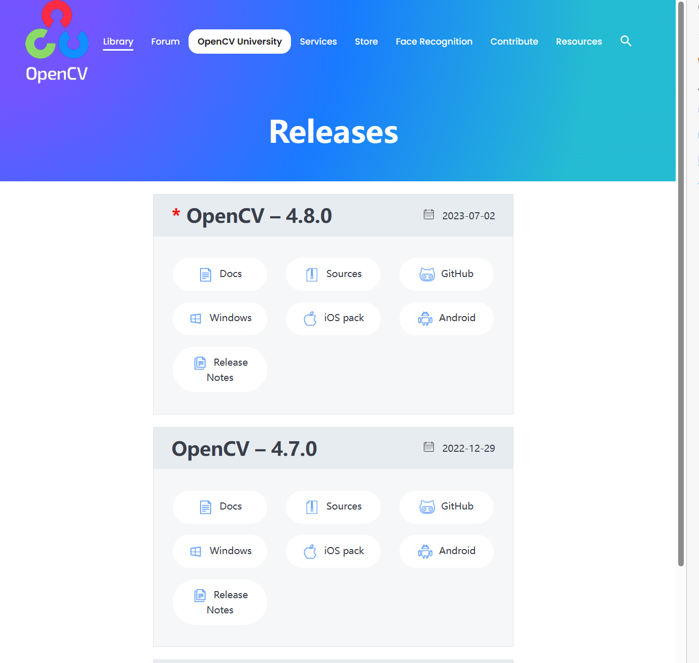

安装完毕后添加环境变量。

> 添加环境变量 `%opencv%\build\x64\vc15\bin`其中 `%opencv%`为你自己的opencv文件夹的位置

### **在Visual Studio2022上配置OpenCV4.8.0**

1、打开visual studio 2022创建新项目，选择C++控制台应用

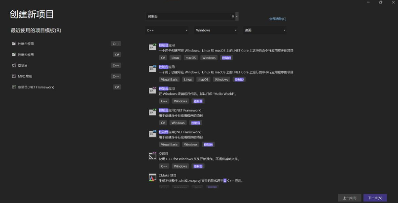

2、点击顶部标签栏 项目 中 属性

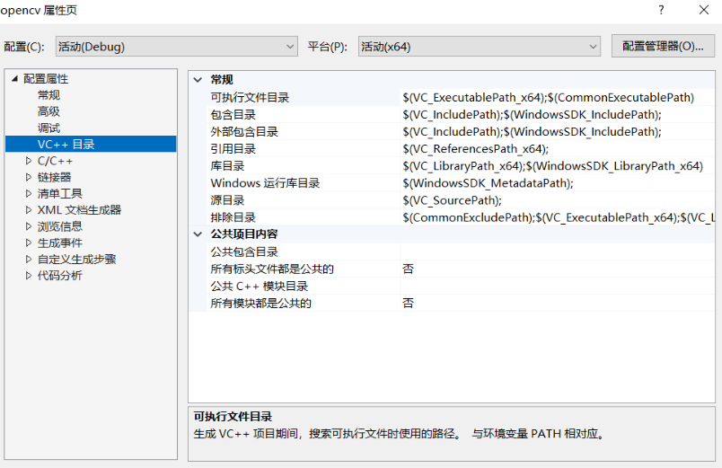

3、 点击VC++目录中的包含目录，编辑，选择路径opencv\build\include，添加到我们的包含目录中

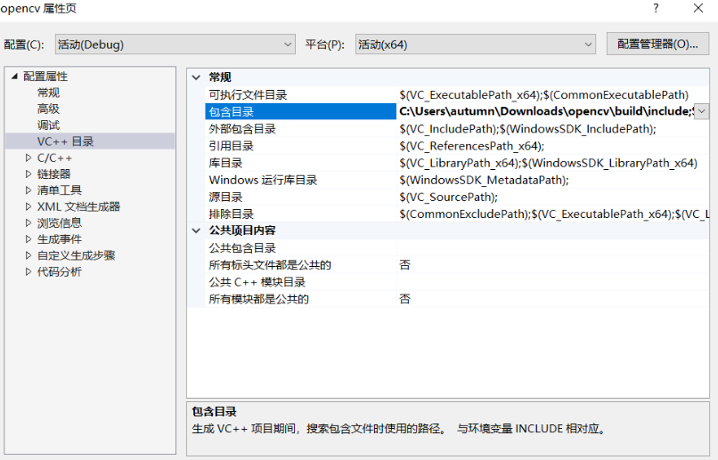

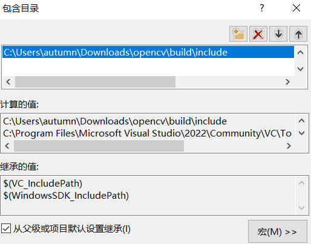

3、点击VC++目录中的库目录，编辑，选择路径opencv\build\x64\vc15\lib，添加到我们的库目录中

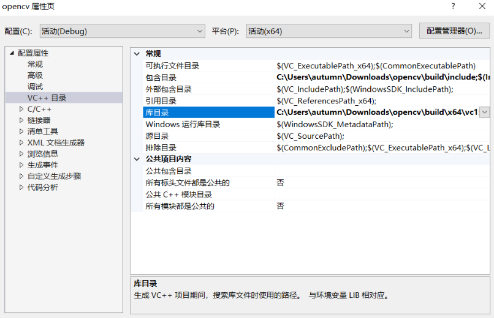

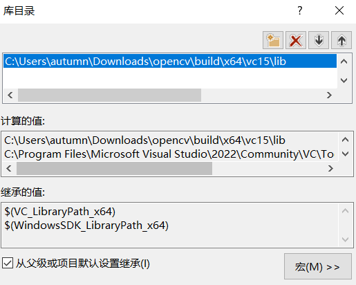


点击 链接器 的 输入 中的 附加依赖项

编辑，复制文件夹opencv\build\x64\vc15\lib中的opencv_world454d.lib文件，粘贴到我们的附加依赖项中

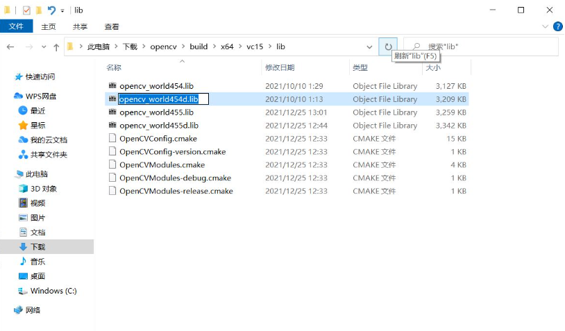

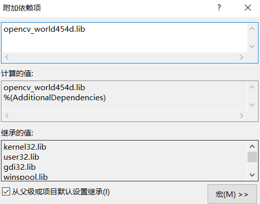


## 三、Ubuntu版本安装

### 一、环境包安装（CPP & Python）

```bash
#第一二三行必选
$ sudo apt-get install build-essential                     # 这是为了安装编译所需的库
$ sudo apt-get install cmake pkg-config git                # 这是为了安装一些必要的工具
$ sudo apt-get install  libgtk2.0-dev  libavcodec-dev libavformat-dev libswscale-dev 
$ sudo apt-get install python-dev python-numpy libtbb2 libtbb-dev libjpeg-dev libpng-dev libtiff-dev libjasper-dev libdc1394-22-dev

```

> 关于libjasper-dev包，不用安装

### 二、单独python版本

```shell
pip install opencv-python
```


### 二、下载编译安装

```shell
cd ~/opencv-4.7.0
mkdir build
cd ./build
```

```shell
cmake -D CMAKE_INSTALL_PREFIX=/usr -D CMAKE_BUILD_TYPE=Release -D OPENCV_GENERATE_PKGCONFIG=ON -D   -D OPENCV_ENABLE_NONFREE=True ..
```

```c
/*
注解：

1. CMAKE_INSTALL_PREFIX 是opencv的安装地址 默认安装在 usr/local
2. CMAKE_BUILD_TYPE 是opencv安装的版本，Release和Debug两种可选，默认安装Release
3. OPENCV_ENABLE_NONFREE 是否使用部分被申请了专利的算方法 这里选True的话就可以使用了
4. OPENCV_GENERATE_PKGCONFIG 强烈建议开启这个 设置为ON OPENCV_GENERATE_PKGCONFIG 因为opencv4默认不生成.pc文件，所以加上这句用于生成opencv4.pc文件，支持pkg-config功能。opencv4版本及以上 这里用ON
*/
```

> 注：如果出现`Built target libprotobuf`的错误，将 `-D ENABLE_CXX11=1` 命令补充在cmake 指令后再来一次

```shell
sudo make -j12
sudo make install
```

### 三、环境配置

#### 1.修改etc/bash.bashrc

我们之前安装的时候 `OPENCV_GENERATE_PKGCONFIG=ON` 所以在/usr/lib/pkgconfig下生成了opencv4.pc文件，里面记录了OpenCV头文件、库文件的路經。需要进行如下配置：

```shell
#搜索opencv.pc文件目录
find / -iname opencv4.pc

#法一（未成功）：
sudo gedit /etc/bash.bashrc

#文件末尾添加以下内容 并保存
PKG_CONFIG_PATH=$PKG_CONFIG_PATH:/usr/lib/pkgconfig
export PKG_CONFIG_PATH
 
#更新
source /etc/bash.bashrc

#法二（成功）：
sudo vim /etc/profile.d/pkgconfig.sh

#文件末尾添加以下内容 并保存
export PKG_CONFIG_PATH=/usr/local/lib/pkgconfig:$PKG_CONFIG_PATH

#保存并退出后激活：
source /etc/profile

```

#### 2.修改动态库

```shell
#打开下列文件
sudo gedit /etc/ld.so.conf.d/opencv.conf 
 
# 添加lib路經 在 末尾 保存退出
/usr/lib
 
# 更新
sudo ldconfig
```

#### 3.更新

```shell
sudo updatedb
```


### 四、测试

```shell
#终端输入以下两命令，显示正常则安装成功
pkg-config --modversion opencv4 #查看版本号
pkg-config --libs opencv4 #查看libs库
```

```shell
cd ~/opencv-4.7.0/samples/cpp/example_cmake
mkdir build
cd ./build
cmake ..
make
./opencv_example ## 生成一个可执行文件 拖入终端执行 也可
```

### 五、Ubuntu_Vscode配置

```json
{
    "tasks": [
        {
            "type": "cppbuild",
            "label": "C/C++: g++ opencv生成活动文件",
            "command": "/usr/bin/g++",
            "args": [
                "-fdiagnostics-color=always",
                "-std=c++11",
                "-static-libgcc",
                "-Wall",
                "-g",
                "${file}",
                "-o",
                "${fileDirname}/${fileBasenameNoExtension}",
                "`pkg-config --cflags --libs opencv4`"
            ],
            "options": {
                "cwd": "${workspaceFolder}"
            },
            "problemMatcher": [
                "$gcc"
            ],
            "group": "build",
            "detail": "调试器生成的任务。"
        }
    ],
    "version": "2.0.0"
}
```

```json
{
    "configurations": [
        {
            "name": "Linux",
            "includePath": [
                "${workspaceFolder}/**",
                "/usr/include/opencv4"
            ],
            "defines": [],
            "compilerPath": "/usr/bin/gcc",
            "cStandard": "c17",
            "cppStandard": "gnu++17",
            "intelliSenseMode": "linux-gcc-x64"
        }
    ],
    "version": 4
}
```

```json
{
    // Use IntelliSense to learn about possible attributes.
    // Hover to view descriptions of existing attributes.
    // For more information, visit: https://go.microsoft.com/fwlink/?linkid=830387
    "version": "0.2.0",
    "configurations": [
        {
            "name": "g++ - 生成和调试活动文件",
            "preLaunchTask": "C/C++: g++ opencv生成活动文件", 
            "type": "cppdbg",
            "request": "launch",
            "program": "${fileDirname}/${fileBasenameNoExtension}",
            "args": [],
            "stopAtEntry": false,
            "cwd": "${workspaceFolder}", 
            "environment": [],
            "externalConsole": true,
            "MIMode": "gdb",
            "setupCommands": [
                {
                    "description": "为 gdb 启用整齐打印",
                    "text": "-enable-pretty-printing",
                    "ignoreFailures": true
                }
            ],
        }
    ]
}
```

```json
{
    "files.associations": {
        "cstdlib": "cpp",
        "ostream": "cpp"
    }
}
```


###  六、Bug解决

1. ```Gtk-Message: 14:00:08.135: Failed to load module "canberra-gtk-module"```

解决办法：

```shell
sudo apt install libcanberra-gtk-module
```


2. ```opencv 420.ddl 缺失```

解决办法：

在项目设置的调试中添加环境变量：

```PATH=D:\Program Files\opencv\source\opencv\build\x64\vc15\bin $(LocalDebuggerEnvironment)```


3. ```sudo updatedb sudo updatedb``` 的时候，显示“```sudo updatedb```找不到命令”

解决方法：

执行 `apt-get install mlocate`
 安装完成 `sudo updatedb`
