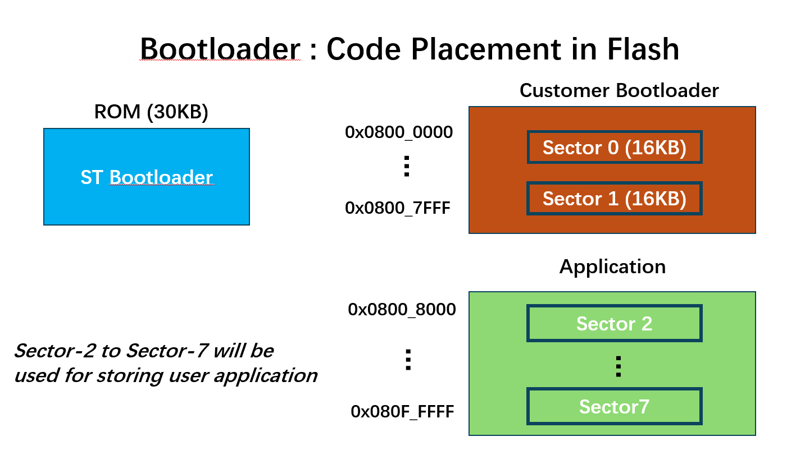
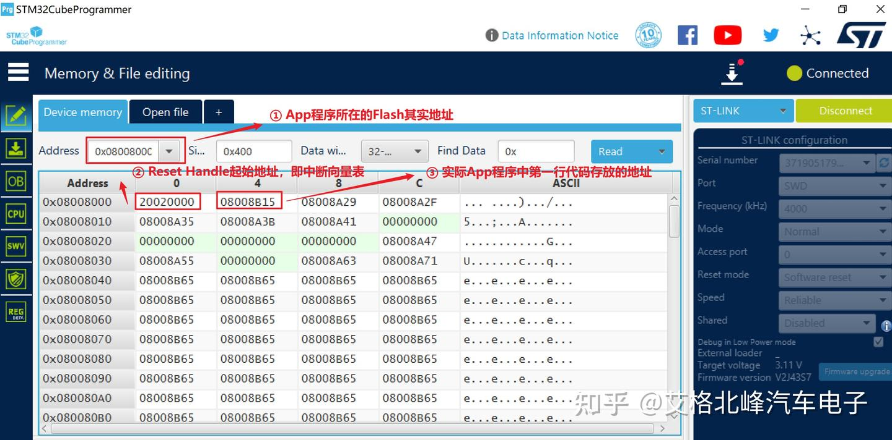
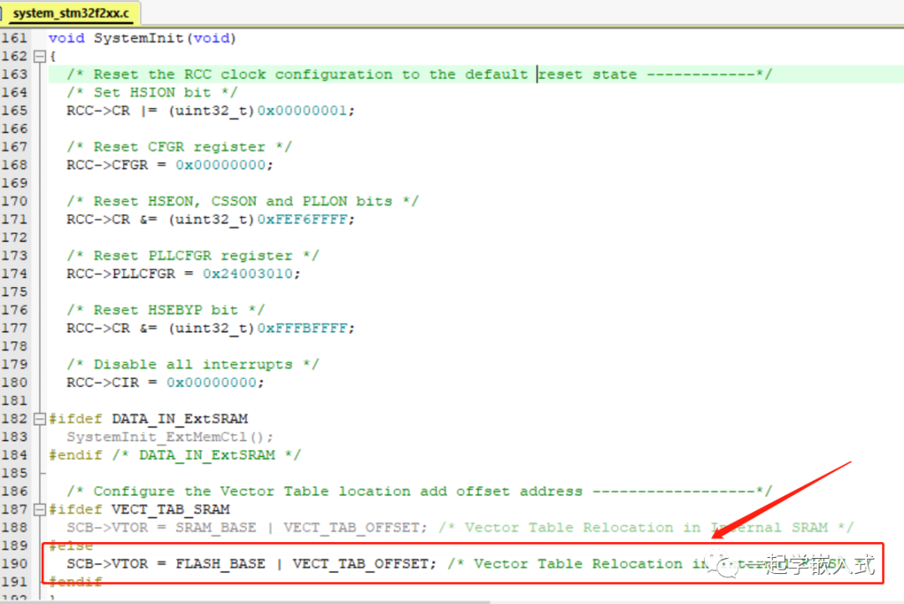

# Bootloader 跳转实现

参考：[STM32单片机实现Bootloader跳转的关键步骤 - 控制/MCU - 电子发烧友网](https://www.elecfans.com/emb/danpianji/202308142211613.html)

[STM32 BootLoader 刷新项目 (九) 跳转指定地址-命令0x55 - 知乎](https://zhuanlan.zhihu.com/p/25175067250)




STM32的BootLoader中跳转指定地址的应用场景主要包括以下几个方面：

1. **[固件升级](https://zhida.zhihu.com/search?content_id=254057116&content_type=Article&match_order=1&q=固件升级&zhida_source=entity)（Firmware Upgrade）**：

- BootLoader允许在不改变硬件连接的情况下进行固件的在线升级。当新的固件版本需要部署到设备上时，BootLoader可以接收新的固件并将其烧录到指定的Flash地址，然后跳转到新固件的执行地址，从而实现固件的无缝更新。

1. **[多应用管理](https://zhida.zhihu.com/search?content_id=254057116&content_type=Article&match_order=1&q=多应用管理&zhida_source=entity)（Multi-Application Management）**：

- 在一些复杂的应用中，可能需要在同一个设备上运行多个应用程序。BootLoader可以通过跳转到不同的地址来选择性地加载和执行不同的应用程序，实现多应用的管理。

1. **[系统恢复](https://zhida.zhihu.com/search?content_id=254057116&content_type=Article&match_order=1&q=系统恢复&zhida_source=entity)（System Recovery）**：

- 如果设备在运行过程中出现软件故障，BootLoader可以作为一个恢复点，通过跳转到备份的固件地址来恢复系统的正常运行。

1. **[安全启动](https://zhida.zhihu.com/search?content_id=254057116&content_type=Article&match_order=1&q=安全启动&zhida_source=entity)（Secure Boot）**：

- 在安全敏感的应用中，BootLoader可以检查固件的合法性，确保只有经过认证的固件才能被加载执行。这可以通过跳转到经过签名验证的固件地址来实现。

1. **[调试和测试](https://zhida.zhihu.com/search?content_id=254057116&content_type=Article&match_order=1&q=调试和测试&zhida_source=entity)（Debugging and Testing）**：

- 在开发和测试阶段，BootLoader可以方便地进行程序的调试和测试。开发者可以通过BootLoader跳转到不同的测试固件地址，快速验证新功能或修复bug。

1. **节省资源（Resource Saving）**：

- 对于资源受限的嵌入式系统，BootLoader可以减少对外部存储器的需求，通过内部Flash存储固件，节省成本和空间。


## 实现跳转的关键步骤：

1. **验证目标地址**：确保目标地址是有效的，并且位于应用程序的合法执行区域内。
2. **设置堆栈指针**：将堆栈指针（MSP）设置为应用程序的初始堆栈值。
3. **跳转到应用程序**：使用函数指针或者直接修改程序计数器（PC）来跳转到应用程序的入口点。

### 验证函数：

```c
uint8_t app_IsReady(uint32_t addr)
{
  __IO uint32_t *data = (volatile uint32_t *)0x90000000UL;
  uint32_t read_data = data[0];
  progress_bar(1000, 0.6, 0.2, (uint8_t *)"verifying...");
  //W25qxx_Read(read,0,sizeof(read));
  //W25qxx_Read((uint8_t *)&data,addr - QSPI_BASE,sizeof(data));   // 如果设置了 外部内存映射模式 将无法再使用原来的读取函数进行内存访问，报错：QSDPI 总线 BUSY
  
    /* 验证程序头合法性 */
	if((*data & 0x2FF80000 ) == 0x24000000)
		return SUCCESS;
	else if((*data & 0x2FF80000 ) == 0x20000000)
		return SUCCESS;
  else if((*data & 0x3FF80000 ) == 0x30000000)
		return SUCCESS;
 	else if((*data & 0x3FF80000 ) == 0x00000000)
		return SUCCESS; 
	else
		return ERROR;
}
```

此步骤应在 配置好 MPU访问权限 或 关闭 MPU的 情况下使用。

> 程序头合法性：
>
> APP程序头为中断向量表位置，故应为固定的字串，用来判断程序是否正常存在，防止跳转到非法地址而死机。


### 跳转函数：

```c
void app_Jump(uint32_t addr)
{
	pFunction JumpToApplication;
	uint32_t JumpAddress;

  __disable_irq();     // 关闭全局中断
	
	/* Jump to user application */
	JumpAddress = *(__IO uint32_t*) (addr + 4);
	JumpToApplication = (pFunction) JumpAddress;

	/* Initialize user application's Stack Pointer */
	__set_MSP(*(__IO uint32_t*) addr);
	JumpToApplication();			
}
```

`JumpAddress = *(__IO uint32_t*) (addr + 4);` 如下图所示，我们并不能直接跳转0x08008000， 因为0x20020000，这个值是Reset Handle，即中断向量表的起始地址；第二个地址0x0800 8004中的值才是实际App程序所在的Flash地址。




### 实现逻辑：

```c
if(app_IsReady(APPLICATION_ADDRESS) == SUCCESS)
  {
    HAL_GPIO_TogglePin(GPIOE,GPIO_PIN_3);
    HAL_Delay(100);
    HAL_GPIO_TogglePin(GPIOE,GPIO_PIN_3);
    HAL_Delay(100);
    HAL_GPIO_TogglePin(GPIOE,GPIO_PIN_3);
    HAL_Delay(100);
    HAL_GPIO_TogglePin(GPIOE,GPIO_PIN_3);
    HAL_Delay(100);
    HAL_GPIO_TogglePin(GPIOE,GPIO_PIN_3);
    HAL_Delay(100);

    HAL_SPI_MspDeInit(&hspi1);    // Deinit 不需要的外设
    
    progress_bar(1000, 0.8, 1, (uint8_t *)"Starting...");
    /* Disable CPU L1 cache before jumping to the QSPI code execution */
    CPU_CACHE_Disable();  
    /* Disable Systick interrupt */
    SysTick->CTRL = 0;
    SysTick->LOAD = 0;
    SysTick->VAL = 0;
    NVIC->ICER[0] = 0xFFFFFFFF; // 禁用所有中断
    NVIC->ICPR[0] = 0xFFFFFFFF; // 清除所有中断挂起位
    
    /* 设置所有时钟到默认状态，使用HSI时钟 */
    HAL_RCC_DeInit();

    /* Initialize user application's Stack Pointer & Jump to user application */
    app_Jump(APPLICATION_ADDRESS);
  }
```

使用时应禁用所有中断并清除所有中断挂起位，以确保跳转过程中不会被中断干扰。


## APP程序配置：

```c
SCB->VTOR = QSPI_BASE; //修改APP 内部 Flash 向量表重定位
__enable_irq();
```

正常来说，在启动文件中执行调用 SystemInit() 函数，这个函数会配置 Flash 的接口信息。 SCB->VTOR = FLASH_BASE | VECT_TAB_OFFSET。



我们可以放在 `main.c` 运行头处：

```c
int main(void)
{

  /* USER CODE BEGIN 1 */
  SCB->VTOR = QSPI_BASE;
  __enable_irq();
  /* USER CODE END 1 */
   ....
}
```

### LD文件更改：

```
MEMORY
{
DTCMRAM (xrw)      : ORIGIN = 0x20000000, LENGTH = 128K
RAM (xrw)      : ORIGIN = 0x24000000, LENGTH = 512K
RAM_D2 (xrw)      : ORIGIN = 0x30000000, LENGTH = 288K
RAM_D3 (xrw)      : ORIGIN = 0x38000000, LENGTH = 64K
ITCMRAM (xrw)      : ORIGIN = 0x00000000, LENGTH = 64K
QSPIFLASH (rx)      : ORIGIN = 0x90000000, LENGTH = 8192K
}
```

将所有的FLASH相关的内存位置改为：我们设置的QSPIFLASH

如需更改RAM存储位置 同理，我们需将 LD文件中所有与ram相关的地址改到你想放的位置

注意： （DTCRAM中无法使用 DMA）


### APP程序调试？