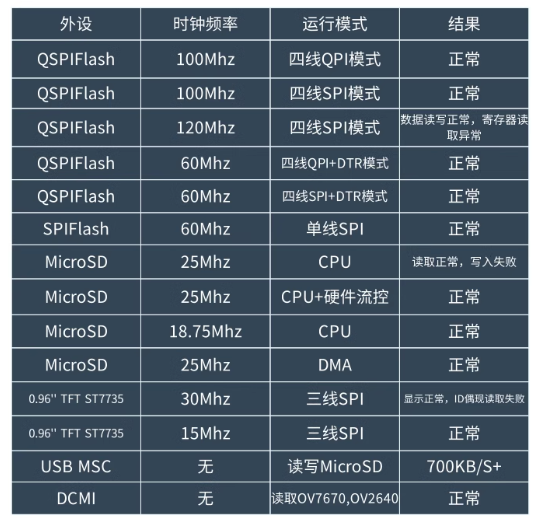
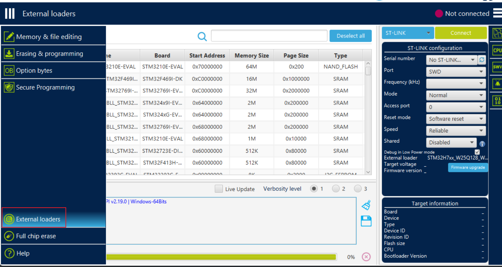

# QSPI外置程序运行

关键步骤：

```c
w25qxx_Init();
w25qxx_EnterQPI();

w25qxx_Startup(w25qxx_QPIMode);  // 开启内存映射模式
```

应注意：



外置内存时钟频率要求比较严格，DTC模式和normal模式支持的时钟速率都不相同，故当启用后如果无法读写 ---> 会出现读出结果均为 0x0000000 或 0x88888888

在跳转为APP应用后，不可以再次初始化 QSPIFLASH 或者占用相关引脚。


## 使用stm32Programmer 和外置烧录算法将程序烧录到QSPIFLASH中

选择外置烧录算法

