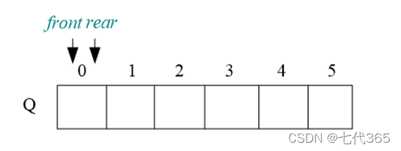
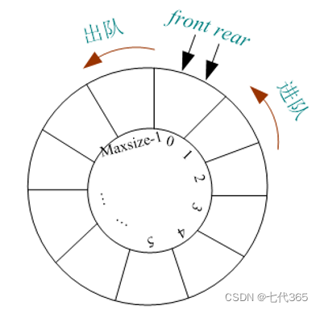

# 循环队列

线性队列：


base为数组的基地址,front,base分别代表指向队头和队尾的"指针"(数组下标),构造空队列只需要申请一块内存给基地址,并且将队头指针与队尾[指针赋值](https://so.csdn.net/so/search?q=指针赋值&spm=1001.2101.3001.7020)为0.





将向量空间想象为一个首尾相接的圆环，并称这种向量为循环向量。存储在其中的队列称为循环队列（Circular Queue）。循环队列是把顺序队列首尾相连，把存储队列元素的表从逻辑上看成一个环，成为循环队列。

循环队列就是将队列存储空间的最后一个位置绕到第一个位置，形成逻辑上的环状空间，供队列循环使用。在循环队列结构中，当存储空间的最后一个位置已被使用而再要进入队运算时，只需要存储空间的第一个位置空闲，便可将元素加入到第一个位置，即将存储空间的第一个位置作为队尾。 循环队列可以更简单防止伪溢出的发生，但队列大小是固定的。

在循环队列中，当队列为空时，有front=rear，而当所有队列空间全占满时，也有front=rear。为了区别这两种情况，规定循环队列最多只能有MaxSize-1个队列元素，当循环队列中只剩下一个空存储单元时，队列就已经满了。因此，队列判空的条件是front=rear，而队列判满的条件是`front=（rear+1)%MaxSize`。

```c++
#include<iostream>

#define MAX_QSIZE 5 //最大队列长度

typedef struct 
{
  int *base;     // 初始化的动态分配存储空间
  int front_p;   //头指针
  int rear_p;    // 尾指针，若队列不空，指向队列尾元素的下一个位置
}SqQueue;


SqQueue* Q_Init()
{
  SqQueue *Q = (SqQueue*)malloc(sizeof(SqQueue));
  Q->base = (int *)malloc(MAX_QSIZE * sizeof(int));
  Q->front_p = Q->rear_p = 0;
  return Q;
}

// 销毁队列Q，Q不再存在
void Q_Destroy(SqQueue *Q) {
    if (Q->base)
        free(Q->base);
    Q->base = NULL;
    Q->front_p = Q->rear_p = 0;
    free(Q);
}
 
// 将Q清为空队列
void Q_Clear(SqQueue *Q) {
    Q->front_p = Q->rear_p = 0;
}

// 若队列Q为空队列，则返回1；否则返回-1
int Q_Empty(SqQueue Q) {
    if (Q.front_p == Q.rear_p) // 队列空的标志
        return 1;
    else
        return -1;
}

// 返回Q的元素个数，即队列的长度
int Q_Length(SqQueue Q) {
    return (Q.rear_p - Q.front_p + MAX_QSIZE) % MAX_QSIZE;
}
 
// 若队列不空，则用e返回Q的队头元素，并返回OK；否则返回ERROR
int Q_GetHead(SqQueue Q, int &e) {
    if (Q.front_p == Q.rear_p) // 队列空
        return -1;
    e = Q.base[Q.front_p];
    return 1;
}
 
// 打印队列中的内容
void Q_Print(SqQueue Q) {
    int p = Q.front_p;
    while (Q.rear_p != p) {
        std::cout << Q.base[p] << std::endl;
        p = (p + 1) % MAX_QSIZE;
    }
}
 
// 插入元素e为Q的新的队尾元素
int Q_Put(SqQueue *Q, int e) {
    if ((Q->rear_p + 1) % MAX_QSIZE == Q->front_p) // 队列满
        return -1;
    Q->base[Q->rear_p] = e;
    Q->rear_p = (Q->rear_p + 1) % MAX_QSIZE;
    return 1;
}
 
// 若队列不空，则删除Q的队头元素，用e返回其值，并返回1；否则返回-1
int Q_Poll(SqQueue *Q, int &e) {
    if (Q->front_p == Q->rear_p) // 队列空
        return -1;
    e = Q->base[Q->front_p];
    Q->front_p = (Q->front_p + 1) % MAX_QSIZE;
    return 1;
}

int main ()
{
  
  return 0;
}
```

