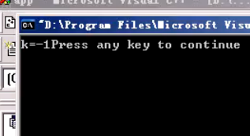

# 逗号运算符


四大注意点：

* 逗号表达式的值等于最后一个表达式的值
* 虽然逗号表达式的值等于最后一个表达式的值，但是每一个表达式都必须要做到计算。
* 要使变量的值发生改变，唯一的方法就是让变量执行赋值语句。
* 逗号运算符是所有运算符中优先级别最低的一个。


```c
main()
{
  int a=3,b=4,k;
  k=（a*b,a+b,a-b）;//逗号表达式的值等于最后一个表达式的值：所以看a-b，就等于-1
  printf("k%=d"，k)；
}
```

结果：



```c
main()
{
  int a=3,b=4,k;
  k=（a=a*b,a+b,a-b）;//每一个表达式都必须要做到计算//k就等于8
  printf("k%=d"，k)；
}
```

