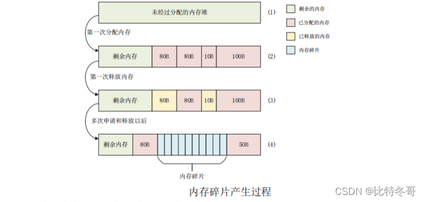
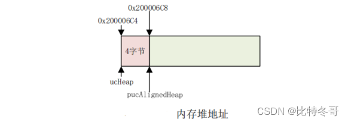
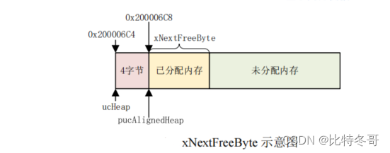
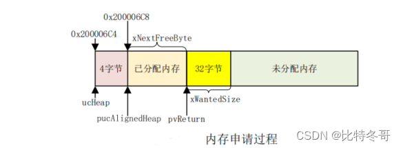
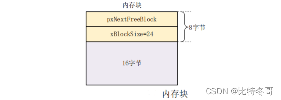
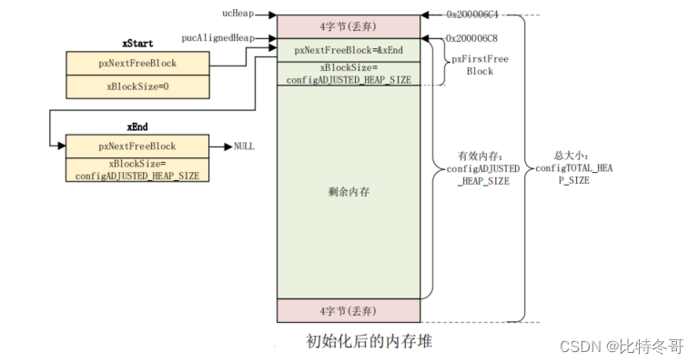

# FreeRTOS 内存管理

## 一、FreeRTOS 内存管理简介

FreeRTOS 创建任务、队列、信号量等的时候有两种方法，一种是动态的申请所需的 RAM。一种是由用户自行定义所需的 RAM，这种方法也叫静态方法，使用静态方法的函数一般以“Static”结尾，比如任务创建函数 `xTaskCreateStatic()`，使用此函数创建任务的时候需要由用户定义任务堆栈，本章我们不讨论这种静态方法。

使用动态内存管理的时候 FreeRTOS 内核在创建任务、队列、信号量的时候会动态的申请RAM。标准 C 库中的 malloc()和 free()也可以实现动态内存管理，但是如下原因限制了其使用：

* 在小型的嵌入式系统中效率不高。
* 会占用很多的代码空间。
* 它们不是线程安全的。
* 具有不确定性，每次执行的时间不同。
* 会导致内存碎片。
* 使链接器的配置变得复杂。

不同的嵌入式系统对于内存分配和时间要求不同，因此一个内存分配算法可以作为系统的可选选项。FreeRTOS 将内存分配作为移植层的一部分，这样 FreeRTOS 使用者就可以使用自己的合适的内存分配方法。

当内核需要 RAM 的时候可以使用 `pvPortMalloc()`来替代 `malloc()`申请内存，不使用内存的时候可以使用 `vPortFree()`函数来替代 `free()`函数释放内存。函数 `pvPortMalloc()`、`vPortFree()`与函数 `malloc()`、`free()`的函数原型类似。

FreeRTOS 提供了 5 种内存分配方法，FreeRTOS 使用者可以其中的某一个方法，或者自己的内存分配方法。这 5 种方法是 5 个文件，分别为:

***heap_1.c、heap_2.c、heap_3.c、heap_4.c   heap_5.c***。

## 二、 内存碎片

在看 FreeRTOS 的内存分配方法之前我们先来看一下什么叫做内存碎片，看名字就知道是小块的、碎片化的内存。那么内存碎片是怎么来的呢？内存碎片是伴随着内存申请和释放而来的，如下图所示：



> (1)、此时内存堆还没有经过任何操作，为全新的。
>
> (2)、此时经过第一次内存分配，一共分出去了 4 块内存块，大小分别为 80B、80B、10B 和100B。
>
> (3)、有些应用使用完内存，进行了释放，从左往右第一个 80B 和后面的 10B 这两个内存块就是释放的内存。如果此时有个应用需要 50B 的内存，那么它可以从两个地方来获取到，一个是最前面的还没被分配过的剩余内存块，另一个就是刚刚释放出来的 80B 的内存块。但是很明显，刚刚释放出来的这个 10B 的内存块就没法用了，除非此时有另外一个应用所需要的内存小于 10B。
>
> (4)、经过很多次的申请和释放以后，内存块被不断的分割、最终导致大量很小的内存块！也就是图中 80B 和 50B 这两个内存块之间的小内存块，这些内存块由于太小导致大多数应用无法使用，这些没法使用的内存块就沦为了内存碎片！

内存碎片是内存管理算法重点解决的一个问题，否则的话会导致实际可用的内存越来越少，最终应用程序因为分配不到合适的内存而奔溃！FreeRTOS 的 heap_4.c 就给我们提供了一个解决内存碎片的方法，那就是将内存碎片进行合并组成一个新的可用的大内存块。


## 三、heap_1  内存发分配方法


### 3.0    分配方法简介

动 态 内 存 分 配 需 要 一 个 内 存 堆 ， FreeRTOS 中 的 内 存 堆 为 ucHeap[] ， 大 小 为configTOTAL_HEAP_SIZE，这个前面讲 FreeRTOS 配置的时候就讲过了。不管是哪种内存分配方法，它们的内存堆都为 ucHeap[],而且大小都是configTOTAL_HEAP_SIZE。内存堆在文件heap_x.c(x 为 1~5)中定义的，比如 heap_1.c 文件就有如下定义：

```c
#if( configAPPLICATION_ALLOCATED_HEAP == 1 )
extern uint8_t ucHeap[ configTOTAL_HEAP_SIZE ]; //需要用户自行定义内存堆
#else
static uint8_t ucHeap[ configTOTAL_HEAP_SIZE ]; //编译器决定
#endif 当宏 configAPPLICATION_ALLOCATED_HEAP 为 1 的时候需要用户自行定义内存堆，否则的话由编译器来决定，默认都是由编译器来决定的。如果自己定义的话就可以将内存堆定义到外部 SRAM 或者 SDRAM 中。
```

heap_1 实现起来就是当需要 RAM 的时候就从一个大数组(内存堆)中分一小块出来，大数组(内存堆)的容量为 configTOTAL_HEAP_SIZE，上面已经说了。使用函数 xPortGetFreeHeapSize()可以获取内存堆中剩余内存大小。

heap_1 特性如下：

1. 适用于那些一旦创建好任务、信号量和队列就再也不会删除的应用，实际上大多数的
   FreeRTOS 应用都是这样的。
2. 具有可确定性(执行所花费的时间大多数都是一样的)，而且不会导致内存碎片。
3. 代码实现和内存分配过程都非常简单，内存是从一个静态数组中分配到的，也就是适合于那些不需要动态内存分配的应用。

### 3.1    heap_1.c         源码

```c

#define  portBYTE_ALIGNMENT_MASK   0x0007

void *pvPortMalloc( size_t xWantedSize )
{
void *pvReturn = NULL;
static uint8_t *pucAlignedHeap = NULL;

	/* Ensure that blocks are always aligned to the required number of bytes. */
	#if( portBYTE_ALIGNMENT != 1 )                                                   //判断当前内存分配块的大小不为1
	{
		if( xWantedSize & portBYTE_ALIGNMENT_MASK )                                  //判断 xWantedSize 二进制后三位是否存在 1 如果存在那么该数不是 8 的倍数，则进入内存对齐环节
		{
			/* Byte alignment required. */
			xWantedSize += ( portBYTE_ALIGNMENT - ( xWantedSize & portBYTE_ALIGNMENT_MASK ) );    
            																	//xWantedSize & portBYTE_ALIGNMENT_MASK   可以得到xWantedSize 最后三位的数，然后 用 0x0007来减去  最后三位数，得到对齐的内存空间
		}
	}
	#endif

	vTaskSuspendAll();               //调用函数 vTaskSuspendAll()挂起任务调度器，因为申请内存过程中要做保护，不能被其他任务打断。
    							   //这个函数会将uxSchedulerSuspended变量的值加1，表示调度器已经被挂起。 
	{
		if( pucAlignedHeap == NULL )
		{
			/* Ensure the heap starts on a correctly aligned boundary. */
            //确保内存堆的开始地址是字节对齐的
			pucAlignedHeap = ( uint8_t * ) ( ( ( portPOINTER_SIZE_TYPE ) &ucHeap[ portBYTE_ALIGNMENT ] ) & ( ~( ( portPOINTER_SIZE_TYPE ) portBYTE_ALIGNMENT_MASK ) ) );                   //这句就是 确保 ucHeap 的起始地址是8字节对齐的，该语句强制将地址的后3个比特位赋值为 000 来保证。
		}

		/* Check there is enough room left for the allocation. */
		if( ( ( xNextFreeByte + xWantedSize ) < configADJUSTED_HEAP_SIZE ) &&
			( ( xNextFreeByte + xWantedSize ) > xNextFreeByte )	)/* Check for overflow. */   //确保没有溢出
		{
			/* Return the next free byte then increment the index past this
			block. */
			pvReturn = pucAlignedHeap + xNextFreeByte;
			xNextFreeByte += xWantedSize;
		}

		traceMALLOC( pvReturn, xWantedSize );                 //traceMALLOC函数通常用于调试和测试
	}
	( void ) xTaskResumeAll();                                //恢复任务调度器

	#if( configUSE_MALLOC_FAILED_HOOK == 1 )                  //宏 configUSE_MALLOC_FAILED_HOOK 为 1 的话就说明使能了内存申请失败钩子函数，因此会调用钩子函数 vApplicationMallocFailedHook()，此函数需要用户自行编写实现。
	{
		if( pvReturn == NULL )
		{
			extern void vApplicationMallocFailedHook( void );     //很好的限制作用域的方法
			vApplicationMallocFailedHook();
		}
	}
	#endif

	return pvReturn;
}
```








### 3.2    内存释放函数

```c
void vPortFree( void *pv )
{
	/* Memory cannot be freed using this scheme.  See heap_2.c, heap_3.c and
	heap_4.c for alternative implementations, and the memory management pages of
	http://www.FreeRTOS.org for more information. */
	( void ) pv;

	/* Force an assert as it is invalid to call this function. */
	configASSERT( pv == NULL );              //用于在调试模式下检查某个条件是否为真。如果条件为假，则会引发一个断言失败（assertion failed）错误，程序会立即停止执行，并打印出错误信息。
}
```

可以看出 vPortFree()并没有具体释放内存的过程。因此如果使用 heap_1，一旦申请内存成功就不允许释放！但是 heap_1 的内存分配过程简单，如此看来 heap_1 似乎毫无任何使用价值啊。千万不能这么想，有很多小型的应用在系统一开始就创建好任务、信号量或队列等，在程序运行的整个过程这些任务和内核对象都不会删除，那么这个时候使用 heap_1 就很合适的。


## 四、heap_2   内存分配方法

### 分配方法简介

heap_2提供了一个更好的分配算法，不像heap_1那样，heap_2提供了内存释放函数。heap_2不会把释放的内存块合并成一个大块，这样有一个缺点，随着你不断的申请内存，内存堆就会被分为很多个大小不一的内存(块)，也就是会导致内存碎片！heap_4 提供了空闲内存块合并的功能。


heap_2 的特性如下：

1. 可以使用在那些可能会重复的删除任务、队列、信号量等的应用中，要注意有内存碎片产生
2. 如果分配和释放的内存 n 大小是随机的，那么就要慎重使用了，比如下面的示例：
   1. 如果一个应用动态的创建和删除任务，而且任务需要分配的堆栈大小都是一样的，那么 heap_2 就非常合适。如果任务所需的堆栈大小每次都是不同，那么 heap_2 就不适合了，因为这样会导致内存碎片产生，最终导致任务分配不到合适的堆栈！不过 heap_4 就很适合这种场景了。
   2. 如果一个应用中所使用的队列存储区域每次都不同，那么 heap_2 就不适合了，和上面一样，此时可以使用 heap_4。
   3.  应用需要调用 pvPortMalloc()和 vPortFree()来申请和释放内存，而不是通过其他FreeRTOS 的其他 API 函数来间接的调用，这种情况下 heap_2 不适合。
3. 如果应用中的任务、队列、信号量和互斥信号量具有不可预料性(如所需的内存大小不能确定，每次所需的内存都不相同，或者说大多数情况下所需的内存都是不同的)的话可能会导致内存碎片。虽然这是小概率事件，但是还是要引起我们的注意！
4. 具有不可确定性，但是也远比标准 C 中的 mallo()和 free()效率高！

heap_2 基本上可以适用于大多数的需要动态分配内存的工程中，而 heap_4 更是具有将内存碎片合并成一个大的空闲内存块(就是内存碎片回收)的功能。


### 4.0    首先是内存分配，和 `heap_1.c`  一致：

```c
/* Allocate the memory for the heap. */
#if( configAPPLICATION_ALLOCATED_HEAP == 1 )
	/* The application writer has already defined the array used for the RTOS
	heap - probably so it can be placed in a special segment or address. */
	extern uint8_t ucHeap[ configTOTAL_HEAP_SIZE ];
#else
	static uint8_t ucHeap[ configTOTAL_HEAP_SIZE ];
#endif /* configAPPLICATION_ALLOCATED_HEAP */
```


### 4.1    Free 内存链表

为了实现内存释放，heap_2 引入了内存块的概念，每分出去的一段内存就是一个内存块，剩下的空闲内存也是一个内存块，内存块大小不定。为了管理内存块又引入了一个链表结构，链表结构如下：

```c
typedef struct A_BLOCK_LINK
{
	struct A_BLOCK_LINK *pxNextFreeBlock;	/*<< The next free block in the list. */
	size_t xBlockSize;						/*<< The size of the free block. */
} BlockLink_t;
```



创建了两个链表指针，分别为 指向 **上一个的指针** 和 指向**下一个的指针**

```c
static const uint16_t heapSTRUCT_SIZE	= ( ( sizeof ( BlockLink_t ) + ( portBYTE_ALIGNMENT - 1 ) ) & ~portBYTE_ALIGNMENT_MASK );
#define heapMINIMUM_BLOCK_SIZE	( ( size_t ) ( heapSTRUCT_SIZE * 2 ) )
```


### 4.2     内存堆初始化函数

```c
static void prvHeapInit( void )
{
BlockLink_t *pxFirstFreeBlock;
uint8_t *pucAlignedHeap;

	/* Ensure the heap starts on a correctly aligned boundary. */
	pucAlignedHeap = ( uint8_t * ) ( ( ( portPOINTER_SIZE_TYPE ) &ucHeap[ portBYTE_ALIGNMENT ] ) & ( ~( ( portPOINTER_SIZE_TYPE ) portBYTE_ALIGNMENT_MASK ) ) );

	/* xStart is used to hold a pointer to the first item in the list of free
	blocks.  The void cast is used to prevent compiler warnings. */
	xStart.pxNextFreeBlock = ( void * ) pucAlignedHeap;
	xStart.xBlockSize = ( size_t ) 0;

	/* xEnd is used to mark the end of the list of free blocks. */
	xEnd.xBlockSize = configADJUSTED_HEAP_SIZE;
	xEnd.pxNextFreeBlock = NULL;

	/* To start with there is a single free block that is sized to take up the
	entire heap space. */
	pxFirstFreeBlock = ( void * ) pucAlignedHeap;
	pxFirstFreeBlock->xBlockSize = configADJUSTED_HEAP_SIZE;
	pxFirstFreeBlock->pxNextFreeBlock = &xEnd;
}
```

初始化之后的内存堆




### 4.3       内存块插入函数详解

heap_2 允 许 内 存 释 放 ， 释 放 的 内 存 肯 定 是 要 添 加 到 空 闲 内 存 链 表 中 的 ， 宏prvInsertBlockIntoFreeList()用来完成内存块的插入操作，宏定义如下：

```c
#define prvInsertBlockIntoFreeList( pxBlockToInsert )								\
{																					\
BlockLink_t *pxIterator;															\
size_t xBlockSize;																	\
																					\
	xBlockSize = pxBlockToInsert->xBlockSize;										\
																					\
	/* Iterate through the list until a block is found that has a larger size */	\
	/* than the block we are inserting. */											\
	for( pxIterator = &xStart; pxIterator->pxNextFreeBlock->xBlockSize < xBlockSize; pxIterator = pxIterator->pxNextFreeBlock )	\
	{																				\
        /*寻找内存块的插入点，内存块是按照内存大小从小到大连接起来的，因为只是用来寻找插入点的，所以 for 循环体内没有任何代码。*/  \
		/* There is nothing to do here - just iterate to the correct position. */	\
	}																				\
																					\
	/* Update the list to include the block being inserted in the correct */		\
	/* position. */																	\
	pxBlockToInsert->pxNextFreeBlock = pxIterator->pxNextFreeBlock;					\
	pxIterator->pxNextFreeBlock = pxBlockToInsert;									\
}
```


### 4.4     内存申请函数

```c
void *pvPortMalloc( size_t xWantedSize )
{
BlockLink_t *pxBlock, *pxPreviousBlock, *pxNewBlockLink;
static BaseType_t xHeapHasBeenInitialised = pdFALSE;    //#define pdFALSE ( ( BaseType_t ) 0 )
void *pvReturn = NULL;

	vTaskSuspendAll();
	{
		/* If this is the first call to malloc then the heap will require
		initialisation to setup the list of free blocks. */
		if( xHeapHasBeenInitialised == pdFALSE )
		{
			prvHeapInit();
			xHeapHasBeenInitialised = pdTRUE;
		}

		/* The wanted size is increased so it can contain a BlockLink_t
		structure in addition to the requested amount of bytes. */
		if( xWantedSize > 0 )
		{
			xWantedSize += heapSTRUCT_SIZE;

			/* Ensure that blocks are always aligned to the required number of bytes. */
			if( ( xWantedSize & portBYTE_ALIGNMENT_MASK ) != 0 )
			{
				/* Byte alignment required. */
				xWantedSize += ( portBYTE_ALIGNMENT - ( xWantedSize & portBYTE_ALIGNMENT_MASK ) );
			}
		}

		if( ( xWantedSize > 0 ) && ( xWantedSize < configADJUSTED_HEAP_SIZE ) )
		{
			/* Blocks are stored in byte order - traverse the list from the start
			(smallest) block until one of adequate size is found. */
			pxPreviousBlock = &xStart;
			pxBlock = xStart.pxNextFreeBlock;
			while( ( pxBlock->xBlockSize < xWantedSize ) && ( pxBlock->pxNextFreeBlock != NULL ) )
			{
				pxPreviousBlock = pxBlock;
				pxBlock = pxBlock->pxNextFreeBlock;
			}

			/* If we found the end marker then a block of adequate size was not found. */
			if( pxBlock != &xEnd )
			{
				/* Return the memory space - jumping over the BlockLink_t structure
				at its start. */
				pvReturn = ( void * ) ( ( ( uint8_t * ) pxPreviousBlock->pxNextFreeBlock ) + heapSTRUCT_SIZE );

				/* This block is being returned for use so must be taken out of the
				list of free blocks. */
				pxPreviousBlock->pxNextFreeBlock = pxBlock->pxNextFreeBlock;

				/* If the block is larger than required it can be split into two. */
				if( ( pxBlock->xBlockSize - xWantedSize ) > heapMINIMUM_BLOCK_SIZE )
				{
					/* This block is to be split into two.  Create a new block
					following the number of bytes requested. The void cast is
					used to prevent byte alignment warnings from the compiler. */
					pxNewBlockLink = ( void * ) ( ( ( uint8_t * ) pxBlock ) + xWantedSize );

					/* Calculate the sizes of two blocks split from the single
					block. */
					pxNewBlockLink->xBlockSize = pxBlock->xBlockSize - xWantedSize;
					pxBlock->xBlockSize = xWantedSize;

					/* Insert the new block into the list of free blocks. */
					prvInsertBlockIntoFreeList( ( pxNewBlockLink ) );
				}

				xFreeBytesRemaining -= pxBlock->xBlockSize;
			}
		}

		traceMALLOC( pvReturn, xWantedSize );
	}
	( void ) xTaskResumeAll();

	#if( configUSE_MALLOC_FAILED_HOOK == 1 )
	{
		if( pvReturn == NULL )
		{
			extern void vApplicationMallocFailedHook( void );
			vApplicationMallocFailedHook();
		}
	}
	#endif

	return pvReturn;
}
```


### 4.5      内存释放函数

```c
void vPortFree( void *pv )
{
uint8_t *puc = ( uint8_t * ) pv;
BlockLink_t *pxLink;

	if( pv != NULL )
	{
		/* The memory being freed will have an BlockLink_t structure immediately
		before it. */
		puc -= heapSTRUCT_SIZE;

		/* This unexpected casting is to keep some compilers from issuing
		byte alignment warnings. */
		pxLink = ( void * ) puc;

		vTaskSuspendAll();
		{
			/* Add this block to the list of free blocks. */
			prvInsertBlockIntoFreeList( ( ( BlockLink_t * ) pxLink ) );
			xFreeBytesRemaining += pxLink->xBlockSize;
			traceFREE( pv, pxLink->xBlockSize );
		}
		( void ) xTaskResumeAll();
	}
}
```


## 五、 heap_3    内存分配方法

该文件中的分配方式非常简单，直接使用 `malloc()` 函数

```c
void *pvPortMalloc( size_t xWantedSize )
{
void *pvReturn;

	vTaskSuspendAll();
	{
		pvReturn = malloc( xWantedSize );
		traceMALLOC( pvReturn, xWantedSize );
	}
	( void ) xTaskResumeAll();

	#if( configUSE_MALLOC_FAILED_HOOK == 1 )
	{
		if( pvReturn == NULL )
		{
			extern void vApplicationMallocFailedHook( void );
			vApplicationMallocFailedHook();
		}
	}
	#endif

	return pvReturn;
}
/*-----------------------------------------------------------*/

void vPortFree( void *pv )
{
	if( pv )
	{
		vTaskSuspendAll();
		{
			free( pv );
			traceFREE( pv, 0 );
		}
		( void ) xTaskResumeAll();
	}
}
```


## 六、  heap_4     内存分配方法

### 6.0     内存分配

```c
#if( configAPPLICATION_ALLOCATED_HEAP == 1 )
	/* The application writer has already defined the array used for the RTOS
	heap - probably so it can be placed in a special segment or address. */
	extern uint8_t ucHeap[ configTOTAL_HEAP_SIZE ];
#else
	static uint8_t ucHeap[ configTOTAL_HEAP_SIZE ];
#endif /* configAPPLICATION_ALLOCATED_HEAP */
```


### 4.1      内存链表

```c
typedef struct A_BLOCK_LINK
{
	struct A_BLOCK_LINK *pxNextFreeBlock;	/*<< The next free block in the list. */
	size_t xBlockSize;						/*<< The size of the free block. */
} BlockLink_t;
```

获取内存结构体大小并实现内存对齐：

```c
static const size_t xHeapStructSize	= ( sizeof( BlockLink_t ) + ( ( size_t ) ( portBYTE_ALIGNMENT - 1 ) ) ) & ~( ( size_t ) portBYTE_ALIGNMENT_MASK );
```


### 4.2     内存堆初始化函数

```c
static void prvHeapInit( void )
{
BlockLink_t *pxFirstFreeBlock;
uint8_t *pucAlignedHeap;
size_t uxAddress;
size_t xTotalHeapSize = configTOTAL_HEAP_SIZE;

	/* Ensure the heap starts on a correctly aligned boundary. */
	uxAddress = ( size_t ) ucHeap;

	if( ( uxAddress & portBYTE_ALIGNMENT_MASK ) != 0 )
	{
		uxAddress += ( portBYTE_ALIGNMENT - 1 );                             //这句是为了在下面分配的时候留有余量
		uxAddress &= ~( ( size_t ) portBYTE_ALIGNMENT_MASK );
		xTotalHeapSize -= uxAddress - ( size_t ) ucHeap;
	}

	pucAlignedHeap = ( uint8_t * ) uxAddress;

	/* xStart is used to hold a pointer to the first item in the list of free
	blocks.  The void cast is used to prevent compiler warnings. */
	xStart.pxNextFreeBlock = ( void * ) pucAlignedHeap;
	xStart.xBlockSize = ( size_t ) 0;

	/* pxEnd is used to mark the end of the list of free blocks and is inserted
	at the end of the heap space. */
	uxAddress = ( ( size_t ) pucAlignedHeap ) + xTotalHeapSize;
	uxAddress -= xHeapStructSize;
	uxAddress &= ~( ( size_t ) portBYTE_ALIGNMENT_MASK );
	pxEnd = ( void * ) uxAddress;
	pxEnd->xBlockSize = 0;
	pxEnd->pxNextFreeBlock = NULL;

	/* To start with there is a single free block that is sized to take up the
	entire heap space, minus the space taken by pxEnd. */
	pxFirstFreeBlock = ( void * ) pucAlignedHeap;
	pxFirstFreeBlock->xBlockSize = uxAddress - ( size_t ) pxFirstFreeBlock;
	pxFirstFreeBlock->pxNextFreeBlock = pxEnd;

	/* Only one block exists - and it covers the entire usable heap space. */
	xMinimumEverFreeBytesRemaining = pxFirstFreeBlock->xBlockSize;
	xFreeBytesRemaining = pxFirstFreeBlock->xBlockSize;

	/* Work out the position of the top bit in a size_t variable. */
	xBlockAllocatedBit = ( ( size_t ) 1 ) << ( ( sizeof( size_t ) * heapBITS_PER_BYTE ) - 1 );              //这一行代码似乎是在设置一个名为xBlockAllocatedBit的变量的值。该值是通过将二进制1（由( size_t ) 1表示）向左移动size_t数据类型每字节的位数减一得到的。这个计算的目的是确定size_t值的最高位的位置，这可以用来检查一个内存块是否已分配。具体来说，如果size_t值的最高位设置为1，则表示该内存块已分配。
}
```

相比于   `heap_2.c`  中的初始化函数，在创建空闲块链表时使用了`pucAlignedHeap`作为链表的起始地址，而不是总堆空间减去`xHeapStructSize`。这可能是因为在某些情况下，空闲块链表需要从堆区的起始地址开始，而不是从总堆空间减去`xHeapStructSize`的位置开始。


### 4.3     内存申请函数

```c

void *pvPortMalloc( size_t xWantedSize )
{
BlockLink_t *pxBlock, *pxPreviousBlock, *pxNewBlockLink;
void *pvReturn = NULL;

	vTaskSuspendAll();
	{
		/* If this is the first call to malloc then the heap will require
		initialisation to setup the list of free blocks. */
		if( pxEnd == NULL )
		{
			prvHeapInit();
		}
		else
		{
			mtCOVERAGE_TEST_MARKER();
		}

		/* Check the requested block size is not so large that the top bit is
		set.  The top bit of the block size member of the BlockLink_t structure
		is used to determine who owns the block - the application or the
		kernel, so it must be free. */
		if( ( xWantedSize & xBlockAllocatedBit ) == 0 )
		{
			/* The wanted size is increased so it can contain a BlockLink_t
			structure in addition to the requested amount of bytes. */
			if( xWantedSize > 0 )
			{
				xWantedSize += xHeapStructSize;

				/* Ensure that blocks are always aligned to the required number
				of bytes. */
				if( ( xWantedSize & portBYTE_ALIGNMENT_MASK ) != 0x00 )
				{
					/* Byte alignment required. */
					xWantedSize += ( portBYTE_ALIGNMENT - ( xWantedSize & portBYTE_ALIGNMENT_MASK ) );
					configASSERT( ( xWantedSize & portBYTE_ALIGNMENT_MASK ) == 0 );
				}
				else
				{
					mtCOVERAGE_TEST_MARKER();
				}
			}
			else
			{
				mtCOVERAGE_TEST_MARKER();
			}

			if( ( xWantedSize > 0 ) && ( xWantedSize <= xFreeBytesRemaining ) )
			{
				/* Traverse the list from the start	(lowest address) block until
				one	of adequate size is found. */
				pxPreviousBlock = &xStart;
				pxBlock = xStart.pxNextFreeBlock;
				while( ( pxBlock->xBlockSize < xWantedSize ) && ( pxBlock->pxNextFreeBlock != NULL ) )
				{
					pxPreviousBlock = pxBlock;
					pxBlock = pxBlock->pxNextFreeBlock;
				}

				/* If the end marker was reached then a block of adequate size
				was	not found. */
				if( pxBlock != pxEnd )
				{
					/* Return the memory space pointed to - jumping over the
					BlockLink_t structure at its start. */
					pvReturn = ( void * ) ( ( ( uint8_t * ) pxPreviousBlock->pxNextFreeBlock ) + xHeapStructSize );

					/* This block is being returned for use so must be taken out
					of the list of free blocks. */
					pxPreviousBlock->pxNextFreeBlock = pxBlock->pxNextFreeBlock;

					/* If the block is larger than required it can be split into
					two. */
					if( ( pxBlock->xBlockSize - xWantedSize ) > heapMINIMUM_BLOCK_SIZE )
					{
						/* This block is to be split into two.  Create a new
						block following the number of bytes requested. The void
						cast is used to prevent byte alignment warnings from the
						compiler. */
						pxNewBlockLink = ( void * ) ( ( ( uint8_t * ) pxBlock ) + xWantedSize );
						configASSERT( ( ( ( size_t ) pxNewBlockLink ) & portBYTE_ALIGNMENT_MASK ) == 0 );

						/* Calculate the sizes of two blocks split from the
						single block. */
						pxNewBlockLink->xBlockSize = pxBlock->xBlockSize - xWantedSize;
						pxBlock->xBlockSize = xWantedSize;

						/* Insert the new block into the list of free blocks. */
						prvInsertBlockIntoFreeList( pxNewBlockLink );
					}
					else
					{
						mtCOVERAGE_TEST_MARKER();
					}

					xFreeBytesRemaining -= pxBlock->xBlockSize;

					if( xFreeBytesRemaining < xMinimumEverFreeBytesRemaining )
					{
						xMinimumEverFreeBytesRemaining = xFreeBytesRemaining;
					}
					else
					{
						mtCOVERAGE_TEST_MARKER();
					}

					/* The block is being returned - it is allocated and owned
					by the application and has no "next" block. */
					pxBlock->xBlockSize |= xBlockAllocatedBit;
					pxBlock->pxNextFreeBlock = NULL;
				}
				else
				{
					mtCOVERAGE_TEST_MARKER();
				}
			}
			else
			{
				mtCOVERAGE_TEST_MARKER();
			}
		}
		else
		{
			mtCOVERAGE_TEST_MARKER();
		}

		traceMALLOC( pvReturn, xWantedSize );
	}
	( void ) xTaskResumeAll();

	#if( configUSE_MALLOC_FAILED_HOOK == 1 )
	{
		if( pvReturn == NULL )
		{
			extern void vApplicationMallocFailedHook( void );
			vApplicationMallocFailedHook();
		}
		else
		{
			mtCOVERAGE_TEST_MARKER();
		}
	}
	#endif

	configASSERT( ( ( ( size_t ) pvReturn ) & ( size_t ) portBYTE_ALIGNMENT_MASK ) == 0 );
	return pvReturn;
}
```


### 4.4     内存释放函数

```c

void vPortFree( void *pv )
{
uint8_t *puc = ( uint8_t * ) pv;
BlockLink_t *pxLink;

	if( pv != NULL )
	{
		/* The memory being freed will have an BlockLink_t structure immediately
		before it. */
		puc -= xHeapStructSize;

		/* This casting is to keep the compiler from issuing warnings. */
		pxLink = ( void * ) puc;

		/* Check the block is actually allocated. */
		configASSERT( ( pxLink->xBlockSize & xBlockAllocatedBit ) != 0 );
		configASSERT( pxLink->pxNextFreeBlock == NULL );

		if( ( pxLink->xBlockSize & xBlockAllocatedBit ) != 0 )
		{
			if( pxLink->pxNextFreeBlock == NULL )
			{
				/* The block is being returned to the heap - it is no longer
				allocated. */
				pxLink->xBlockSize &= ~xBlockAllocatedBit;

				vTaskSuspendAll();
				{
					/* Add this block to the list of free blocks. */
					xFreeBytesRemaining += pxLink->xBlockSize;
					traceFREE( pv, pxLink->xBlockSize );
					prvInsertBlockIntoFreeList( ( ( BlockLink_t * ) pxLink ) );
				}
				( void ) xTaskResumeAll();
			}
			else
			{
				mtCOVERAGE_TEST_MARKER();
			}
		}
		else
		{
			mtCOVERAGE_TEST_MARKER();
		}
	}
}
```


### 4.5     内存插入函数

```c

static void prvInsertBlockIntoFreeList( BlockLink_t *pxBlockToInsert )
{
BlockLink_t *pxIterator;
uint8_t *puc;

	/* Iterate through the list until a block is found that has a higher address
	than the block being inserted. */
	for( pxIterator = &xStart; pxIterator->pxNextFreeBlock < pxBlockToInsert; pxIterator = pxIterator->pxNextFreeBlock )
	{
		/* Nothing to do here, just iterate to the right position. */
	}

	/* Do the block being inserted, and the block it is being inserted after
	make a contiguous block of memory? */
	puc = ( uint8_t * ) pxIterator;
	if( ( puc + pxIterator->xBlockSize ) == ( uint8_t * ) pxBlockToInsert )
	{
		pxIterator->xBlockSize += pxBlockToInsert->xBlockSize;
		pxBlockToInsert = pxIterator;
	}
	else
	{
		mtCOVERAGE_TEST_MARKER();
	}

	/* Do the block being inserted, and the block it is being inserted before
	make a contiguous block of memory? */
	puc = ( uint8_t * ) pxBlockToInsert;
	if( ( puc + pxBlockToInsert->xBlockSize ) == ( uint8_t * ) pxIterator->pxNextFreeBlock )
	{
		if( pxIterator->pxNextFreeBlock != pxEnd )
		{
			/* Form one big block from the two blocks. */
			pxBlockToInsert->xBlockSize += pxIterator->pxNextFreeBlock->xBlockSize;
			pxBlockToInsert->pxNextFreeBlock = pxIterator->pxNextFreeBlock->pxNextFreeBlock;
		}
		else
		{
			pxBlockToInsert->pxNextFreeBlock = pxEnd;
		}
	}
	else
	{
		pxBlockToInsert->pxNextFreeBlock = pxIterator->pxNextFreeBlock;
	}

	/* If the block being inserted plugged a gab, so was merged with the block
	before and the block after, then it's pxNextFreeBlock pointer will have
	already been set, and should not be set here as that would make it point
	to itself. */
	if( pxIterator != pxBlockToInsert )
	{
		pxIterator->pxNextFreeBlock = pxBlockToInsert;
	}
	else
	{
		mtCOVERAGE_TEST_MARKER();
	}
}
```


