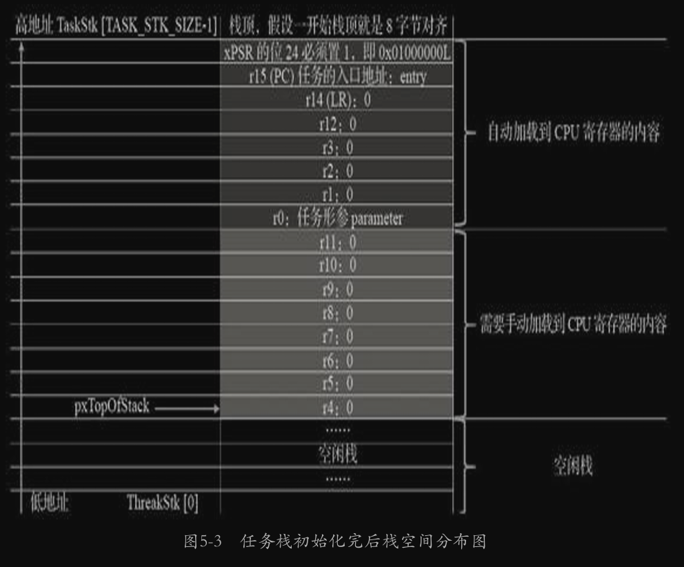

# 任务管理

## 任务

任务是竞争系统资源的最小运行单元。FreeRTOS 的任务可认为是一系列独立任务的集合。调度器会不断启动、停止每一个任务，所以每个任务都需要自己的栈空间来保存上次的运行状态。

### 任务控制块

栈空间类型定义：

```c
#define portSTACK_TYPE uint32_t 
typedef portSTACK_TYPE StackType_t;
```

控制块定义：

```c
typedef struct tskTaskControlBlock 			/* The old naming convention is used to prevent breaking kernel aware debuggers. */
{
	volatile StackType_t	*pxTopOfStack;	// 栈顶

	#if ( portUSING_MPU_WRAPPERS == 1 )
		xMPU_SETTINGS	xMPUSettings;		/*< The MPU settings are defined as part of the port layer.  THIS MUST BE THE SECOND MEMBER OF THE TCB STRUCT. */
	#endif

	ListItem_t			xStateListItem;	/*< The list that the state list item of a task is reference from denotes the state of that task (Ready, Blocked, Suspended ). */
	ListItem_t			xEventListItem;		/*< Used to reference a task from an event list. */
	UBaseType_t			uxPriority;			/*< The priority of the task.  0 is the lowest priority. */
	StackType_t			*pxStack;			/*< Points to the start of the stack. */
	char				pcTaskName[ configMAX_TASK_NAME_LEN ];/*< Descriptive name given to the task when created.  Facilitates debugging only. */ /*lint !e971 Unqualified char types are allowed for strings and single characters only. */
} tskTCB;
typedef tskTCB TCB_t;   // 为了兼容旧的调试器
```

### 任务创建

```c
TaskHandle_t xTaskCreateStatic(	TaskFunction_t pxTaskCode,
									const char * const pcName,		
									const uint32_t ulStackDepth,
									void * const pvParameters,
									UBaseType_t uxPriority,
									StackType_t * const puxStackBuffer,
									StaticTask_t * const pxTaskBuffer )    //用户提供的任务控制块

static void prvInitialiseNewTask( 	TaskFunction_t pxTaskCode,                //任务入口
									const char * const pcName,		      //名称
									const uint32_t ulStackDepth,           //任务栈深度
									void * const pvParameters,             //任务形参
									UBaseType_t uxPriority,                //任务优先级
									TaskHandle_t * const pxCreatedTask,    //任务句柄
									TCB_t *pxNewTCB,                       //任务栈起始地址
									const MemoryRegion_t * const xRegions )
```

```c
{
StackType_t *pxTopOfStack;
UBaseType_t x;

	/* Avoid dependency on memset() if it is not required. */
	#if( tskSET_NEW_STACKS_TO_KNOWN_VALUE == 1 )
	{
        // 将整个栈填充为值 0xA 辅助调试，检测堆栈使用量；检测栈溢出
		( void ) memset( pxNewTCB->pxStack, ( int ) tskSTACK_FILL_BYTE, ( size_t ) ulStackDepth * sizeof( StackType_t ) );
	}
	#endif /* tskSET_NEW_STACKS_TO_KNOWN_VALUE */

	/* Calculate the top of stack address.  This depends on whether the stack
	grows from high memory to low (as per the 80x86) or vice versa.
	portSTACK_GROWTH is used to make the result positive or negative as required
	by the port. */
	#if( portSTACK_GROWTH < 0 )
	{
		pxTopOfStack = &( pxNewTCB->pxStack[ ulStackDepth - ( uint32_t ) 1 ] );      //获取栈顶地址
		pxTopOfStack = ( StackType_t * ) ( ( ( portPOINTER_SIZE_TYPE ) pxTopOfStack ) & ( ~( ( portPOINTER_SIZE_TYPE ) portBYTE_ALIGNMENT_MASK ) ) );  // 对齐栈指针

		/* Check the alignment of the calculated top of stack is correct. */
		configASSERT( ( ( ( portPOINTER_SIZE_TYPE ) pxTopOfStack & ( portPOINTER_SIZE_TYPE ) portBYTE_ALIGNMENT_MASK ) == 0UL ) );
	}
	#endif /* portSTACK_GROWTH */

    
    
    
	/* Store the task name in the TCB. */
	if( pcName != NULL )
	{
		for( x = ( UBaseType_t ) 0; x < ( UBaseType_t ) configMAX_TASK_NAME_LEN; x++ )
		{
			pxNewTCB->pcTaskName[ x ] = pcName[ x ];

			/* Don't copy all configMAX_TASK_NAME_LEN if the string is shorter than
			configMAX_TASK_NAME_LEN characters just in case the memory after the
			string is not accessible (extremely unlikely). */
			if( pcName[ x ] == ( char ) 0x00 )
			{
				break;
			}
			else
			{
				mtCOVERAGE_TEST_MARKER();
			}
		}

		/* Ensure the name string is terminated in the case that the string length
		was greater or equal to configMAX_TASK_NAME_LEN. */
		pxNewTCB->pcTaskName[ configMAX_TASK_NAME_LEN - 1 ] = '\0';
	}
	else
	{
		/* The task has not been given a name, so just ensure there is a NULL
		terminator when it is read out. */
		pxNewTCB->pcTaskName[ 0 ] = 0x00;
	}
    

	/* This is used as an array index so must ensure it's not too large.  First
	remove the privilege bit if one is present. */
	if( uxPriority >= ( UBaseType_t ) configMAX_PRIORITIES )
	{
		uxPriority = ( UBaseType_t ) configMAX_PRIORITIES - ( UBaseType_t ) 1U;
	}
	else
	{
		mtCOVERAGE_TEST_MARKER();
	}

	pxNewTCB->uxPriority = uxPriority;
	#if ( configUSE_MUTEXES == 1 )
	{
		pxNewTCB->uxBasePriority = uxPriority;
		pxNewTCB->uxMutexesHeld = 0;
	}
	#endif /* configUSE_MUTEXES */

	vListInitialiseItem( &( pxNewTCB->xStateListItem ) );
	vListInitialiseItem( &( pxNewTCB->xEventListItem ) );

	/* Set the pxNewTCB as a link back from the ListItem_t.  This is so we can get
	back to	the containing TCB from a generic item in a list. */
	listSET_LIST_ITEM_OWNER( &( pxNewTCB->xStateListItem ), pxNewTCB );

	/* Event lists are always in priority order. */
	listSET_LIST_ITEM_VALUE( &( pxNewTCB->xEventListItem ), ( TickType_t ) configMAX_PRIORITIES - ( TickType_t ) uxPriority ); /*lint !e961 MISRA exception as the casts are only redundant for some ports. */
	listSET_LIST_ITEM_OWNER( &( pxNewTCB->xEventListItem ), pxNewTCB );、
     

	#if ( configUSE_TASK_NOTIFICATIONS == 1 )
	{
		pxNewTCB->ulNotifiedValue = 0;
		pxNewTCB->ucNotifyState = taskNOT_WAITING_NOTIFICATION;
	}
	#endif


	pxNewTCB->pxTopOfStack = pxPortInitialiseStack( pxTopOfStack, pxTaskCode, pvParameters );  //初始化任务栈

    
    //  让任务句柄指向任务控制块
	if( pxCreatedTask != NULL )
	{
		/* Pass the handle out in an anonymous way.  The handle can be used to
		change the created task's priority, delete the created task, etc.*/
		*pxCreatedTask = ( TaskHandle_t ) pxNewTCB;
	}
	else
	{
		mtCOVERAGE_TEST_MARKER();
	}
}
```


> 在Cortex M3（Cortex-M4或Cortex-M7）内核的单片机中，因为总线宽度是32位 的，通常只要栈保持4字节对齐即可，那么此处为何要为8字节？难道 有哪些操作是64位的？确实有，那就是浮点运算，所以要8字节对齐 （但是目前还没有涉及浮点运算，此处的设置只是为了后续能够兼容 浮点运行）。如果栈顶指针是8字节对齐的，在进行向下8字节对齐时，指针不会移动，如果不是8字节对齐的，在做向下8字节对齐时， 就会空出几个字节，比如当pxTopOfStack是33时，明显不能被8整除， 进行向下8字节对齐就是32，那么就会空出一个字节不使用。


```c
StackType_t *pxPortInitialiseStack( StackType_t *pxTopOfStack, TaskFunction_t pxCode, void *pvParameters ) PRIVILEGED_FUNCTION;

StackType_t *pxPortInitialiseStack( StackType_t *pxTopOfStack, TaskFunction_t pxCode, void *pvParameters )
{
	/* Simulate the stack frame as it would be created by a context switch
	interrupt. */

	/* Offset added to account for the way the MCU uses the stack on entry/exit
	of interrupts, and to ensure alignment. */
	pxTopOfStack--;              //调整栈顶以满足对齐和中断行为要求

	*pxTopOfStack = portINITIAL_XPSR;	/* xPSR 程序状态寄存器，记录了当前运行模式（Thumb 模式）、中断使能位等。 */
	pxTopOfStack--;
	*pxTopOfStack = ( ( StackType_t ) pxCode ) & portSTART_ADDRESS_MASK;	/* PC  将任务函数入口地址写入栈中，作为 PC 的值。*/
	pxTopOfStack--;
	*pxTopOfStack = ( StackType_t ) portTASK_RETURN_ADDRESS;	/* LR 如果任务意外退出，就会跳转到这个错误处理函数 */

	/* Save code space by skipping register initialisation. */
	pxTopOfStack -= 5;	/* R12, R3, R2 and R1. */
	*pxTopOfStack = ( StackType_t ) pvParameters;	/* R0 */

	/* A save method is being used that requires each task to maintain its
	own exec return value. */
	pxTopOfStack--;
	*pxTopOfStack = portINITIAL_EXC_RETURN;

	pxTopOfStack -= 8;	/* R11, R10, R9, R8, R7, R6, R5 and R4. */

	return pxTopOfStack;
}
```

`PRIVILEGED_FUNCTION`

- 这是一个宏，通常定义为 `__attribute__((privileged))`（GCC 编译器扩展）或等效的关键字。
- 表示该函数必须在 **特权模式下运行**（Privileged Mode），适用于 ARM Cortex-M 系列处理器中的安全机制（如 TrustZone 或 MPU 配置）。
- 主要用于确保栈操作和系统级操作的安全性。




### 任务状态

* Ready： 就绪
* Running： 运行
* Blocked  ：  任务正在等待某个时序或者外部中断
* Suspended：使用 `vTaskSuspend()`挂起任务，`vTaskResume()`  恢复任务。

### 任务状态迁移：


使用`vTaskSuspend()` 挂起任务


### 就绪列表

任务创建完成后，将任务添加到就绪列表中，表示任务已经就绪。

```c
PRIVILEGED_DATA static List_t pxReadyTasksLists[ configMAX_PRIORITIES ];/*< Prioritised ready tasks. */
```

就序列表是一个 List数组，数组每一个序号为优先级，通过将任务控制块插入就序列表 来实现

### 任务调度器

基于优先级的全抢占式调度。

不可中断区域：

* 中断处理函数
* 调度器上锁部分
* 禁止中断的代码区域

FreeRTOS 使用两种方法寻找最高优先级的任务：

* 从链表中从高优先级向下查找
* **计算前导零指令CLZ**  （STM32使用）

相同优先级的任务采取时间片轮转的方式进行调度。

调度原则：一但 **任务状态**  发生改变，并且当前任务的优先级小于队列中任务最高优先级的时候，立即进行任务切换。

```c
vTaskStartScheduler()
```

##### 启动过程：

`vTaskStartScheduler()` 调用  `xPortStartScheduler()`，

`static void prvPortStartFirstTask( void )`

`void vPortSVCHandler( void )`

#### 上下文切换：

上下文切换核心为：触发`pendSV` 异常

- 时间片耗尽
- 任务阻塞
- 中断
- 任务优先级变化

最终都将触发 `pendSV` 异常

`xPortPendSVHandler`


### 任务优先级

任务优先级常量越大，内核花销越多，优先级号越小优先级越低，调度器总是保证选择具有最高优先级的任务，如果当前优先级不止同一个任务，则让任务轮流执行，Freertos 通过运行 心跳中断，来实现任务时间片切换。


还可以利用阻塞态来实现任务切换：

```c
void vTaskDelay( portTickType xTicksToDelay ); 
void vTaskDelayUntil( portTickType * pxPreviousWakeTime, portTickType xTimeIncrement );   //第一个参数为自己创建的变量，用于记录上一次离开阻塞点时刻
```


### 空闲任务与空闲任务钩子函数

空闲任务负责回收内核资源。如果空闲任务一直运行在钩子函数中，则无法进行回收工作。


## 常用的任务函数

### `xTaskCreate()`

```c
BaseType_t xTaskCreate(	TaskFunction_t pxTaskCode,                                 //任务函数
							const char * const pcName,		                    //名字
							const configSTACK_DEPTH_TYPE usStackDepth,           //栈空间大小
							void * const pvParameters,                           //参数传递
							UBaseType_t uxPriority,                              //优先级
							TaskHandle_t * const pxCreatedTask )                 //句柄
```


### `vTaskPrioritySet()` 

任务可以通过传入NULL值来修改自己的优先级

```c
void vTaskPrioritySet( xTaskHandle pxTask, unsigned portBASE_TYPE uxNewPriority ); 
```


### `vTaskSuspend()`

```c
void vTaskSuspend( *TaskHandle_t* *xTaskToSuspend* );

//参数 xTaskToSuspend 指定挂起任务的句柄
// 使用 NULL 来表示挂起当前任务
```

```c
taskENTER_CRITICAL();

#define taskENTER_CRITICAL()		portENTER_CRITICAL()

void portENTER_CRITICAL( void );
#pragma aux portENTER_CRITICAL = "pushf" \
                                 "cli";
```

1. `#pragma aux portENTER_CRITICAL = ...`：这行代码似乎是一个特定于编译器的编译指令或 pragma。`#pragma aux` 指令不是标准的 C 或 C++，用于向编译器提供有关 `portENTER_CRITICAL` 函数的汇编实现的附加信息。
2. `"pushf"`：这个指令将 FLAGS 寄存器的内容推送到堆栈上。FLAGS 寄存器包含了代表 CPU 状态的各种标志，比如进位标志、零标志和中断标志。
3. `"cli"`：这个指令清除 FLAGS 寄存器中的中断标志。当中断标志被清除（设置为 0）时，它禁用了中断。这实际上禁用了硬件中断，防止 CPU 响应外部中断请求。

### `vTaskSuspendAll()`

将所有任务挂起，直接将调度器锁定，并且可以嵌套。

### `vTaskResume()`

只需要调用一次，即可恢复被多次挂起 的任务，并让其重新进入就绪态。

### `xTaskResumeFromISR()`

专门用在中断服务程序中。

### `xTaskResumeAll()`

恢复调度器。

### `vTaskDelete()`

用于删除另一个任务或者删除自己。

### `vTaskDelay(const TickType_t xTixksToDelay )`

用于阻塞延时，调用该函数后，任务进入阻塞状态，让出cpu资源，延时单位为系统节拍周期。

延时时间是从调用`vTaskDelay()` 后开始计算，是相对性延时，不保证解除阻塞后函数能够立马执行（因为有其他中断或任务的影响）

```c
#if ( INCLUDE_vTaskDelay == 1 )

	void vTaskDelay( const TickType_t xTicksToDelay )
	{
	BaseType_t xAlreadyYielded = pdFALSE;

		/* A delay time of zero just forces a reschedule. */
		if( xTicksToDelay > ( TickType_t ) 0U )
		{
			configASSERT( uxSchedulerSuspended == 0 );
			vTaskSuspendAll();   //挂起所有任务
			{
				traceTASK_DELAY();

				/* A task that is removed from the event list while the
				scheduler is suspended will not get placed in the ready
				list or removed from the blocked list until the scheduler
				is resumed.

				This task cannot be in an event list as it is the currently
				executing task. */
				prvAddCurrentTaskToDelayedList( xTicksToDelay, pdFALSE );
			}
			xAlreadyYielded = xTaskResumeAll();
		}
		else
		{
			mtCOVERAGE_TEST_MARKER();
		}

		/* Force a reschedule if xTaskResumeAll has not already done so, we may
		have put ourselves to sleep. */
		if( xAlreadyYielded == pdFALSE )
		{
			portYIELD_WITHIN_API();
		}
		else
		{
			mtCOVERAGE_TEST_MARKER();
		}
	}

#endif /* INCLUDE_vTaskDelay */
```


### `vTaskDelayUntil(TickType_t * const pxPreviousWakeTime, const TickType_t xTimeIncrement)`

绝对延时函数，用于较为精确的周期运行任务，任务从上一次运行到下一次运行的时间间隔是绝对的。接受两个参数，当前系统绝对时间和应延时的时间间隔。

该函数会计算函数合法，应保证周期性延时时间大于任务主题代码执行时间。

```c
void vTaskDelayUntil( TickType_t * const pxPreviousWakeTime, const TickType_t xTimeIncrement )
```


## 任务设计要点

要注意 **任务运行的上下文环境**、**任务的执行时间合理设计**

* 中断服务函数，应只标记事件然后通知任务去处理 ；快进快出

* 空闲任务

  > 当调用 `vTaskStartScheduler()` 时，调度器自动创建一个短循环空闲任务，**用户可以通过空闲任务钩子在空闲任务中完成一些额外功能**，空闲任务还承担删除任务，实现资源回收的功能。***不允许阻塞***
  >
  > * 永不挂起
  > * 不使用死循环

* 任务执行时间

必须考虑任务和响应时间的匹配，处理事件更短的任务优先级更高。