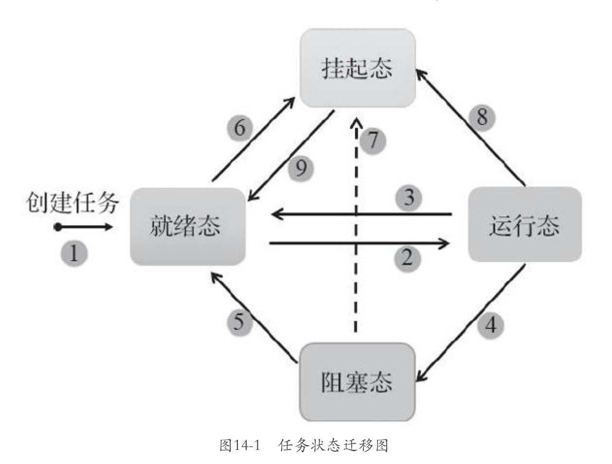

# 任务管理

## 任务

任务是竞争系统资源的最小运行单元。FreeRTOS 的任务可认为我是一系列独立任务的集合。调度器会不断启动、停止每一个任务，所以每个任务都需要自己的栈空间来保存上次的运行状态。

## 任务调度器

基于优先级的全抢占式调度。

不可中断区域：

* 中断处理函数
* 调度器上锁部分
* 禁止中断的代码区域

FreeRTOS 使用两种方法寻找最高优先级的任务：

* 从链表中从高优先级向下查找
* **计算前导零指令CLZ**  （STM32使用）

相同优先级的任务采取时间片轮转的方式进行调度。

调度原则：一但 **任务状态**  发生改变，并且当前任务的优先级小于队列中任务最高优先级的时候，立即进行任务切换。

## 任务状态

* Ready
* Running
* Blocked  ：  任务正在等待某个时序或者外部中断
* Suspended：使用 `vTaskSuspend()`挂起任务，`vTaskResume()`  恢复任务。

## 任务状态迁移：



## 常用的任务函数

### `vTaskSuspend()`

```c
void vTaskSuspend( *TaskHandle_t* *xTaskToSuspend* );

//参数 xTaskToSuspend 指定挂起任务的句柄
// 使用 NULL 来表示挂起当前任务
```

```c
taskENTER_CRITICAL();

#define taskENTER_CRITICAL()		portENTER_CRITICAL()

void portENTER_CRITICAL( void );
#pragma aux portENTER_CRITICAL = "pushf" \
                                 "cli";
```

1. `#pragma aux portENTER_CRITICAL = ...`：这行代码似乎是一个特定于编译器的编译指令或 pragma。`#pragma aux` 指令不是标准的 C 或 C++，用于向编译器提供有关 `portENTER_CRITICAL` 函数的汇编实现的附加信息。
2. `"pushf"`：这个指令将 FLAGS 寄存器的内容推送到堆栈上。FLAGS 寄存器包含了代表 CPU 状态的各种标志，比如进位标志、零标志和中断标志。
3. `"cli"`：这个指令清除 FLAGS 寄存器中的中断标志。当中断标志被清除（设置为 0）时，它禁用了中断。这实际上禁用了硬件中断，防止 CPU 响应外部中断请求。

### `vTaskSuspendAll()`

将所有任务挂起，直接将调度器锁定，并且可以嵌套。

### `vTaskResume()`

只需要调用一次，即可恢复被多次挂起 的任务，并让其重新进入就绪态。

### `xTaskResumeFromISR()`

专门用在中断服务程序中。

### `xTaskResumeAll()`

恢复调度器。

### `vTaskDelete()`

用于删除另一个任务或者删除自己。

### `vTaskDelay(const TickType_t xTixksToDelay )`

用于阻塞延时，调用该函数后，任务进入阻塞状态，让出cpu资源，延时单位为系统节拍周期。

延时时间是从调用`vTaskDelay()` 后开始计算，是相对性延时，不保证解除阻塞后函数能够立马执行（因为有其他中断或任务的影响）

```c
#if ( INCLUDE_vTaskDelay == 1 )

	void vTaskDelay( const TickType_t xTicksToDelay )
	{
	BaseType_t xAlreadyYielded = pdFALSE;

		/* A delay time of zero just forces a reschedule. */
		if( xTicksToDelay > ( TickType_t ) 0U )
		{
			configASSERT( uxSchedulerSuspended == 0 );
			vTaskSuspendAll();   //挂起所有任务
			{
				traceTASK_DELAY();

				/* A task that is removed from the event list while the
				scheduler is suspended will not get placed in the ready
				list or removed from the blocked list until the scheduler
				is resumed.

				This task cannot be in an event list as it is the currently
				executing task. */
				prvAddCurrentTaskToDelayedList( xTicksToDelay, pdFALSE );
			}
			xAlreadyYielded = xTaskResumeAll();
		}
		else
		{
			mtCOVERAGE_TEST_MARKER();
		}

		/* Force a reschedule if xTaskResumeAll has not already done so, we may
		have put ourselves to sleep. */
		if( xAlreadyYielded == pdFALSE )
		{
			portYIELD_WITHIN_API();
		}
		else
		{
			mtCOVERAGE_TEST_MARKER();
		}
	}

#endif /* INCLUDE_vTaskDelay */
```


### `vTaskDelayUntil(TickType_t * const pxPreviousWakeTime, const TickType_t xTimeIncrement)`

绝对延时函数，用于较为精确的周期运行任务，任务从上一次运行到下一次运行的时间间隔是绝对的。接受两个参数，当前系统绝对时间和应延时的时间间隔。

该函数会计算函数合法，应保证周期性延时时间大于任务主题代码执行时间。

```c
void vTaskDelayUntil( TickType_t * const pxPreviousWakeTime, const TickType_t xTimeIncrement )
	{
	TickType_t xTimeToWake;
	BaseType_t xAlreadyYielded, xShouldDelay = pdFALSE;

		configASSERT( pxPreviousWakeTime );
		configASSERT( ( xTimeIncrement > 0U ) );
		configASSERT( uxSchedulerSuspended == 0 );

		vTaskSuspendAll();
		{
			/* Minor optimisation.  The tick count cannot change in this
			block. */
			const TickType_t xConstTickCount = xTickCount;

			/* Generate the tick time at which the task wants to wake. */
			xTimeToWake = *pxPreviousWakeTime + xTimeIncrement;

			if( xConstTickCount < *pxPreviousWakeTime )
			{
				/* The tick count has overflowed since this function was
				lasted called.  In this case the only time we should ever
				actually delay is if the wake time has also	overflowed,
				and the wake time is greater than the tick time.  When this
				is the case it is as if neither time had overflowed. */
				if( ( xTimeToWake < *pxPreviousWakeTime ) && ( xTimeToWake > xConstTickCount ) )
				{
					xShouldDelay = pdTRUE;
				}
				else
				{
					mtCOVERAGE_TEST_MARKER();
				}
			}
			else
			{
				/* The tick time has not overflowed.  In this case we will
				delay if either the wake time has overflowed, and/or the
				tick time is less than the wake time. */
				if( ( xTimeToWake < *pxPreviousWakeTime ) || ( xTimeToWake > xConstTickCount ) )
				{
					xShouldDelay = pdTRUE;
				}
				else
				{
					mtCOVERAGE_TEST_MARKER();
				}
			}

			/* Update the wake time ready for the next call. */
			*pxPreviousWakeTime = xTimeToWake;

			if( xShouldDelay != pdFALSE )
			{
				traceTASK_DELAY_UNTIL( xTimeToWake );

				/* prvAddCurrentTaskToDelayedList() needs the block time, not
				the time to wake, so subtract the current tick count. */
				prvAddCurrentTaskToDelayedList( xTimeToWake - xConstTickCount, pdFALSE );
			}
			else
			{
				mtCOVERAGE_TEST_MARKER();
			}
		}
		xAlreadyYielded = xTaskResumeAll();

		/* Force a reschedule if xTaskResumeAll has not already done so, we may
		have put ourselves to sleep. */
		if( xAlreadyYielded == pdFALSE )
		{
			portYIELD_WITHIN_API();
		}
		else
		{
			mtCOVERAGE_TEST_MARKER();
		}
	}
```


## 任务设计要点

要注意 **任务运行的上下文环境**、**任务的执行时间合理设计**

* 中断服务函数，应只标记事件然后通知任务去处理 ；快进快出

* 空闲任务

  > 当调用 `vTaskStartScheduler()` 时，调度器自动创建一个短循环空闲任务，**用户可以通过空闲任务钩子在空闲任务中完成一些额外功能**，空闲任务还承担删除任务，实现资源回收的功能。***不允许阻塞***
  >
  > * 永不挂起
  > * 不使用死循环

* 任务执行时间

必须考虑任务和响应时间的匹配，处理事件更短的任务优先级更高。