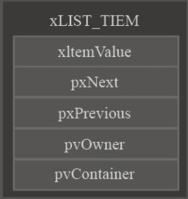

# FreeRTOS中链表的实现



```c
struct xLIST;
struct xLIST_ITEM
{
	listFIRST_LIST_ITEM_INTEGRITY_CHECK_VALUE			/*< Set to a known value if configUSE_LIST_DATA_INTEGRITY_CHECK_BYTES is set to 1. */
	configLIST_VOLATILE TickType_t xItemValue;			/*< The value being listed.  In most cases this is used to sort the list in descending order. */
	struct xLIST_ITEM * configLIST_VOLATILE pxNext;		/*< Pointer to the next ListItem_t in the list. */
	struct xLIST_ITEM * configLIST_VOLATILE pxPrevious;	/*< Pointer to the previous ListItem_t in the list. */
	void * pvOwner;										/*< Pointer to the object (normally a TCB) that contains the list item.  There is therefore a two way link between the object containing the list item and the list item itself. */
	struct xLIST * configLIST_VOLATILE pxContainer;		/*< Pointer to the list in which this list item is placed (if any). */
	listSECOND_LIST_ITEM_INTEGRITY_CHECK_VALUE			/*< Set to a known value if configUSE_LIST_DATA_INTEGRITY_CHECK_BYTES is set to 1. */
};
typedef struct xLIST_ITEM ListItem_t;					/* For some reason lint wants this as two separate definitions. */
```

根节点：

```c
typedef struct xLIST
{
	listFIRST_LIST_INTEGRITY_CHECK_VALUE				/*< Set to a known value if configUSE_LIST_DATA_INTEGRITY_CHECK_BYTES is set to 1. */
	volatile UBaseType_t uxNumberOfItems;
	ListItem_t * configLIST_VOLATILE pxIndex;			/*< Used to walk through the list.  Points to the last item returned by a call to listGET_OWNER_OF_NEXT_ENTRY (). */
	MiniListItem_t xListEnd;							/*< List item that contains the maximum possible item value meaning it is always at the end of the list and is therefore used as a marker. */
	listSECOND_LIST_INTEGRITY_CHECK_VALUE				/*< Set to a known value if configUSE_LIST_DATA_INTEGRITY_CHECK_BYTES is set to 1. */
} List_t;
```


插入功能函数：

1.  `vListInsertEnd`
2. `vListInsert`
3. `uxListRemove`

