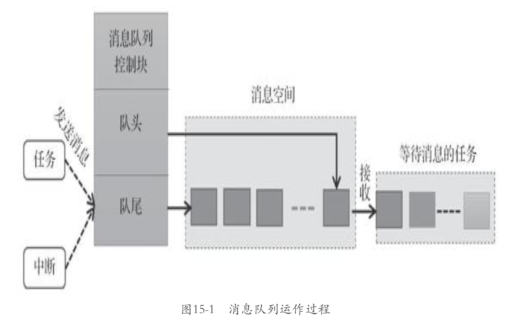
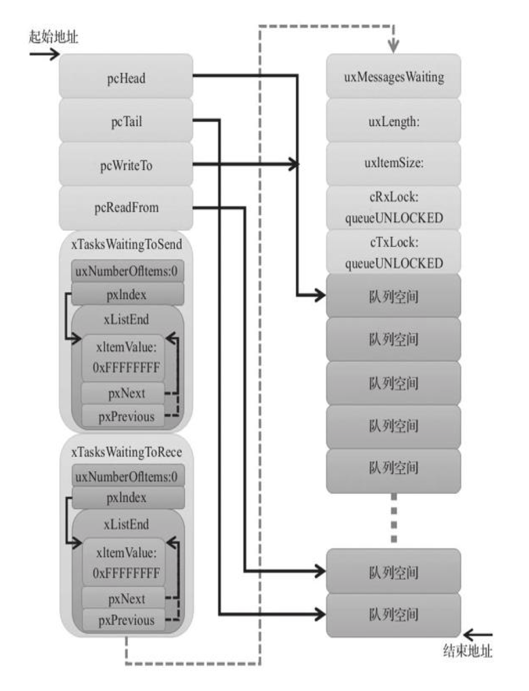

# 消息队列

一种用于任务间异步通信的数据结构，实现了任务接受来自其他任务或中断的不定长消息。当队列为空，消息读取函数被阻塞；当队列不为空，该任务会被唤醒。

支持 FIFO 和 LIFO

## 消息队列的运作机制

1. 分配内存 = 消息队列控制块 + 单个消息空间大小 * 消息队列长度

接着初始化消息队列。

每个消息空间可以存放不大于消息大小的任意数据。如果队列满了，将会根据用户阻塞超时时间进行阻塞，待其他任务读取队列后，自动转换为就绪态。

***紧急消息发送的位置是消息队列的队头而不是队尾***

任务读取队列的时候，可以指定阻塞超时时间（如果在这段时间队列为空，函数将继续等待）



## 消息队列的阻塞机制

为了保护每个任务对队列进行读写的过程，必须有阻塞机制，防止其他函数干扰。


## 常用消息队列函数

```c
typedef struct QueueDefinition
{
	int8_t *pcHead;					/*< Points to the beginning of the queue storage area. */
	int8_t *pcTail;					/*< Points to the byte at the end of the queue storage area.  Once more byte is allocated than necessary to store the queue items, this is used as a marker. */
	int8_t *pcWriteTo;				/*< Points to the free next place in the storage area. */

	union							/* Use of a union is an exception to the coding standard to ensure two mutually exclusive structure members don't appear simultaneously (wasting RAM). */
	{
		int8_t *pcReadFrom;			/*< Points to the last place that a queued item was read from when the structure is used as a queue. */
		UBaseType_t uxRecursiveCallCount;/*< Maintains a count of the number of times a recursive mutex has been recursively 'taken' when the structure is used as a mutex. */
	} u;

	List_t xTasksWaitingToSend;		/*< List of tasks that are blocked waiting to post onto this queue.  Stored in priority order. */
	List_t xTasksWaitingToReceive;	/*< List of tasks that are blocked waiting to read from this queue.  Stored in priority order. */

	volatile UBaseType_t uxMessagesWaiting;/*< The number of items currently in the queue. */
	UBaseType_t uxLength;			/*< The length of the queue defined as the number of items it will hold, not the number of bytes. */
	UBaseType_t uxItemSize;			/*< The size of each items that the queue will hold. */

	volatile int8_t cRxLock;		/*< Stores the number of items received from the queue (removed from the queue) while the queue was locked.  Set to queueUNLOCKED when the queue is not locked. */
	volatile int8_t cTxLock;		/*< Stores the number of items transmitted to the queue (added to the queue) while the queue was locked.  Set to queueUNLOCKED when the queue is not locked. */

	#if( ( configSUPPORT_STATIC_ALLOCATION == 1 ) && ( configSUPPORT_DYNAMIC_ALLOCATION == 1 ) )
		uint8_t ucStaticallyAllocated;	/*< Set to pdTRUE if the memory used by the queue was statically allocated to ensure no attempt is made to free the memory. */
	#endif

	#if ( configUSE_QUEUE_SETS == 1 )
		struct QueueDefinition *pxQueueSetContainer;
	#endif

	#if ( configUSE_TRACE_FACILITY == 1 )
		UBaseType_t uxQueueNumber;
		uint8_t ucQueueType;
	#endif

} xQUEUE;
```


## 消息队列动态创建函数

```c
xQueueCreate()
```

用于创建一个新的队列并返回可用于访问这个队列的队列句柄

```c
QueueHandle_t xQueueGenericCreate( const UBaseType_t uxQueueLength, const UBaseType_t uxItemSize, const uint8_t ucQueueType )
	{
	Queue_t *pxNewQueue;
	size_t xQueueSizeInBytes;
	uint8_t *pucQueueStorage;

		configASSERT( uxQueueLength > ( UBaseType_t ) 0 );

		if( uxItemSize == ( UBaseType_t ) 0 )
		{
			/* There is not going to be a queue storage area. */
			xQueueSizeInBytes = ( size_t ) 0;
		}
		else
		{
			/* Allocate enough space to hold the maximum number of items that
			can be in the queue at any time. */
			xQueueSizeInBytes = ( size_t ) ( uxQueueLength * uxItemSize ); /*lint !e961 MISRA exception as the casts are only redundant for some ports. */
		}

		pxNewQueue = ( Queue_t * ) pvPortMalloc( sizeof( Queue_t ) + xQueueSizeInBytes );

		if( pxNewQueue != NULL )
		{
			/* Jump past the queue structure to find the location of the queue
			storage area. */
			pucQueueStorage = ( ( uint8_t * ) pxNewQueue ) + sizeof( Queue_t );

			#if( configSUPPORT_STATIC_ALLOCATION == 1 )
			{
				/* Queues can be created either statically or dynamically, so
				note this task was created dynamically in case it is later
				deleted. */
				pxNewQueue->ucStaticallyAllocated = pdFALSE;
			}
			#endif /* configSUPPORT_STATIC_ALLOCATION */

			prvInitialiseNewQueue( uxQueueLength, uxItemSize, pucQueueStorage, ucQueueType, pxNewQueue );
		}

		return pxNewQueue;
	}
```



### 创建消息队列：

* 定义句柄
* 创建队列

```c
QueueHandle_t Test_Queue = NULL;
#define QUEUE_LEN     4
#define QUEUE_SIZE    4

BaseType_t xReturn = pdPASS;

taskENTER_CRITICAL();

Test_Queue = XQueueCreate((UBaseType_t) QUEUE_LEN,(UBaseType_t) QUEUE_SIZE)
   ;
if(Test_Queue!=NULL)
    printf("Success!");
taskEXIT_CRITICAL(); 
```


### 消息队列静态创建函数

```c
xQueueCreateStatic()
```

该函数使用静态内存分配

```c
QueueHandle_t Test_Queue = NULL;
#define QUEUE_LEN     4
#define ITEM_SIZE    sizeof(uint32_t)

static StaticQueue_t xStaticQueue;
uint8_t ucQueueStorageArea[QUEUE_LEN * ITEM_SIZE];
void vATask(void *pvParameters)
{
    QueueHandle_t xQueue;
    xQueue = xQueueCreateStatic(
   		QUEUE_LEN,
        ITEM_SIZE,
        ucQueueStorageArea,
        &xStaticQueue
    	);
}
```


### 消息队列删除函数

```c
vQueueHandle_t(QueueHandle_t xQueue );
```


## 向消息队列发送消息

### `xQueueSend()`

向队列尾部发送队列消息，消息以复制的形式入队。

### `xQueueSendToBack()`

### `xQueueSendToFront()`

向队首发送队列消息，消息以复制的形式入队。

### `xQueueSendFromISR()`

中断函数中调用，用于向队列尾部发送队列消息。

### `xQueueSendToBackFromISR()`

### `xQueueSendToFrontFromISR()`


### 通用消息队列发送函数`xQueueGenericSend()`

### 消息队列发送函数 `xQueueGenericSendFromISR()`

该函数没有阻塞机制只能用于在中断中发送消息。


### 从消息队列读取消息函数

### `xQueueReceive(xQueue, pvBuffer, xTicksToWait)`

从队列中接收消息并把消息从中删除，需要提供一个足够大的缓冲区。

### `xQueuePeek()`

从队列中接收消息并把消息**并不删除消息**，需要提供一个足够大的缓冲区。

### `xQueueReceiveFromISR()`

中断版本

### `xQueuePeekFromISR()`

### `xQueueGenericReceive()`


### 注意事项

* 先创建消息队列，再根据队列句柄进行操作
* 复制方式传递数据
* 队列不属于任何一个任务