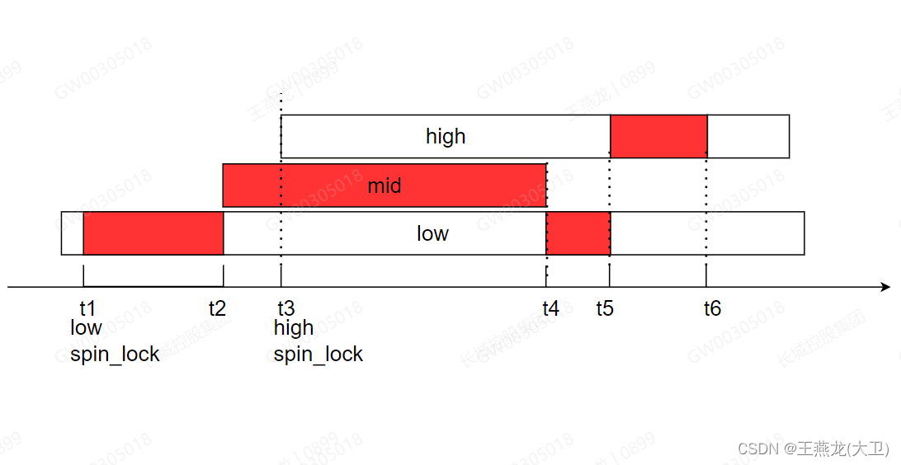
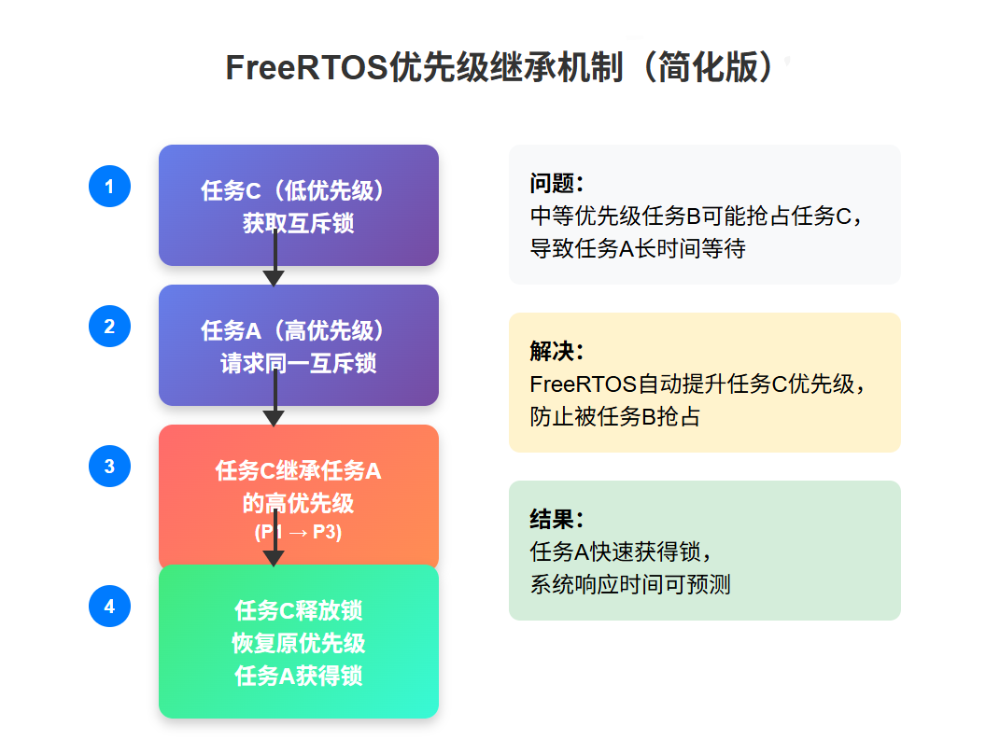

# 调度

[FreeRTOS 调度（单核、AMP 和 SMP） - FreeRTOS™](https://www.freertos.org/zh-cn-cmn-s/Documentation/02-Kernel/02-Kernel-features/01-Tasks-and-co-routines/04-Task-scheduling)

适用于 单核和非对称多核

### 默认调度策略：

使用固定优先级的抢占式 调度策略，对[同等优先级的任务](https://www.freertos.org/Documentation/02-Kernel/02-Kernel-features/01-Tasks-and-co-routines/03-Task-priorities)执行时间切片轮询调度。

抢占式： 高优先级任务会抢占低优先级任务



##### 优先级翻转

发生原因： 

1. 低优先级任务持有某互斥锁
2. 中优先级任务唤醒抢占cpu
3. 高优先级无法拿锁，无法抢占cpu

导致高优先级任务反而无法正常运行

##### 优先级继承

任务使用互斥锁，会提高当前任务的继承优先级，直到释放持有的所有互斥锁，多持有一个锁，继承优先级会提高，直到释放。



##### 优先级天花板：

```c
/* 定义天花板优先级并创建互斥量 */
#define CEILING_PRIORITY (configMAX_PRIORITIES - 1)
SemaphoreHandle_t xMutex;

/* 创建普通互斥量 */
xMutex = xSemaphoreCreateMutex();

/* 使用前先将优先级提升到天花板优先级 */
UBaseType_t uxOriginalPriority = uxTaskPriorityGet(NULL);
vTaskPrioritySet(NULL, CEILING_PRIORITY);

/* 使用互斥量进行资源保护 */
if (xSemaphoreTake(xMutex, portMAX_DELAY) == pdTRUE) {
    /* 临界区代码 */
    xSemaphoreGive(xMutex);
}

/* 恢复原始优先级 */
vTaskPrioritySet(NULL, uxOriginalPriority);
```


##### 关闭中断

```c
/* 方法1：关闭中断 */
taskENTER_CRITICAL();
/* 临界区代码（必须非常短） */
taskEXIT_CRITICAL();

/* 方法2：挂起调度器 */
vTaskSuspendAll();
/* 临界区代码 */
xTaskResumeAll();
```

