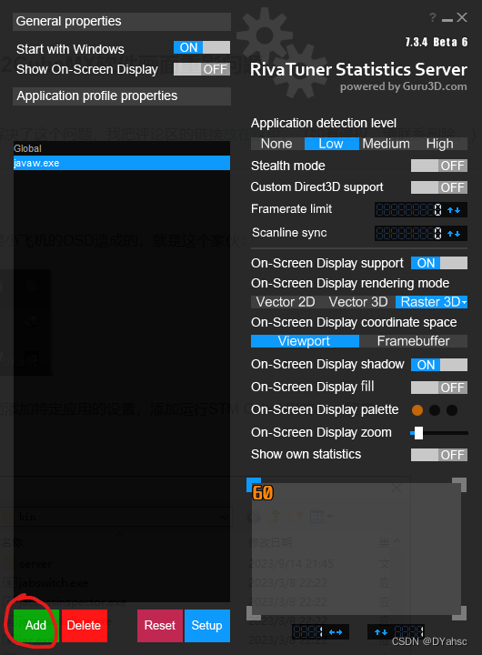

总的问题是微星小飞机的[OSD](https://so.csdn.net/so/search?q=OSD&spm=1001.2101.3001.7020)造成的，就是这个家伙：

然后可以在里面添加特定应用的设置，添加运行STM CubeMX的Java程序：

一般都在安装路径的这个地方：

..\STMicroelectronics\[STM32Cube](https://so.csdn.net/so/search?q=STM32Cube&spm=1001.2101.3001.7020)\STM32CubeMX\jre\bin

之后把这个关了。

**它就不会再抽风了**（好诶！！！）