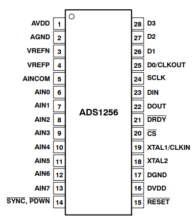
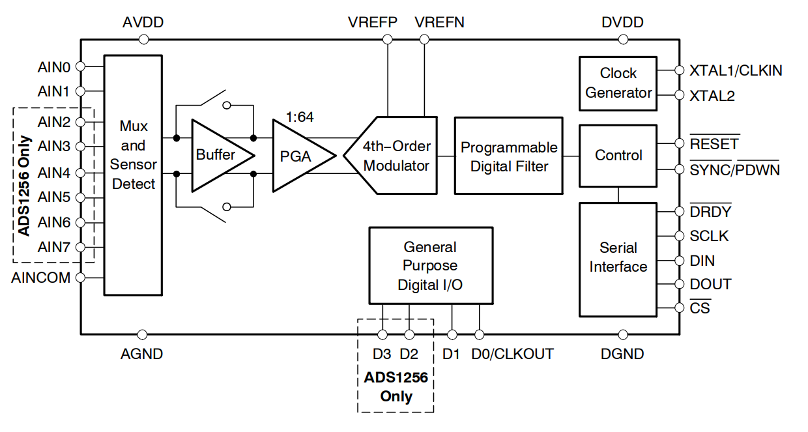
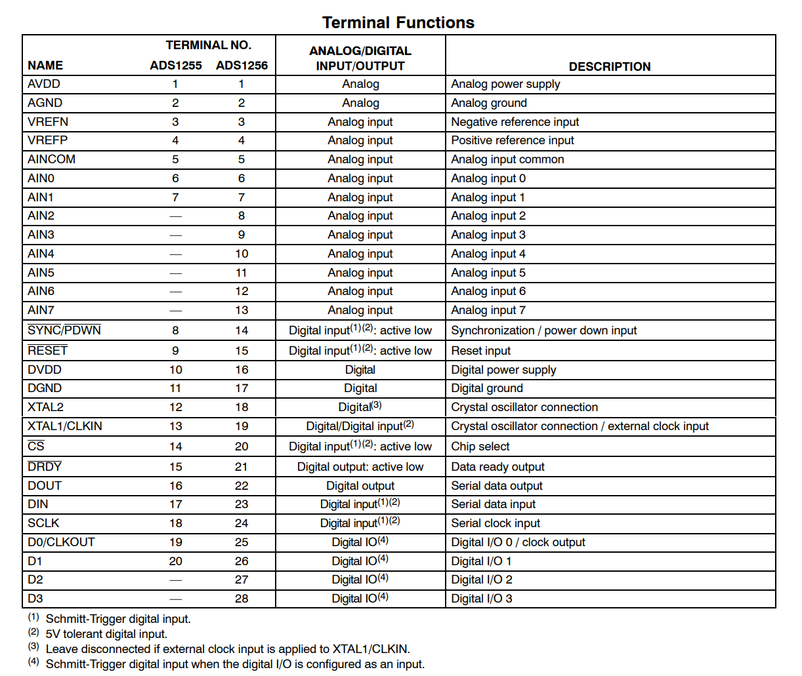
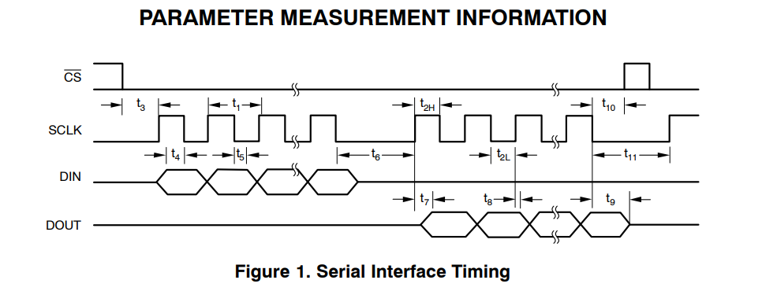
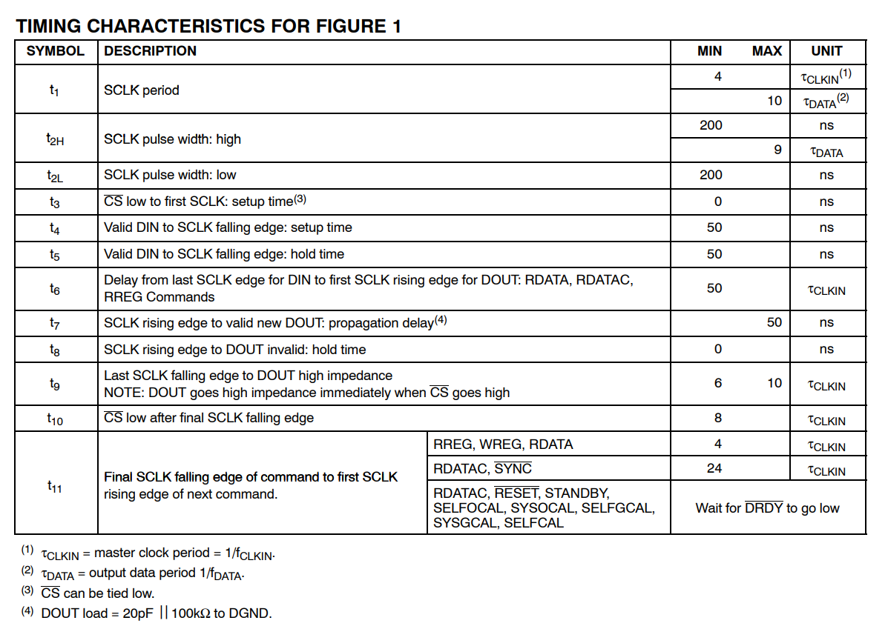
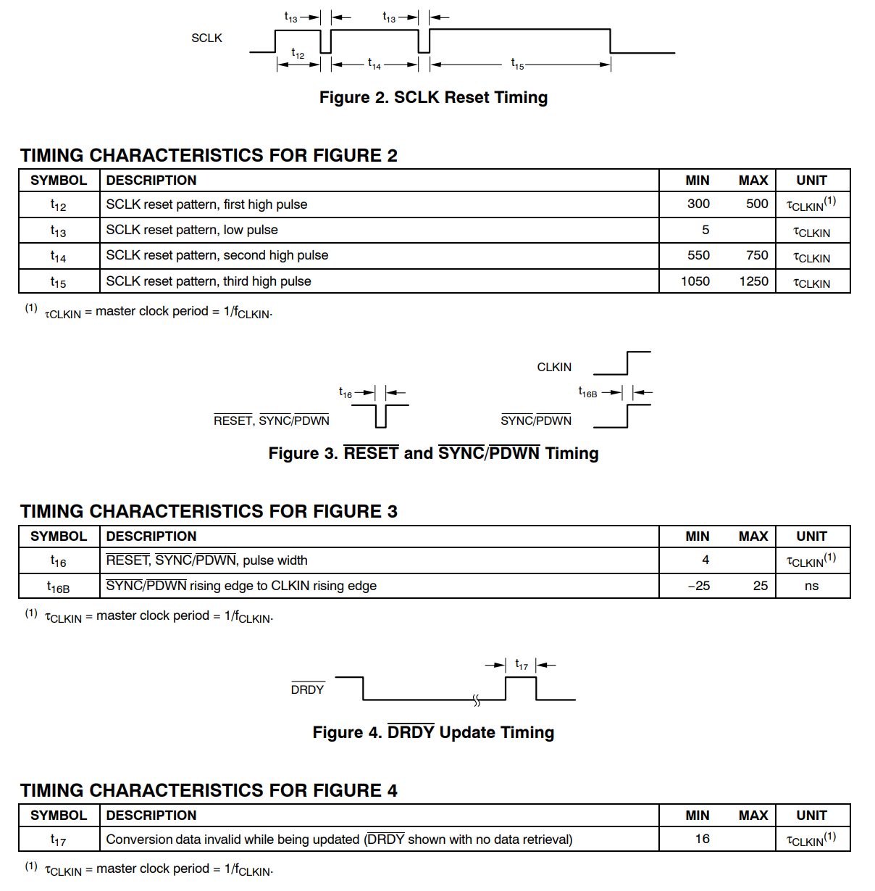
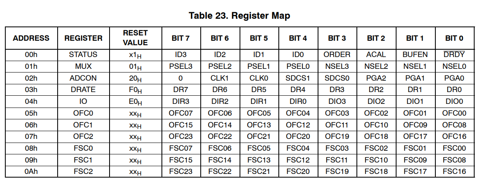
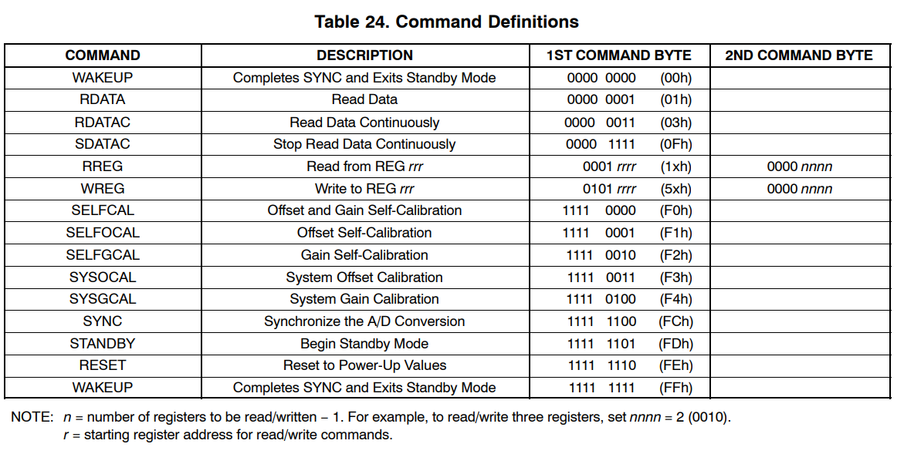
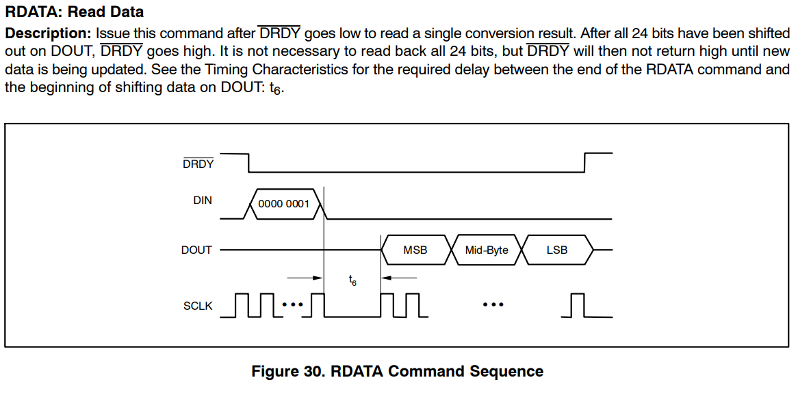
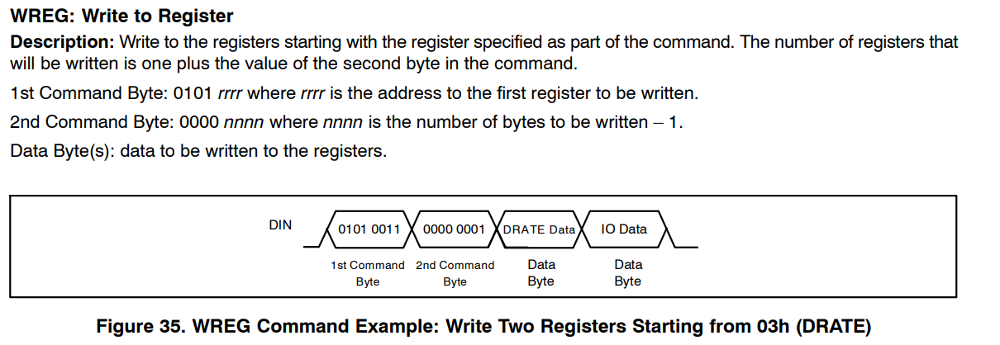

# Texas  Instruments  ADS1256 模数转换芯片

## 1. 芯片定义





### 1.1     Feature：

* 24Bits
* Up to 23 Bits and PGA  Settings
* Data Output Rates to 30kSPS
* Analog Supply : **5V**




### 1.2 Parameter  Measurement  Information







## 2.    Driver编写

本文使用 晶振 **7.68MHz** 进行 程序编写

经过计算：
$$
\tau_{CLKIN} = \frac{1}f_{CLKIN} = 1.302\times 10^{-7}s = 0.13\mu s = 130ns
$$

The setting time 指的是 从模拟输入端到数字滤波器的传播时延

```c
 * DATA RATE		SETTLING TIME(ms)        
 * 30 000			0.21                     
 * 2000				0.68
 * 1000				1.18
 * 500				2.18
 * 100				10.18
```

由上面的图表可知：

* $t_3 \geq 0$ 即可，故片选信号 CS 拉低后可以立即传输数据。
* $521ns = 4\times \tau_{CLKIN}\leq t_1 \leq 10\times \tau_{Data} = 33\mu s = 33000ns$
* DIN 的 SCLK 的最后一个下降沿 和 DOUT 第一个上升沿 的时间间隔    $t_6 \geq 50\times \tau_{CLKIN} = 6510ns$
* 在最后一个 SCLK 信号falling edge后 ， CS 在拉高前必须等待 $t_{11} \geq 24 \times \tau_{CLKIN} = 3125ns $







