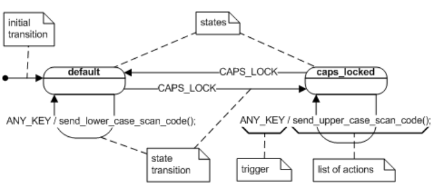
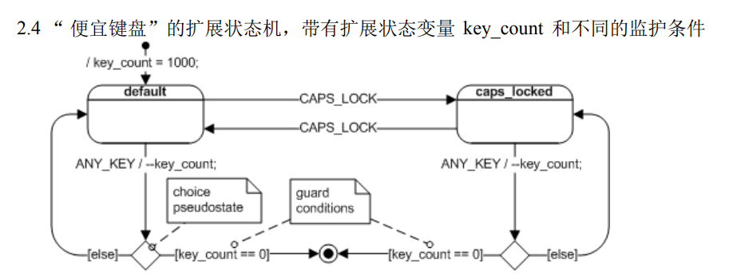
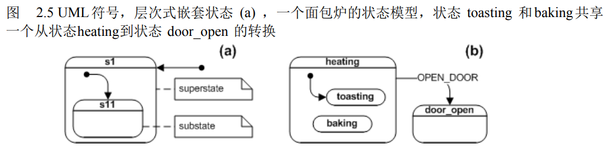

# 1.0 UML状态机

## 2.1   事件-动作范式 的过于简单

一个事件本身不能决定要被执行去反应这个事件的动作。当前上下文最少也是同等重要的。 然而，流行的事件 - 动作范型仅认识到对事件类型的依靠，而把上下文的处理交给主要的很容易退化成 “意大利面条式”代码的特定编程技术。

## 2.2     基本状态机

状态机而可以将系统的行为分解成相对小的块，当前状态的响应仅取决于当前事件类型，不在取决于上下文的事件顺序。这种方法里，“行为的块”被叫做状态。行为的改变（例如，响应任何事件的改变）对应着状态改变，被称为状态转换。

FSM是一个界定对全部行为的约束的很有效的方法。“在一个状态里”意味着系统仅响应全部 被允许事件的一个子集，产生可能响应的一个子集，并直接改变状态到所有可能状态的一个子集。

### 2.2.1       状态

状态能被抽象出所有可能（但不相关）的事件序列并仅 捕捉到相关的事件。状态的概念减少了在代码中分辨 执行上下文的问题，只要测试一个状态变量而不是许多变量，从而排除了大量的条件逻辑运算。

### 2.2.2    状态图

FSM有一个叫状态图 (state diagram) 的图型表达方法。这些图是有向图，节点代表状态，连接线代表状 态转换

### 2.2.3   扩展状态机

在一个系统中，系统的完整状态是定性和定量的结合。一个变量的改变并不意味着状态的转换。因此： 带有变量补充的状态机被称为**扩展状态机**，扩展状态机可以将  **量变带来质变**  引入状态机中， 例如与倒数计数器相结合：

### 2.2.4    监护条件（Guard Condition）

监护条件（简称监护）是基于扩展状态变量和事件参数动态评估的布尔表达式。监护条件仅在表达式为真时才允许动作或转换，而在表达式为假时禁止它们，从 而影响一个状态机的行为。在 UML 符号里，监护条件在方括号里出现（如 [key_count == 0] ）。  而滥用监护条件会造成，程序又回归到  `if else`  的意大利面条。

 成为高效率状态机设计者的主要一个挑战是培养一种感觉，知道行为的某些部分将会被捕捉成 “定性”方面（状态），而另外一些部分最好被当做“定量”方面（扩展状态变量）。

> * 一般的，你将主 动寻找机会去捕捉事件历史（什么发生了）作为系统的“状态”，而不是在扩展状态变量中存储这些信息。
> * 但 它不能存储太多的信息（比如很多的击键次数）

### 2.2.5    事件

一个事件是对系统有重大意义的一个在时间和空间上所发生的事情。严格的讲，术语 event指所发生事情的类型而不是发生事情的任何具体的实例。一个事件能有相关联的参数，允许事件实例传达不仅某些感兴趣的事件发生了，而且还有关于发 生事情的量化信息。

* 当事件实例被 接收时并等待处理时它被接收（比如它被放在一个事件队列里）
* 事件实例被派送给状态机，这 里它变成当前事件
* 当状态机结束了对这个事件实例的处理后，它被消耗。

### 2.2.6   动作和转换

当一个事件实例被派送，状态机通过执行动作来响应，比如改变一个变量，执行输入输出，调用一个函 数，产生另一个事件实例。或者变成另一个状态。任何和当前事件关联的参数值对被这个事件直接导致 的所有动作都有效。

从一个状态切换到另一个状态被称为状态转换，引发它的事件被称为触发事件 (triggering  event) ，或简单的被称为触发 (trigger) 。在键盘例子里，如果当 `CapsLock` 键被按下时键盘在 default 状态，键盘将进入到 caps_locked 状态。然而，如果键盘已经在 caps_locked 状态，按下 CapsLock键会引发一个不同的转换—从 caps_locked 到 default 。在这 2 个事例里，按下 `CapsLock`  就是 这个触发事件。

在扩展状态机里，一个转换可以有一个监护条件，这意味着仅当监护条件被评估为真时转换才能 “启动”。

### 2.2.7     运行-到-完成执行模型

所有的状态机体系，包括 UML 状态图，普遍的假设一个状态机在它能开始处理下一个事件前完成对 每个事件的处理。这个执行模型被称为运行 - 到 - 完成，或 RTC。

在 RTC模型里，系统在分散的不可分割的 RTC步骤里处理事件。新到的事件不能中断当前事件 的处理，而且必须被存储（通常是存储在一个事件队列里），直到状态机又变成空闲。这些语义完全避 免了在一个单一的状态机里的任何内部并发问题。 RTC模型也克服了处理和转换相关联的动作时的概 念性问题8，因为状态机在动作过程中没有处于一个明确定义的状态（在 2 个状态之间）。在处理事件时， 系统没有响应（不可观测性），因此在那个时段这种不清楚的状态没有实际的意义。

然而请注意， RTC不意味着状态机必须独占 CPU直到 RTC步骤被完成。可抢占性约束只适用 状态机在忙于处理事件的任务上下文的情况。在一个多任务处理环境里，其他（和繁忙的状态机的任务 上下文无关的）任务也可以运行，可能抢占当前执行的状态机。只要其他状态机互相间不共享变量或其 他资源，就不会有并发性的危险。

## 2.3   UML 对传统FSM方法的扩展

FSM即使在处理适度规模的系统，也倾向于变成不可管理（状态爆炸）。由于已知的状态爆炸的现象，传统 FSM的复杂性增加速度会快过它描叙的反应性系统的复杂性。发 生这种情况的原因是因为传统的状态机体系具有重复性。

### 2.3.1   反应性系统里的行为重用

所有反应性系统似乎用一种相似的方法重用行为。这个模式非常精辟：一个 GUI 系统首先 分派每个事件到应用程序（例如 Windows 调用在应用程序里面的一个特定的函数，而把事件作为一个参 数）。如果没有被应用程序处理，这个事件流回系统。这样就建立了一个层次式的事件处理次序。

### 2.3.2    层次式嵌套状态

状态图对经典 FSM最重要的革新是引入了层次式嵌套状态（这就是为什么状态图也被称为层次式状态机HSM的原因）。 和状态嵌套关联的语义如后所示（见图 2.5(a) ）：如果一个系统在嵌套的状态 s11( 称为子状态 ) 里， 它也（隐含的）在环绕的状态 s1( 称为超状态 ) 里。

这个状态机将试着处理任何在状态 s11 上下文的 事件，概念上它在较低层次。然而，如果状态 s11 没有指示如何去处理这个事件，这个事件不会像在 传统的“平面”状态机里那样被默默的丢弃，相反，它被自动的在超状态 s1的较高层上下文里被处理。

***复杂状态***：包含其他状态的状态

***简单状态***：没有内部结构的状态

***直接子状态***：一个嵌套的状态当它没有被其他状态包含时

***过渡性嵌套子状态***：一个嵌套的状态当它被其他状态包含时

任何层次式状态机可以被看作为一个 复合状态 的内部结构。每个状态机都有一个 **顶状态**，是每个状态机层次的抽象根。

子状态（嵌套状态）仅需要定义与超状态（包围状态）不同的部分。一个子状态可以容易 的通过忽略公共处理的事件，从而重用它的超状态的公共行为，然后这些公共行为自动的被高层的状态处理。通过这个方法，子状态能共享它们的超状态的全部行为。

> …我们一直被我们每次能领会的事物的数目所限制，但是通过抽象，我们通过增加更大的语义内容来使用大量信息。

复合状态不但隐藏了而且通过强大的重用机制（ `Umltimate Hood` 模式）积极的减少了复杂性。

### 2.3.3     行为继承

状态嵌套允许一个子状态从它的祖先（超状态）继承行为。行为继承可以有效地组织代码并提高代码的重用度。

### 2.3.4      Liskov 替换原则（LSP）

Liskov替换原则可以定义为：**如果S是T的子类型，则在任何使用T的地方都可以用S来替代，而不会导致程序的行为发生变化。**

简单来说，就是子类必须能够完全替代父类，并且保持程序的正确性和稳定性。遵守 LSP 可以让我们建立更好的状态层次并有效利用抽象方法。

### 2.3.5     正交区域

