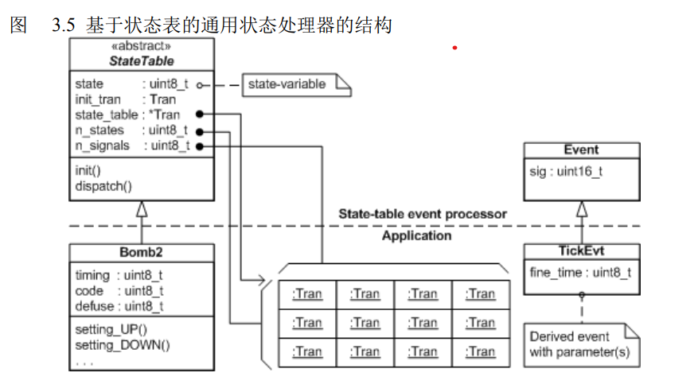

# 3.0   标准状态机实现方法

状态机在高级编程语言比如 C 或 C++ 里典型的实现方法包括： 

* 嵌套的 switch 语句 
* 状态表 
* 面向对象的状态设计模式，以及 
* 综合以上方法的其他技术


## 3.2   一个通用的状态机接口

接口包含两个函数：

* `init()`    触发在一个状态机里的顶层初始转换
* `dispatch()`     给状态机派送一个事件

### 3.2.1   表示事件

事件包含 2 个部分：

* 事件的 `signal` 表示所发生事务的类型
* event parameters 表示所发生事务的定量化信息

```c
typedef struct EventTag{
	uint16_t sig;
}Event;

typedef struct TickEvtTag{
    Event super;
    uint8_t fine_time;
}TickEvt;
```

故 `dispatch()`

```c
void dispatch(StateMachine *me, Event const* e);
```


## 3.3    嵌套的 `switch` 语句（最流行和直接的 方法）

第一层使用`switch` 使用一个标量化的状态变量作为 **区分器**， 第二层 `switch`  使用事件的信号。

嵌套 switch 语句实现方法有以下结果：

1. 它是简单的。 
2.  它需要枚举每个信号和每个状态。 
3.  它有小的内存用量，因为只用需要一个小的标量化状态变量来表示状态机的当前状态。
4. 它不促进代码重用，因为一个状态机的所有的要素必须为当前的问题进行特别的编码。
5.  整个状态机被编码为一个整体式的函数，它很容易增长的非常大。
6.  事件派送的时间不是一个常数，而是取决于 2 层 switch 语句的执行，性能随着 case 语句 的增加而降低（典型的是 O(log n) ，这里 n 是 case 的数目）。 
7. 这个实现**不是层次式**的。你能在每个转换里直接手工编码进入 / 退出动作，但是从改变状态 机拓扑的角度看，这将容易导致错误和并难以维护。主要是因为属于一个状态的代码（例如 一个进入动作）将会分散并在很多地方（每一个通向这个状态的转换中）重复。
8.  这个性质对代码合成工具来说不是问题，它常常使用这种嵌套的 switch 语句实现方法。

```c
/*****************************************************************************
* Product:  Time Bomb Example with "Nested Switch Statement"
* Last Updated for Version: 4.1.01
* Date of the Last Update:  Nov 04, 2009
*
*                    Q u a n t u m     L e a P s
*                    ---------------------------
*                    innovating embedded systems
*
* Copyright (C) 2002-2009 Quantum Leaps, LLC. All rights reserved.
*
* This software may be distributed and modified under the terms of the GNU
* General Public License version 2 (GPL) as published by the Free Software
* Foundation and appearing in the file GPL.TXT included in the packaging of
* this file. Please note that GPL Section 2[b] requires that all works based
* on this software must also be made publicly available under the terms of
* the GPL ("Copyleft").
*
* Alternatively, this software may be distributed and modified under the
* terms of Quantum Leaps commercial licenses, which expressly supersede
* the GPL and are specifically designed for licensees interested in
* retaining the proprietary status of their code.
*
* Contact information:
* Quantum Leaps Web site:  http://www.quantum-leaps.com
* e-mail:                  info@quantum-leaps.com
*****************************************************************************/
#include "bsp.h"

enum BombSignals {                          /* all signals for the Bomb FSM */
    UP_SIG,
    DOWN_SIG,
    ARM_SIG,
    TICK_SIG
};

enum BombStates {                            /* all states for the Bomb FSM */
    SETTING_STATE,
    TIMING_STATE
};

typedef struct EventTag {
    uint16_t sig;                                    /* signal of the event */
    /* add event parameters by derivation from the Event structure... */
} Event;

typedef struct TickEvtTag {
    Event super;                         /* derive from the Event structure */
    uint8_t fine_time;                           /* the fine 1/10 s counter */
} TickEvt;

typedef struct Bomb1Tag {                                   /* the Bomb FSM */
    uint8_t state;                             /* the scalar state-variable */
    uint8_t timeout;                    /* number of seconds till explosion */
    uint8_t code;              /* currently entered code to disarm the bomb */
    uint8_t defuse;                /* secret defuse code to disarm the bomb */
} Bomb1;

void Bomb1_ctor(Bomb1 *me, uint8_t defuse);            /* the "constructor" */
void Bomb1_init(Bomb1 *me);                              /* init() function */
void Bomb1_dispatch(Bomb1 *me, Event const *e);

                                     /* macro for taking a state transition */
#define TRAN(target_)  (me->state = (uint8_t)(target_))

                                        /* the initial value of the timeout */
#define INIT_TIMEOUT   10

/*..........................................................................*/
void Bomb1_ctor(Bomb1 *me, uint8_t defuse) {
    me->defuse = defuse;    /* the defuse code is assigned at instantiation */
}
/*..........................................................................*/
void Bomb1_init(Bomb1 *me) {
    me->timeout = INIT_TIMEOUT;  /* timeout is initialized in initial tran. */
    TRAN(SETTING_STATE);
}
/*..........................................................................*/
void Bomb1_dispatch(Bomb1 *me, Event const *e) {
    switch (me->state) {
        case SETTING_STATE: {
            switch (e->sig) {
                case UP_SIG: {
                    if (me->timeout < 60) {
                        ++me->timeout;
                        BSP_display(me->timeout);
                    }
                    break;
                }
                case DOWN_SIG: {
                    if (me->timeout > 1) {
                        --me->timeout;
                        BSP_display(me->timeout);
                    }
                    break;
                }
                case ARM_SIG: {
                    me->code = 0;
                    TRAN(TIMING_STATE);           /* transition to "timing" */
                    break;
                }
            }
            break;
        }
        case TIMING_STATE: {
            switch (e->sig) {
                case UP_SIG: {
                    me->code <<= 1;
                    me->code |= 1;
                    break;
                }
                case DOWN_SIG: {
                    me->code <<= 1;
                    break;
                }
                case ARM_SIG: {
                    if (me->code == me->defuse) {
                        TRAN(SETTING_STATE);     /* transition to "setting" */
                    }
                    break;
                }
                case TICK_SIG: {
                    if (((TickEvt const *)e)->fine_time == 0) {
                        --me->timeout;
                        BSP_display(me->timeout);
                        if (me->timeout == 0) {
                            BSP_boom();                 /* destroy the bomb */
                        }
                    }
                    break;
                }
            }
            break;
        }
    }
}

/* Test harness ------------------------------------------------------------*/
#include <stdio.h>
#include <conio.h>
#include <dos.h>
#include <stdlib.h>                                          /* for _exit() */

static Bomb1 l_bomb;                                       /* time bomb FSM */

/*..........................................................................*/
void main() {

    Bomb1_ctor(&l_bomb, 0x0D);       /* the secret defuse code, 1101 binary */

    printf("Time Bomb (Nested switch)\n"
           "Press 'u'   for UP   event\n"
           "Press 'd'   for DOWN event\n"
           "Press 'a'   for ARM  event\n"
           "Press <Esc> to quit.\n");

    Bomb1_init(&l_bomb);                     /* take the initial transition */

    for (;;) {                                                /* event loop */
        static TickEvt tick_evt = { TICK_SIG, 0};

        delay(100);                                         /* 100 ms delay */

        if (++tick_evt.fine_time == 10) {
            tick_evt.fine_time = 0;
        }
        printf("T(%1d)%c", tick_evt.fine_time,
                             (tick_evt.fine_time == 0) ? '\n' : ' ');

        Bomb1_dispatch(&l_bomb, (Event *)&tick_evt); /* dispatch tick event */

        if (_kbhit()) {
            static Event const up_evt   = { UP_SIG   };
            static Event const down_evt = { DOWN_SIG };
            static Event const arm_evt  = { ARM_SIG  };
            Event const *e = (Event *)0;

            switch (_getch()) {
                case 'u': {                                     /* UP event */
                    printf("\nUP  : ");
                    e = &up_evt;                   /* generate the UP event */
                    break;
                }
                case 'd': {                                   /* DOWN event */
                    printf("\nDOWN: ");
                    e = &down_evt;               /* generate the DOWN event */
                    break;
                }
                case 'a': {                                    /* ARM event */
                    printf("\nARM : ");
                    e = &arm_evt;                 /* generate the ARM event */
                    break;
                }
                case '\33': {                                  /* <Esc> key */
                    printf("\nESC : Bye! Bye!");
                    fflush(stdout);
                    _exit(0);
                    break;
                }
            }

            if (e != (Event *)0) {             /* keyboard event available? */
                Bomb1_dispatch(&l_bomb, e);           /* dispatch the event */
            }
        }
    }
}

```


## 3.4      状态表（State Table）

另一个常见的实现状态机的方法是基于状态表来表现一个状态机。最流行的方法是用一个 2 维状态表， 在它的水平方向列出各个事件，在它的垂直方向列出各个状态。单元的内容是用（ action ， next-state ） 表现的各个转换。

| 状态\事件 | UP                    | DOWN                     | ARM                              | TICK                      |
| --------- | --------------------- | ------------------------ | -------------------------------- | ------------------------- |
| setting   | setting_UP(), setting | setting_DOWN() , setting | , setting setting_ARM (), timing | empty(), setting          |
| timing    | timing_UP(), timing   | timing_DOWN(), timing    | timing_ARM (), setting(*)        | timing_TICK(), timing(**) |


### 3.4.1     通用的状态表事件处理器



通用事件处理器包含一个管理着一个外部转换数组的 `StateTable `结构以及一个为 带有变量的派生事件或没有变量的事件使用的` Event `结构。

```c
typedef struct EventTag {
    uint16_t sig;                                    /* signal of the event */
    /* add event parameters by derivation from the Event structure */
} Event;

struct StateTableTag;                                /* forward declaration */

typedef void (*Tran)(struct StateTableTag *me, Event const *e);

typedef struct StateTableTag {
    uint8_t state;                              /* the current active state */
    Tran const *state_table;                             /* the State-Table */
    uint8_t n_states;                                   /* number of states */
    uint8_t n_signals;                                 /* number of signals */
    Tran initial;                                 /* the initial transition */
} StateTable;

void StateTable_ctor(StateTable *me,
                     Tran const *table, uint8_t n_states, uint8_t n_signals,
                     Tran initial);
void StateTable_init(StateTable *me);
void StateTable_dispatch(StateTable *me, Event const *e);
void StateTable_empty(StateTable *me, Event const *e);

        /* macro for taking a state transition inside a transition function */
#define TRAN(target_)  (((StateTable *)me)->state = (uint8_t)(target_))

#endif                                                        /* statetbl_h */
```

​	

```c
#include "statetbl.h"
#include <assert.h>                       //断言防止外部定义的状态机不正确执行

void StateTable_ctor(StateTable *me,      //构造函数
                     Tran const *table, uint8_t n_states, uint8_t n_signals,
                     Tran initial)
{
    me->state_table = table;
    me->n_states    = n_states;
    me->n_signals   = n_signals;
    me->initial     = initial;
}
/*..........................................................................*/
void StateTable_init(StateTable *me) {
    me->state = me->n_states;
    (*me->initial)(me, (Event *)0);          /* top-most initial transition */

    assert(me->state < me->n_states);/* the initial tran. must change state */
}
/*..........................................................................*/
void StateTable_dispatch(StateTable *me, Event const *e) {
    Tran t;

    assert(e->sig < me->n_signals);          /* require the signal in range */

    t = me->state_table[me->state*me->n_signals + e->sig];
    (*t)(me, e);                         /* execute the transition function */

    assert(me->state < me->n_states);   /* ensure that state stays in range */
}
/*..........................................................................*/
void StateTable_empty(StateTable *me, Event const *e) {
    (void)me;               /* void compiler warning about unused parameter */
    (void)e;                /* void compiler warning about unused parameter */
}
```


应用程序

```c
/*****************************************************************************
* Product:  Time Bomb Example with "State Table"
* Last Updated for Version: 4.5.03
* Date of the Last Update:  Nov 04, 2009
*
*                    Q u a n t u m     L e a P s
*                    ---------------------------
*                    innovating embedded systems
*
* Copyright (C) 2002-2009 Quantum Leaps, LLC. All rights reserved.
*
* This software may be distributed and modified under the terms of the GNU
* General Public License version 2 (GPL) as published by the Free Software
* Foundation and appearing in the file GPL.TXT included in the packaging of
* this file. Please note that GPL Section 2[b] requires that all works based
* on this software must also be made publicly available under the terms of
* the GPL ("Copyleft").
*
* Alternatively, this software may be distributed and modified under the
* terms of Quantum Leaps commercial licenses, which expressly supersede
* the GPL and are specifically designed for licensees interested in
* retaining the proprietary status of their code.
*
* Contact information:
* Quantum Leaps Web site:  http://www.quantum-leaps.com
* e-mail:                  info@quantum-leaps.com
*****************************************************************************/
#include "bsp.h"
#include "statetbl.h"

enum BombSignals {                          /* all signals for the Bomb FSM */
    UP_SIG,
    DOWN_SIG,
    ARM_SIG,
    TICK_SIG,

    MAX_SIG                                        /* the number of signals */
};

enum BombStates {                            /* all states for the Bomb FSM */
    SETTING_STATE,
    TIMING_STATE,

    MAX_STATE                                       /* the number of states */
};

typedef struct TickEvtTag {
    Event super;                         /* derive from the Event structure */
    uint8_t fine_time;                           /* the fine 1/10 s counter */
} TickEvt;

typedef struct Bomb2Tag {                                   /* the Bomb FSM */
    StateTable super;               /* derive from the StateTable structure */
    uint8_t timeout;                    /* number of seconds till explosion */
    uint8_t defuse;                /* secret defuse code to disarm the bomb */
    uint8_t code;              /* currently entered code to disarm the bomb */
} Bomb2;

void Bomb2_ctor(Bomb2 *me, uint8_t defuse);            /* the "constructor" */

void Bomb2_initial     (Bomb2 *me, Event const *e);   /* initial transition */
void Bomb2_setting_UP  (Bomb2 *me, Event const *e);  /* transition function */
void Bomb2_setting_DOWN(Bomb2 *me, Event const *e);  /* transition function */
void Bomb2_setting_ARM (Bomb2 *me, Event const *e);  /* transition function */
void Bomb2_timing_UP   (Bomb2 *me, Event const *e);  /* transition function */
void Bomb2_timing_DOWN (Bomb2 *me, Event const *e);  /* transition function */
void Bomb2_timing_ARM  (Bomb2 *me, Event const *e);  /* transition function */
void Bomb2_timing_TICK (Bomb2 *me, Event const *e);  /* transition function */

                                        /* the initial value of the timeout */
#define INIT_TIMEOUT   10

/*..........................................................................*/
void Bomb2_ctor(Bomb2 *me, uint8_t defuse) {
    /* state table for Bomb state machine */
    static const Tran bomb2_state_table[MAX_STATE][MAX_SIG] = {
        { (Tran)&Bomb2_setting_UP,  (Tran)&Bomb2_setting_DOWN,
          (Tran)&Bomb2_setting_ARM, &StateTable_empty },
        { (Tran)&Bomb2_timing_UP,   (Tran)&Bomb2_timing_DOWN,
          (Tran)&Bomb2_timing_ARM,  (Tran)&Bomb2_timing_TICK  }
    };
    StateTable_ctor(&me->super,
                    &bomb2_state_table[0][0], MAX_STATE, MAX_SIG,
                    (Tran)&Bomb2_initial);      /* construct the superclass */
    me->defuse = defuse;                      /* set the secret defuse code */
}
/*..........................................................................*/
void Bomb2_initial(Bomb2 *me, Event const *e) {
    (void)e;           /* avoid the compiler warning about unused parameter */
    me->timeout = INIT_TIMEOUT;
    TRAN(SETTING_STATE);
}
/*..........................................................................*/
void Bomb2_setting_UP(Bomb2 *me, Event const *e) {
    (void)e;               /* avoid compiler warning about unused parameter */
    if (me->timeout < 60) {
        ++me->timeout;
        BSP_display(me->timeout);
    }
}
/*..........................................................................*/
void Bomb2_setting_DOWN(Bomb2 *me, Event const *e) {
    (void)e;               /* avoid compiler warning about unused parameter */
    if (me->timeout > 1) {
        --me->timeout;
        BSP_display(me->timeout);
    }
}
/*..........................................................................*/
void Bomb2_setting_ARM(Bomb2 *me, Event const *e) {
    (void)e;               /* avoid compiler warning about unused parameter */
    me->code = 0;
    TRAN(TIMING_STATE);                           /* transition to "timing" */
}
/*..........................................................................*/
void Bomb2_timing_UP(Bomb2 *me, Event const *e) {
    (void)e;               /* avoid compiler warning about unused parameter */
    me->code <<= 1;
    me->code |= 1;
}
/*..........................................................................*/
void Bomb2_timing_DOWN(Bomb2 *me, Event const *e) {
    (void)e;               /* avoid compiler warning about unused parameter */
    me->code <<= 1;
}
/*..........................................................................*/
void Bomb2_timing_ARM(Bomb2 *me, Event const *e) {
    (void)e;               /* avoid compiler warning about unused parameter */
    if (me->code == me->defuse) {
        TRAN(SETTING_STATE);                     /* transition to "setting" */
    }
}
/*..........................................................................*/
void Bomb2_timing_TICK(Bomb2 *me, Event const *e) {
    if (((TickEvt const *)e)->fine_time == 0) {
        --me->timeout;
        BSP_display(me->timeout);
        if (me->timeout == 0) {
            BSP_boom();                                 /* destroy the bomb */
        }
    }
}

/* Test harness ------------------------------------------------------------*/
#include <stdio.h>
#include <conio.h>
#include <dos.h>
#include <stdlib.h>                                          /* for _exit() */

static Bomb2 l_bomb;                                       /* time bomb FSM */

/*..........................................................................*/
int main() {

    Bomb2_ctor(&l_bomb, 0x0D);  /* instantiate with defuse code 1101 binary */

    printf("Time Bomb (State-Table)\n"
           "Press 'u'   for UP   event\n"
           "Press 'd'   for DOWN event\n"
           "Press 'a'   for ARM  event\n"
           "Press <Esc> to quit.\n");

    StateTable_init((StateTable *)&l_bomb);  /* take the initial transition */

    for (;;) {                                                /* event loop */
        static TickEvt tick_evt = { TICK_SIG, 0};

        delay(100);                                         /* 100 ms delay */

        if (++tick_evt.fine_time == 10) {
            tick_evt.fine_time = 0;
        }
        printf("T(%1d)%c", tick_evt.fine_time,
                             (tick_evt.fine_time == 0) ? '\n' : ' ');

        StateTable_dispatch((StateTable *)&l_bomb, (Event *)&tick_evt);

        if (kbhit()) {
            static Event const up_evt   = { UP_SIG   };
            static Event const down_evt = { DOWN_SIG };
            static Event const arm_evt  = { ARM_SIG  };
            Event const *e = (Event *)0;

            switch (getch()) {
                case 'u': {                                     /* UP event */
                    printf("\nUP  : ");
                    e = &up_evt;                   /* generate the UP event */
                    break;
                }
                case 'd': {                                   /* DOWN event */
                    printf("\nDOWN: ");
                    e = &down_evt;               /* generate the DOWN event */
                    break;
                }
                case 'a': {                                    /* ARM event */
                    printf("\nARM : ");
                    e = &arm_evt;                 /* generate the ARM event */
                    break;
                }
                case '\33': {                                  /* <Esc> key */
                    printf("\nESC : Bye! Bye!");
                    fflush(stdout);
                    _exit(0);
                    break;
                }
            }
            if (e != (Event *)0) {             /* keyboard event available? */
                StateTable_dispatch((StateTable *)&l_bomb, e);
            }
        }
    }

    return 0;
}
```

### 3.4.3 结果

 状态表实现技术有以下结果： 

1. 它直接映射成为表示状态机的高度规范的状态表 
2.  它需要枚举全部状态和信号，它们被用来检索状态表。 
3.  因为状态和信号被用来检索一个数组，他们必须是连续的并从零开始。
4.  它为事件派发提供了相对好和可确定的性能 (O(cosnt),不包含动作的执行时间 ) 。 
5.  它促进了通用事件处理器的重用，通常它是短小的代码。
6. 它需要一个大的状态表，它通常是稀疏表。然而，因为状态表是不变的，它常常被存储在 ROM 而不是 RAM 里。 
7. 它需要一个复杂的状态表的初始化动作，必须绝对符合所枚举的状态和信号。从改变状态机 拓扑的角度看来，手工维护这个初始化动作是冗长的并容易导致错误。例如，增加一个新的 状态需要增加并初始化状态表的一整行单元。

> 注意： 因为复杂的初始化和快速增加的状态表，程序员常常发觉增加新的状态或事件是昂贵的。这种 看法常常阻止程序员去改进状态机。相反，他们趋向错误的使用扩展状态变量和监护条件（见 第二章 2.2.5节）。 
>
> * 它需要很大数量的精确粒度的函数用来表示动作。
> * 当使用 C/C++ 实现时，它典型的非常依赖指向函数的指针（见 3.7.1节），因为状态表典型的包含 了很多这些指向函数的指针。 
> *  它不是层次式的。尽管状态表能被扩展从而实现状态嵌套，进入 / 退出动作和转换监护条件，这些 扩展需要把全部转换链硬编码到转换动作函数里，这容易导致错误和不灵活（也见节xx）。
