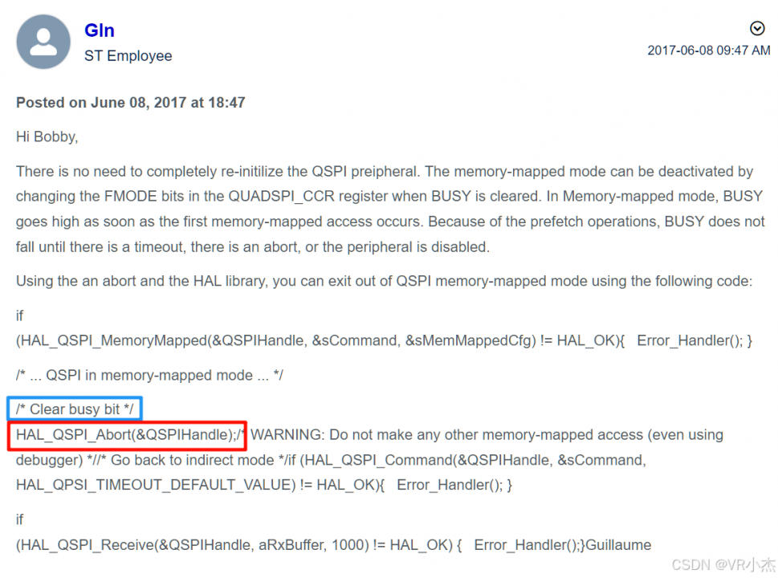

# [STM32 QSPI Flash 退出内存映射模式的方法 - STM32/STM8单片机论坛 - ST MCU意法半导体官方技术支持论坛](https://bbs.21ic.com/icview-3406156-1-1.html)

https://community.st.com/t5/stm32-mcus-products/stm32f7-qspi-exit-memory-mapped-mode/m-p/452589

