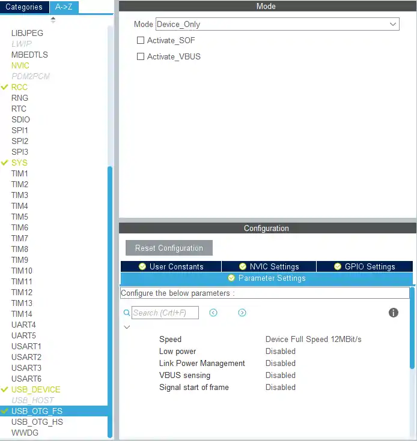
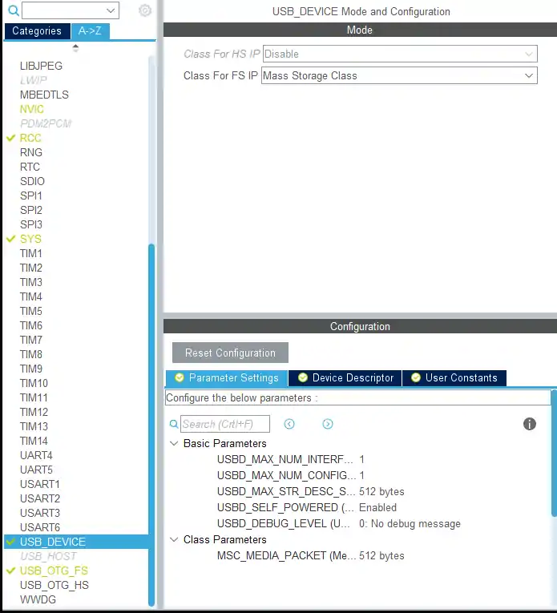

# 模拟U盘

[如何使用 STM32 USB MSC（大容量存储类） --- How to use the STM32 USB MSC (Mass Storage Class)](https://controllerstech.com/stm32-usb-msc/)

[STM32CubeMX-H7-15-SPI通信协议读写W25Q64_mosi初始为高-CSDN博客](https://blog.csdn.net/m0_74211379/article/details/147302949)

USB时钟只能为 48MHz

### 注意 **USB OTG FS with internal DMA**

使用internal DMA 需要将程序的RAM修改至 RAM 中，从 DTCMRAM 到 DMA 控制器没有互连。

### 注意 DTCM, which is not accessible by USB.  内存配置问题 只能 关闭DCache。
