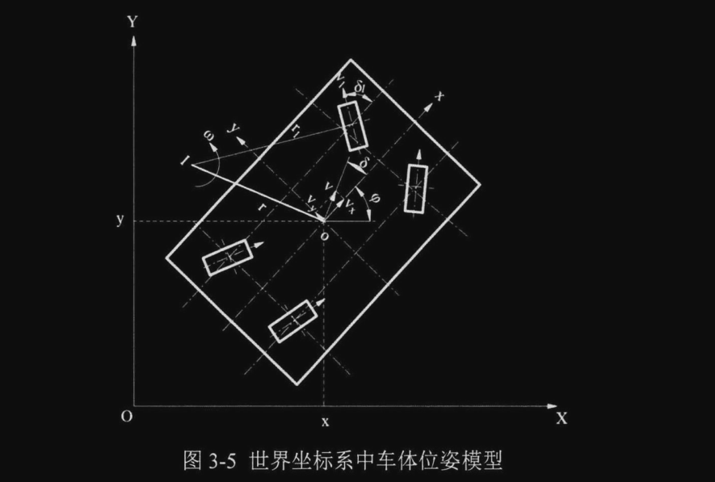

# AGV底盘控制学习笔记

## 直线运动：

* 直行
* 斜行
* 横移

滑移角和速度：
$$
\delta = \delta{_1} = \delta_2 = \delta_3 = \delta_4
\\
v = v_1 = v_2 = v_3 = v_4
$$

## 零半径原地旋转：

舵轮到车体中心点位置距离：
$$
l = \sqrt{(\frac{L}{2})^2 + (\frac{D}{2})^2}
$$
各个舵轮的滑移角和速度：
$$
\delta_1 = \delta_4 = -arctan(\frac{L}{D})
\\
\delta_2 = \delta_3 = arctan(\frac{L}{D})
\\
\\
v_1 = v_3 = -\omega·l
\\
v_2 = v_4 = \omega·l
$$
各个舵轮与车体轴线的夹角分别为：
$$
\alpha_1 = \alpha_4 = arctan(\frac{D}{L})
\\
\alpha_2 = \alpha_3 = -arctan(\frac{D}{L})
$$

## 曲线运动：

移动机器人在运行过程中出现轨迹偏离需要 **纠偏** ，最常见的一种运动方式是曲线运动，最复杂的一种状态：

车体中心点的滑移角：
$$
\delta = arctan(\frac{v_y}{v_x})
$$
各中心点的速度 ($v_x,v_y$) 与各舵轮速度 ( $v_{ix},v_{iy}$ ) 关系：
$$
\left[
 \begin{matrix}
   v_{1x}  \\
   v_{1y}  \\
   v_{2x}  \\
   v_{2y}  \\
   v_{3x}  \\
   v_{3y}  \\
   v_{4x}  \\
   v_{4y}  \\
  \end{matrix}
  \right]
   = 
   \left[
   \begin{matrix}
   1  & 0 & -l\sin(\alpha_1) \\
   0  & 1 & l\cos(\alpha_1) \\
   1  & 0 & -l\sin(\alpha_2) \\
   0  & 1 & l\cos(\alpha_2) \\
   1  & 0 & l\sin(\alpha_3) \\
   0  & 1 & -l\cos(\alpha_3) \\
   1  & 0 & l\sin(\alpha_4) \\
   0  & 1 & -l\cos(\alpha_4) \\
  \end{matrix}
  \right]
   \left[
 \begin{matrix}
   v_{x}  \\
   v_{y}  \\
   \omega  \\
  \end{matrix}
  \right]
  
  
  
  \tag{1}
$$
各个舵轮速度：
$$
\begin{cases}
v_1 = \sqrt{(v_{1x})^2+(v_{1y})^2} \\
\\
v_1 = \sqrt{(v_{2x})^2+(v_{2y})^2} \\
\\
v_1 = \sqrt{(v_{3x})^2+(v_{3y})^2} \\
\\
v_1 = \sqrt{(v_{4x})^2+(v_{4y})^2}
\end{cases}
$$

各个舵轮滑移角:
$$
\begin{cases}
\delta_1 = \arctan({v_{1y}}/{v_{1x}}) \\
\\
\delta_1 = \arctan({v_{2y}}/{v_{2x}}) \\
\\
\delta_1 = \arctan({v_{3y}}/{v_{3x}}) \\
\\
\delta_1 = \arctan({v_{4y}}/{v_{4x}}) 
\end{cases}
$$

通过以上分析得到三种运动模式下四个舵轮的控制角度和速度与中心点速度的关系，将整车置于世界坐标系中，引入角度矽表示世界坐标系和车体坐标系之间的夹角。 此时，车体在世界坐标系中的位姿模型如图3．5所示，

​	位置矢量可以描述为$P=[x,y,\phi]^{T}$， 车体坐标系中的位置矢量可以描述为 $P_1 = [x_1,y_1,\phi_1]^T$   。

世界坐标系中的位姿矢量可以由正交转换矩阵 *$R(\phi)$* 转换得到，即：
$$
P = R(\phi)P_1
\\
\\
P_1 = R^{-1}(\phi)P
\\
\\
R(\phi) =
\left[
 \begin{matrix}
   \cos(\phi) & -\sin(\phi)  & 0\\
   \sin(\phi) & \cos(\phi) &  0\\
   0    &      0       &      1
  \end{matrix}
  \right]
$$

设各个舵轮在世界坐标系中的  坐标为（$x_{wi},y_{wi}$）:
$$
\left[
 \begin{matrix}
   x_{w1}  \\
   y_{w1}  \\
   x_{w2}  \\
   y_{w2}  \\
   x_{w3}  \\
   y_{w3}  \\
   x_{w4}  \\
   y_{w4}  \\
  \end{matrix}
  \right]
   = 
   \left[
   \begin{matrix}
   1  & 0 & \cos(\phi)  & -\sin(\phi) \\
   0  & 1 &  \sin(\phi) & \cos(\phi) \\
   1  & 0 &  \cos(\phi) & \sin(\phi) \\
   0  & 1 &  \sin(\phi) & -\cos(\phi) \\
   1  & 0 & -\cos(\phi) & -\sin(\phi) \\
   0  & 1 & -\sin(\phi) & \cos(\phi) \\
   1  & 0 & -\cos(\phi) & \sin(\phi) \\
   0  & 1 & -\sin(\phi) & -\cos(\phi) \\
  \end{matrix}
  \right]
   \left[
 \begin{matrix}
   x  \\
   y  \\
   L/2  \\
   D/2
  \end{matrix}
  \right]
$$

四舵轮全向AGV系受非完整约束：

> 非完整约束是指在机械系统中，某些自由度或轴向的运动受到限制，无法独立进行。

$$
\dot{x}\sin(\phi + \delta) + \dot{y}\cos(\phi + \delta) = 0
$$

$$
\dot{P} =
\left[
 \begin{matrix}
   \dot{x} \\
   \dot{y} \\
   \dot{\phi}
  \end{matrix}
 \right]
  = 
  Ju
  =
  \left[
 \begin{matrix}
   \cos(\phi + \delta) & 0 \\
   \sin(\phi + \delta) & 0 \\
   0                   & 1
  \end{matrix}
 \right]
   \left[
 \begin{matrix}
	v \\
	\omega
  \end{matrix}
 \right]
 \\
 =
\left[
 \begin{matrix}
   \cos(\phi) & -\sin(\phi)  & 0\\
   \sin(\phi) & \cos(\phi) &  0\\
   0    &      0       &      1
  \end{matrix}
  \right]
  
  \left[
 \begin{matrix}
   v_x \\
   v_y \\
   \omega
  \end{matrix}
 \right]
$$

***J***   是系统的雅可比矩阵

## 位姿误差模型

路径跟踪控制的目的是要让AGV稳定的沿着参考轨迹运动，控制器输出的实际控 制量需根据当前位姿误差来确定，因此有必要先建立移动机器人系统的动态误差模型。 位姿误差模型主要用来描述运动过程中某一时刻车体实际位姿与目标位姿的偏移。

通过 误差模型，可将世界坐标系下的绝对误差转化为车体坐标系下的相对误差，更便于控制器的设计。考虑四舵轮全向AGV在世界坐标系中的位姿，以全向AGV的中心点作为参考点，机器人运行的理想位姿以 $P_r = [x_r,y_r,\phi_r]^T$ 描述，实际位姿由  $P = [x,y,\phi]^T$ 描述， 速度矢量可以描述为 $u = [v,\omega]^T$ 。

常见的位姿误差模型通过约束车辆运行中的滑移角为 0，即假设车体运行速度始终与车体坐标系的X轴重合，该约束将限制四舵轮全向AGV 的灵活性，不能更好的发挥四舵轮底盘的优势。本节考虑滑移角并假设其值为 $\delta$  建立位姿误差模型，车体在世界坐标系中的如图3-9所示。

车体坐标系中，速度在 x 和 y 轴上面的分量：
$$
\dot{x}\cos(\phi) + \dot{y}\sin(\phi) = v_x
\\
\\
\dot{y}\cos(\phi) - \dot{x}\sin(\phi) = v_x
$$
车体的轨迹跟踪误差：
$$
P_e =
\left[
 \begin{matrix}
   x_e \\
   y_e \\
   \phi_e
  \end{matrix}
 \right]
 =
 \left[
 \begin{matrix}
   \cos(\phi) & \sin(\phi)  & 0\\
   -\sin(\phi) & \cos(\phi) &  0\\
   0    &      0       &      1
  \end{matrix}
  \right]
  \left[
 \begin{matrix}
   x_r - x \\
   y_r - y \\
   \phi_r - \phi
  \end{matrix}
  \right]
$$
将上面的矩阵方程展开，并进行微分处理（求导）

可以得到位姿误差微分方程：
$$
\dot{x}_e = (\dot{x}_r-\dot{x})\cos(\phi) - \dot{\phi}(x_r-x)\sin(\phi) + (\dot{y_r}-\dot{y})\sin(\phi) + \dot{\phi}(y_r-y)\cos(\phi)
\\
\dot{y}_e = (\dot{y}_r-\dot{y})\cos(\phi) - \dot{\phi}(y_r-y)\sin(\phi) + (\dot{x_r}-\dot{x})\sin(\phi) + \dot{\phi}(x_r-x)\cos(\phi)
\\
\dot{\phi}_e = \dot{\phi}_r - \dot{\phi}
$$
化简得到：
$$
\dot{x_e} = v_{rx}\cos\phi_e - v_{ry}\sin(\phi_e) - v_x+\omega y_e
\\
\\
\dot{y_e} = v_{ry}\cos(\phi_e) + v_{rx}\sin(\phi_e) - v_y + \omega x_e
\\
\\
\dot{\phi_e} = \omega_r - \omega
$$
