# S型速度规划曲线

S形加减速的最重要特征是该算法的**加速度/减速度曲线**的形状如字母 S。S形加减速的速度曲线平滑 ,从而能够减少对控制过程中的冲击，并使插补过程具有**柔性** [1](https://blog.csdn.net/u010632165/article/details/104951091/?utm_medium=distribute.pc_relevant.none-task-blog-2~default~baidujs_baidulandingword~default-0.fixedcolumn&spm=1001.2101.3001.4242.1#fn1)。
由于T形曲线在加速到匀速的切换过程中，实际中存在较大过冲，因此这里对比一下**T**曲线和**7段S曲线**的实际过程；

- **T形**：**加速 -> 匀速 -> 减速**
- **S形**：**加加速(\**T 1 T_1T1\**) -> 匀加速(\**T 2 T_2T2\**) -> 减加速(\**T 3 T_3T3\**)-> 匀速(\**T 4 T_4T4\**)-> 加减速(\**T 5 T_5T5\**)-> 匀减速(\**T 6 T_6T6\**)-> 减减速(\**T 7 T_7T7\**)**

## 直接计算型 理论分析

由于S曲线在加减速的过程中，其加速度是变化的，因此这里引入了新的一个变量 J JJ，即**加加速度**。
$$
J = \frac{d_a}{d_t}
$$

* 加加速
* 匀加速
* 减加速
* 匀速
* 加减速
* 匀减速
* 减减速

> $∣a∣$ 为加速度的绝对值；
> 其中 $T_k = t_k - t_{k-1}$
>
> $\tau_k = t - t_{k-1}$

故需要确定三个基本的参数：系统最大速度，最大加速度，加加速度

- **最大速度**：反映了系统的最大运行能力 ；

- **最大加速度**：反映了系统的最大加减速能力 ；

- 加加速度

  ：反映了系统的柔性；

  - 柔性越大，过冲越大，运行时间越短；
  - 柔性越小，过冲越小，运行时间越长；

### 加速度时间方程：

$$
a(t)=
\begin{cases}
Jt \\
a_{max} \\
a_{max} - J(t-t_2)  \\
0  \\
-J(t-t_4)  \\
-a_max \\
-a_{max} - J(t-t_6)

\end{cases}
$$

### 速度时间方程：

$$
v= \frac{1}{2}Jt^2
$$

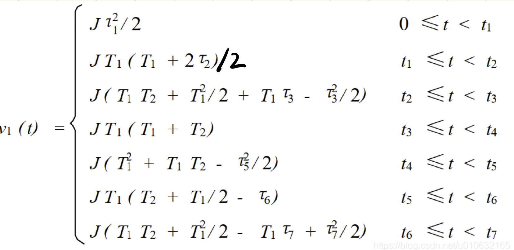

### 时间位移函数：

$$
S = \frac{1}{6}Jt^3
$$

$$
\begin{cases}
S = \int^t_0vdt   \\
\\
v = \frac{1}{2}Jt^2
\end{cases}
$$

位移方程：

## 实现思路：

正如前面所提到的，**S曲线规划**需要确定三个最基本的系统参数 ：系统最大速度 v m a x v_{max}vmax ，最大加速度a_{max} ，加加速度J JJ，这样就可以确定这个运行过程。
这里有一个隐性的条件，就是在运行的过程中可以达到最大速度，这样才是完整的**7段S曲线**，另外这里还有一些中间参数：

* $t_m = \frac{V_{max}}{a_{max}}$
* $J = J_1 = J_3 = J_5 = J_7 = \frac{a_{max}}{t_m}$
* $T_f$  用户给整个运行过程所需要的时间

### $T_k$  推导

假设存在 $T_2$和$T_6$ :

可以得到：
$$
T_2 = T_6 = \frac{V_{max}-V_s}{a_{max}}-T_1
$$

> $V_s $ 为初始速度

假设可以到最大速度：
$$
\begin{cases}
T_f = T_1 + T_2 + T_3 + T_4 + T_5 + T_6 + T_7 \\
\\
T_2 = T_6  \\
\\
T_1 = T_3 = T_5 = T_7 \\
\end{cases}
$$
可以算出：
$$
T_4 = T_f - 2\frac{V_{max}}{a_{max}} - 2\frac{a_{max}}{J}
$$

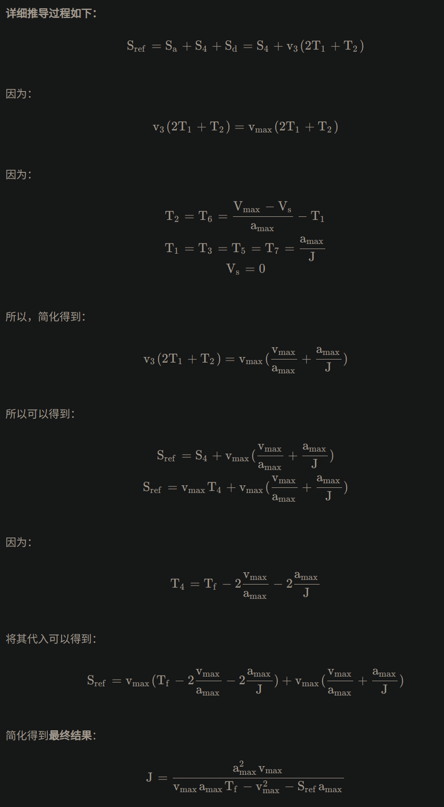

### 函数使用：

## Sigmoid 函数  理论分析

参考论文： 一种基于Sigmoid函数的自动驾驶车辆运动规划方法[J]

Sigmoid函数是在生物学中常见的S型的曲线，表达式如下：
$$
S(x) = \frac{1}{1+e^{-x}}
$$
能够将变量映射到（0,1）之间，该函数平滑且易于求导。该函数变化连续光滑且严格单调，当x趋近于正无穷的时候，函数值趋近于1。

根据应用将 Sigmoid 函数进行拉伸和平移：
$$
S(x) = A + \frac{B}{1 + e^{-ax + b}}
$$

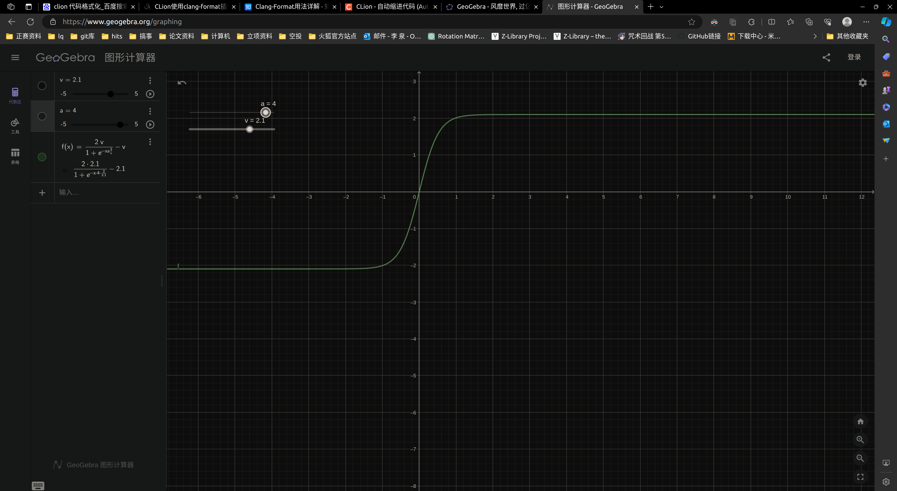

改进的Sigmoid函数：

* 形式1：

$$
V(t) = 2v(\frac{1}{1+e^{-2a(t-t_d)/v}})-v
$$

* 形式2：

$$
V_{current} = V_{start} + \frac{V_{target}-V_{start}}{1 + e^{-flexible(\frac{2t - T_{max}}{T_max})}}
$$ {1}

### 形式1分析：

加速阶段 a 为最大加速度且 $a > 0$ $t_d = 0$

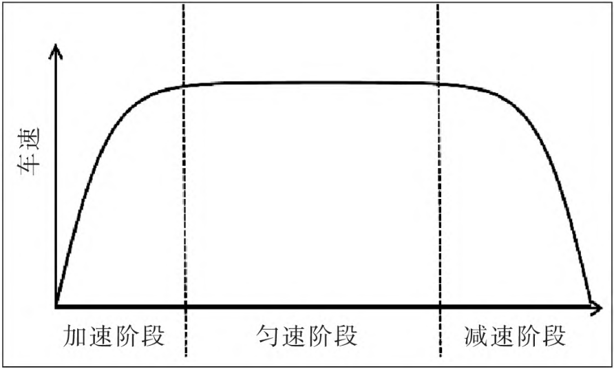

#### 最大值为：  

$$
0 \leq \frac{1}{1 + e^{-x}} \leq 1
$$

#### 导数：

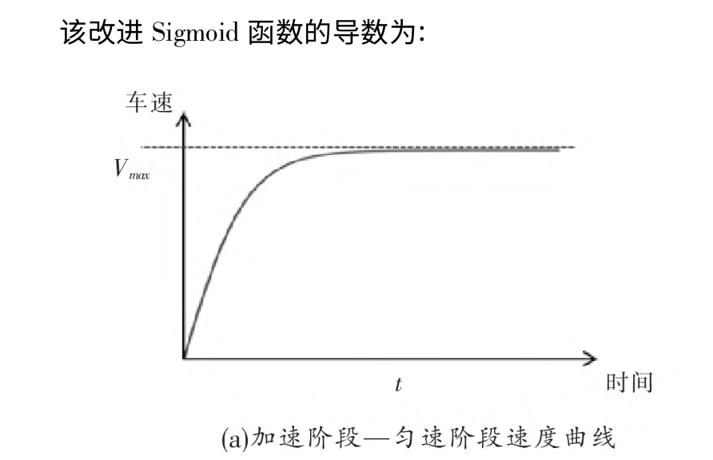

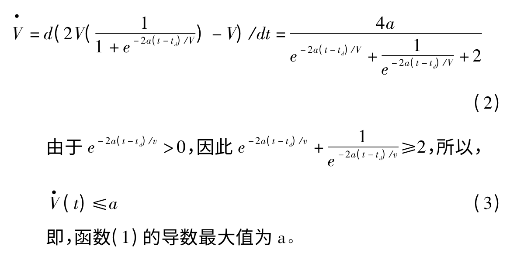

#### 积分：

#### 采用改进的 Sigmoid 函数构建车辆运动规划方程

将路径点分为两个阶段：两部分 $S_1$ 和 $S_2$ 。 

$S_1$ 为加 速 阶 段—匀 速 阶 段，$S_2$ 为 匀 速 阶 段—减 速 阶 段

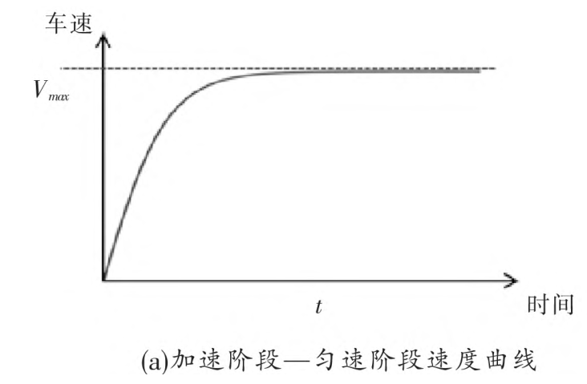

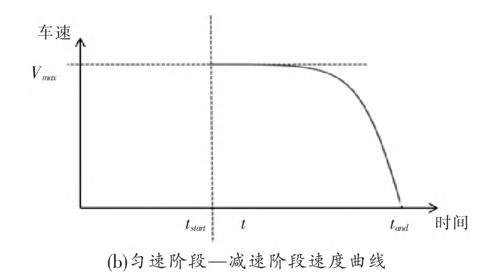

#### 加速匀速阶段：

速度方程：
$$
V(t) = 2V_{max}(\frac{1}{1 + e^{-2a_{max}t/v_{max}}}) - V_{max}
$$
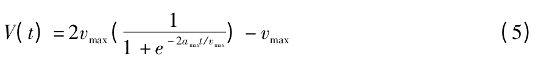

导数方程：

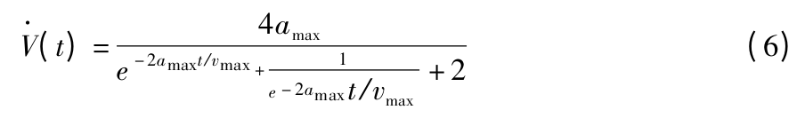

积分方程：

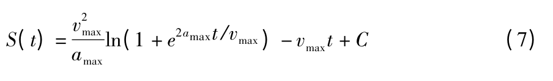

当 $t = 0$ 时，路径长度为 0 ，因此：

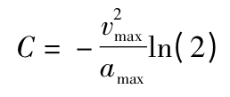

#### 匀速减速阶段：

速度方程：

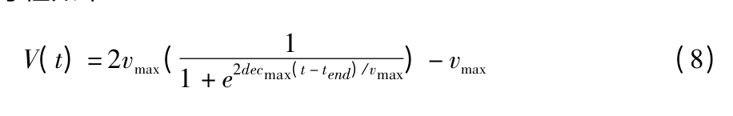

导数方程：

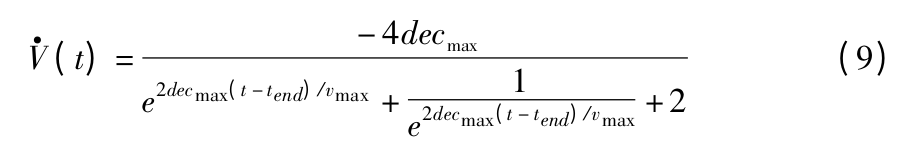

积分方程：

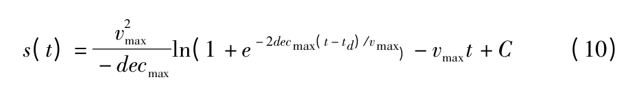

常数求解：  $S(t_{start}) = 0$

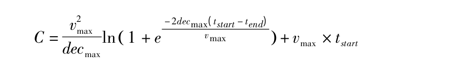

#### 规划步骤：

根据路径规划的总长度，按照路径长度分为两部分 $S_1$ 和 $S_2$ 两部分

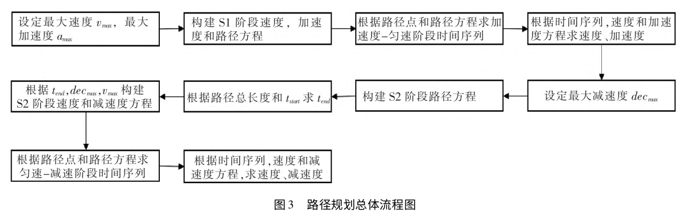

## 修改后的规划函数：

速度函数：
$$
V(t) = \frac{v_t-u}{1+e^{-2a/v_t}}+u
$$
整体加速所需时间：
$$
t = \frac{S}{2u+2a-2a\frac{u}{v_t}}
$$
由路程计算所需加速度：

