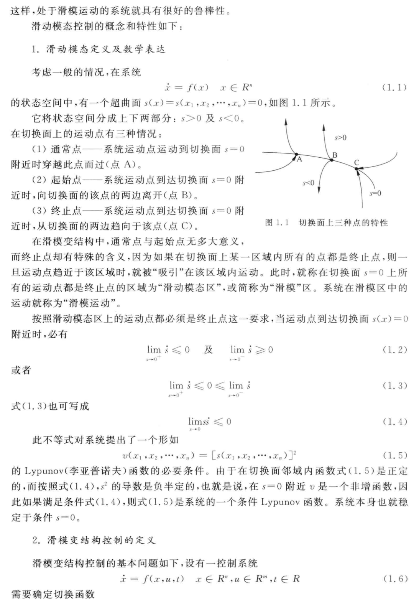
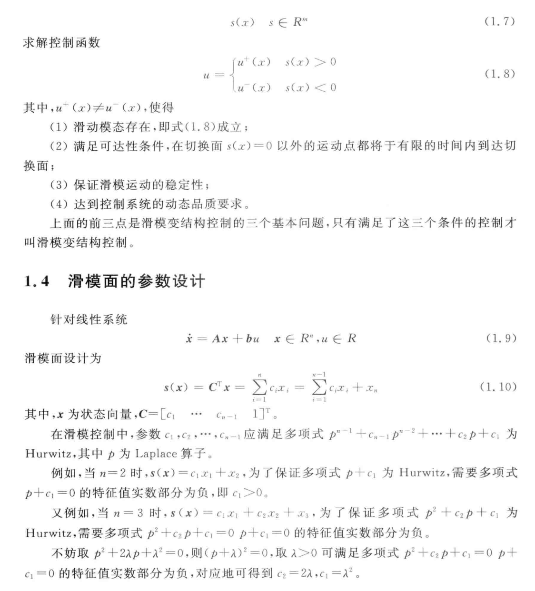
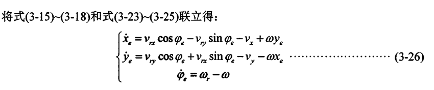

# 滑模控制

这种控制策略可以在动态过程中，根据系统当前的状态有目的地不断变换结构，迫使系统按照预定的 **滑动模态** 进行运动。

缺点：   当状态轨迹到达滑模面后，难以严格地沿着滑面向平衡点移动。

## 滑膜变结构控制基本原理






### 滑模控制工程意义

针对**跟踪问题**，设计滑模函数为：
$$
s(t) = ce(t) + \dot{e}(t)
$$
其中 $e(t)$ 和 $\dot{e}(t)$ 分别为跟踪误差 及其变化率， c必须满足 Hurwitz 条件 即 $c>0$

当 $s(t) = 0$  
$$
s(t) = ce(t) + \dot{e}(t) = 0
\\
\dot{e}(t) = - ce(t)
\\
\frac{1}{e(t)}\times \dot{e}(t) = -c
\\
\int^t_0\frac{1}{{e}(t)}\dot{e}(t)dt = \int^t_0 -cdt
\\
\ln\frac{e(t)}{e(0)} = -ct
\\
e(t) = e(0)\exp(-ct)
$$

即当 $t \rightarrow \infin$ 误差指数，误差指数收敛为0，收敛速度取决于  c 值。


### 四舵轮全向 AGV 滑膜控制器设置

主要思想：根据被控系统的模型设计出合理的切换函数以及可控制率，使得系统误差迅速减小进入滑动模态。




代码实现：

```python
# This is a sample Python script.

# Press Shift+F10 to execute it or replace it with your code.
# Press Double Shift to search everywhere for classes, files, tool windows, actions, and settings.

import numpy as np
import math


class SMCController:
    def __init__(self):
        self.k1 = 0.18
        self.k2 = 0.012
        self.k3 = 0.035

        self.k_0 = 0.01

        self.e1 = 0.5
        self.e2 = 0.5
        self.e3 = 0.57

        self.ks1 = 0.8
        self.ks2 = 0.8
        self.ks3 = 0.8

        self.alpha1 = 0.9
        self.alpha2 = 0.9
        self.alpha3 = 0.98

        self.sigma1 = 0.05
        self.sigma2 = 0.05
        self.sigma3 = 0.05

        self.K = np.mat([[self.k1, 0, 0], [0, self.k2, 0], [0, 0, self.k3]])
        self.K_0 = np.mat([0, 0, self.k_0])
        self.E = np.mat([[self.e1, 0, 0], [0, self.e2, 0], [0, 0, self.e3]])
        self.Q = np.mat([0.05, 0.08, 0.03])

        self.P_e_int = np.mat([0.0, 0.0, 0.0])
        self.lastP_e = np.mat([0, 0, 0])

    def sgn(self, x):
        if x > 0:
            return 1
        elif x < 0:
            return -1
        else:
            return 0

    def fal(self, x, alpha, sigma):
        if abs(x) > sigma:
            return pow(abs(x), alpha) * self.sgn(x)
        else:
            return x / pow(sigma, 1 - alpha)

    def reset_P_e(self):
        self.P_e = 0

    def SMC_Cal(self, v_x, v_y, w, x_e, y_e, theta_e, delta_t):
        P_r = np.mat([v_x, v_y, w])
        P_mat = np.mat([[0, w, v_y], [-w, 0, v_x], [0, 0, 0]])
        P_e = np.mat([x_e, y_e, theta_e])

        self.P_e_int += np.mat([x_e, y_e, theta_e]) * delta_t

        delta_P_e = P_e - self.lastP_e

        s1 = x_e + self.ks1 * self.P_e_int[0, 0]
        s2 = y_e + self.ks2 * self.P_e_int[0, 1]
        s3 = theta_e + self.ks3 * self.P_e_int[0, 2] + self.K_0[0, 2] * self.sgn(theta_e) * (
                delta_P_e[0, 0] + delta_P_e[0, 1])

        Fal = np.mat([self.fal(s1, self.alpha1, self.sigma1), self.fal(s2, self.alpha2, self.sigma2),
                      self.fal(s3, self.alpha3, self.sigma3)])

        result = P_r.T + (P_mat + self.K) * P_e.T + self.K_0.T + self.E.T * abs(P_e.T - self.lastP_e.T) + self.E * Fal.T \
                 + self.Q * np.mat([math.asinh(s1), math.asinh(s2), math.asinh(s3)]).T

        self.lastP_e = P_e
        return result


if __name__ == '__main__':
    a = SMCController()
    for i in np.arange(0,10,1):
        print(a.SMC_Cal(1.0, 2.0, 0.0, 1.0, 10.0, 0.0, 1))
        print(a.SMC_Cal(1.0, 2.0, 0.0, 1.0, 10.0, 0.0, 1))
        print(a.SMC_Cal(1.0, 2.0, 0.0, 1.0, 10.0, 0.0, 1))
        print(a.SMC_Cal(1.0, 2.0, 0.0, 1.0, 10.0, 0.0, 1))


# See PyCharm help at https://www.jetbrains.com/help/pycharm/
```

