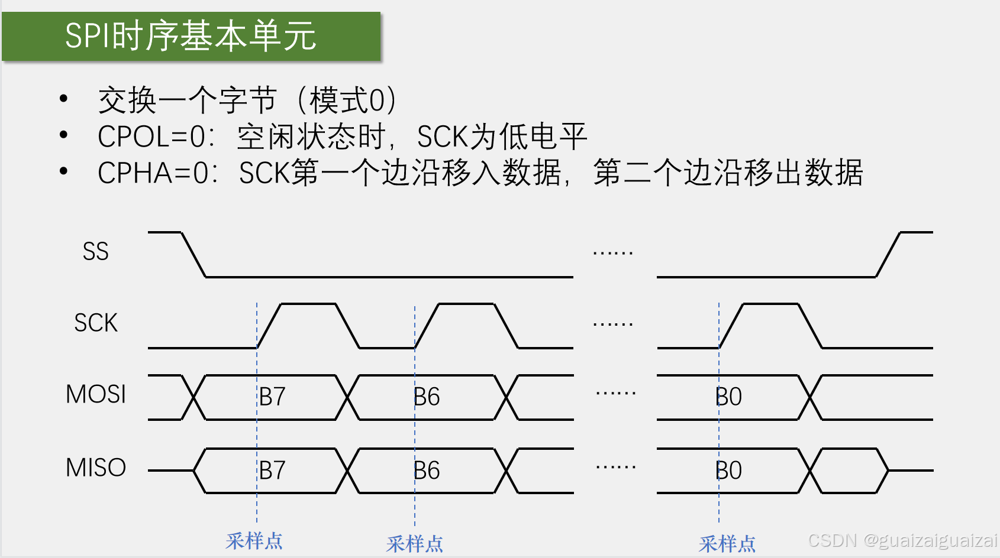
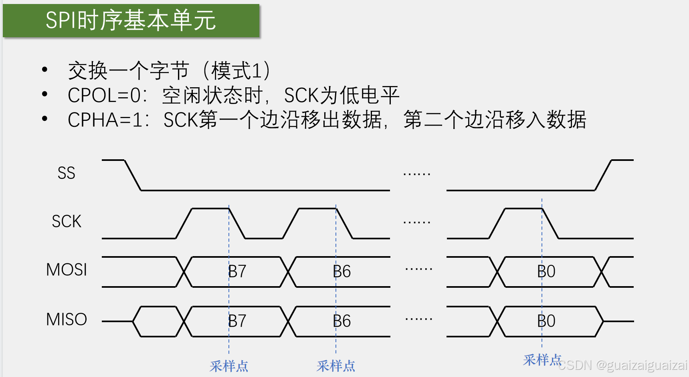
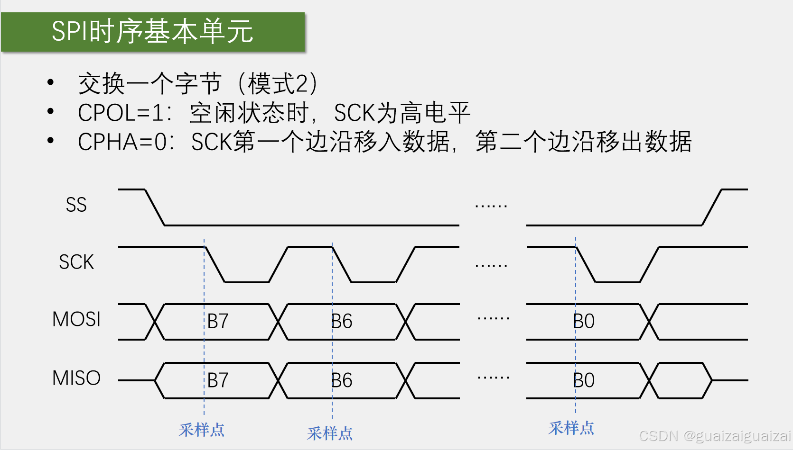
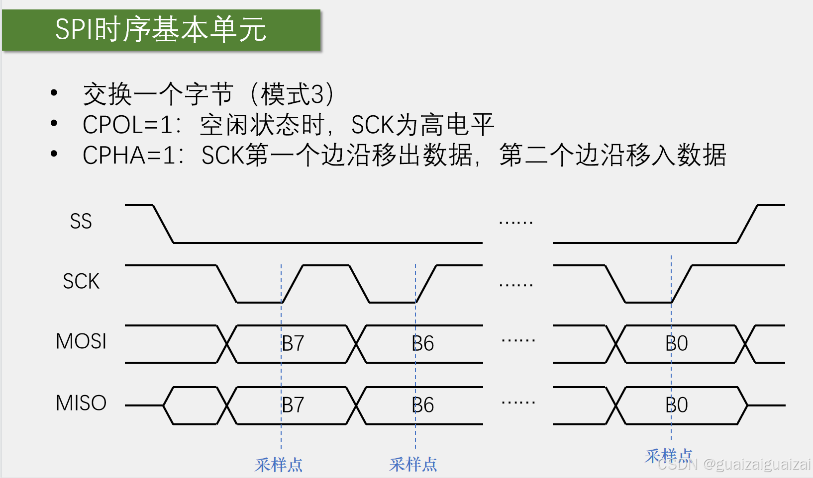

##SPI协议

***
* SPI物理层
    * #####SPI通讯使用三条总线
        1. 从设备选择线（SPI通讯以NSS线置低电平时开始传输，该从机被选中）
        2. 时钟信号线
        3 MOSI/MISO  主设备输出线和输入线

* 协议层
    * #####SPI通讯时序
    
    MOSI和MISO都只在NSS为低电平的时候有效，SCK每个时钟周期传输一位信号
    * #####CPOL（时钟极性）/CPHA（时钟相位） 通讯协议
        * CPOL=0时，SCk空闲时为低电平/CPOL=1时，相反。
        * 当 CPHA=0 时  SCK 时钟线的**奇数边沿**被采样/当 CPHA=1 时，数据线在 SCK 的**偶数边**采样
        
    * 传输方式
        * 双线全双工
        * 双线单向
        * 单线模式

* SPI 初始化结构体详解
    *
 ```c
typedef struct {
    uint32_t Mode; /* 设置 SPI 的主/从机端模式 */
    //若被配置为从机模式则接收外来的SCK信号
    uint32_t Direction; /* 设置 SPI 的单双向模式 */
    //双线全双工 (SPI_DIRECTION_2LINES)，双线只接收 (SPI_DIRECTION_2LINES_RXONLY)，单线 SPI_DIRECTION_1LINE。
    uint32_t DataSize; /* 设置 SPI 的数据帧长度，可选 8/16 位 */
    // 8 位 (SPI_DATASIZE_8BIT) 还是 16位 (SPI_DATASIZE_16BIT)

    uint32_t CLKPolarity;/* 设置时钟极性 CPOL，可选高/低电平 */
    uint32_t CLKPhase; /* 设置时钟相位，可选奇/偶数边沿采样 */
    可设置为高电平 (SPI_POLARITY_HIGH)或低电平 (SPI_POLARITY_LOW)。时钟相位 CPHA 则可以设置为 SPI_PHASE_1EDGE(在SCK 的奇数边沿采集数据) 或 SPI_P HASE_2EDGE(在 SCK 的偶数边沿采集数据) 。


    uint32_t NSS; /* 设置 NSS 引脚由 SPI 硬件控制还是软件控制 */
    uint32_t BaudRatePrescaler; /* 设置时钟分频因子，fpclk/分频数 =fSCK */
    uint32_t FirstBit; /* 设置 MSB/LSB 先行 */
    uint32_t TIMode; /* 指定是否启用 TI 模式 */
    uint32_t CRCCalculation; /* 指定是否启用 CRC 计算 */
    uint32_t CRCPolynomial; /* 设置 CRC 校验的表达式 */
} SPI_InitTypeDef;
 ```









