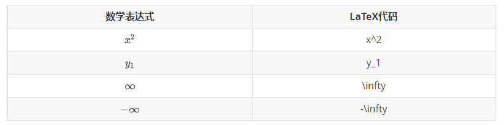
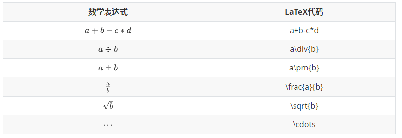
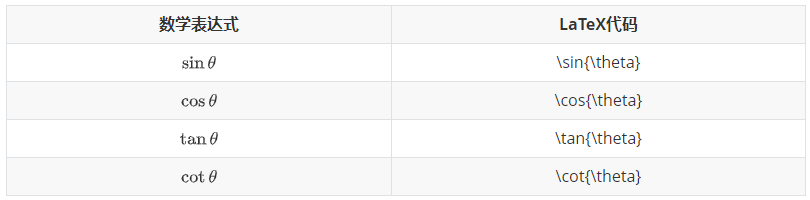
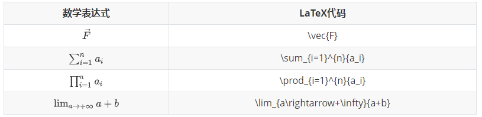
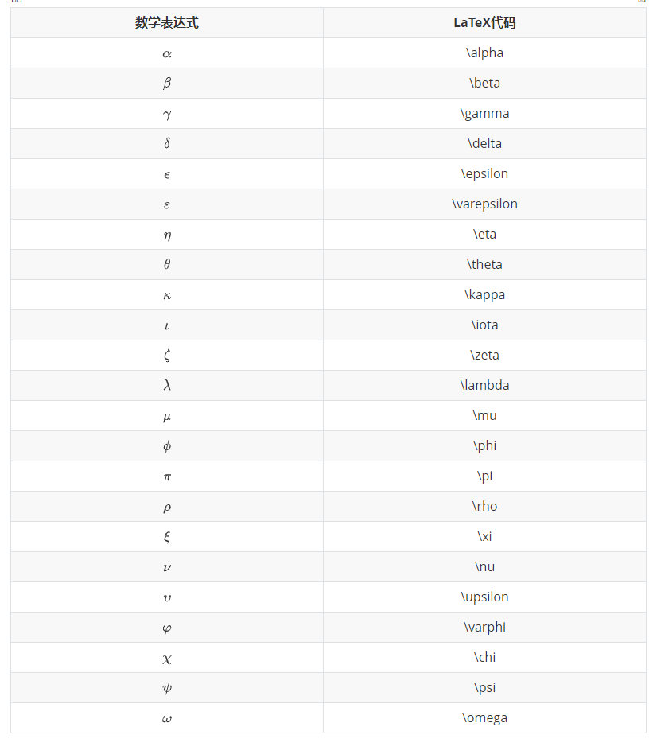
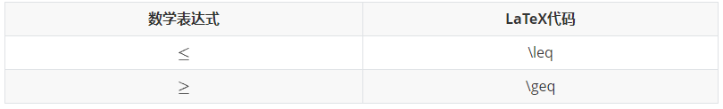
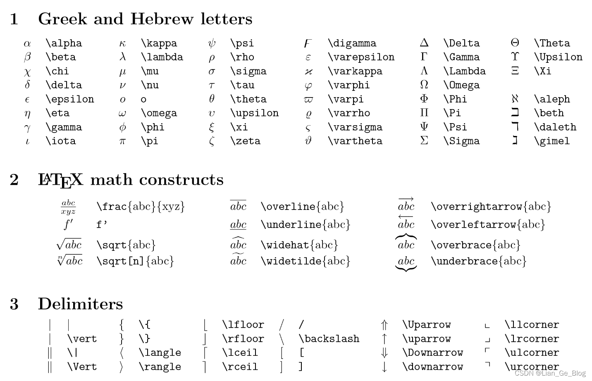
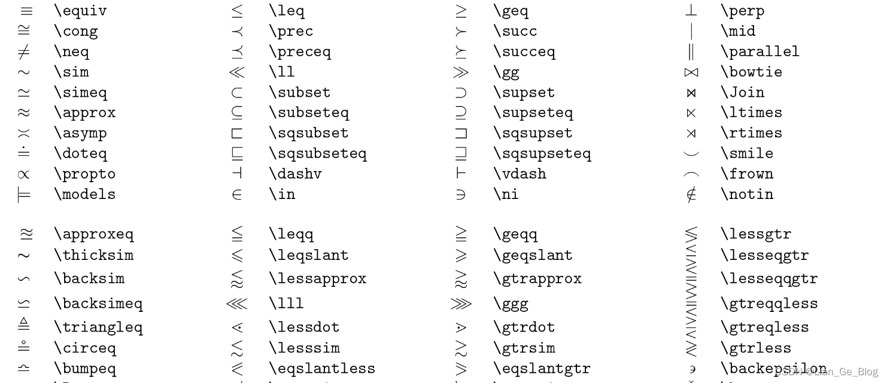
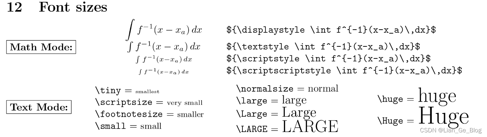
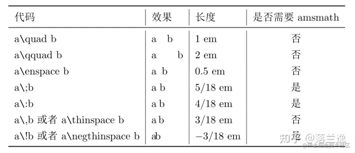

# 公式使用技巧

## 行内公式使用：

在设置中打开内联公式。使用快捷键$  +  ```ESC``` ，并将公式包裹在```$ $```之间


## 常用LaTeX代码：
















箭头


等于号变体



字体



符号⊕： 
$$
\oplus
$$
空格：



## 矩阵：

```latex
无括号
式子序号使用   \tag{1}
$$
\begin{matrix}
 1 & 2 & 3 \\
 4 & 5 & 6 \\
 7 & 8 & 9 
\end{matrix} \tag{1}
$$
```

$$
\begin{matrix}
 1 & 2 & 3 \\
 4 & 5 & 6 \\
 7 & 8 & 9 
\end{matrix} \tag{1}
$$

> ### 带括号的矩阵

```latex
$$
 \left\{
 \begin{matrix}
   1 & 2 & 3 \\
   4 & 5 & 6 \\
   7 & 8 & 9
  \end{matrix}
  \right\} \tag{2}
$$
```

```latex
$$
 \left[
 \begin{matrix}
   1 & 2 & 3 \\
   4 & 5 & 6 \\
   7 & 8 & 9
  \end{matrix}
  \right] \tag{3}
$$
```

```latex
$$
 \left(
 \begin{matrix}
   1 & 2 & 3 \\
   4 & 5 & 6 \\
   7 & 8 & 9
  \end{matrix}
  \right) \tag{4}
$$
```


> ### 行省略号`\cdots`，列省略号`\vdots`，斜向省略号（左上至右下）`\ddots`

```latex
$$
 \left\{
 \begin{matrix}
 1      & 2        & \cdots & 5        \\
 6      & 7        & \cdots & 10       \\
 \vdots & \vdots   & \ddots & \vdots   \\
 \alpha & \alpha+1 & \cdots & \alpha+4 
 \end{matrix}
 \right\}
$$
```

$$
\left\{
 \begin{matrix}
 1      & 2        & \cdots & 5        \\
 6      & 7        & \cdots & 10       \\
 \vdots & \vdots   & \ddots & \vdots   \\
 \alpha & \alpha+1 & \cdots & \alpha+4 
 \end{matrix}
 \right\}
$$


## 行列式

```latex
$$
 \begin{vmatrix}
   1 & 2 & 3 \\
   4 & 5 & 6 \\
   7 & 8 & 9
  \end{vmatrix}
\tag{7}
$$
```

$$
\begin{vmatrix}
   1 & 2 & 3 \\
   4 & 5 & 6 \\
   7 & 8 & 9
  \end{vmatrix}
\tag{7}
$$


## 多行等式对齐

```latex
$$
\begin{aligned}
a &= b + c \\
  &= d + e + f
\end{aligned}
$$
```

$$
\begin{aligned}
a &= b + c \\
  &= d + e + f
\end{aligned}
$$


## 方程组

```latex
$$
\begin{cases}
3x + 5y +  z \\
7x - 2y + 4z \\
-6x + 3y + 2z
\end{cases}
$$
```

$$
\begin{cases}
3x + 5y +  z \\
7x - 2y + 4z \\
-6x + 3y + 2z
\end{cases}
$$

```latex
$$
f(n) =
\begin{cases} 
n/2,  & \text{if }n\text{ is even} \\
3n+1, & \text{if }n\text{ is odd}
\end{cases}
$$
```

$$
f(n) =
\begin{cases} 
n/2,  & \text{if }n\text{ is even} \\
3n+1, & \text{if }n\text{ is odd}
\end{cases}
$$

