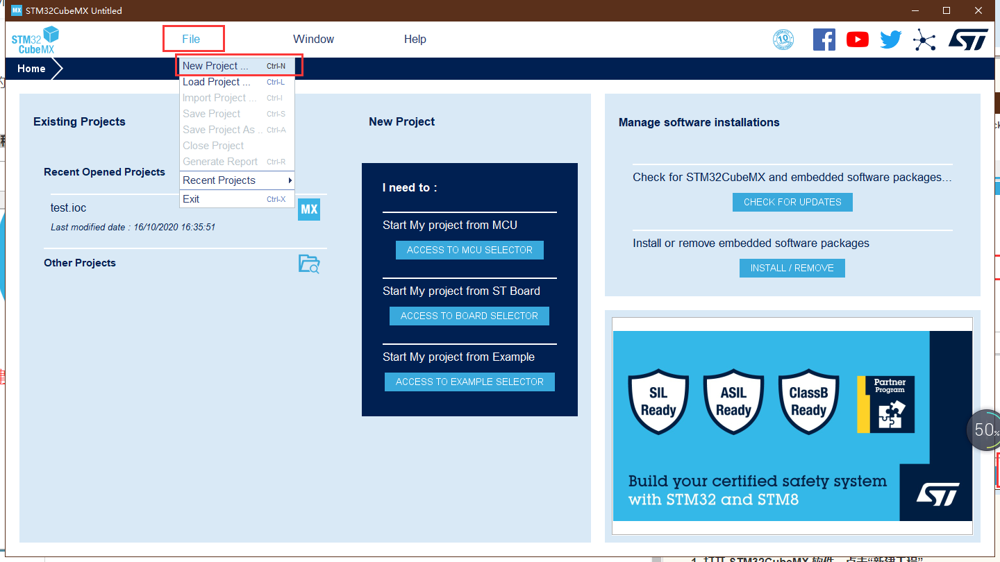
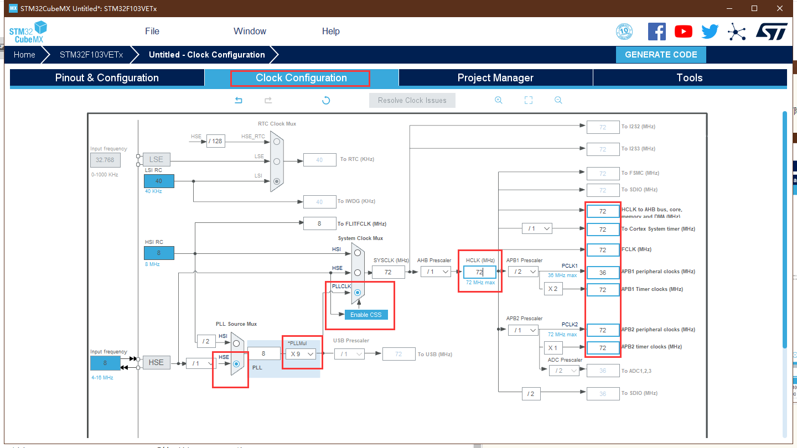
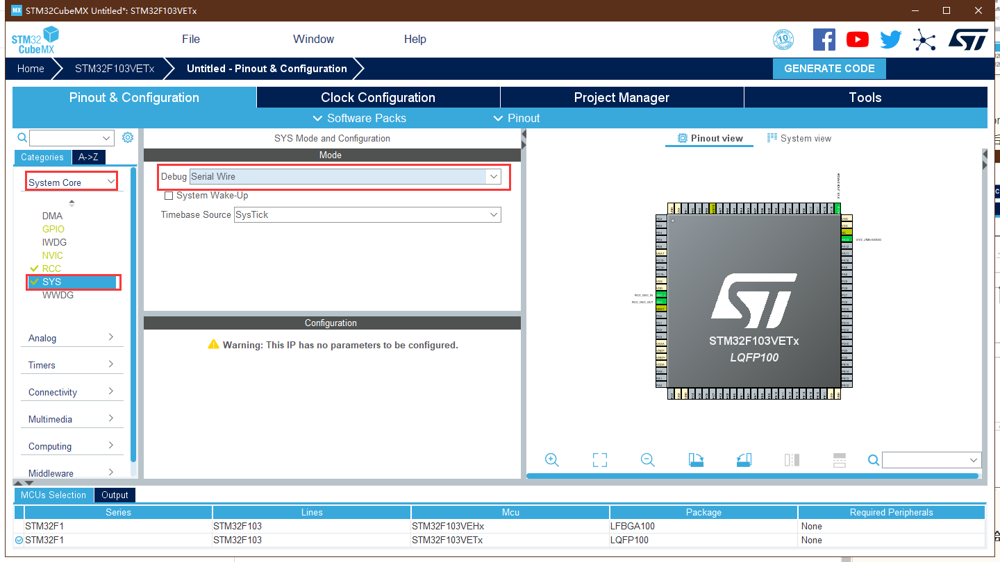
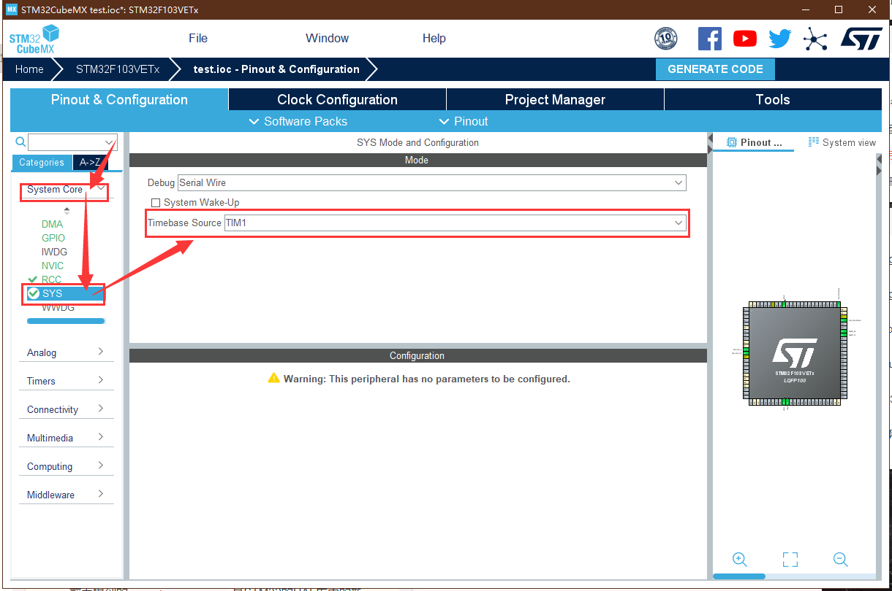
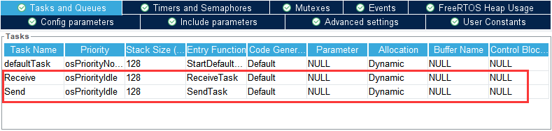
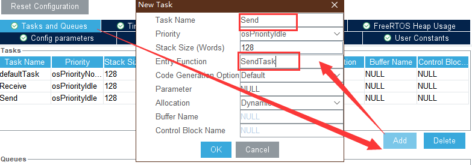
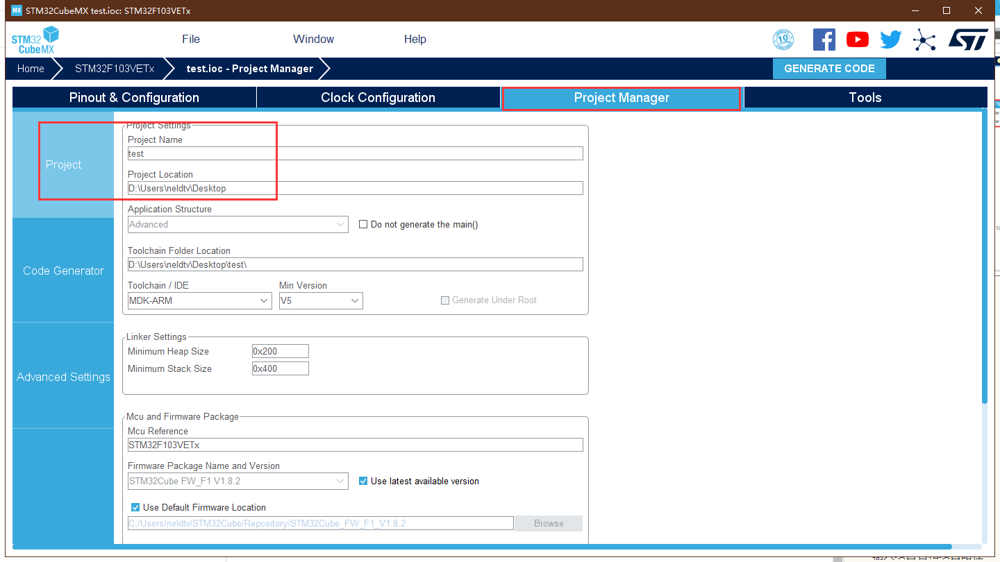

# STM32CubeMX + FreeRTOS实时操作系统

## 一、[FreeRTOS](https://so.csdn.net/so/search?q=FreeRTOS&spm=1001.2101.3001.7020)简介

> FreeRTOS 是一个可裁剪、可剥夺型的多任务内核，而且没有任务数限制。FreeRTOS 提供了实时操作系统所需的所有功能，包括资源管理、同步、任务通信等。
>
> FreeRTOS 是用 C 和汇编来写的，其中绝大部分都是用 C 语言编写的，只有极少数的与处理器密切相关的部分代码才是用汇编写的，FreeRTOS 结构简洁，可读性很强！最主要的是非常适合初次接触[嵌入式](https://so.csdn.net/so/search?q=嵌入式&spm=1001.2101.3001.7020)实时操作系统学生、嵌入式系统开发人员和爱好者学习。
>
> 最新版本 V9.0.0（2016年），尽管现在 FreeRTOS 的版本已经更新到 V10.4.1 了，但是我们还是选择 V9.0.0，因为内核很稳定，并且网上资料很多，因为 V10.0.0 版本之后是亚马逊收购了FreeRTOS之后才出来的版本，主要添加了一些云端组件，一般采用 V9.0.0 版本足以。

- FreeRTOS官网：http://www.freertos.org/
- 代码托管网站：https://sourceforge.net/projects/freertos/files/FreeRTOS/

## 二、新建工程

**1. 打开 STM32CubeMX 软件，点击“新建工程”**

**2. 选择 MCU 和封装**

**3. 配置时钟**
RCC 设置，选择 HSE(外部高速时钟) 为 Crystal/Ceramic Resonator(晶振/陶瓷谐振器)

选择 Clock Configuration，配置系统时钟 SYSCLK 为 72MHz
修改 HCLK 的值为 72 后，输入回车，软件会自动修改所有配置

**4. 配置调试模式**
**非常重要的一步，否则会造成第一次烧录程序后续无法识别调试器**
SYS 设置，选择 Debug 为 Serial Wire

## 三、SYS Timebase Source

在 `System Core` 中选择 `SYS` ，对 `Timebase Source` 进行设置，选择 `TIM1` 作为HAL库的时基（除了 `SysTick` 外都可以）。

在基于STM32 HAL的项目中，一般需要维护的 “时基” 主要有2个：

1. HAL的时基，SYS Timebase Source
2. OS的时基（仅在使用OS的情况下才考虑）

而这些 “时基” 该去如何维护，主要分为两种情况考虑：

- **裸机运行**：
  可以通过 `SysTick`（滴答定时器）或 （`TIMx`）定时器 的方式来维护 `SYS Timebase Source`，也就是HAL库中的 `uwTick`，这是HAL库中维护的一个全局变量。在裸机运行的情况下，我们一般选择默认的 `SysTick`（滴答定时器） 方式即可，也就是直接放在 `SysTick_Handler()` 中断服务函数中来维护。

- **带OS运行**：
  前面提到的 `SYS Timebase Source` 是STM32的HAL库中的新增部分，主要用于实现 `HAL_Delay()` 以及作为各种 timeout 的时钟基准。

  在使用了OS（操作系统）之后，OS的运行也需要一个时钟基准（简称“时基”），来对任务和时间等进行管理。而OS的这个 时基 一般也都是通过 `SysTick`（滴答定时器） 来维护的，这时就需要考虑 “HAL的时基” 和 “OS的时基” 是否要共用 `SysTick`（滴答定时器） 了。

  如果共用SysTick，当我们在CubeMX中选择启用FreeRTOS之后，在生成代码时，CubeMX一定会报如下提示：
  

> 强烈建议用户在使用FreeRTOS的时候，不要使用 `SysTick`（滴答定时器）作为 “HAL的时基”，因为FreeRTOS要用，最好是要换一个！！！如果共用，潜在一定风险。

## 四、FreeRTOS

### 4.1 参数配置

在 `Middleware` 中选择 `FREERTOS` 设置，并选择 `CMSIS_V1` 接口版本

> 
> CMSIS是一种接口标准，目的是屏蔽软硬件差异以提高软件的兼容性。RTOS v1使得软件能够在不同的实时操作系统下运行（屏蔽不同RTOS提供的API的差别)，而RTOS v2则是拓展了RTOS v1，兼容更多的CPU架构和实时操作系统。因此我们在使用时可以根据实际情况选择，如果学习过程中使用STM32F1、F4等单片机时没必要选择RTOS v2，更高的兼容性背后时更加冗余的代码，理解起来比较困难。

在 `Config parameters` 进行具体参数配置。

**Kernel settings：**

- **USE_PREEMPTION：** `Enabled`：RTOS使用抢占式调度器；Disabled：RTOS使用协作式调度器（时间片）。
- **TICK_RATE_HZ：** 值设置为`1000`，即周期就是1ms。RTOS系统节拍中断的频率，单位为HZ。
- **MAX_PRIORITIES：** 可使用的最大优先级数量。设置好以后任务就可以使用从0到（MAX_PRIORITIES - 1）的优先级，其中0位最低优先级，（MAX_PRIORITIES - 1）为最高优先级。
- **MINIMAL_STACK_SIZE：** 设置空闲任务的最小任务堆栈大小，以字为单位，而不是字节。如该值设置为`128` Words，那么真正的堆栈大小就是 128*4 = 512 Byte。
- **MAX_TASK_NAME_LEN：** 设置任务名最大长度。
- **IDLE_SHOULD_YIELD：** `Enabled` 空闲任务放弃CPU使用权给其他同优先级的用户任务。
- **USE_MUTEXES：** 为1时使用互斥信号量，相关的API函数会被编译。
- **USE_RECURSIVE_MUTEXES：** 为1时使用递归互斥信号量，相关的API函数会被编译。
- **USE_COUNTING_SEMAPHORES：** 为1时启用计数型信号量， 相关的API函数会被编译。
- **QUEUE_REGISTRY_SIZE：** 设置可以注册的队列和信号量的最大数量，在使用内核调试器查看信号量和队列的时候需要设置此宏，而且要先将消息队列和信号量进行注册，只有注册了的队列和信号量才会在内核调试器中看到，如果不使用内核调试器的话次宏设置为0即可。
- **USE_APPLICATION_TASK_TAG：** 为1时可以使用vTaskSetApplicationTaskTag函数。
- **ENABLE_BACKWARD_COMPATIBILITY：** 为1时可以使V8.0.0之前的FreeRTOS用户代码直接升级到V8.0.0之后，而不需要做任何修改。
- **USE_PORT_OPTIMISED_TASK_SELECTION：** FreeRTOS有两种方法来选择下一个要运行的任务，一个是通用的方法，另外一个是特殊的方法，也就是硬件方法，使用MCU自带的硬件指令来实现。STM32有计算前导零指令吗，所以这里强制置1。
- **USE_TICKLESS_IDLE：** 置1：使能低功耗tickless模式；置0：保持系统节拍（tick）中断一直运行。假设开启低功耗的话可能会导致下载出现问题，因为程序在睡眠中，可用ISP下载办法解决。
- **USE_TASK_NOTIFICATIONS：** 为1时使用任务通知功能，相关的API函数会被编译。开启了此功能，每个任务会多消耗8个字节。
- **RECORD_STACK_HIGH_ADDRESS：** 为1时栈开始地址会被保存到每个任务的TCB中（假如栈是向下生长的）。

**Memory management settings：**

- **Memory Allocation：** `Dynamic/Static` 支持动态/静态内存申请
- **TOTAL_HEAP_SIZE：** 设置堆大小，如果使用了动态内存管理，FreeRTOS在创建 task, queue, mutex, software timer or semaphore的时候就会使用heap_x.c(x为1~5)中的内存申请函数来申请内存。这些内存就是从堆ucHeap[configTOTAL_HEAP_SIZE]中申请的。
- **Memory Management scheme：** 内存管理策略 `heap_4`。

**Hook function related definitions：**

- **USE_IDLE_HOOK：** 置1：使用空闲钩子（Idle Hook类似于回调函数）；置0：忽略空闲钩子。
- **USE_TICK_HOOK：** 置1：使用时间片钩子（Tick Hook）；置0：忽略时间片钩子。
- **USE_MALLOC_FAILED_HOOK：** 使用内存申请失败钩子函数。
- **CHECK_FOR_STACK_OVERFLOW：** 大于0时启用堆栈溢出检测功能，如果使用此功能用户必须提供一个栈溢出钩子函数，如果使用的话此值可以为1或者2，因为有两种栈溢出检测方法。

**Run time and task stats gathering related definitions：**

- **GENERATE_RUN_TIME_STATS：** 启用运行时间统计功能。
- **USE_TRACE_FACILITY：** 启用可视化跟踪调试。
- **USE_STATS_FORMATTING_FUNCTIONS：** 与宏configUSE_TRACE_FACILITY同时为1时会编译下面3个函数prvWriteNameToBuffer()、vTaskList()、vTaskGetRunTimeStats()。

**Co-routine related definitions：**

- **USE_CO_ROUTINES：** 启用协程。
- **MAX_CO_ROUTINE_PRIORITIES：** 协程的有效优先级数目。

**Software timer definitions：**

- **USE_TIMERS：** 启用软件定时器。

**Interrupt nesting behaviour configuration：**

- **LIBRARY_LOWEST_INTERRUPT_PRIORITY：** 中断最低优先级。
- **LIBRARY_LOWEST_INTERRUPT_PRIORITY：** 系统可管理的最高中断优先级。

###  4.2   创建任务Task

我们创建两个任务，一个消息接收任务，一个消息发送任务。

- **Task Name：** 任务名称
- **Priority：** 优先级，在 FreeRTOS 中，数值越大优先级越高，0 代表最低优先级
- **Stack Size (Words)：** 堆栈大小，单位为字，在32位处理器（STM32），一个字等于4字节，如果传入512那么任务大小为512*4字节
- **Entry Function：** 入口函数
- **Code Generation Option：** 代码生成选项
- **Parameter：** 任务入口函数形参，不用的时候配置为0或NULL即可
- **Allocation：** 分配方式：`Dynamic` 动态内存创建
- **Buffer Name：** 缓冲区名称
- **Conrol Block Name：** 控制块名称

## 五、UART串口打印

 一样的用法

## 六、生成代码

输入项目名和项目路径

选择应用的 IDE 开发环境 EIDE

每个外设生成独立的 `’.c/.h’` 文件
不勾：所有初始化代码都生成在 main.c
勾选：初始化代码生成在对应的外设文件。 如 GPIO 初始化代码生成在 gpio.c 中。
点击 GENERATE CODE 生成代码