# WTR  Ubuntu 通识

Data:  2024-02-21

Author: Liam  

本章内容目的： 了解 Linux 系统架构，文件架构，常见命令, 使用技巧...    ---  妄图提高大家自己搜索解决问题的能力

铺垫 `ROS2`

目录

* 简介和安装
* 文件系统结构
* 常用命令
* 环境变量位置
* 好用的工具

## 0  简介和安装

Linux 和我们熟知的 Windows 一样，都是 `操作系统` 。简单说，操作系统是 管理 计算机硬件 和 所有应用程序 的 `系统软件` 。

它对下管理机器所有的硬件，对上管理着应用程序。

负责加载、运行、调度、终止应用程序，并提供编程接口和服务给应用程序调用（使用各种硬件资源），完成各种各样的功能。

### 0.0   安装Linux

* 双系统的安装方法
* 虚拟机安装方法 VMware


### 0.1   登录

Linux用户可以有如下两种登录方式：

- Linux主机直接登录
- 在另一台电脑远程登录

```shell
ssh  192.168.0.1 -p 22
```


0.2   切换root 用户

一般情况下，执行高级权限操作 我们习惯于通过一般用户提权的方式来运行 `sudo`

```shell
sudo apt update
```

但是有些操作依然无法进行，这时候就需要进入root账户：

```shell
sudo passwd root

su
```


## 1  文件系统

Linux中，文件是个非常广泛的概念。

Linux中的文件，不仅指磁盘上的文本、图片、视频文件，也包括硬件设备，比如串口、声卡、输入设备、输出设备等。

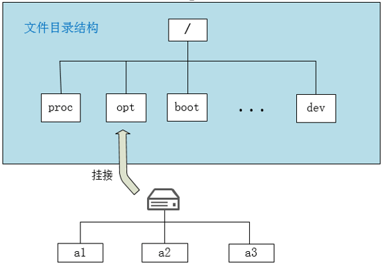

根据  [Filesystem Hierarchy Standard](https://refspecs.linuxfoundation.org/FHS_3.0/fhs-3.0.pdf):  

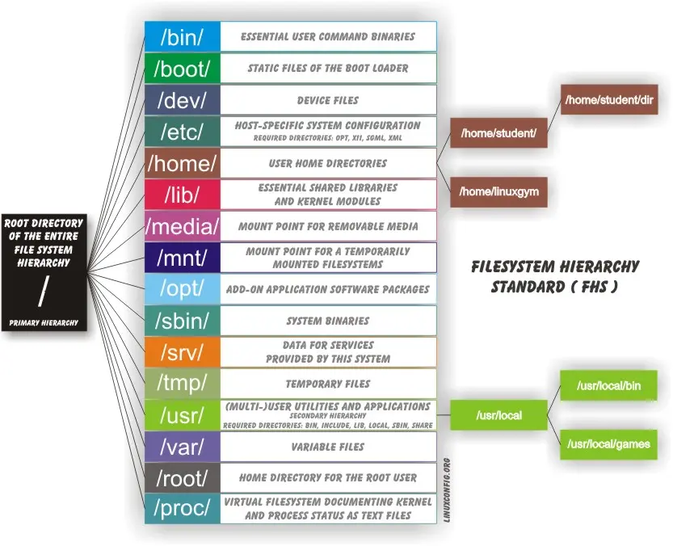

### 根目录：

| 目录           | 说明                                                         |
| -------------- | ------------------------------------------------------------ |
| /bin           | 所有用户可用的基本命令程序文件                               |
| /boot          | 引导加载器必须用到的各静态文件，如kernel、ramfs（initrd），以及grub(bootloader)等 |
| /dev           | 设备文件与特殊文件                                           |
| /etc           | 系统程序的静态配置文件                                       |
| /home          | 普通的家目录的集中位置；一般每个普通用户的家目录默认为此目录下与用户名同名的子目录 |
| /lib           | 为系统启动或根文件系统上的应用程序（/bin,/sbin等）提供共享库，以及为内核提供内核模块 |
| /lib64         | 特定字长系统上的库文件，如64位系统上为/lib64                 |
| /media         | 挂载点目录，通常用来挂载移动设备                             |
| /mnt           | 挂载点目录，通常挂载额外的临时文件系统                       |
| /opt, /options | 附加应用程序的安装位置，可选                                 |
| /proc          | 虚拟文件系统，用于为内核及进程存储其相关信息                 |
| /root          | 管理员的家目录，可选                                         |
| /run           | 存放动态的，不持久的应用程序运行数据                         |
| /sbin          | 供管理员使用的工具程序                                       |
| /srv           | 系统上运行的服务用到的数据                                   |
| /sys           | sysfs虚拟文件系统提供了一种比proc更为理想的访问内核数据的途径；其主要作用在于为管理Linux设备提供一种统一模型的的接口 |
| /tmp           | 临时文件                                                     |
| /usr           | 全局共享的只读数据路径                                       |
| /var           | 频繁发生变化的文件                                           |
| /misc          | 备用目录，可选                                               |
| /selinux       | SELinux（Security Enhanced Linux）相关的安全策略等信息的存储位置 |


### /usr目录层级

usr意为universal shared read-only file，全局共享只读文件，即该目录可以在所有遵循FHS的主机间共享（只读）

| 目录           | 说明                                                         |
| -------------- | ------------------------------------------------------------ |
| /usr/include   | C程序头文件                                                  |
| /usr/bin       | 普通用户命令                                                 |
| /usr/sbin      | 供管理员使用的命令                                           |
| /usr/lib       | 库文件                                                       |
| /usr/lib<qual> | 特定字长系统上的库文件，如64位系统上为/usr/lib64             |
| /usr/share     | 命令手册也和自带文档等架构特有的文件的存储位置，例如doc, man等 |
| /usr/X11R6     | X-Window程序的安装位置（可选）                               |
| /usr/src       | 程序源码文件的存储位置                                       |
| /usr/local     | 第三方软件的安装路径，也是一个独立层级                       |
| /usr/games     | 游戏或教育程序                                               |


### /usr/local：local目录层级

/usr/local层次结构是供系统管理员在本地安装软件时使用的。当系统软件更新时，它需要安全，不被覆盖。它可用于在一组主机之间共享的程序和数据，但不在/usr中找到。 本地安装的软件必须放置在/usr/local中，而不是/usr，除非正在安装以替换或升级/usr中的软件。

| 目录 | 描述 |
|-----|------|
| bin | 本地二进制文件 |
| etc | 本地二进制文件的主机特定系统配置 |
| games | 本地游戏二进制文件 |
| include | 本地C头文件 |
| lib | 本地库文件 |
| man | 本地在线手册 |
| sbin | 本地系统二进制文件 |
| share | 本地与架构无关的层次结构 |
| src | 本地源代码 |

### /var目录层级

```csharp
/var目录包含变量数据文件。这包括守护进程目录和文件、管理和日志数据以及瞬态和临时文件。

/var的一些部分在不同系统之间不可共享。例如，/var/log、/var/lock和/var/run。其他部分可以共享，尤其是/var/mail、/var/cache/man、/var/cache/fonts和/var/spool/news。

/var在这里指定是为了使得可以将/usr挂载为只读。在系统操作期间写入的所有原本存放在/usr中的内容（而不是在安装和软件维护期间）必须放在/var中。

如果无法将/var创建为单独的分区，则通常最好将/var移到根分区之外并放入/usr分区中。（有时会这样做以减小根分区的大小或在根分区空间不足时。）但是，/var不能链接到/usr，因为这样会使得/usr和/var的分离变得更加困难，并可能造成命名冲突。相反，将/var链接到/usr/var。

应用程序通常不应向/var的顶层添加目录。只有当这些目录具有某种系统范围的影响，并在与FHS邮件列表协商后，才应添加这些目录。
```

| 目录       | 说明                                              |
| ---------- | ------------------------------------------------- |
| /var/log   | 日志目录及文件                                    |
| /var/run   | 运行中的进程相关的数据，通常用于存放进程的PID文件 |
| /var/cache | 应用程序缓存数据目录                              |
| /var/lib   | 应用程序状态信息数据                              |
| /var/local | 专用于为/usr/local下的应用程序存储可变数据        |
| /var/opt   | 专用于为/opt下的应用程序存储可变数据              |
| /var/spool | 应用程序数据池                                    |
| /vat/tmp   | 保存系统两次重启之间产生的临时数据                |


### /sys目录内容

| sys 下的子目录                                               | 所包含的内容                                                 |
| ------------------------------------------------------------ | ------------------------------------------------------------ |
| /sys/devices                                                 | 这是内核对系统中所有设备的分层次表达模型，也是 /sys 文件系统管理设备的最重要的目录结构，下文会对它的内部结构作进一步分析； |
| /sys/dev                                                     | 这个目录下维护一个按字符设备和块设备的主次号码(major:minor)链接到真实的设备(/sys/devices下)的符号链接文件，它是在内核 2.6.26 首次引入； |
| /sys/bus                                                     | 这是内核设备按总线类型分层放置的目录结构， devices 中的所有设备都是连接于某种总线之下，在这里的每一种具体总线之下可以找到每一个具体设备的符号链接，它也是构成 Linux 统一设备模型的一部分； |
| /sys/class                                                   | 这是按照设备功能分类的设备模型，如系统所有输入设备都会出现在 /sys/class/input 之下，而不论它们是以何种总线连接到系统。它也是构成 Linux 统一设备模型的一部分； |
| /sys/block                                                   | 这里是系统中当前所有的块设备所在，按照功能来说放置在 /sys/class 之下会更合适，但只是由于历史遗留因素而一直存在于 /sys/block, 但从 2.6.22 开始就已标记为过时，只有在打开了 CONFIG_SYSFS_DEPRECATED 配置下编译才会有这个目录的存在，并且在 2.6.26 内核中已正式移到 /sys/class/block, 旧的接口 /sys/block 为了向后兼容保留存在，但其中的内容已经变为指向它们在 /sys/devices/ 中真实设备的符号链接文件； |
| /sys/firmware                                                | 这里是系统加载固件机制的对用户空间的接口，关于固件有专用于固件加载的一套API，在附录 LDD3 一书中有关于内核支持固件加载机制的更详细的介绍； |
| /sys/fs                                                      | 这里按照设计是用于描述系统中所有文件系统，包括文件系统本身和按文件系统分类存放的已挂载点，但目前只有 fuse,gfs2 等少数文件系统支持 sysfs 接口，一些传统的虚拟文件系统(VFS)层次控制参数仍然在 sysctl (/proc/sys/fs) 接口中； |
| /sys/kernel                                                  | 这里是内核所有可调整参数的位置，目前只有 uevent_helper, kexec_loaded, mm, 和新式的 slab 分配器等几项较新的设计在使用它，其它内核可调整参数仍然位于 sysctl (/proc/sys/kernel) 接口中 ; |
| /sys/module                                                  | 这里有系统中所有模块的信息，不论这些模块是以内联(inlined)方式编译到内核映像文件(vmlinuz)中还是编译为外部模块(ko文件)，都可能会出现在 /sys/module 中： ● 编译为外部模块(ko文件)在加载后会出现对应的 /sys/module/<module_name>/, 并且在这个目录下会出现一些属性文件和属性目录来表示此外部模块的一些信息，如版本号、加载状态、所提供的驱动程序等； ● 编译为内联方式的模块则只在当它有非0属性的模块参数时会出现对应的 /sys/module/<module_name>, 这些模块的可用参数会出现在 /sys/modules//parameters/<param_name> 中， ●● 如 /sys/module/printk/parameters/time 这个可读写参数控制着内联模块 printk 在打印内核消息时是否加上时间前缀； ●● 所有内联模块的参数也可以由 “<module_name>.<param_name>=” 的形式写在内核启动参数上，如启动内核时加上参数 “printk.time=1” 与 向 “/sys/module/printk/parameters/time” 写入1的效果相同； ● 没有非0属性参数的内联模块不会出现于此。 |
| /sys/power                                                   | 这里是系统中电源选项，这个目录下有几个属性文件可以用于控制整个机器的电源状态，如可以向其中写入控制命令让机器关机、重启等。 |
| /sys/slab (对应 2.6.23 内核，在 2.6.24 以后移至 /sys/kernel/slab) | 从2.6.23 开始可以选择 SLAB 内存分配器的实现，并且新的 SLUB（Unqueued Slab Allocator）被设置为缺省值；如果编译了此选项，在 /sys 下就会出现 /sys/slab ，里面有每一个 kmem_cache 结构体的可调整参数。对应于旧的 SLAB 内存分配器下的 /proc/slabinfo 动态调整接口，新式的 /sys/kernel/slab/<slab_name> 接口中的各项信息和可调整项显得更为清晰。 |

### /etc

| 目录           | 描述                 |
| -------------- | -------------------- |
| /etc/opt       | /opt下程序的配置文件 |
| /etc/sysconfig | 系统级别应用配置     |
| /etc/init.d    | 系统服务脚本         |
| /etc/X11       | X协议相关配置文件    |
| /etc/sgml      | SGML相关配置文件     |
| /etc/xml       | XML相关配置          |


目录挂载命令

```shell
mount
```


## 2   文件权限和目录配置

### 2.1  使用者和群组

* 文件拥有者
* 群组
* 其他人

### 2.2  文件权限

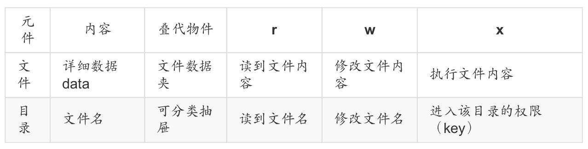

如何更改 文件权限

```shell
chmod
```

- 4：读权限（r）
- 2：写权限（w）
- 1：执行权限（x）

```shell
#更改文件所有者
chown
#更改文件群组
chgrp
```


### 2.3   文件种类 无扩展名！

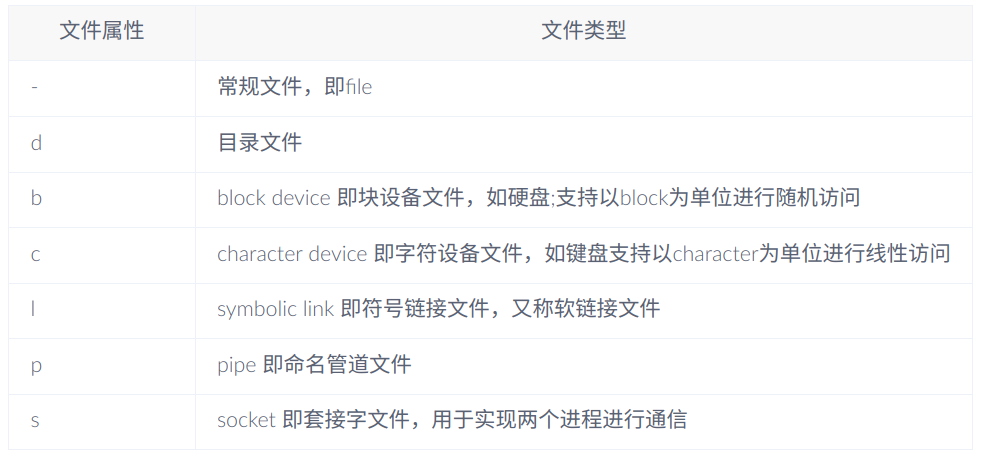


## 3    Linux 文件与目录管理

### 3.1    相对路径和绝对路径

**绝对路径**： 绝对路径 开始于根目录，沿着目录层级，一直到达所期望的目录或文件。

比如下图

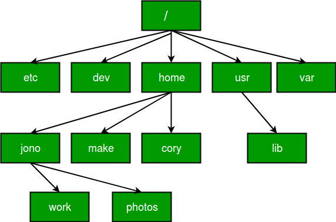

其 中的 photos（假设它是个目录） 的绝对路径 就是 `/home/jono/photos`

我们要进入到 photos这个目录，就执行命令 `cd /home/jono/photos`


**相对路径**：

相对路径相对的是 当前目录。

在使用相对路径的过程中， 经常用到一对特殊符号 `.` (点) 和 `..` (两个点)。

符号 `.` 指的是当前目录，`..` 指的是当前目录的父目录。

根据上面的图，假如当前目录为 jono ，如果要用相对路径切换到photos,就这样写 `cd ./photos` ，也可以直接写 `cd photos` ，

假如当前目录为 cory ，如果要用相对路径切换到 photos,就这样写 `cd ../jono/photos` 。其中 两个点 `..` 表示上级目录。当然也可以使用绝对路径 `cd /home/jono/photos`


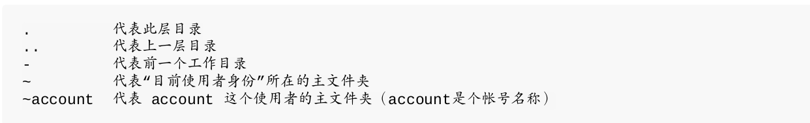


### 3.2  目录相关操作

* cd：变换目录
* pwd：显示目前的目录
* mkdir：创建一个新的目录
* rmdir：删除一个空的目录
* cd （change directory, 变换目录）
* ls
* cp
* rm
* mv
* pwd
* dirname


环境变量

```shell
$PATH
```

#### 通配符


常用的通配符有下面：

* `*` 匹配任意 `多个` 字符（包括零个或一个）
* `?` 匹配任意 `一个` 字符（不包括零个）
* `[abcd]` 匹配abcd中任意一个字符

下面是一些示例的用法

* `*` 表示 所有文件（或目录）
* `by*` 表示 文件名以“by”开头的文件（或目录）
* `by*.py` 表示 以"by"开头，中间有任意多个字符，并以".py"结尾的文件（或目录）
* `byhy????` 表示 以“byhy”开头，其后紧接着 `4个字符` 的文件（或目录）
* [byh]*` 表示 文件名以"b",“y”,或"h"开头的文件（或目录）` 
* `byhy[0-9][0-9]` 表示 以"byhy"开头，并紧接着2个数字的文件（或目录）
* 很多 Linux命令，只要它们使用的参数是文件名，都可以使用通配符， 比如 `ls、cp、rm、mv `等等


### 3.3   文件内容查询

* cat 由第一行开始显示文件内容
* tac 从最后一行开始显示，可以看出 tac 是 cat 的倒着写！
* nl 显示的时候，顺道输出行号！
* more 一页一页的显示文件内容
* less 与 more 类似，但是比 more 更好的是，他可以往前翻页！
* head 只看头几行
* tail 只看尾巴几行
* od 以二进制的方式读取文件内容！


### 3.4   观察文件类型：file

由于Linux并不依赖扩展名识别文件类型，所以需要使用file查看


## 4 指令与文件的搜寻

### which （寻找“可执行文件”）

完整文件名

### 件文件名的搜寻

```shell
whereis （由一些特定的目录中寻找文件文件名）
locate
find
```


## 5   文件压缩

Linux常见压缩指令

* *.zip   &emsp;  &emsp; &emsp; zip 程序压缩的文件；
* *.gz     &emsp;  &emsp; &emsp;    gzip 程序压缩的文件；
* *.bz2     &emsp;  &emsp; &emsp;   bzip2 程序压缩的文件；
* *.xz     &emsp;  &emsp; &emsp;    xz 程序压缩的文件；
* *.tar     &emsp;  &emsp; &emsp;   tar 程序打包的数据，并没有压缩过；
* *.tar.gz   &emsp;  &emsp; &emsp;  tar 程序打包的文件，其中并且经过 gzip 的压缩
* *.tar.bz2  &emsp;  &emsp; &emsp;  tar 程序打包的文件，其中并且经过 bzip2 的压缩
* *.tar.xz   &emsp;  &emsp; &emsp;  tar 程序打包的文件，其中并且经过 xz 的压缩

````shell
tar

tar [-z&#124;-j&#124;-J] [xv] [-f 既有的 tar文件名] [-C 目录] &lt;==解压缩
选项与参数：
-c ：创建打包文件，可搭配 -v 来察看过程中被打包的文件名（filename）
-t ：察看打包文件的内容含有哪些文件名，重点在察看“文件名”就是了；
-x ：解打包或解压缩的功能，可以搭配 -C （大写） 在特定目录解开
特别留意的是， -c, -t, -x 不可同时出现在一串命令行中。
-z ：通过 gzip 的支持进行压缩/解压缩：此时文件名最好为 *.tar.gz
-j ：通过 bzip2 的支持进行压缩/解压缩：此时文件名最好为 *.tar.bz2
-J ：通过 xz 的支持进行压缩/解压缩：此时文件名最好为 *.tar.xz
特别留意， -z, -j, -J 不可以同时出现在一串命令行中
-v ：在压缩/解压缩的过程中，将正在处理的文件名显示出来！
-f filename：-f 后面要立刻接要被处理的文件名！建议 -f 单独写一个选项啰！（比较不会忘记）
-C 目录 ：这个选项用在解压缩，若要在特定目录解压缩，可以使用这个选项。
其他后续练习会使用到的选项介绍：
-p（小写） ：保留备份数据的原本权限与属性，常用于备份（-c）重要的配置文件
-P（大写） ：保留绝对路径，亦即允许备份数据中含有根目录存在之意；
--exclude=FILE：在压缩的过程中，不要将 FILE 打包！
```
```
tar -jxv -f /root/etc.tar.bz2 etc/shadow
//单独解开压缩文件的某个文件
```
```
 tar -jcv -f /root/system.tar.bz2 --exclude=/root/etc* \
 //单独不压缩目录中的某些文件
```
````


## [6   Vim 使用](https://zhuanlan.zhihu.com/p/628940845)

### 基础命令：

## 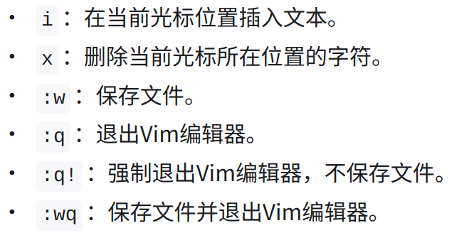 

### 编辑命令：

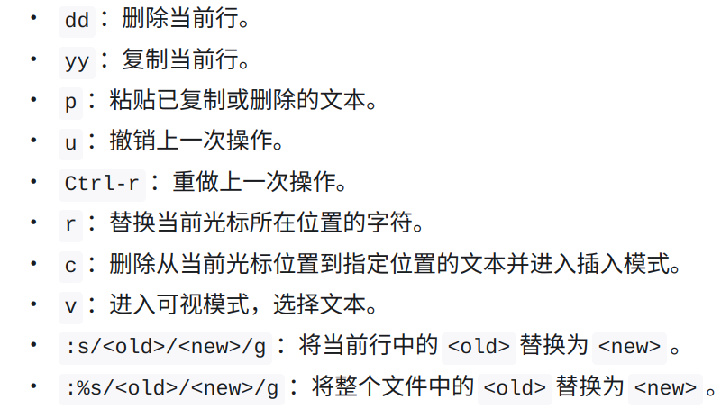

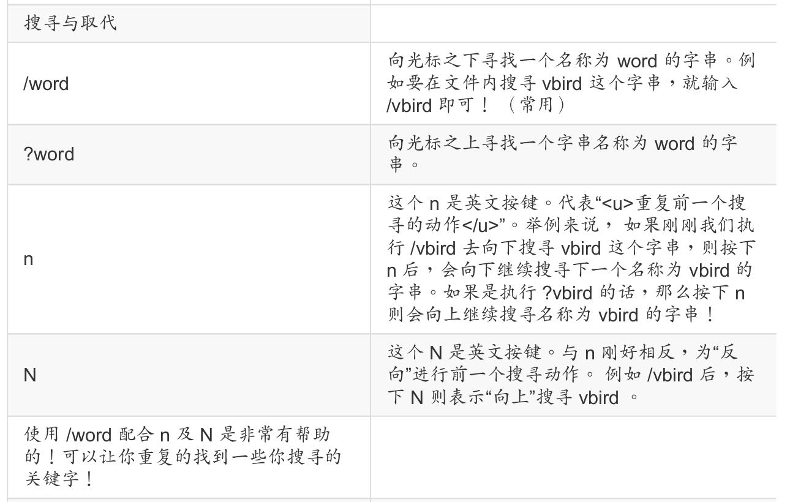

##  7   BASH学习

Shell是系统的用户界面，提供了用户与[内核](https://link.zhihu.com/?target=https%3A//baike.baidu.com/item/%E5%86%85%E6%A0%B8/108410%3FfromModule%3Dlemma_inlink)进行交互操作的一种接口。它接收用户输入的命令并把它送入内核去执行。Shell是一个命令解释器，它解释由用户输入的命令并且把它们送到内核。不仅如此，Shell有自己的编程语言用于对命令的编辑，它允许用户编写由shell命令组成的程序。

常见的shell有以下几种：

1. Bourne Shell (sh) 
2. Bash (Bourne Again Shell): Bash是Bourne Shell的一种改进版本，是大多数Linux系统默认的shell。
3. C Shell (csh): C Shell与Bourne Shell有相似的语法，但添加了C语言的一些特性，如命令行编辑和条件语句。它主要用于BSD系统。
4. fish
5. Zsh (Z Shell)

```shell
#查询当前shell
echo $SHELL
```

终端（英语：Computer terminal），是与计算机系统相连的一种输入输出设备，通常离计算机较远。根据功能不同，可分若干类。具有某些处理功能的终端称为灵巧终端或智能终端，这类终端有它自己的微处理器和控制电路;没有此功能的叫做哑终端，它没有微处理器。支持与计算机会话或处理的终端叫交互终端或联机终端。

　　说白了其实终端就是——人与机器交互的接口

### Shell 的变量功能

```shell
myname = a
echo ${myname}
unset mynme
```

### export： 自订变量转成环境变量

当前设定的变量 经过 export 该终端所调用的子程序将会继承该变量。


### 命名别名

#### 命令别名设置： alias, unalias

```shell
alias | grep l
```


### bash 的环境配置文件

login shell 配置文件读取流程：

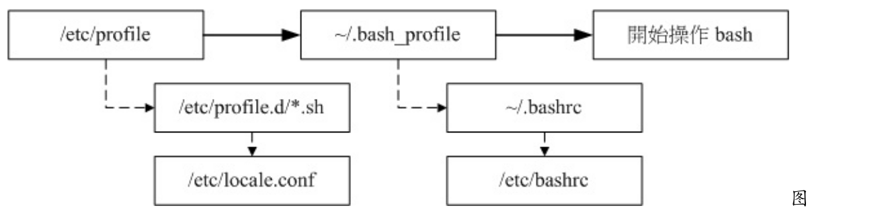

source ：读入环境配置文件的指令

另一个全局环境变量是：

```shell
/etc/environment.d/xx.sh
```


### 数据流重导向

数据流重导向就是将某个指令执行后应该要出现在屏幕上的数据， 给他传输到
其他的地方，例如文件或者是设备 （例如打印机之类的）

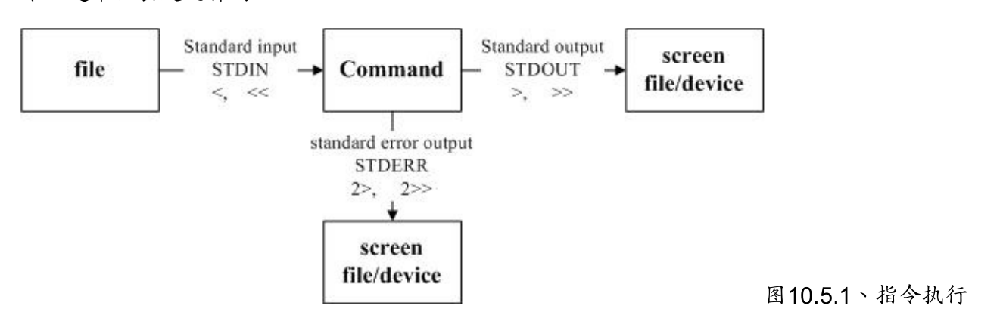

* 标准输入：  `<` or `<<`
* 标准输出： `>` or `>>`
* 标准错误输出：`2>`   or  `2>>`

Linux进程在启动后，通常就会打开3个文件句柄，标准输入文件（stdin），标准输出文件（stdout）和 标准错误文件（stderr）。

Linux进程，要从用户那里读入输入的信息，就是从stdin文件里面读取信息，要 输出 信息 给用户看 都是 输出到 stdout， 要 输出 错误提示 给用户看 都是 输出到 stderr。

而缺省情况下这三个文件stdin、stdout、stderr 都指向 —— 终端设备。


### 管线命令

" | " 是一个界定符号。它被bash解析为将上一个命令的标准输出定向为下一个命令的标准输入。可见，" | "的下一个命令是要能够接收标准输入的。所以，我们将能够**读取标准输入**的命令称为管线命令。

#### 撷取命令(cut、grep)

撷取命令通常是针对 一行一行 来分析，而不是整篇文件分析！

#### 2.1 cut

这个指令可以将一段信息的某一段给切出来，处理的信息是以 行 为单位的！常见用法如下：

```shell
# 范例一
root@ubuntu:~# echo ${PATH}
/usr/local/sbin:/usr/local/bin:/usr/sbin:/usr/bin:/sbin:/bin:/usr/games:/usr/local/games:/snap/bin
root@ubuntu:~# echo ${PATH} | cut -d ':' -f 1
/usr/local/sbin
root@ubuntu:~# echo ${PATH} | cut -d ':' -f 2
/usr/local/bin
root@ubuntu:~# echo ${PATH} | cut -d ':' -f 3
/usr/sbin
root@ubuntu:~# echo ${PATH} | cut -d ':' -f 1,3
/usr/local/sbin:/usr/sbin
root@ubuntu:~# echo ${PATH} | cut -d ':' -f 1-3
/usr/local/sbin:/usr/local/bin:/usr/sbin

```


#### 2.2 grep

cut 是在一行信息中取出某部分我们想要的。而grep是在分析一行信息时，若其中有我们想要的信息，则整行拿出来！常见用法如下：

```shell
ls /dev | grep ttyUSB
```

搭配 **正则表达式** 可以更加强大。


语法表格

> 首先先给出最最基础部分的匹配规则,这个是肯定要会的
>
> | single char (单字符)                      | quantifiers(数量)             | position(位置)             |
> | ----------------------------------------- | ----------------------------- | -------------------------- |
> | \d 匹配数字                               | * 0个或者更多                 | ^一行的开头                |
> | \w 匹配word(数字、字母)                   | + 1个或更多，至少1个          | $一行的结尾                |
> | \W 匹配**非**word(数字、字母)             | ? 0个或1个,一个Optional       | \b 单词"结界"(word bounds) |
> | \s 匹配white space(包括空格、tab等)       | {min,max}出现次数在一个范围内 |                            |
> | \S 匹配**非**white space(包括空格、tab等) | {n}匹配出现n次的              |                            |
> | . 匹配任何，任何的字符                    |                               |                            |

元字符列举

> 以下是一些元字符的列举：
>
> | 元字符 | 描述                                                       |
> | ------ | ---------------------------------------------------------- |
> | .      | 句号匹配任意单个字符除了换行符。                           |
> | [ ]    | 字符种类。匹配方括号内的任意字符。                         |
> | [^ ]   | 否定的字符种类。匹配除了方括号里的任意字符                 |
> | *      | 匹配>=0个重复的在*号之前的字符。                           |
> | +      | 匹配>=1个重复的+号前的字符。                               |
> | ?      | 标记?之前的字符为可选.                                     |
> | {n,m}  | 匹配num个大括号之前的字符或字符集 (n <= num <= m).         |
> | (xyz)  | 字符集，匹配与 xyz 完全相等的字符串.                       |
> | \|     | 或运算符，匹配符号前或后的字符.                            |
> | \      | 转义字符,用于匹配一些保留的字符 `[ ] ( ) { } . * + ? ^ $ \ |
> | ^      | 从开始行开始匹配.                                          |
> | $      | 从末端开始匹配.                                            |

**正则表达式限定符**

| 限定符 | 描述                                                       |
| :----- | :--------------------------------------------------------- |
| .      | 匹配任意的一个字符。                                       |
| ?      | 匹配前面的子表达式，最多一次。                             |
| *      | 匹配前面的子表达式零次或多次。                             |
| +      | 匹配前面的子表达式一次或多次。                             |
| {N}    | 匹配前面的子表达式 N 次。                                  |
| {N,}   | 匹配前面的子表达式 N 次到多次。                            |
| {N,M}  | 匹配前面的子表达式 N 到 M 次，至少 N 次至多 M 次。         |
| -      | 只要不是在序列开始、结尾或者序列的结束点上，表示序列范围。 |
| ^      | 匹配一行开始的空字符串；也表示字符不在要匹配的列表中。     |
| $      | 匹配一行末尾的空字符串。                                   |
| \b     | 匹配一个单词前后的空字符串。                               |
| \B     | 匹配一个单词中间的空字符串。                               |
| \<     | 匹配单词前面的空字符串。                                   |
| \>     | 匹配单词后面的空字符串。                                   |


#### 双向重导向(tee)

tee这个命令，既可以读取标准输入，还能向指定文件输出的同时向标准输出设备输出

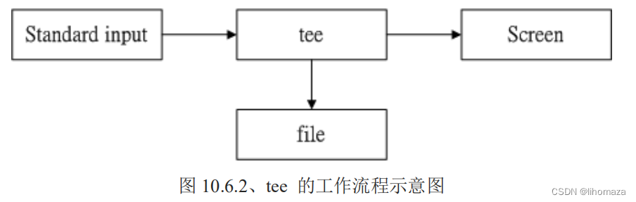

```shell
# tee : ls的输出保存到1.txt的同时输出到终端
root@ubuntu:~# ls -l /home | tee 1.txt | cat
total 12
drwxr-xr-x  5 root   root   4096 3月   8  2022 sqlite3
drwxr-xr-x 16 study  study  4096 11月 15 23:54 study
drwxr-xr-x  2 test   test   4096 11月  9 20:57 test
root@ubuntu:~# cat 1.txt
total 12
drwxr-xr-x  5 root   root   4096 3月   8  2022 sqlite3
drwxr-xr-x 16 study  study  4096 11月 15 23:54 study
drwxr-xr-x  2 test   test   4096 11月  9 20:57 test

# grep : ls的输出保存到4.txt但没有向终端输出，可能cat都没运行过
root@ubuntu:~# ls -l /home | grep 'study' > 4.txt | cat
root@ubuntu:~# cat 4.txt
drwxr-xr-x 16 study  study  4096 11月 15 23:54 study

# tee : 以追加的方式保存到1.txt的同时向终端输出
root@ubuntu:~# ls -l /home | tee -a 1.txt | cat	
total 12
drwxr-xr-x  5 root   root   4096 3月   8  2022 sqlite3
drwxr-xr-x 16 study  study  4096 11月 15 23:54 study
drwxr-xr-x  2 test   test   4096 11月  9 20:57 test
root@ubuntu:~# cat 1.txt
total 12
drwxr-xr-x  5 root   root   4096 3月   8  2022 sqlite3
drwxr-xr-x 16 study  study  4096 11月 15 23:54 study
drwxr-xr-x  2 test   test   4096 11月  9 20:57 test
total 12
drwxr-xr-x  5 root   root   4096 3月   8  2022 sqlite3
drwxr-xr-x 16 study  study  4096 11月 15 23:54 study
drwxr-xr-x  2 test   test   4096 11月  9 20:57 test

```


## 8   系统服务管理

```shell
systemctl status xxx
systemctl restart xxx
systemctl start xxx
systemctl stop xxx
systemctl enabled xxx
systemctl disabled xxx
```


## 查看系统版本

- 执行命令 `uname –a` 查看系统内核版本信息、

```shell
uname -a
```


## 网络管理

查看所有网络接口的IP地址，可以使用命令 `ip addr`

```

```

### ping 检测网络连通性

我们经常需要检查是否可以从本机访问某个远程主机，这时应该使用 `ping` 命令

```

```

### wget下载

Linux中，要从网络下载文件，可以使用 wget。

wget就是一个下载文件的命令行工具。

例如：

```
wget https://mirrors.aliyun.com/centos/timestamp.txt
```

### 防火墙

通常网站服务之类的产品运行在Ubuntu上，我们会开启防火墙。防止恶意的网络访问和攻击。

Ubuntu目前使用命令 `ufw` (uncomplicated firewall) 管理防火墙功能。

缺省 ufw 是未被激活的，执行如下命令激活。

```py
ufw enable
```

注意：这个命令最好是在 虚拟机终端执行。

如果是Putty远程登录，并且当前没有允许SSH访问的ufw规则，执行这个命令可能就会断开连接。

可以执行如下命令检查 当前的 防火墙设置

```py
ufw status
```


## 9   软件安装

### 通过apt源安装：

```shell
#更新软件源
sudo apt update
#更新软件
sudo apt upgrade
#安装软件
sudo apt install zsh
```

### 通过deb软件包安装:

```shell
# 一般这种类型的软件分发 将安装文件打包为 .deb 为后缀
sudo dpkg -i linux_qq_56.deb
```

### 源码编译安装：

这种情况一般 会有安装指导，下载指定的编译平台

> ### 一点点编译小知识
>
> 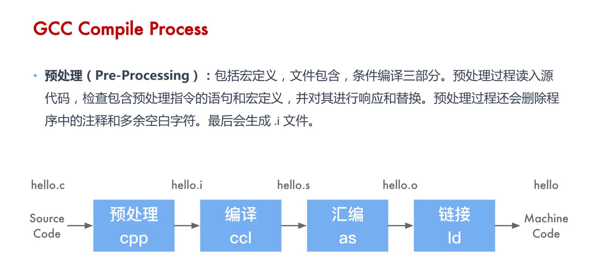
>
> 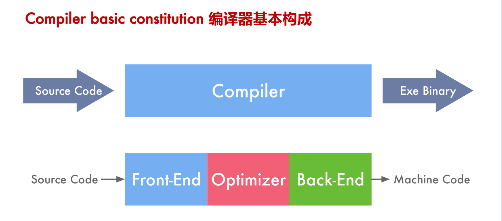


### pip 安装：

此类适用于  python 软件

```
pip install  minicom
```


## 10   有用的工具

### 10.1    git 

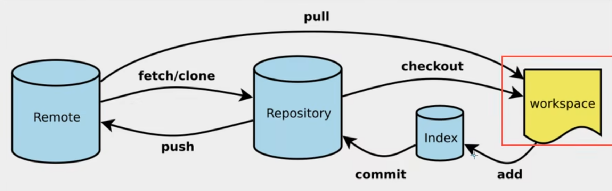

掌握3句：

```shell
#新建初始化代码仓库
git init

#从网上克隆仓库
git clone [url]


git add .
git commit -m "message"
git push [remote-name] [branch-name]

git pull [remote-name] [branch-name]
```


### 10.2   docker

虚拟化容器


