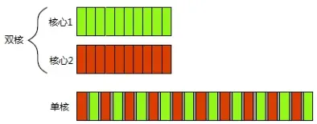
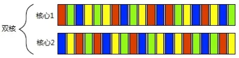

# C++ Concurrency in Action

## *Chapter  1*

> 1. 何谓并发(concurrency)

并发是指两种或两种以上的行为在系统中**同时存在**,至于是否是在某一时刻同时执行，在并发的概念里并不考虑。
 当我们说一个程序是并发的，实际上是指该程序“支持并发的设计”，所以问题就变成了怎样的程序结构才叫做支持并发的设计？
 并发设计的标准是：**使过个操作可以再重叠的时间段内运行**。并行同样是在重叠的时间段内运行，因此并行是并发的一种模式。并发的另一种模式为协程，也就是任务切换(task switch)。
 系统每次从一个任务切换到另一个时都需要**切换一次上下文**(context switch)，任务切换也有时间开销。进行上下文的切换时，操作系统必须为当前运行的任务保存CPU的状态和指令指针，并计算出要切换到哪个任务，并为即将切换到的任务重新加载处理器状态。然后，CPU可能要将新任务的指令和数据的内存载入到缓存中，这会阻止CPU执行任何指令，从而造成的更多的延迟。
 并发设计的程序在实际执行过程中并不一定会多个任务执行时间段重叠的现象(可能当前只有一个任务在运行)。并发并不是在描述程序执行的状态，而是程序的结构。

多核之间的任务切换

 在单核处理器上的并发可以说是伪并发，多核处理器上，才可以做到真正的并发。

> 1. 何谓并行(parallelism)

并行是指多个动作在某一时刻**同时执行**。
 判断一个程序是否处于并行状态，只需要看同一个时刻是否有超过一个工作单位在运行。单线程永远无法达到并行状态。

### *Concurrency vs. parallelism*

* **concurrency's concern**  
  * separation of concerns  （分离）
  * responsiveness  （灵敏） 
* **parallelism's concern** 
  * performance of bulk data processing

Using concurrency for separation of concerns and performance : task and data parallelism

* data parallelism
* task parallelism

Algorithms that are readily susceptible to such parallelism are called ***embarrassingly parallelism***.

When using the concurrency,  you should highly consider the tradeoff:

* require more OS resources and memory.
* lead to more bugs and hard to read.
* the operating system has to do **more context switching**. 

### 并发的方式

> 1. 多进程并发

多进程并发是指将应用户程序分为多个独立的进程，在同一时刻运行，就像此刻我的电脑同时在执行文本处理又在使用网易云播放歌曲。

- 多进程并发缺点
   独立的进程可以通过进程间的通信渠道（如信号、套接字、文件、管道等）。但是进程之间的通信要么复杂、要么低效，并且运行多个进程需要固定开销：启动进程耗时、操作系统需要调用内部资源管理进程。
- 多进程并发优点
   操作系统在进程间提供附加的保护操作和高级别的通信机制，意味着比较容易编写安全的代码。另外还可以通过远程连接的方式在不同的机器上执行不同的进程，如分布式系统。

> 1. 多线程并发

在单个进程中运行多个线程，线程像是轻量级的进程。进程中的线程共享地址空间，共享数据。

- 多线程并发缺点
   线程间共享数据时可能会遇到问题，如条件竞争。开发者必须保证每个线
   程所访问的数据时一致额。
- 多线程并发优点
   由于地址空间共享，加上缺少线程间数据的保护，使得操作系统的工作量减少，所以开销较小。

### 并发的效率问题

> 1. 单核处理器上的并发

多线程在单核处理器上也是顺序执行的，只是操作系统可以帮助你在很短的时间内进行了很多上下文切换。在同一时间点只有一个线程在执行，系统给每个线程分配时间片执行，每个时间片大概10ms左右，在操作系统进行上下文切换时，也是需要花费时间的，实际效率并不会提高，反而会因为上下文切换增加开销。
 因此在单核处理器上，尽量不要使用并发编程，控制线程数量，这样可以再一定程度上提高程序性能，另外还避免了不必要的线程同步问题。

> 1. 多核处理器上的并发

在双核处理器上，三线程反而比双线程效率更低。在使用CPU占用较高的算法运算时，单核单线程、双核双线程、四核四线程比较合适。但是有时候会发现线程数量超过CPU内核数反而效率更高。这是因为这种程序的单线程运算不足以占满整个CPU的一个内核。（比如存在大量IO操作，IO操作比较慢，是程序瓶颈）。
 多线程的用处在于，做某个耗时的操作时，需要等待返回结果，这时用多线程可以提高程序并发程度。如果一个不需要任何等待并且顺序执行能够完成的任务，用多线程简直是浪费。

