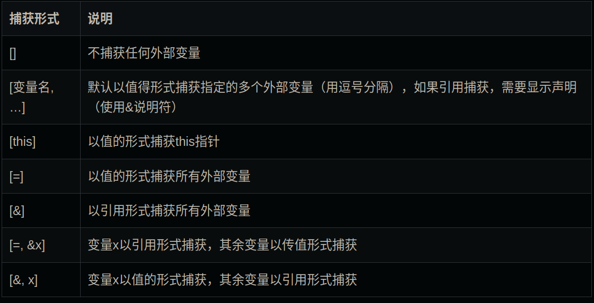

# c++中的Lambda函数

lambda 表达式（通常称为 lambda）是一种具有函数性质的，可以像表达式一样，做为**参数传递**给其它函数体的一种结构体。

## 基本Lambda表达式

最简单的形式，是self-contained函数，没有输入参数，甚至可以没有返回值。常见用法：将lambda表达式作为一个函数模板的参数。若需要传递参数，则在lambda introducer后附上参数列表。如果需要调用则需要在最后加上```(  ) 调用方法```

```cpp
[]{ // Lambda表达式以[]开始
    do_stuff();
    do_more_stuff();
}(); // 表达式结束，可以直接调用
```

```cpp
//example
[](int i){std::cout<<i<<"\n";}
```

如果lambda函数的函数体只包含一个`return`语句，那么返回值的类型就是lambda函数的返回值类型 。如果lambda函数的函数体包含多个`return`语句，那此时就**必须**显式地指定返回类型（当然单个`return`语句也可以指定）。

```cpp
//返回值类型由参数列表()后接着的->指定。即使lambda函数不需要传参，若要显示指定返回值类型，也要写（空）参数列表()。
cond.wait(lk,[]()->bool{return data_ready;});
```

## 捕获外部变量

### 2.1. 值捕获

```cpp
int main()
{
    int a=32;
    auto f = [a] {cout << a << endl; };
    f();
}
```


### 2.2. 引用捕获

 使用引用捕获一个外部变量，只需要在捕获列表变量前面加上一个引用说明符&.

### 2.3. 隐式捕获

隐式捕获有两种方式，分别是[=]和[&]



## 引用局部变量的lambda函数

使用空lambda inrocuder[]的函数不能引用任何的局部变量，其只能使用全局变量或者通过函数传参。如果想要访问全局变量，就需要捕获（capture）它。捕获全局变量最简单的方式就是通过[=]将**作用域**中所有的变量全部捕获，则lambda函数在创建时就会拷贝局部变量的一份副本以供访问。考虑以下代码：
```cpp
std::function<int(int)> make_offseter(int offset){
    return [=](int j){return offset+j;};
}
```

 我们也可以选择通过**引用**来捕获所有局部变量。在这种情况下，一旦其引用的变量由于退出所属的函数或块作用域而销毁时，调用lambda函数就是未定义行为，就像引用在其他情况下已经被销毁的变量一样。以下介绍关于`[&]` 对局部变量的引用。

```cpp
int main() {
    int offset = 42; // 1
    std::function<int(int)> offset_a = [&](int j) { return offset + j; }; // 2
    offset = 123; // 3
    std::function<int(int)> offset_b = [&](int j) { return offset + j; }; // 4
    std::cout << offset_a(12) << "," << offset_b(12) << std::endl; // 5
    offset = 99; // 6
    std::cout << offset_a(12) << "," << offset_b(12) << std::endl; // 7
}
/*
输出为
135,135
111,111
*/
```

* 如果想要拷贝大部分变量，而部分引用，可以在`=`后加上部分参数的引用`[=, &j, &k]`

```cpp
int main() {
    int i=1234,j=5678,k=9;
    std::function<int()> f=[=,&j,&k]{return i+j+k;};
    i=1;
    j=2;
    k=3;
    std::cout<<f()<<std::endl;
}
/*
输出为
1239
*/
```


* 相反的，如果想要引用大部分变量而部分拷贝，只需在`&`后加上部分拷贝参数`[&, i, j]`

```cpp
int main(){
    int i=1234,j=5678,k=9;
    std::function<int()> f=[&,j,k]{return i+j+k;};
    i=1;
    j=2;
    k=3;
    std::cout<<f()<<std::endl;
}
/*
输出为
5688
*/
```

* 当然，如果不用`=`或者`&`，则可以实现部分局部变量的捕获。

```cpp
int main() {
    int i=1234,j=5678,k=9;
    std::function<int()> f=[&i,j,&k]{return i+j+k;};
    i=1;
    j=2;
    k=3;
    std::cout<<f()<<std::endl;
}
/*
输出为
5682
*/
```


## 修改捕获变量

在Lambda表达式中，如果以传值方式捕获外部变量，则函数体中不能修改该外部变量，否则会引发编译错误。那么有没有办法可以修改值捕获的外部变量呢？这是就需要使用**mutable**关键字，该关键字用以说明表达式体内的代码可以修改值捕获的变量


