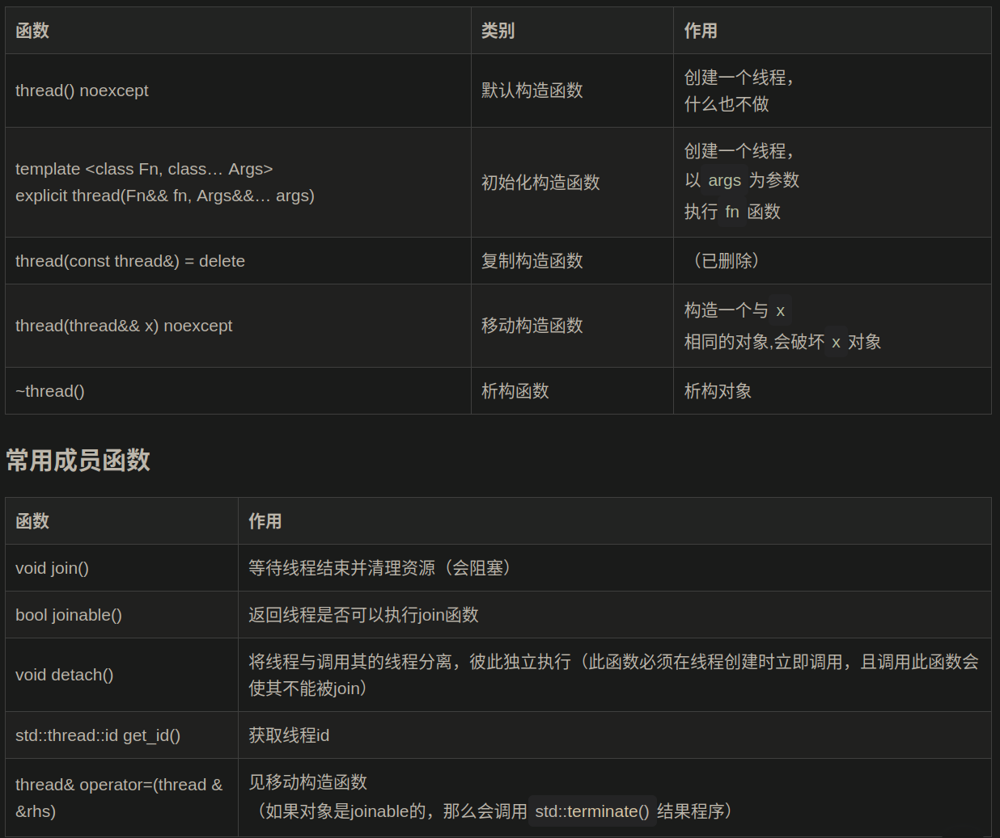
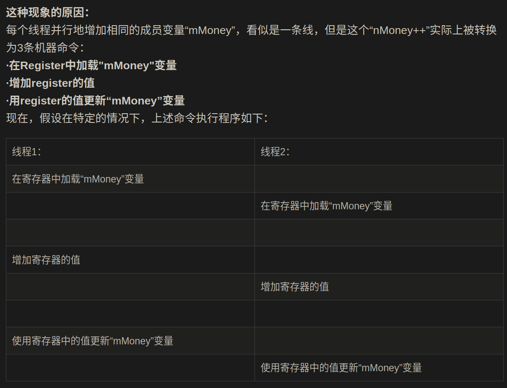
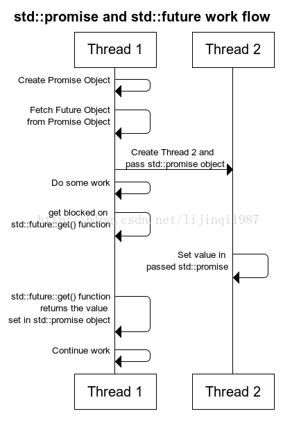
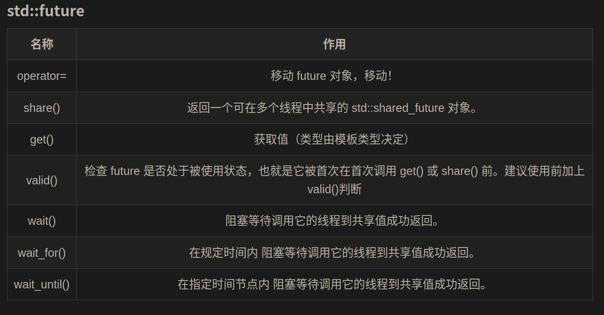
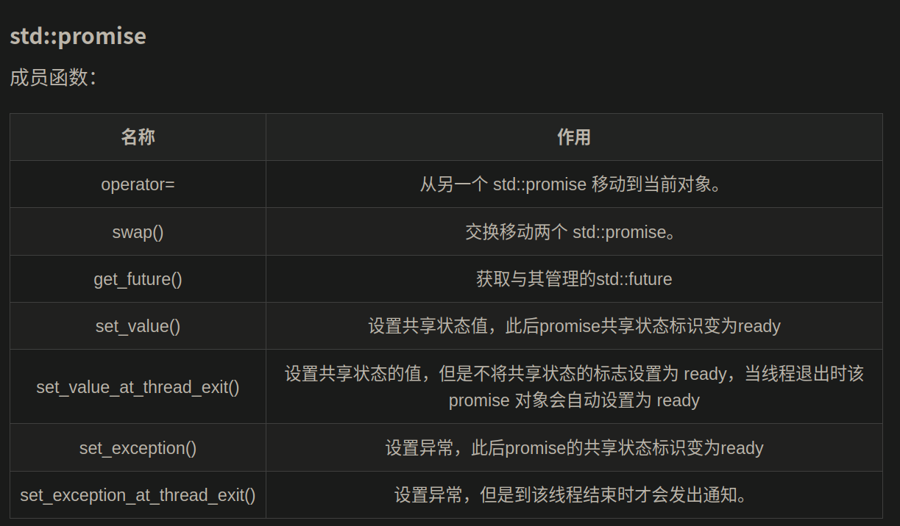

# C++多线程

## 一、创建线程

### 使用```std::thread```创建其他线程

需包含头文件```<thread>```

```std::thread```



新县城将在创建新对象后立即开始，并行执行回调。可以使用```std::thread```来附加一个回调，当新线程启动时，回调将被执行。此外，任何线程可以通过在该线程的对象上调用join()函数来等待另一个线程退出。

多线程运行是以异步形式进行，可以同时执行多条语句。

回调：

1. 函数指针
2.  函数对象
3. Lambda函数

```cpp
std::thread thOBJ(<CALLBACK>)
```

#### 函数指针

```cpp
#include <iostream>
#include <thread>
 
void thread_function() {
  for (int i = 0; i < 100; i++)
    std::cout << "thread function excuting" << std::endl;
}
 
int main() {
  std::thread threadObj(thread_function);
  for (int i = 0; i < 100; i++)
    std::cout << "Display from MainThread" << std::endl;
  threadObj.join();
  std::cout << "Exit of Main function" << std::endl;
  return 0;
}

/*
输出结果中会出现两句回应不同时刻出现
*/
```

函数对象创建线程：

```cpp
#include <iostream>
#include <thread>
 
class DisplayThread {
 public:
  void operator ()() {
    for (int i = 0; i < 100; i++)
      std::cout << "Display Thread Excecuting" << std::endl;
  }
};
 
int main() {
  std::thread threadObj((DisplayThread()));
  for (int i = 0; i < 100; i++)
    std::cout << "Display From Main Thread " << std::endl;
  std::cout << "Waiting For Thread to complete" << std::endl;
  threadObj.join();
  std::cout << "Exiting from Main Thread" << std::endl;
 
  return 0;
}
```


## 二、joining和detaching 线程

### ```Joining```线程

线程一旦启动，另一个线程可以通过调用std::thread对象上调用join()函数等待这个线程执行完毕。

```cpp
std::thread th(funcPtr); 
th.join();
```

### ```Detaching```线程

detach一个线程，需要在std::thread对象中调用std::detach()函数。调用detach()后，std::thread对象不再与实际执行线程相关联，在线程句柄上调用detach() 和 join()要小心 。

```cpp
std::thread th(funcPtr)
th.detach();
```

当join()函数在线程对象上执行,当join()返回时，std::thread 对象与他没有关联线程，如果在这样的对象上再次调用join()函数，那么它将导致程序终止。类似的，调用detach()使std::thread对象没有链接任何线程函数，在这种情况下，在一个std::thread对象上调用detach()函数两次将导致程序终止。

因此，在每次调用join()或detach()前，需要检查线程是否join-able

```cpp
std::thread threadObj(WorkerThread())
if(threadObj.joinable()){
	std::cout<<"Detaching Thread"<<std::endl;
	threadObj.detach();
}
if(threadObj.joinable()){
	std::cout<<"Detaching Thread"<<std::endl;
	threadObj.detach();
}
 
std::thread threadObj2(WorkerThread())
if(threadObj2.joinable()){
	std::cout<<"Joining Thread"<<std::endl;
	threadObj2.join();
}
if(threadObj2.joinable()){
	std::cout<<"Joining Thread"<<std::endl;
	threadObj2.join();
}
```

**case2:不要忘记使用关联的执行线程在std::thread对象上调用join或detach**

如果std::thread关联的执行线程没有调用join和detach，那么在对象的析构期，它将终止程序

因为在析构期，它将检查线程是否仍然Join-able，然后终止程序。

```cpp
#include <iostream>
#include <thread>
#include <algorithm>
 
 
class WorkerThread
{
public:
    void operator()()
    {
        std::cout << "Worker Thread" << std::endl;
    }
};
 
 
int main()
{
    std::thread threadObj((WorkerThread()));
    //如果没有在std::thread对象上调用join或detach，其析构函数将会终止程序
    return 0;
}
```

## 三、将参数传递给线程

要将参数传递给线程的可关联对象或函数，只需将参数传递给std::thread构造函数。

```cpp
#include <iostream>
#include <string>
#include <thread>
 
void threadCallback(int x, std::string str) {
  std::cout << "Passed Number = " << x << std::endl;
  std::cout << "Passed String = " << str << std::endl;
}
int main() {
  int x = 10;
  std::string str = "Sample String";
  std::thread threadObj(threadCallback, x, str);
  threadObj.join();
  return 0;
}
```

**给线程传递函数** 
 不要将本地堆栈变量的地址传递给线程的回调函数，因为线程1中的局部变量可能会超出范围，但线程2仍然尝试通过它的地址访问它。 在这种情况下，访问无效地址可能会导致不可预测的行为.

同样的，在将指针传递给位于heap上的线程时，要小心，因为某些线程可能在新线程尝试访问它之前删除该内存。 在这种情况下，访问无效地址可能会导致不可预测的行为。

```cpp
#include <iostream>
#include <thread>
 
void newThreadCallback(int* p)  {
  std::cout << "Inside Thread :  "" : p = " << *p << std::endl;
  std::chrono::milliseconds dura(1000);
  std::this_thread::sleep_for(dura);
  *p = 19;
}
 
void startNewThread()  {
  int i = 10;
  std::cout << "Inside Main Thread :  "" : i = " << i << std::endl;
  std::thread t(newThreadCallback, &i);
  t.detach();
  std::cout << "Inside Main Thread :  "" : i = " << i << std::endl;
}
 
int main()  {
  startNewThread();
  std::chrono::milliseconds dura(2000);
  std::this_thread::sleep_for(dura);
  return 0;
}  
```

#### 给线程传递引用

```cpp
#include <iostream>
#include <thread>
 
void threadCallback(int const& x) {
  int& y = const_cast<int&>(x);
  y++;
  std::cout << "Inside Thread x = " << x << std::endl;
}
 
int main() {
  int x = 9;
  std::cout << "In Main Thread : Before Thread Start x = " << x << std::endl;
  std::thread threadObj(threadCallback, x);
  threadObj.join();
  std::cout << "In Main Thread : After Thread Joins x = " << x << std::endl;
  return 0;
} 

/*
输出为：
In Main Thread : Before Thread Start x = 9 
Inside Thread x = 10 
In Main Thread : After Thread Joins x = 9  
*/
```

 即使threadCallback接受参数作为引用，但是并没有改变main中x的值，在线程引用外它是不可见的。 
 这是因为线程函数threadCallback中的x是引用复制在新线程的堆栈中的临时值。

使用```std::ref```可以解决上述特性

```cpp
#include <iostream>
#include <thread>
 
void threadCallback(int const& x) {
  int& y = const_cast<int&>(x);
  y++;
  std::cout << "Inside Thread x = " << x << std::endl;
}
 
int main() {
  int x = 9;
  std::cout << "In Main Thread : Before Thread Start x = " << x << std::endl;
  std::thread threadObj(threadCallback, std::ref(x));
  threadObj.join();
  std::cout << "In Main Thread : After Thread Joins x = " << x << std::endl;
  return 0;
}
```

 **指定一个类的成员函数的指针作为线程函数**
 将指针传递给成员函数作为回调函数，并将指针指向对象作为第二个参数

```cpp
#include <iostream>
#include <thread>
 
class DummyClass {
 public:
  DummyClass() { }
  DummyClass(const DummyClass& obj) { }
  void sampleMemberfunction(int x) {
    std::cout << "Inside sampleMemberfunction " << x << std::endl;
  }
};
 
int main() {
  DummyClass dummyObj;
  int x = 10;
  std::thread threadObj(&DummyClass::sampleMemberfunction, &dummyObj, x);
  threadObj.join();
 
  return 0;
}  
```


## 四、数据共享和竞争条件

#### 竞争条件：

发生在多线程应用程序中的一种bug 。当两个或多个线程并行执行一组操作，访问相同的内存位置，此时，它们中的一个或多个线程会修改内存位置中的数据，这可能会导致一些意外的结果，这就是竞争条件。



#### 为了修复竞争条件

需要使用lock机制，每个线程在修改或读取共享数据之前获取一个锁。

## 五、使用mutex修复竞争

为了修复多线程环境中的竞争条件，我们需要mutex互斥锁，在修改或读取共享数据前，需要对数据加锁，修改完成后，对数据进行解锁。 
 在c++11的线程库中，mutexes在<mutexe>头文件中，表示互斥体的类是std::mutex。

两个重要方法：

1. ```lock()```
2. ```unlock()```

```cpp
#include <iostream>
#include <thread>
#include <vector>
#include <mutex>
 
class Wallet {
  int mMoney;
  std::mutex mutex;
 public:
  Wallet() : mMoney(0) { }
  int getMoney() { return mMoney;}
  void addMoney(int money) {
    mutex.lock();         //在增加money前加锁
    for (int i = 0; i < money; i++) {
      mMoney++;
    }
    mutex.unlock();      //离开函数前解锁
  }
};
 
```

如果我们忘记在函数结束后对锁进行释放会怎么样？这种情况下，一个线程将退出而不释放锁，其他线程将保持等待，为了避免这种情况，我们应当使用std::lock_guard。

  **std::lock_guard :** 
 std::lock_guard是一个template class，它为mutex实现RALL，它将mutex包裹在其对象内，并将附加的mutex锁定在其构造函数中，当其析构函数被调用时，它将释放互斥体。

```cpp
class Wallet {
  int mMoney;
  std::mutex mutex;
 public:
  Wallet() : mMoney(0) { }
  int getMoney() { return mMoney;}
  void addMoney(int money) {
    std::lock_guard<std::mutex> lockGuard(mutex);
 
    for (int i = 0; i < money; ++i) {
      //如果在此处发生异常，lockGuadr的析构函数将会因为堆栈展开而被调用
      mMoney++;
      //一旦函数退出，那么lockGuard对象的析构函数将被调用，在析构函数中mutex会被释放
    }
 
  }
}; 
```


## 六、std::future , std::promise和线程的返回值

C++ 11标准库提供了future来提供了一种访问异步操作结果的机制，我们可以以同步等待的方式来获取结果，可以通过查询future的状态（future_status）来获取异步操作的结果。

> future 是一个用来获取异步任务的结果，其存在的意义其实就是为了解决 std::thread 无法返回值的问题。

* 预言只有一个，但预言家们倒是有很多个（即获得future的方式）
  1. std::async 函数会返回一个std::future
  2. std::promise::get_future 调用成员函数，获取 std::future
  3. std::packaged_task::get_future 调用成员函数，获取 std::future

### std::future对象只有在有效的(valid)情况下才有用(useful)

- 既然是一个预言，那肯定要有内容，说明这个事件出现后会带来什么
   如果不说明白，只告诉一个名称，那就只有靠猜了，就没什么意义

> std::future 默认构造函数创建的 future 对象不是有效的，没有什么意义。

#### future的[拷贝构造函数](https://so.csdn.net/so/search?q=拷贝构造函数&spm=1001.2101.3001.7020)是被禁用的

> std::future 的拷贝构造函数是被禁用的，只提供了默认的构造函数和 move 构造函数（注：C++ 新特性）。另外，std::future 的普通赋值操作也被禁用，只提供了 move 赋值操作。

#### 函数方法

> 询问获取future结果有四种方式：get、wait、wait_until、wait_for

1. get 等待异步操作结束并返回结果
2. wait 只是等待异步操作完成，没有返回值
3. wait_until 与wait类似，但可以设置一个绝对时间点
4. wait_for 是超时等待返回结果

    get代表的应该是比较乐观的一类，等待预言到来，好好观赏那最后的一天。
    （等待线程结束，获取返回值）
    wait 代表的比较悲观，什么预言都不管了，最后那天什么样都没兴趣。
    （等待线程结束，没有返回值）
    wait_until 比较奇怪，一开始都和wait()一样，但不同的给了自己一个时间，到了那个时间，就变成wait_for 去问一下预言家发生了吗，并返回状态。
    (在指定时间内等待，时间到了，如果共享状态还不ready，就返回状态)
    wait_for 就是比较正常的人，跑去问预言家预言还有多久会发生
    （获取future的状态）


## 获取future的状态

就要查询future的状态，这里要使用的是wait_for

#### future_status有三种状态：

1. deferred：异步操作还没开始
2. ready：异步操作已经完成
3. timeout：异步操作超时

```cpp
std::future_status status;
do
{
    // 我们对预言的实现的时限忍耐是很有限的，我们只能忍一秒
    status = fu.wait_for(std::chrono::seconds(1));  
    if(status == std::future_status::deferred)      //异步操作还没开始
        std::cout << "deferred" << std::endl;  // 那还可以等等
    else if(status == std::future_status::timeout)  //异步操作超时
        std::cout << "timeout" << std::endl;  // 抡起大棒打骗子
    else if(status == std::future_status::ready)    //异步操作已完成
        std::cout << "ready" << std::endl;  // 真的发生了！
}while(status != std::future_status::ready);

```

> 但在一个有效的future对象上调用get会阻塞当前的调用者，直到 Provider 设置了共享状态的值或异常（此时共享状态的标志变为 ready）

## shared_future介绍

shared_future 提供了一种访问异步操作结果的机制，
允许多个线程等待同一个共享状态，既支持移动操作也支持拷贝操作，
可以引用相同的共享状态，允许一旦共享状态就绪就可以多次检索共享状态下的值

> future是一个只能讲给一个人听的秘密预言，而且阅后即毁。所以**future只能调用一次get**，如果已经get过，其共享状态就会被释放，再次使用就会报错。
>
> 但如果想告诉更多的人都听到这个预言，就要用到shared_future,  **shared_future 在get后，不会释放共享状态**，可以拷贝，共享某个共享状态的最终结果

## future转换为shared_future

shared_future 可以通过 future 对象隐式转换
 也可以通过显式调用std::future::share显式转换

> 注意：当future转换为shared_future后，原future对象就会变的无效。

```cpp
// 隐式转换
// 将std::shared_future<int>调整为std::future<int>也是正确的
std::shared_future<int> f1 = std::async(std::launch::async, []() { return fib(20); });

// 显式转换
// 通过std::future移动构造std::shared_future对象
std::promise<void> ready_promise;
std::shared_future<void> ready_future(ready_promise.get_future());

// 从 promise 获取 future，并赋值给shared_future
promise<int> prom;
shared_future<int> sf1 = std::move(prom.get_future());

// 调用std::future::share显式转换
std::future<int> fut = std::async(do_get_value);
std::shared_future<int> shared_fut = fut.share();

```

shared_future和future的差别就体现在shared 分享，其他都是一样的.


## promise和future



example：

```cpp
#include <iostream>
#include <thread>
#include <future>
 
void initiazer(std::promise<int>* promObj){
	std::cout<<"Inside Thread"<<std::endl;
	promObj->set_value(35);
}
 
int main(){
	std::promise<int> promiseObj;
	std::future<int> futureObj = promiseObj.get_future();
	std::thread th(initiazer, &promiseObj);
	std::cout<<futureObj.get()<<std::endl;
	th.join();
 
	return 0;
}
```





std::promise::get_future：返回一个与promise共享状态相关联的future对象
2、std::promise::set_value：设置共享状态的值，此后promise共享状态标识变为ready
3、std::promise::set_exception：为promise设置异常，此后promise的共享状态标识变为ready
4、std::promise::set_value_at_thread_exit：设置共享状态的值，但是不将共享状态的标志设置为 ready，当线程退出时该 promise 对象会自动设置为 ready（注意：该线程已设置promise的值，如果在线程结束之后有其他修改共享状态值的操作，会抛出future_error(promise_already_satisfied)异常）
