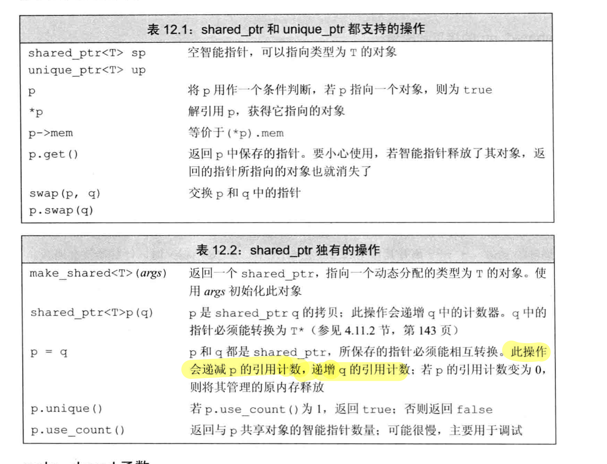
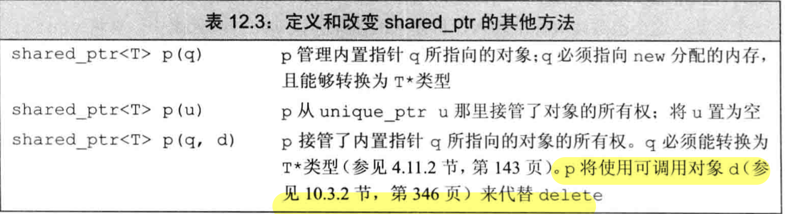
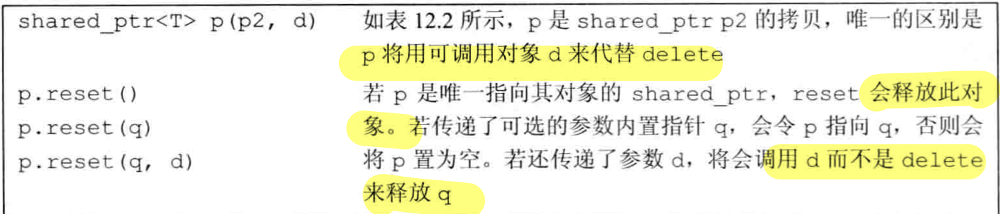
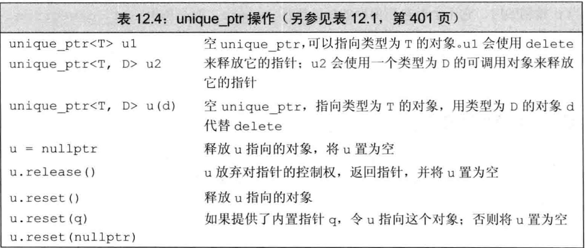

# C++智能指针

## 简介

头文件： 

```c++
#include<memory>
```


#### shared_ptr<>类

std::shared_ptr<>是c++11中引入的一种智能指针，智能指针**模板**，它足够聪明，如果指针不在任何地方使用，就会自动删除指针。这可以帮助我们彻底消除内存泄露和悬挂指针的问题。



#### shared_ptr和共享所有权

它遵循共享所有权的概念，即不同的shared_ptr对象可以与相同的指针相关联，并且在内部使用引用计数机制来实现。

### 创建```shared_ptr```对象

将shared_ptr对象绑定原始指针

```cpp
std::shared_ptr<int> p1(new int());

//检查shared_ptr对象引用计数
p1.use_count();
```

#### shared_ptr的拷贝和赋值

每个shared_ptr对象内部指向两块内存区域

1)指向对象
2)指向用于引用计数的控制数据

共享所有权怎样在引用计数的帮助下工作

·当一个新的shared_ptr对象与一个指针相关联时，在它的构造函数中，它将与这个指针相关的引用计数增加1.
·当任何shared_ptr对象超出作用域时，则在其析构函数中将相关指针的引用计数递减1.当引用计数变为0时，意味着没有任何shared_ptr对象与这块内存关联，在这种情况下，它使用**析构函数**完成销毁工作。shared_ptr类会自动释放动态对象。

> shared_ptr无用后耶为释放的情况，可能是shared_ptr存放在一个容器当中。

### make_shared函数

创建shared_ptr对象的最好方法是使用 **std::make_shared,**它将在动态内存中是分配对象，并且初始化。

### 好处： shared_ptr可以协调对象的析，但仅限于自身的拷贝。

```cpp
std::shared_ptr<int> p1=std::make_shared<int>();
```

std::make_shared为引用计数所需的对象和数据结构做了一次内存分配，即新运算符只会被调用一次。

```cpp
void process(shared_ptr<int> ptr)
{
    
}

shared_ptr<int> p(new int (42));
process(p);   //在process中引用计数值为2.
int i = *p；    //此时引用计数值为1
//若这样，则计数值在退出process时就为0
process(shared_ptr<int>(x));     //临时的shared_ptr
```

当将shared_ptr绑定了一个普通指针，则不能使用原指针来访问。

通常我们使用`auto` 来接收动态内存分配对象。

#### 分离关联的原始指针

可以调用reset()方法使```std::shaerd_ptr```对象解除连接它的指针。

```cpp
//它将引用计数减1，如果引用计数变为0，则删除指针.
p1.reset();
//在这种情况下，它将在内部指向新的指针，因此其引用计数将再次变为1。
p1.reset(new int(34));
//使用nullptr重置
p1 = nullptr;
```

### shared_ptr和new结合使用

我们不能将内置指针隐式转换为智能指针，必须使用**直接初始化**。

```cpp
shared_ptr<int> p2= new int(42);
shared_ptr<int> p1(new int(42));
```

必须显式绑定到相关参数。

默认情况下，初始化智能指针的不许指向动态内存，因为智能指针默认使用```delete```释放。





### 不要将get初始化为另一个指针或为指针赋值

智能指针类型定义了一个名为get的函数，返回内置指针。**切记不能够将这个内置指针绑定到另一个智能指针上面去。**

如果相互指向同一块内存，则会引发错误。


## 智能指针异常

智能指针对于资源正常释放具有很大的好处。

#### 使用自己的释放操作

定义一个函数来代替```delete```————```删除器```，能够对保存的指针进行释放工作。可以创建一个```shared_ptr```，可以传递一个（可选的）指向删除器的参数。

#### 智能指针陷阱：

* 不适用相同的内置指针值初始化多个智能指针。
* 不```delete get()```返回的指针
* ```get()```返回的的指针，注意其生存期
* 如果智能指针管理的资源不是new分配的，则要**传递一个删除器**


## 对比，直接管理内存

### new

* 直接初始化         
* 传统的构造方式
* 列表初始化

当括号中只有单一的初始化器时候才可以使用```auto```

```coo
auto p1 = new auto(obj);
auto p2 = new auto(a,b,c);
```

动态分配const对象

```cpp
const int *pci = new const int(1024);
```

内存耗尽

内存耗尽后，如果无法分配内存空间，一般情况下会抛出一个类型为bad_alloc的异常

```cpp
int *p2 = new (nothrow) int;   //分配失败，new返回一个空指针
int *p1 = new int;             //如果分配失败，new会抛出std::bad_alloc
```

### delete

```delete```接受指针，并释放指向的动态内存空间。

delete之后重置指针值，指针变成了**空闲指针**。


## unique_ptr

unique_ptr拥有一个对象，唯一拥有当前给定对象。

unique_ptr不支持普通拷贝或赋值操作，必须使用直接初始化。



可以使用release或者reset将指针所有权转移。

```cpp
//release成员返回unique_ptr当前保存到指针并置为空
unique_ptr<string> p2(p1.release())
```

//reset成员接受可选的指针参数，令其重新指定，并且将原来的对象释放。

#### 可以拷贝或者赋值一个将要被赋值或者将要被销毁的```unique_ptr```

```cpp
//返回的一个unique_ptr,返回一个局部对象的拷贝
unique_ptr<int> clone(int p){
    return unique_ptr<int> ret(new int (p));
}
```

#### 向unique_ptr传递删除器

unique_ptr默认情况下用```delete```，必须在尖括号中unique_ptr指向类型之后提供删除器类型。

```cpp
//p指向一个类型为objT的对象，并使用一个类型为delT的对象释放objT对象。
unique_ptr<objT, delT> p (new objT, fun);

void f(destination &d)
{
    connnection c = connect(&d);
    unique_ptr<connection, decltype(end_connnection)*>
        p(&c,end_connection);
}
```

使用了```decltype```来知名函数指针类型，  ```*```来指出该类型为指针。

## weak_ptr

不控制所致对生存期的智能指针，它指向有一个shared_ptr管理的对象。


## Problem:

**智能指针前面加上星号**：智能指针前面加*号就是变成了本体的引用
