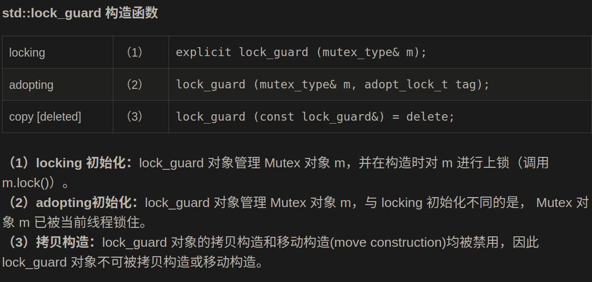

# c++ mutex

每个线程在对资源操作前都尝试先加锁，成功加锁才能操作，操作结束解锁。

但通过“锁”就将资源的访问变成互斥操作，而后与时间有关的错误也不会再产生了。

**同一时刻，同一临界区，只能有一个线程持有该锁**。

当A线程对某个全局变量加锁访问，B在访问前尝试加锁，拿不到锁，B阻塞。***C线程不去加锁，而直接访问该全局变量，依然能够访问，但会出现数据混乱**。*

所以，**互斥锁实质上是操作系统提供的一把“建议锁”（又称“协同锁”），建议程序中有多线程访问共享资源的时候使用该机制。但，并没有强制限定。**
**因此，即使有了mutex，如果有线程不按规则来访问数据，依然会造成数据混乱。**

### 头文件：

**mutex类4种**
     std::mutex，最基本的 Mutex 类。
     std::recursive_mutex，递归 Mutex 类。
     std::time_mutex，定时 Mutex 类。
     std::recursive_timed_mutex，定时递归 Mutex 类。
**Lock 类（两种）**
     std::lock_guard，与 Mutex RAII 相关，方便线程对互斥量上锁。
     std::unique_lock，与 Mutex RAII 相关，方便线程对互斥量上锁，但提供了更好的上锁和解锁控制。
**其他类型**  
     std::once_flag
     std::adopt_lock_t
     std::defer_lock_t
     std::try_to_lock_t
**函数**
     std::try_lock，尝试同时对多个互斥量上锁。
     std::lock，可以同时对多个互斥量上锁。
     std::call_once，如果多个线程需要同时调用某个函数，call_once 可以保证多个线程对该函数只调用一次。


**std::mutex 的成员函数**

- **构造函数**，std::mutex不允许拷贝构造，也不允许 move 拷贝，最初产生的 mutex 对象是处于 unlocked 状态的。
- **lock()**，调用线程将锁住该互斥量。线程调用该函数会发生下面 3 种情况：(1). 如果该互斥量当前没有被锁住，则调用线程将该互斥量锁住，直到调用 unlock之前，该线程一直拥有该锁。(2). 如果当前互斥量被其他线程锁住，则当前的调用线程**被阻塞住**。(3). **如果当前互斥量被当前调用线程锁住，则会产生死锁(deadlock)**。
- **unlock()**， 解锁，释放对互斥量的所有权。
- **try_lock()**，尝试锁住互斥量，如果互斥量被其他线程占有，则当前线程也**不会被阻塞**。线程调用该函数也会出现下面 3 种情况，(1). 如果当前互斥量没有被其他线程占有，则该线程锁住互斥量，直到该线程调用 unlock 释放互斥量。(2). 如果当前互斥量被其他线程锁住，则当前调用线程返回 false，而并不会被阻塞掉。**(3). 如果当前互斥量被当前调用线程锁住，则会产生死锁(deadlock)。**

### **recursive_mutex类的介绍**

std::recursive_mutex 与 std::mutex 一样，也是一种可以被上锁的对象，但是和 std::mutex 不同的是，std::recursive_mutex 允许**同一个线程对互斥量多次上锁**（即递归上锁），来获得对互斥量对象的多层所有权，std::recursive_mutex 释放互斥量时需要调用与该锁层次深度相同次数的 unlock()，可理解为 lock() 次数和 unlock()  次数相同，除此之外，std::recursive_mutex 的特性和 std::mutex 大致相同。

### **四、time_mutex类的介绍**

std::time_mutex 比 std::mutex 多了两个成员函数，try_lock_for()，try_lock_until()。

try_lock_for 函数接受一个**时间范围**，表示在这一段时间范围之内线程如果没有获得锁则被阻塞住（与 std::mutex 的 try_lock() 不同，try_lock 如果被调用时没有获得锁则直接返回 false），如果在此期间其他线程释放了锁，则该线程可以获得对互斥量的锁，如果超时（即在指定时间内还是没有获得锁），则返回 false。

try_lock_until 函数则接受一个**时间点**作为参数，在指定时间点未到来之前线程如果没有获得锁则被阻塞住，如果在此期间其他线程释放了锁，则该线程可以获得对互斥量的锁，如果超时（即在指定时间内还是没有获得锁），则返回 false。

下面的小例子说明了 std::time_mutex 的用法（[参考](http://www.cplusplus.com/reference/mutex/timed_mutex/try_lock_for/)）。

```cpp
#include <iostream>       // std::cout
#include <chrono>         // std::chrono::milliseconds
#include <thread>         // std::thread
#include <mutex>          // std::timed_mutex
 
std::timed_mutex mtx;
 
void fireworks() {
  // waiting to get a lock: each thread prints "-" every 200ms:
  while (!mtx.try_lock_for(std::chrono::milliseconds(200))) {
    std::cout << "-";
  }
  // got a lock! - wait for 1s, then this thread prints "*"
  std::this_thread::sleep_for(std::chrono::milliseconds(1000));
  std::cout << "*\n";
  mtx.unlock();
}
 
int main ()
{
  std::thread threads[10];
  // spawn 10 threads:
  for (int i=0; i<10; ++i)
    threads[i] = std::thread(fireworks);
 
  for (auto& th : threads) th.join();
 
  return 0;
}
```


#### **五、std：：recursive_timed_mutex类的介绍**

和 std:recursive_mutex 与 std::mutex 的关系一样，std::recursive_timed_mutex 的特性也可以从 std::timed_mutex 推导出来，感兴趣的同鞋可以自行查阅。

#### **（1）std::lock_guard 介绍**

​    std::lock_gurad 是 C++11 中定义的模板类。定义如下：

```cpp
 template <class Mutex> class lock_guard;
```


lock_guard 对象通常用于管理某个锁(Lock)对象，因此与 Mutex RAII 相关，方便线程对互斥量上锁，即在某个 lock_guard 对象的声明周期内，它所管理的锁对象会一直保持上锁状态；而 lock_guard 的生命周期结束之后，它所管理的锁对象会被解锁(注：类似 shared_ptr 等智能指针管理动态分配的内存资源)。

​    模板参数 Mutex 代表互斥量类型，例如 std::mutex 类型，它应该是一个基本的 BasicLockable  类型，标准库中定义几种基本的 BasicLockable 类型，分别 std::mutex, std::recursive_mutex,  std::timed_mutex，std::recursive_timed_mutex以及 std::unique_lock(本文后续会介绍  std::unique_lock)。(注：BasicLockable 类型的对象只需满足两种操作，lock 和 unlock，另外还有  Lockable 类型，在 BasicLockable 类型的基础上新增了 try_lock 操作，因此一个满足 Lockable  的对象应支持三种操作：lock，unlock 和 try_lock；最后还有一种 TimedLockable 对象，在 Lockable  类型的基础上又新增了 try_lock_for 和 try_lock_until 两种操作，因此一个满足 TimedLockable  的对象应支持五种操作：lock, unlock, try_lock, try_lock_for, try_lock_until)。 

​    在 lock_guard 对象构造时，传入的 Mutex 对象(即它所管理的 Mutex 对象)会被当前线程锁住。在lock_guard 对象被析构时，它所管理的 Mutex 对象会自动解锁，由于不需要程序员手动调用 lock 和 unlock 对 Mutex 进行上锁和解锁操作，因此这也是**最简单安全的上锁和解锁方式**，尤其是在程序抛出异常后先前已被上锁的 Mutex 对象可以正确进行解锁操作，极大地简化了程序员编写与 Mutex 相关的异常处理代码。

​    值得注意的是，lock_guard 对象并不负责管理 Mutex 对象的生命周期，lock_guard 对象只是简化了  Mutex 对象的上锁和解锁操作，方便线程对互斥量上锁，即在某个 lock_guard 对象的声明周期内，它所管理的锁对象会一直保持上锁状态；而 lock_guard 的生命周期结束之后，它所管理的锁对象会被解锁。



#### **（2）std::unique_lock 介绍**

​    但是 lock_guard 最大的缺点也是简单，没有给程序员提供足够的灵活度，因此，C++11 标准中定义了另外一个与  Mutex RAII 相关类 unique_lock，该类与 lock_guard 类相似，也很方便线程对互斥量上锁，但它提供了更好的上锁和解锁控制。

​    顾名思义，unique_lock 对象以**独占所有权**的方式（ unique owership）管理 mutex 对象的上锁和解锁操作，所谓独占所有权，就是没有其他的 unique_lock 对象同时拥有某个 mutex 对象的所有权。

​     在构造(或移动(move)赋值)时，unique_lock 对象需要传递一个 Mutex 对象作为它的参数，新创建的 unique_lock 对象负责传入的 Mutex 对象的上锁和解锁操作。

​     std::unique_lock 对象也能保证在其自身析构时它所管理的 Mutex 对象能够被正确地解锁（即使没有显式地调用 unlock 函数）。因此，和 lock_guard 一样，这也是一种简单而又安全的上锁和解锁方式，尤其是**在程序抛出异常后先前已被上锁的 Mutex 对象可以正确进行解锁操作**，极大地简化了程序员编写与 Mutex 相关的异常处理代码。

​       值得注意的是，unique_lock 对象同样也不负责管理 Mutex 对象的生命周期，unique_lock  对象只是简化了 Mutex 对象的上锁和解锁操作，方便线程对互斥量上锁，即在某个 unique_lock  对象的声明周期内，它所管理的锁对象会一直保持上锁状态；而 unique_lock 的生命周期结束之后，它所管理的锁对象会被解锁，这一点和  lock_guard 类似，但 unique_lock 给程序员提供了更多的自由，我会在下面的内容中给大家介绍 unique_lock 的用法。

​       另外，与 lock_guard 一样，模板参数 Mutex 代表互斥量类型，例如 std::mutex  类型，它应该是一个基本的 BasicLockable 类型，标准库中定义几种基本的 BasicLockable 类型，分别  std::mutex, std::recursive_mutex,  std::timed_mutex，std::recursive_timed_mutex (以上四种类型均已在上一篇博客中介绍)以及  std::unique_lock(本文后续会介绍 std::unique_lock)。(注：BasicLockable  类型的对象只需满足两种操作，lock 和 unlock，另外还有 Lockable 类型，在 BasicLockable 类型的基础上新增了  try_lock 操作，因此一个满足 Lockable 的对象应支持三种操作：lock，unlock 和 try_lock；最后还有一种  TimedLockable 对象，在 Lockable 类型的基础上又新增了 try_lock_for 和 try_lock_until  两种操作，因此一个满足 TimedLockable 的对象应支持五种操作：lock, unlock, try_lock,  try_lock_for, try_lock_until)。

(1) 默认构造函数

新创建的 unique_lock 对象不管理任何 Mutex 对象。

(2) locking 初始化

新创建的 unique_lock 对象管理 Mutex 对象 m，并尝试调用 m.lock() 对 Mutex 对象进行上锁，如果此时另外某个 unique_lock 对象已经管理了该 Mutex 对象 m，则当前线程将会被阻塞。

(3) try-locking 初始化

新创建的 unique_lock 对象管理 Mutex 对象 m，并尝试调用 m.try_lock() 对 Mutex 对象进行上锁，但如果上锁不成功，并不会阻塞当前线程。

(4) deferred 初始化

新创建的 unique_lock 对象管理 Mutex 对象 m，但是在初始化的时候并不锁住 Mutex 对象。 m 应该是一个没有当前线程锁住的 Mutex 对象。

(5) adopting 初始化

新创建的 unique_lock 对象管理 Mutex 对象 m， m 应该是一个已经被当前线程锁住的 Mutex 对象。(并且当前新创建的 unique_lock 对象拥有对锁(Lock)的所有权)。

(6) locking 一段时间(duration)

新创建的 unique_lock 对象管理 Mutex 对象 m，并试图通过调用 m.try_lock_for(rel_time) 来锁住 Mutex 对象一段时间(rel_time)。

(7) locking 直到某个时间点(time point)

新创建的 unique_lock 对象管理 Mutex 对象m，并试图通过调用 m.try_lock_until(abs_time) 来在某个时间点(abs_time)之前锁住 Mutex 对象。

(8) 拷贝构造 [被禁用]

unique_lock 对象不能被拷贝构造。

(9) 移动(move)构造

新创建的 unique_lock 对象获得了由 x 所管理的 Mutex 对象的所有权(包括当前 Mutex 的状态)。调用 move 构造之后， x 对象如同通过默认构造函数所创建的，就不再管理任何 Mutex 对象了。

综上所述，由 (2) 和 (5) 创建的 unique_lock 对象通常拥有 Mutex 对象的锁。而通过 (1) 和 (4) 创建的则不会拥有锁。通过 (3)，(6) 和 (7) 创建的 unique_lock 对象，则在 lock 成功时获得锁。