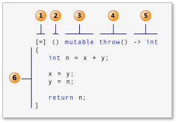
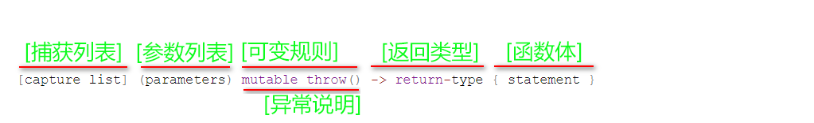

# `lambda`  表达式学习 (C++)

## 1.0    `Lambda` 语法

> 下图显示了 lambda 语法的各个部分：
>
> 1. `捕获列表`：（capture list）（在 C++ 规范中也称为 Lambda 引导。）
>
> 2. `参数列表`：（parameters list）（可选）。 （也称为 Lambda 声明符）
>
> 3. `mutable 规范`：（可选）。
>
> 4. `异常说明`：exception-specification（可选）。
>
> 5. `返回类型`：trailing-return-type（可选）。
>
> 6. `Lambda 体`：也就是函数体。
>    
>
>    

